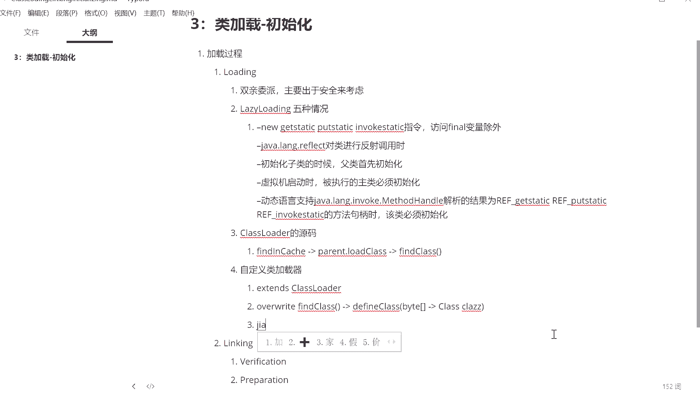

# 花了2万多买的Java架构师课程全套，现在分享给大家，从软件安装到底层源码（马士兵教育MCA架构师VIP教程） - P124：【JVM】第二天课后总结 - 马士兵_马小雨 - BV1zh411H79h

我们稍微复习一下。嗯。呃，双期委派主要出安全来考虑。那个我复习一下这个双击委约的过程，就向上找向下委托这么一个过程。呃，然后呢我给大家讲了。累计楼顶的问题。内底楼顶有5种情况。

那么这个这种情况呢是在深入加了虚拟金那本书里头。有详细的列出来啊。

来，这地呢给大家复制下来。累计loading的5种情况。是这5种啊。那么今天呢。Okay。呃，我们还讲了。class loader的原码。刚刚文板需要大家掌握什么呢？

就loadclass过程到底是什么样子的？我们需要重写的时候就需。需要。look class嗯，然后。呃，是首先是fin and catch啊。不是计你这不是加载过了，如果没加载过的话呢。

应该是调用父亲的冷。Parent的。Load plus。如果父近交载不下来，我就就要用find class去查找啊。find class呢这个呢是需要你进行重写的。所以呢我们自定义了加载器。

最简单办法就是从。lastloader集承。然后呢。重写。摔的看爽了。在里面呢我们一般会用到deffin class。来把二进制的。自接出租。转换成为一个。class类的最小。

使用自动系的加水器呢也可以进行加密是吧？

定义自己属于自己格式的这种class。好，我们讲了混合执行的问题啊。解释执行。

嗯。大概呢这是我们呃今天讲的内容。那么下节课呢再来给大家讲了linking的过程，以及和inlishizing呃inlishizing的过程。呃，刚才我看jones已经把那个参数给查出来了。呃。

这个就是说怎么检测热点代码。叫它这件代码，刚才我看joths已经帮大家把那参数查出来了啊，XX叫什么来着？看看。😔，周老师，你来再来敲一下来，我给大家记在笔记里。周老师，你还健在吗？呃。

compelle threshold是吧。re后的他默认是等于1万的是吧？那我正好正好踩到了这个点上啊嗯。Okay。后来。

这是我今天咱们讲的整个的技术的问题，已经讲完了。