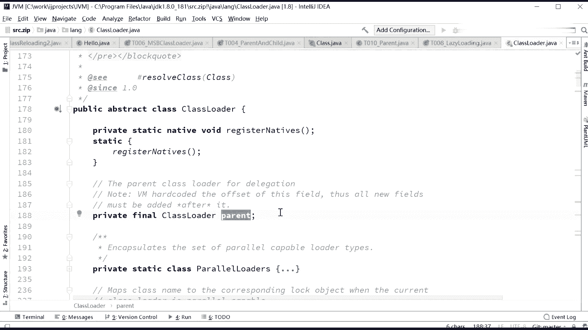
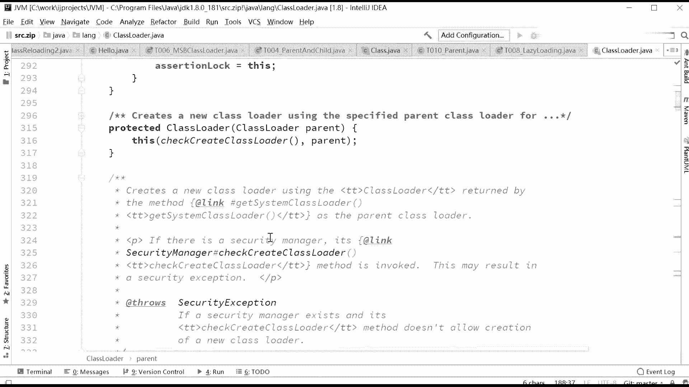
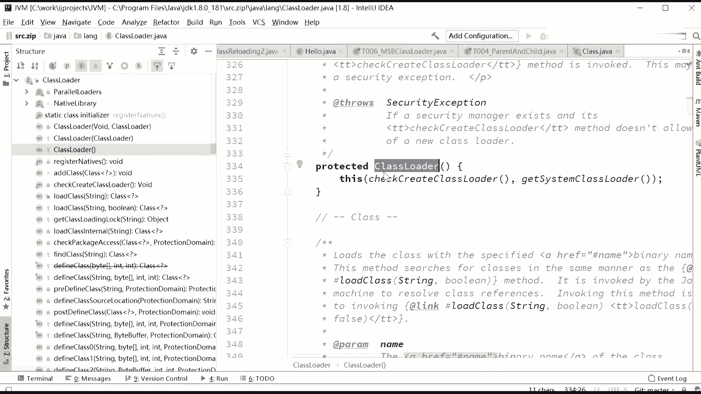
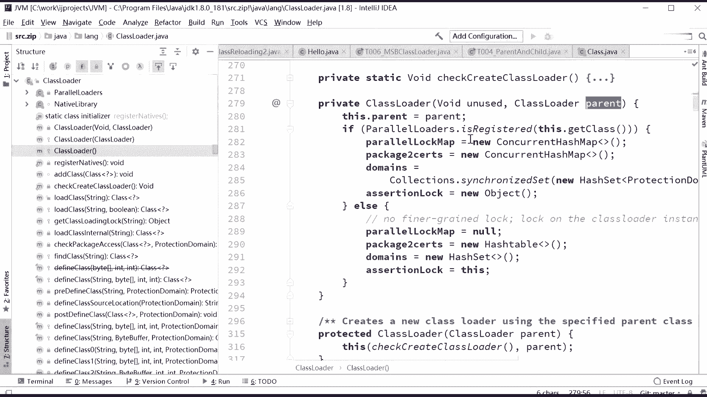
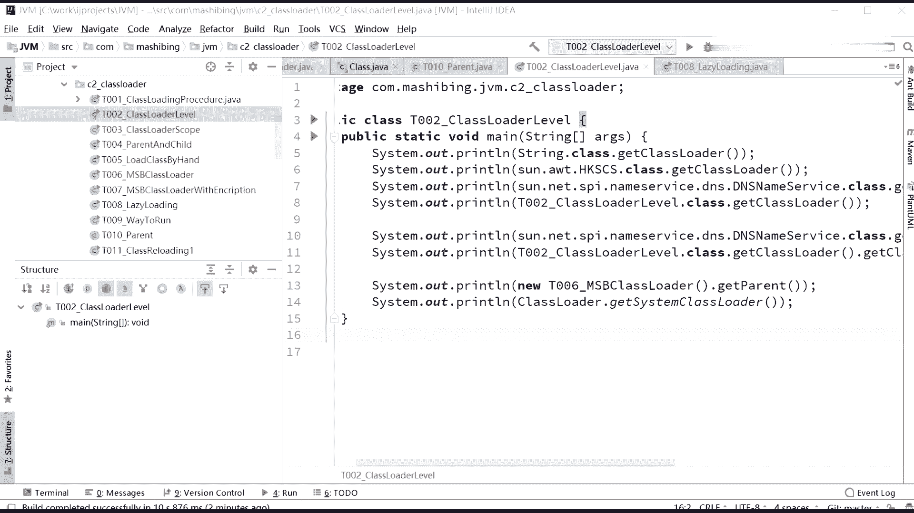

# 花了2万多买的Java架构师课程全套，现在分享给大家，从软件安装到底层源码（马士兵教育MCA架构师VIP教程） - P125：【JVM】第三天课前复习 - 马士兵_马小雨 - BV1zh411H79h

一。好了，各位同学，咱们上第三次课啊。呃有一些同学是新到的，那么应该你前两次课呢没有听或者没有补，这个没有关系。呃，第一次课呢咱们讲的是class loading。就是说呃sorry。

第一次课我们讲的是class的 format formatclass文件的格式。呃，那块呢是比较独立的内容。你呃放在咱们课后去补就行了。呃，上一节课呢讲的内容呢稍微有一点点复杂，所以我们稍微的回顾一下。

好吧，即便你上次课没有听的话呢，你先大体的跟上这次课，再下了课之后，你再去补上一次课的内容。上一次课呢，我们主要讲了类的那个呃整个load到内存的它的一个大体的过程啊，重点解释了双清委派机制。

就是class loader。那好呃，我们来稍微回顾一下啊，一个class呢放到内存里去会经过好几步。第一步呢叫loading。主上节课主要讲了这部分啊。

呃第二步呢叫linking linking分成三部分verification preparation和resolution。这个后面我们再解释。那么。这几步呃loading临挺完了之后呢。

最后一步呢叫initializing初始化啊。好。上节课呢我主要讲了类加载器啊，关于类加载器，我不知道大家伙还有没有印象。类加载器呢它叫做双默认的啊，默认的是叫做双亲委派机制。

双亲委派机制的主要的含义就是当你要求一个class loader去load的一个class的时候，他首先找他的父亲，注意这个父亲不是继承关系上的父亲，而是你自己指定的他这个代理的这么一个关系。好。

Yeah。他先去他的parent里面去找，你有没有漏的过来，漏过这个类啊，如果漏了，直接返回。如果没有漏呢。就再找他父亲的父亲，一直在那顶上顶上那个呢叫bustr用CI加写的。如果到这儿都没有找到的话。

那么他就翻回头去看我能不能加载呀。由于他加载的是特定的class pass，所以他加载不了的话，他就找他的孩子，你继续给我加载，你继续给我加载，你继续给我加载。

一直到我们自定义的这个class load这里，如果能加载上，那要加载，加载不上呢。class not found exception。这是双亲纬派的一个机制啊。呃，因为有可有可能有上节课没听的同学。

我再呃说一遍，我再说一遍啊，没有由于有上节课没听的同学，所以呢。你大体听明白我刚才复习的这个意思，然后你课下去抓紧时间把上一节课内容补一补，好吧。嗯。偶然问说不是继承，怎么是parent。

他的一个成员变量叫parent啊。好，这是双清委派的一个机制啊。然后上节课呢，我教了大家呢，怎么样去呃定义自己的class load。这个呢要看代码了是吧？啊。

自定义的class load大家还有没有印象啊？自定义class load呢使用的是一个设计模式里面的模板方法，template method这样的。

呃，一个一个一个一个设计啊。嗯。

Stture。ok。我们稍微回顾一下啊，也一个自定义的class loader来说呢，你首先要从class load或者它的子类来继承。继承完了之后呢。去只要重写一个find class就行了。

这个fin class呢是在low class里被调用的，是吧？

让我们重重写好啊，呃找到你对应的class版漏到内存，这个就叫自定义的class load。

在目前这种自定义class load的情况下呢，你是不会打破打破这种双清尾派机制的。上节课咱们读源码的时候说过，这个双亲尾派机制实际上是写在哪了呢？我不知道大家还有没有印象啊。

class loader里面的那个方法，load class嗯。给大家读个原码啊。所以由于look class里面双亲委派机制的模型已经被写好了。所以你只需要找到它的调用find class的部分。

重写这部分就可以了。嗯，寻找类啊。Okay。好。呃，这节课呢我们给大家讲一些上节课遗留的内容，就是有一些同学问的问题啊。

诶大概。那。Or of no。上节课呢有同学问过一些相关的问题啊，我来稍微回答一下。

哎，我也是醉了。

那怎么重新定大小，这么费劲呢。拖右边拖不动，只能拖左拖左边。

是怎么做到的？

稍等一下啊，把内容拖进来。

啊，这上节课呢，咱们做的笔记。

嗯。呃，双清委派第一节课呢，我们遗留了几个问题。

有个有同学问说是这个parent到底是怎么指定的？其实怎么指定呢？这件事特别简单。呃，你想一下啊。

你来分析一下啊，拿大腿来分析一下。同学们，你们想想看，我们自定义一个class load的时候，我们有没有指定他自己的那parent呀？为了避免咱们。

这个上节课没有听的同学啊。

这个你你先听一大概就行啊，这个你你要需要补一补里面内容。呃，我们回顾一下，任何一个class loader，任何一个class loader。大家看这里啊都有一个parent。

成员变量parent他的parent也是一个class loader。呃，咱们自己定义自己class load的时候，实际上呢并没有指定我的class load是我的我的parent是谁，对吧？同学们。

好，我没有指定我的parent是谁的情况下，他的parent是谁呢？那当然你就去找啊呃，他的parent到底怎么指定的？

这个你要去原版里找的话，你就会你就会知道。

嗯。看这里。

看一下这个原码啊。同学们，你们想象一下，我new自己的一个自定义class load，它会调用父亲默认的参数为空的class load。所以呢当他调用父亲默认为空class load的时候。

调用的就是这个构造方法。

在这个构造方法里面调用了自己的另外一个构造方法。好，这个构造方法呢，但家你看这里啊。他第一个是没有用的。第二个呢是他的parent。所以在这个构造方法里已经指定了他的parent是谁了。

那parent是谁呢？

这 their parent and parent。

呃。他的parent是谁呢？看这里啊。看下面这种。protected class load class load parents用这个方法可以指定他的父亲是谁？

他附近默认的是谁呀？嗯 guesses the manager security return now。

Check freight。

Parent。嗯，你得看他的父亲默认。呃，稍等片刻啊，我一会儿再给带大家找到那个他默认父亲在哪里指定的那段代码。

呃，我们先来看看你怎么指定你自己的父亲。呃，大家看这里啊。呃，我们怎么指定自己的父亲？你会发现在他的。副类里面有一个各造方法，这个各造方法是protected的是吧？受保护的，所以只有子类能调用。

那嗯看到这里，同学们我问大家一句有。多少同学能够想得出来，我到底怎么样自定义自己的class，就是自自自己指指指定自己的父亲啊。很简单是吧哎。看这里啊。呃。

我呢给大家写了一个自定义的指定父亲的这样的一个。

class load啊在这里。T010pararent。你怎么指定自己的父亲？其实非常简单。用自己的class load呃，自定义的这个class load。去从class order集成。

构造方法里面，plic mylo的构造方法里面调用super指定parent。我parent是谁呀？我parent自己随便指定的，我可以指定是我自己自定义的那个parent。

是吧我现在这拍的是我自定义那个MSBclassloader。然后我下面的这个my loader，他的父亲就可以是这个MSBclass loader。

所以super这块直接调用super就可以指定他的parent。这第一个问题呢我就解决了。好，关于这第一个问题，有没有同学有疑问的？偶然偶然说是重写。你说是是重写哪个啊？未指定的话，有默认的吗？呃。

你要是想没有指定的情况下，看他的默认的是谁，这个用用什么方法呢？里面有一个方法嘛，这点get parent你就能拿到是吧？所以你查一下他默认的是谁就行了。嗯。😊，我们自定义的这个呢。

看这里啊。大兵说子类定义父亲的 parent没有定义啊，我们不是只定吗？调用了分类构造方法给它设进去不就行了吗？设定啊不叫定义。设定为它的值，好吧。

呃。

等一会儿，我给你找一下他默认的那个是谁。

。默认的这个呢是在哪里指定的啊？

搜一搜。

Parent。

该s systemstem class load嗯，看这里啊。在这里。呃，当我们调用父器默认的这个时候呢，默认的是谁啊？它是get system class load。

就是拿到的是一个stem class load，这 systemsem class load又是谁呢？他是怎么调用的呢？

嗯。

具体的这个实现呢，你不用去看这stem class loader呢，就是默认的就是我们的APPclass load啊。

呃，你直接调用这个方法就能拿到他最后的结果到底是谁。这里面呢由于牵扯到了很多安全性的内容，我们就不详细的直接追到我们所有的这个代码里面去了。

呃。

initial system class load在这里面是真真正正的把我们的class load默认的那个值给你初始化了。那默认的值是什么呢？其实很简单，你直接在你的代码里面去试一下就行，好吧。

很有很多内容呢，你只要动手一试就可以。我相信大家应该能想到吧，这块。

你比如说他的父亲到底是谁，你可以list thereget parent不就知道了吗？呃，get system class load。呃，你如果想那个。知道他的系统的。

咱们系统默认的这个class load是谁，你是不是在这里直接调用get system class load就可以了。所以。这个东西还用我在这里给大家写吗？如果需要的话，我就再给大家写一下，需要吗？

偶然偶然你问的这个问题是在上一节课里面内容，你现在已经下课再补一补好吗？偶然嗯。这块还需要我给大家写吗？就是一个类默认的。

写想吧。

我写在这儿啊。一个class loader默认的。比如说。

s out new T006，这是我们自定义那class loader their get parent他默认是谁是吧？

Ss out。你呃。let loaderge system class load默认的那个啊，就是可刚才你看到了，默认就传的他父亲，就是通过ge system class load得到的，对不对？

运行一下，你一看就知道啊。好看这里都是APPclass load是吧？所以他的parent默认是谁？APPclass loadclass load就系统系统class load是谁？

stem class load是谁，也是APP class load。就是当前的我们这个project啊都是由他默认来加载的。所以自定义这块到现在指定parent这块。

我看大家还有没有谁有没有一些什么样的内容嗯。leden个 system class load你被用来干嘛的？就是拿到系统的默认的这个class loader嘛，也关于安全的嘛。呃。

它内部呢自己定义了一些安全的检查，但这个我们一般用不到。我们需要他的时候，就直接调用这方法拿到用就行了啊。再我再说一遍啊，有很多小同学的问题呢，其实不是这节课的问题，而是上一节课的问题。

所以呢你这节课的前前一小半节，我复习的这个过程呢，你要是暂时听不太明白，关系不大，先补一补上节课的内容再回来听。好吧，同学们嗯。O。嗯。那好，那关于。指定parent这块咱们就过了。

上一节课呢其实还遗留了一个呃很大的一个问题啊，就是呃咱们双清委派机制是可以被打破的。这块问题呢，我们作为一个扩展就行，你了解就好。不了解的话呢，听老师说说好吧，有个印象。呃。

因为是因为我为什么又讲又讲到这么深入的内容？其实原因是有一个小伙伴啊跟我说，他面试的时候遇到过了，好吧。我只能感慨现在这个面试啊是越来越变态了啊，当然多数的情况下啊是不会考这方面内容的。

那。就是你你的这个打破双亲尾派这个问题啊，打破双亲维派这个问题是什么情况下会发生？呃，同学们，你们想一想，你们咱咱们回顾一下啊，这个双亲尾派是在哪个源码里指定的呀，是不是load class的原码啊。

还有印象吧？是在class loader里面的load class这个源码里面已经设好的，指定好的啊？

这个class loader这个类，然后这个类里面的load class这个方法。

咱们上节课呢读过这方法。う。

所谓的双亲委派机制，其实呢就是在这个方法里面呢给咱们写死了。所以你你你这这方法我在上节课带大家读过了，我就不带大家重新读了呃。

在这里是先找他的父亲的，什么，先找自己的，找不着了之后呢，让他父亲去调，父亲再找他自己的等等，才形成了。刚才咱们所说的那个双亲委派机制，先上上先向上找再向下委托这么一个机制。双亲委派。那好。

要打破这个双清委派机制。第一件事儿我先问你，你说你该怎么做？load class已经帮你写好了双清尾派机制了，你只需要去重写咱们的find class就可以了。

可是现在我要求你去打破双清委派机制，你怎么干？你只有一个干法，就是把low class给重写了。我这么讲，大家能理解吧？就load class已经重写人人家已经写好这个机制了，你想把这机制给干掉。

你怎么办？你是不是得重写这个load class呀？所以。

你要想咱们说怎么实现啊，就是说你要想打破这个双切尾派机制，我不想用双切尾派了。

你要想打破他。重写load class方法，而不要去重写find class方法，这时候就能打破。那什么情况下需要会打破双清尾派机制呢？呃，在深入理解招要虚拟杰那本书上啊，就是周志明老师那本书上。

他说过三个。

三种情况。第一种情况，JDK1。2之前，自定义的class load都必须重写low class。因为那会儿还没有find class那方法，所以那会儿你不想打破也得打破，这是它自定义的一个缺陷。

这个不管它。好，这不管。第21个呢是。你可以自己在一个县城里面设定自己现城上下文的class load，你随便设定。你随便设定完之后，这class loader load class你一重写。

那你就可以随随便便的load的各种各样的class了。当然有同学说可能老师我不太理解这块不太理解就不太理解，就不理解这。不用去深入去研究它，没有什么大太大的意义。多数情况下，你面试是遇不上，好吧。

遇上就算你倒霉就行了，找下一家。好。好，我们继续啊。还有呢就是模块化的时候，这个热启动热部署，像OSGI呀、tnca啊，都有自己的模块指定的class loader啊。

这里是可以加载同一类库的不同的版本好，这里其实用到的自定义class loader，打破双亲部署，双亲尾派，这个用的是比较多的。一。有。听我说。一。哎，稍等啊，这个观键咱们的机器人女友在那里边那说话。

孙老师帮我把那机器人女有给关掉，谢谢。嗯。我先给它关掉啊。好，听我说咱们呃有有多少同学，咱们多多数同学听这个课的话，你应该是了解toca的，对不对？好，有有没有现在在听课同学不了解tcast。

你给老师扣个2来。有没有？好，大家听我说啊。嗯你们不了解toca是是什么情况。听架构的课需要你SSM的基础。SSM基础什么意思？你tomca不了解啊。如果这个要不了解，你真的得听一听。

就是连老师的初级课曲线啊。不是这个这个了解呢，我说的你用过就可以啊，你知道tomca是怎么回事就行了。不是说你源码急OK。好，听我说tomca呢，大家知道你写一个web application。

你就把它呃你自己写的类呢扔到一个tomca的指定的目录下面去是吧？同学们一启动呢，它就可以这些类的就加载下来了。但是大家知如果说呃我们要是两个不同的web application。

两个web不同的web application，在toomca下是可以同时被加载的。但我问你一句，如果第一个web application里面，它加载了一个类是A，第二个呢也加载了这个类是A。

加载的是不同版本。比方说这unit这里用到的是。5。5。1版本这unit这里用到的是4。0版本。那这两个内容注意这两个里边的类的名字是一样的啊。只un你里边有个类，这叫A吧。他的名字和5。

1里面这个名字A是一样的。报g点这unit点什么什么什么。如果我们用。刚才的这种双亲委派机制，你觉得这俩哥们儿能够加载到同一空间吗？肯定不可能的呀。如果第一个被加载进来之后，后面再加载的时候。

他肯定会去找啊，里边有没有啊？有发现有一个同名的，有一个同名的，他还会加载吗？他不会被加载。好，说到这儿，有没有同学不能理解的？能理解的同学给老师扣一，我们继续好不好？嗯。

所以呢tomca里边每一个web application都有自己的class loader哦，我说到这里，大家是不是能理解，就是每一个自己的web application都有自己的class load。

自己的load的这个class loader。互相之间是可以同名的这是没问题的。好，class loader一第一个class loader里边有一个名字叫comme点马氏兵点什么什么。A好。

这个没问题。class load2里边它load进来一个comme点什么什什么A，这个也没问题，听懂了吧？两个class loadload进来可以同名的垒。这是完全没有问题的。

OK所以这里面呢其实他就已经呃。打打破了双击委派机制啊，当然打破的细节呢比较复杂。呃，你你你刚才那个你他他都要往父亲里去找啊，那个父亲里去找人，如果他找到了，他他他是不是就加载不了了呀。

那这时候怎么才能让他不不去父亲里找啊，我二话不说，我就直接加载行不行？我不去父亲里找，那怎么办？你是不得去重写load class呀？

ok。好，为了跟大家说清楚这个问题呢，我写了几个小程序来给大家演示一下啊。

大家看这里。

这里呢我我给大家演示一下，就是类的这种热部署是怎么实现的。OK类的热部署是怎么实现的。呃。你看这儿啊。呃，当然。这是第一个呢，小程序呢是不能够实现的一种方式，不能够实现一种方式，什么意思？

正是因为你只是重写了find class，你是打破不了双清委派机制的。所以你这个这种方式是不能不能实现的。什么意思？你我们来读一下这代码啊。呃，我们定义了自己的1个MSBclass loader。

然后呢，去load的一个class，这个class呢叫hellow。名字comme嘛是兵GVM helllow上节课以。漏得过这代码啊，代码比较简单。呃，然后呢我打印class的hash code。

接下来注意看注意看，我把第一个class load设为空。Dclass loader设为空。设为空之后呢。我重新再漏的，我我再new一个class loader。你有了一个新的class loader。

然后我再去load的同样的一个class。

我们来看看这两个classus是不是相等。考一下。

但然你能看到它是处。

嗯，看这里啊。

他处同学们，这是其实这是为什么呢？就是因为你双亲委派，不管你怎么怎么做，他都会去父亲这里找。如果你漏得完一次之后，你下次无论再找谁去漏的。他都会去这个。已经加载过的那些个类里面去找。如果找着了。

它就不会再重新加载。所以你后面你无论再你多少次，再漏了多少遍，都没有没有任何用处。如果你想干掉这件事儿，想真真正正做到热加载怎么办呢？只有这么一种办法，大家注意看。

看这里。好呃，在这儿呢我。定义了自己的新的一个class load。我刚才说了，你你要是定义自己class load的时候，只是重写find class，你是打破不了双清尾派机制的。那么。

你要想打破双牛委派机制，你只能这么干。自定义自己的my my loader从class loader继成。这次我们重写的是load class，而不是find class。

好在load class里面呢。好的，看这里啊。

我首先去找谁呢？找你要求我去load的那个class文件。

如果我没找着。我让我的父亲去漏的，如果我找着了，我直接自己就漏的。

这里头有个小小问题，大家回回顾一下，人家class load点默认的那个load class逻辑是什么呀？首先找是不是已经加载过了。对吧我把那部分逻辑给他干掉了。我说你我管你加载过没给我加载过。

反正你告诉我名字，我就直接去加载。

正因为这样。

我们才能实现什么呢？比如说这儿有一个class文件。好。我呢呃要想让他动态改了之后，我要是想让它重新加载，我怎么办呀？

我重新调用一下。

我这个class load这个这个这个这个这个呃load load load class就OK了，我重新调一下就OK了。因为他二话不说会去给我重新加载。那有同学会说，老师这事儿不对呀。

你如果是同一个loadclass loader的话，他已经加载过一遍了。你再去load的。你原来那个是覆盖不了的呀，没错，覆盖不了。但是我怎么办呀？我直接把这个class load整体干掉不就行了吗？

所以tom cat里边啊是这么干的。当你要你你为什么能写1个GSP文件，或者为为什么能写一个那个那个呃web web application，你改了里边内容之后，它能够进行热加载。很简单。

他直接把这个web application的整个。class loader他的class loader全部干掉。干掉之后呢，重新再加载一遍。

里边的所有的class。我模拟了一下怎么写呢？这么来写。看这里。my loader等于new my loader。我念完了之后，我load class。透马士钉JVMhello。

然后接下来我又new了一遍my loader，这次我又重新load classcom点马士冰点这BM hello。好。打印class两个classus是不是相等？

这时候还相等吗？跑一下看看。bos不行的。上节课咱们做过代码，如果你在同一个class loader里面去load的，它两个是相等的对吧？现在呢它已经变成不相等。

说明什么我们load的class不是同一个。那那你可以想象一下，在这两次load的中间，如果你改了。海lo里边代码的话，他肯定就会输出新的。嗯。Yes。

ok。这是呃tom cat的底层呢，它现对应的怎么实现。当然我写的其实上非常简单啊，只是为了教大家一下呢，它呃原理性的一些东西。你要想呃真真正正的把那个整个tmca全都实现了，那个就相对复杂很多了。

那么原来连老师呢讲过tm cat的源码。呃，如果大家感兴趣的话呢。找找啊，咱们公开课的那个链接里头也有。好。这里呢是我大概教了大家一下怎么样去进行热加载的一个概念。就热加载呢呃基本都是这么干的。

他会把整个class loader全部干掉。

干掉之后呢，再把其他的那些class漏了一遍。