# 花了2万多买的Java架构师课程全套，现在分享给大家，从软件安装到底层源码（马士兵教育MCA架构师VIP教程） - P126：【JVM】初始化 - 马士兵_马小雨 - BV1zh411H79h

好。🎼到现在为止呢，我们就也就相当于呢我们把loading这部分的内容呢给解决了。下面我们来看linking这部分内容。那么linking这部分内容呢，它分成三步。

第一部分呢叫verification preparation啊，第二步叫prepar。第三步叫resolution。我首先简单给大家解释每一步大概是什么意思。呃呃，loading这块内容呢相对复杂。

问的面试题呢比较多。其实后面这部分内容啊，面试题呢并不多，就那么一点点嗯。我呢这节课呢把咱们后面部分内容给呢快速给大家解决掉，好吧。首先第一步呢叫verification。

verification这件事儿其实特别简单，就是你检验你刚才加载进来的这个class文件，它到底是不是符合这VM规定。你格式不对，你前面那四个字节不就是0S咖啡ba，那肯定不对啊。

那不是我要不是我要的东西，你被篡改过了，我就不会再进行下一步。所以verification是对文件进行校验的。这比较简单，问的也很少，咱就不多说它。第二步叫prepar好，这步必须掌握这步是什么呢？

给静态成员变量附默认值。好，这部呢叫prepar，对静态成员面料抚摸认质。先大概记一下，一会儿我来给大家演示程序。第三叫resolution。resolution叫解析。

如果大家读class load的原码的话。

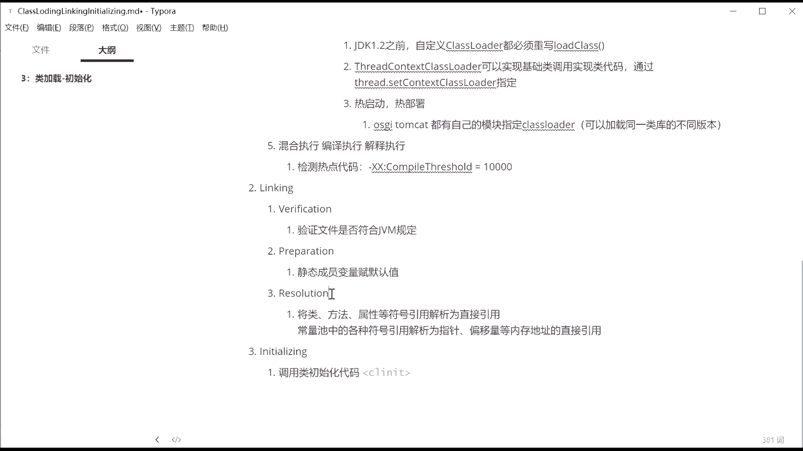

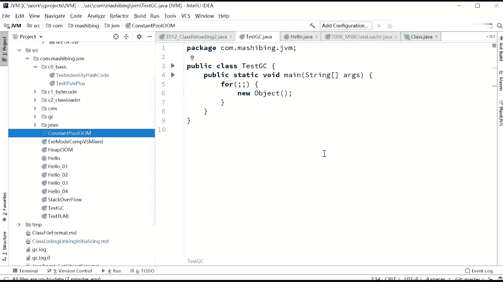

还是去看一眼。在我们的这个class load的源码里边。

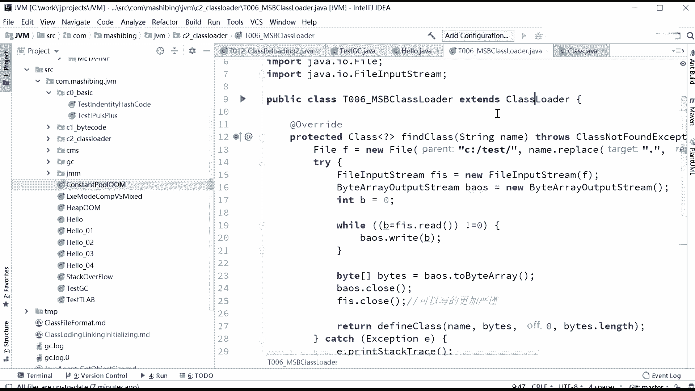

呃，load class的时候。

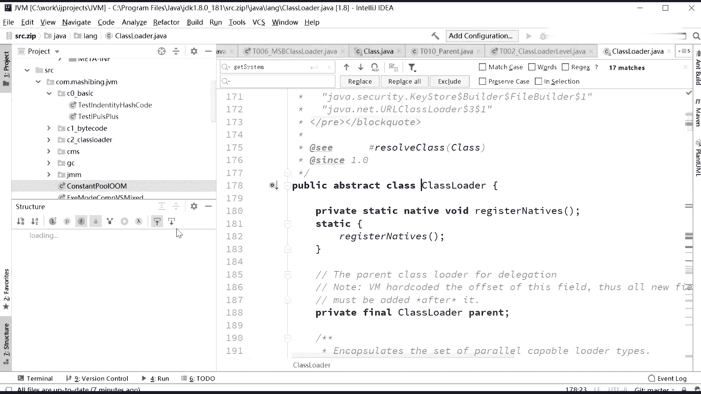

不知道大家还有没有印象啊，loc class第二呃第二个参数。第二参数是一个布尔类型叫resolve，到底是不是进行解析。就是你传储，它就会对你进行解析。如果不传输不传储的话，就不对你进行解析。

所以这个解析指的就是这一步。

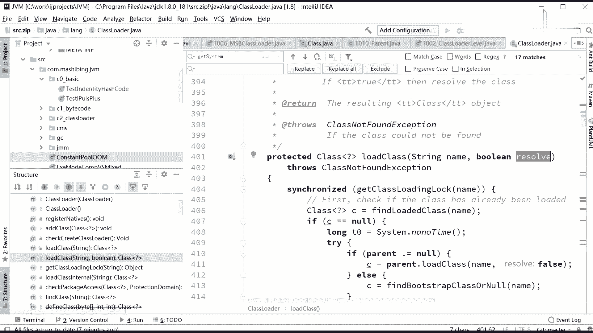

就是resolution这部。那么resolution到底是解决什么问题呢？resolution是解决这样一个问题。他会把类方法属性符号引用解析为直接引用。那有同学会说老师什么叫符号引用？呃。

我们稍微回顾一下我们第一节课讲的那个class文件里面，class文件里面在它的常量池里，是不是放着一个一个的类的。名字呀，比方说java land object，这个大家还有没有印象？

L里边写的是java land object。好，当我们下面要用到这个object的时候呢，它下面的这个引用啊，实际上是一个符号，指向的是这个字符串javaline object。

但是这个真正的这个javaline object在内存之中的什么位置呢？它很可能在这个位置。好，所谓的解析过程就是把这个字符引用。我们称之为符号引用。直接转换成为指向内存的具体的地址和指针的这个过程好。

这个过程叫resolution。关于resolution，有没有同学有问题的？有问题你提出来。没问题，扣一啊。Yes。嗯。所以resolution呢呃比较简单。对啊，jona说有有些引用是动态绑定，哎。

有些是必须是动态绑定。因为你只有扭出来了之后运行起来，你才能知道那个具体的位置在哪。所以很多是动态绑定啊，不是说有些啊是很多很多都是。所以这个resolution一般来讲，面试呢也问不太到，呃。

问到的内容呢也没有没有没有什么更加详细内容，多数就是多态。其实啊所以这个呢我们呃先不去理他，好吧。现在呢最重要的呢还有两项，一项叫preparation。我刚才说了是类静态成员附默认值。

那么静态成员变量附默认值，什么叫默认值啊？大家学java最基础的时候，int类型不指定的时候，什么值？零嘛对吧？long类型0double类型0。0嗯，然后引用类型要是不复值的时候空值。

然后这就叫默认值给静态成员变量服默认值。那好。那什么时候会对这些默认直径初始化呢？在第三步里头，initial lighting调用类初始化代码好，在类初始化代码里头。给。静态成员点亮。F。初始值。啊。

这句话什么意思？

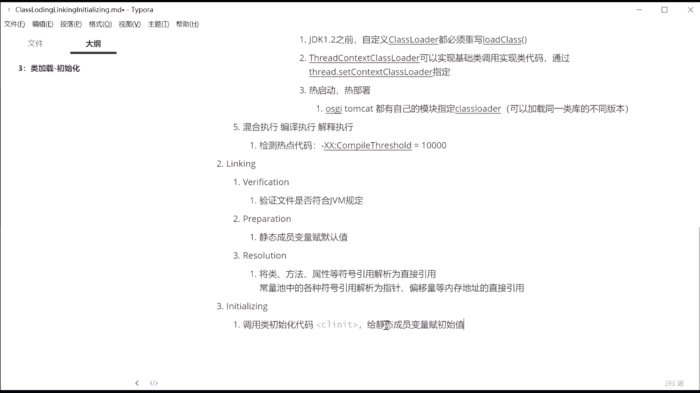

呃，我原来在公开课讲过一道面试题，我们通过这道面试题来理解，好吧。来，我来我们来读一下这个命试题啊。嗯。好，这面题呢在这里。

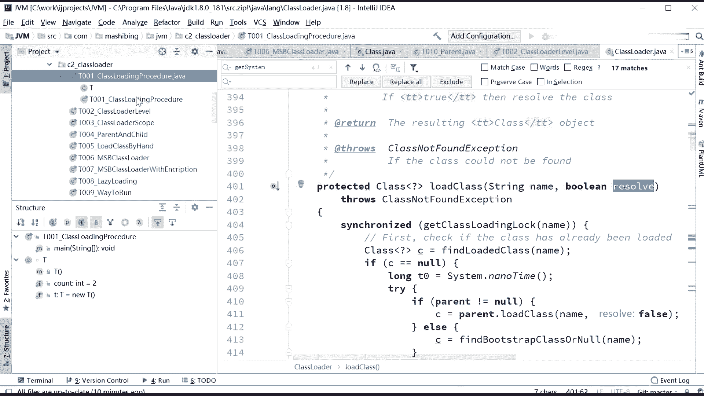

来，我先给大简呃，大家呢一点简单的时间啊，你先读一下这道面试题。几十秒钟，你先读一下啊。我们有一个自定义的class T，它呢成员变量countt等2。还有一个成圆变量T小T等于6T。静态的嗯。

过造方法，private tea。看着加价。然后。面二题是问你打印T点com这个值是几？来告诉我。哪里有2有3是吧，来。来跑一下。三啊说二的都不对，怎么还要说一的？浩涛，你这个一是什么概念？

这一是哪儿来的？呃，来注意看啊。然后我把这两句话换一下，哎，两句话换个位置，你再看一下啊，刚开始是这这是这样的，康等2先复制，然后再调用了newT换个位置。跑一下。A，这值变成二了。好。

这到底是什么情况怎么做到的？我们来分一下这小程序啊，这里面呢实实际上牵扯的内容也挺多的啊，尝试给大家。

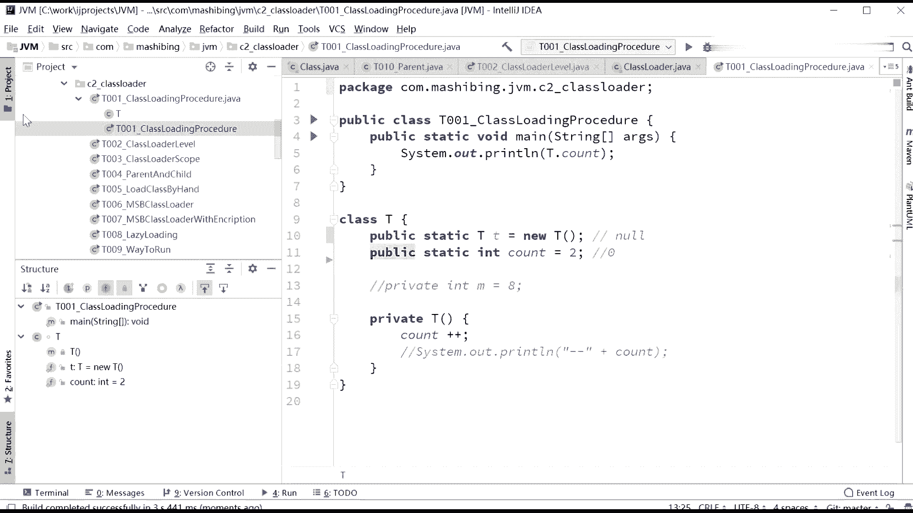

分析一下，我的画图板翻过来之后没有装上啊，我只能拿鼠标画。嗯。😊，我只能拿鼠标画，拿鼠标号就拿鼠标画，好吧。呃，你认真看啊。呃，整个过程呢是这样的，我们先看先看。这样的一种做法。

抗等2最后是怎么打印出来，抗能变成三的，是什么一种情况？呃，我们来分析一下整个的执行过程。执行过程是这样。当我们调用T点com的时候，他需要把T点class漏到内存，通过我们的class loader。

我们class loader默认的就是APPclass loader，它会把T点class load到内存，load完了之后进行verification进行校验。校验完了之后进行preparation。

prepar就是把T里面的静态的这些成员变量给他附默认值。那这个时候看的值是几啊？抗的值是0。注意这时候小T是什么？小T是空值。所以他这个时候有没有调用。构造方法没有countt加加了吗？没加。ok。

继续进行resolution解析，不说了，进行initialization initialitialization初始化初始化就是来给这些值把它把它复初始值。那复初始值的话，这count原来默认值是0。

初始值日几初始值是2，所以这时候countt变成2。好，这个初始值是几？这个初始值是new T，所以它会调用new T把countt加加。因此。抗的值最后变成3。调至第一个过程。不知道大家听清楚没有？

好，我们来看第二个过程，反过来我们反过来再看，认真看反过来过程是什么样子的。反过来过程是是这样子的，我们再来分析这过程啊。这个过程是T点class漏到内存不解释了，verification不解释了。

接下来进行prepar，prepar的时候，T是什么？T是空值。啊，刚开始啊就是准备的过程，T呢是空值n值。好count的值是几啊？count值是0。听懂了吧？好，接下来。进行初始化初始化过程。

首先注意，由于他语句换了顺序了，它从上往下执行。所以首先会调用6T。这个newT的时候，把countt加加count的值现在是几啊？是零countt加加呢count的值变成了一。接下来继续往下执行。

那6T6完了之后，count的值负值为2，所以最后的值赋值为2。因此第一个是3，第二是2，这过程不知道说清楚没有？嗯。哎。这道题呢其实问的非常的无聊。呃，我我们一般写程序会这么写吗？

我们一般写程序会这么写吗？听到啊。一般不会这么写嘛，谁会谁没事这么写程序。😡，我要是这么写的话，我一定是说给他付付。初始值的话，我直我会直接给他这个构造方法里，或者用一个静态语句块。给他付出日职。

就是这是一个编程习惯的问题。嗯，还有一点。我真的没事儿，那个会在这里头进行countt加加。总而言之呢，这代码呢就是为了面试编出来面面面面面你用，好吧，面试秀智商用的啊，所以一般的呢。

也不会呃这么来写程序啊。你要是这么写程序，基本上你的会被你的你你你的老大怼你，这是肯定的啊。呃，所以。一般啊写你如果真正的写程序的时候，一般怎么写呢？其实呢是应该写。诶。把这里都复成初值。

用一个静态语一块挨挨着盘的复值就行了，好吧。所以呢。嗯。😊，这个程序呢就是为了向你说明整个我们class漏到内存之后，实际上它是有两个过程的。第一个过程呢叫preparation。

第二过程呢叫initalization。好，关于这一点，我我现在呃问大家一句，是不是大家都明白了。

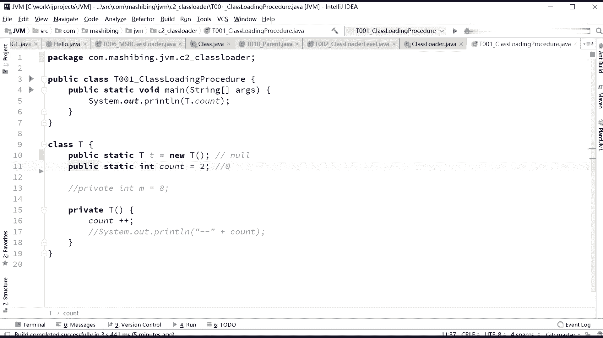

就是这两个过程。第一个过程呢，preparation是静态变量复默认值啊。第二个过程呢是静态变量复制为初始值啊。嗯。

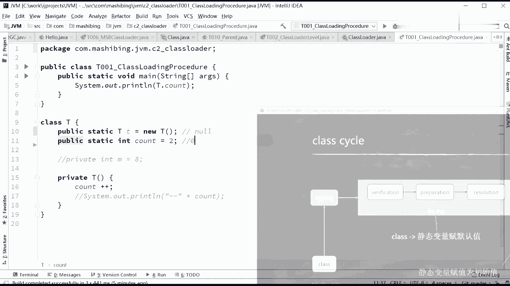

好嘞。Yeah。好，当大家理解了这个问题之后呢，我们再来讲一个更加更难的问题。好吧，这问题呢我在公安会也讲过，但是有同学可能没听过，所以我还要重复一下，我快速重复一下。更难的问题。这更难的问题是什么呢？

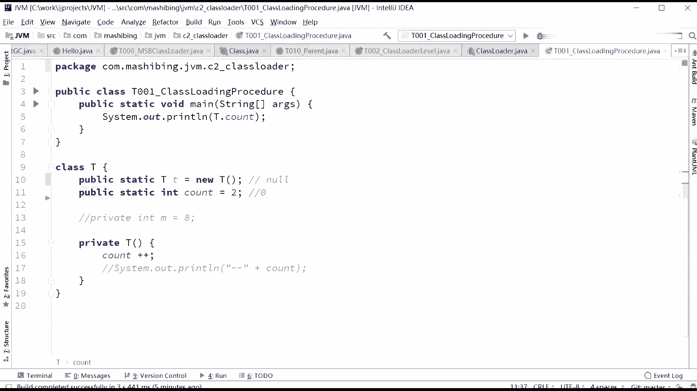

同学们，这里啊其实只是一个嗯。静态变量的问题。呃，我们我们分析一下啊，假如他有一个成员变量，M是8。大家知道这个成员变量。要想呃给他这个运用把它用起来的话，那么你实际上实际上需要拗对象的。

你得把这个替这个对象给扭出来，这一点呢比较简单。注意这个new对象的过程也分成两步。我再说一遍，new对象过程也分成两步。比如说假如它成员变量啊，咱们现在扭出来了一个对象，叫叫小叫叫T啊。

大T的对象扭出来之后，它里边有成员变量，M8，它分成两步。第一步是把这个。给这个对象申请内存的过程。申请完内存之后，它里面的成员变量先付默认值再说一遍，先付默认值。所以。

如果我们把它说new一个object， new T把这句话再来分解的话，它实际上中间也是两步。第一步呢是new出来这个T这个。扭出来替这个内存，new完了之后，里边这个成员变量还没有进行赋值呢。好。

这个时候它的默认值是0。然后newT下一步申请完内存，复完默认值之后，下一步才会调用构造方法，调构造方法才会给它负值成为初始值。这个初始值变成8，所以它中间有两步，第一步是0，第二步是8。

我讲这儿跟那个classus。初始化和那个呃prepar也有有有非常的类似。关于这一点，有没有同学没听明白的，没听明白的同学，你给老师扣个2。Yes。听明白给老师扣一，我们继续好吧。

我在就是任何不管你是静态变量，静态变量是在类初始化的类类类被加载之后分成两步。那么对象里面的成员变量呢，是我们扭出来之后啊，分成两步。小五，你是哪没明白啊？嗯。呃。

M等班和浩涛问M等班和countt佳佳先后顺序，你写把谁写前面。谁就先执行，正常是这样。但其实他们两个如果没有互相之间没有依赖关系的话，还有还是有可能被乱续执行的。我这节课如果讲的快，就能马上会讲到。

先别着急，好不好？因为这节课内容呢挺挺挺多，挺深入，挺细的还啊，我其实就这节个经准备了很长长时间。但是乱序这个东西呢，我后面会讲，先别着急啊，总而言之就是先分分配空间，再付默认值，然后再付分付初始值。

就这个这个事儿啊已经被面试的时候面了好几次了，大家理解这件事儿就行。

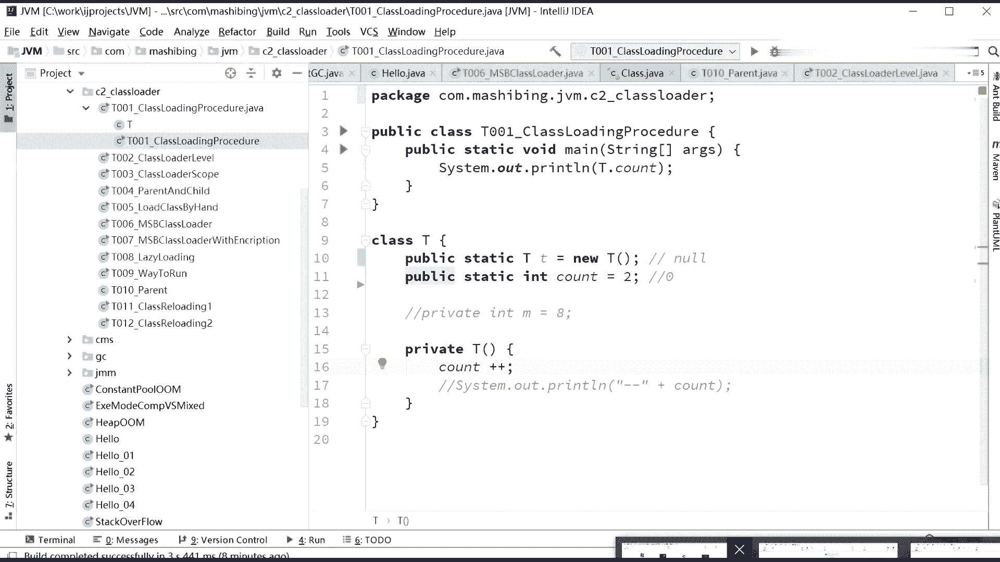

再说一遍。好，做个。小小的总结。就是总而言之呢。漏的。漏了完了之后呢。默认值。然后呢出始值。这是class，如果是object呢new objectject。如果是 new的话，依然是。申请内存。

申请完了之后付。默认值。然后初始。

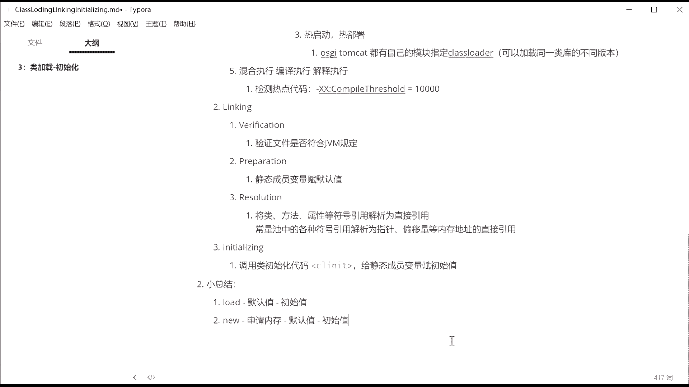

比后中间啊他有一个负默认值的过程，这点。