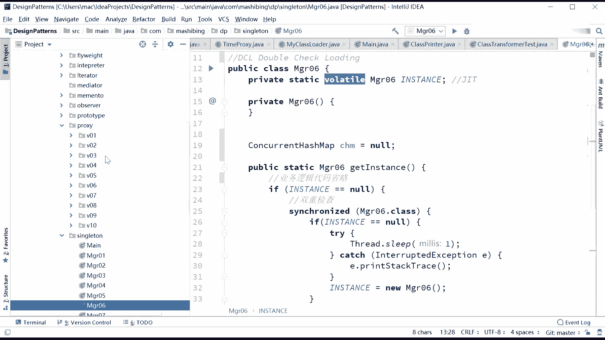
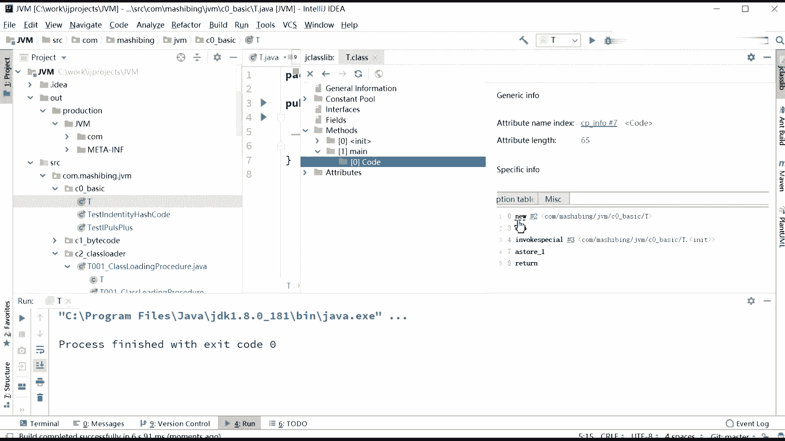
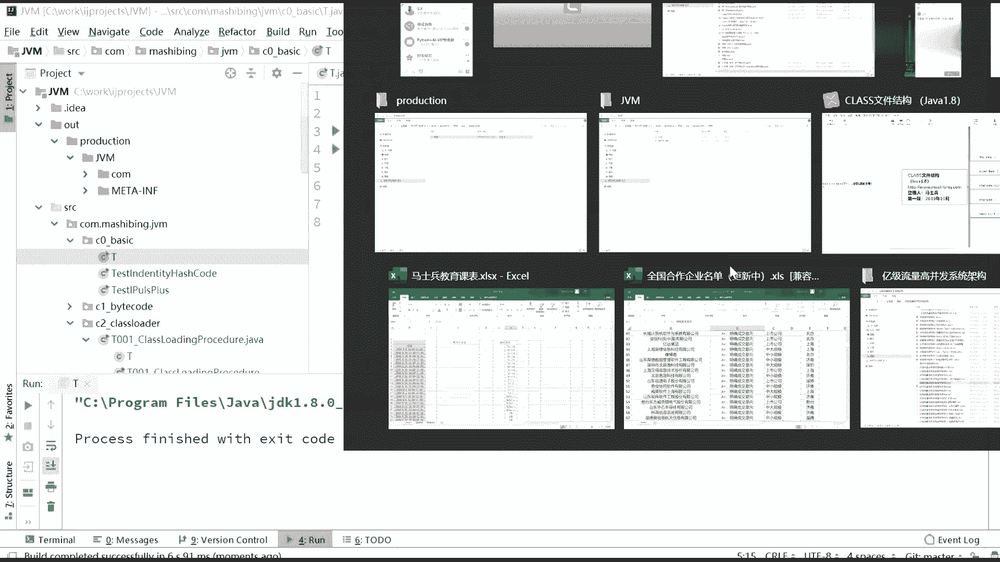
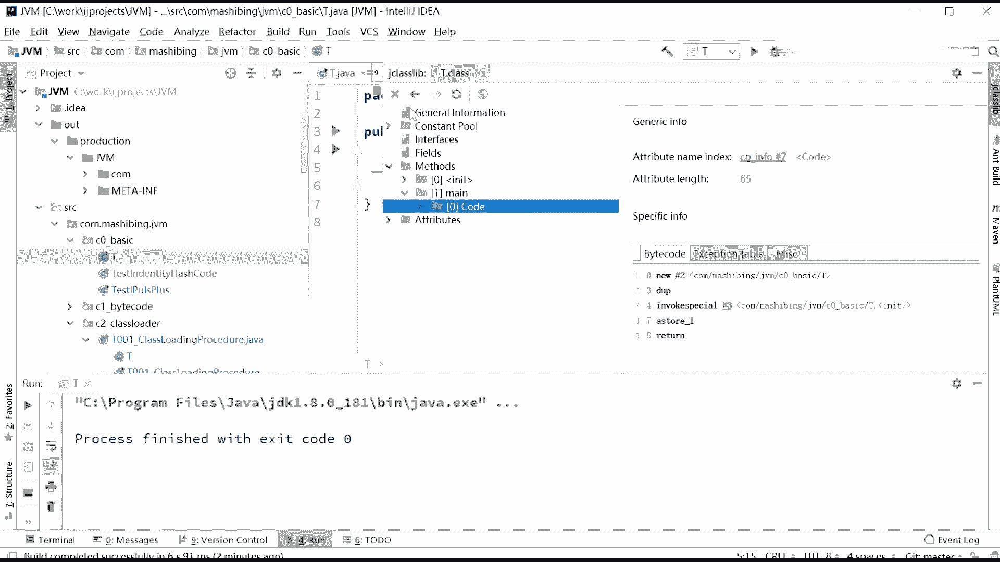

# 花了2万多买的Java架构师课程全套，现在分享给大家，从软件安装到底层源码（马士兵教育MCA架构师VIP教程） - P127：【JVM】单例模式 双重检查 - 马士兵_马小雨 - BV1zh411H79h

有恐怖。最恶心的是有的有一道题是这么问的。这道题呢我得打开原来的，咱们曾经讲过的一个模式，这个模式呢叫单立模式。我们找到单利模式代码啊，稍等一下。我在讲设计模式的时候呢，讲过一个单立模式。呃。

在这个单力模式里边啊。找到我的得力模式。Sing过 letter。哪去了？这儿了。在单列模式里面呢，我讲过1个DCL单例。好。呃，不知道大家还有没有印象啊，这个这个单例呢称之为。第一。

DDCL单位叫DCL什么意思呢？叫double。Check。double check啊，双重检双重检查是什么意思？比方说我们要对这个单例啊，呃，我们说我们分析一下这个这个小程序是怎么写的。

这个小程序呢其实上是这么写的啊，就是我们现在呢要为呃给manager06呢做个单例。那做这个单例的时候，我是这么写，上来之后先检查。我想做成多线程安全的那上来之后。

我先检查这个instance是不是等于空。如果它等于空的话，那说明还没有任何一个线程给他进行初始化是吧？同学们，那这时候呢我就好。加速上锁上锁，我来对他进行初始化。下面我又进行一个检查。

我为什么要进行这次检查？主要是因为我到这次检查到加锁这个期间，有可能被别的县城给处入放了。所以我又进行第二次检查。如果他依然为空，那么说明刚才这一段里头没有人进行过初始化。

这个时候我就可以踏踏实实的把它进行初始化了。你有manature06。但是这个面试题问的是什么呢？问的是。同学你好。这里的manager06需不需要加volatile？为什么？好，我先告诉你答案。

需要加voltile。为什么关于为什么主要是重排的问题啊，我记得我讲vollettail的时候呢，也给大家讲过这个问题。我在这儿呢，由于是整个这个也牵扯到类的这个加载的过程对对象的初始化过程。

所以我在这里呢再给大家重复一遍，为什么要加volt。如果说不加vollatail会发生什么情况？同学问我们来分析下呃，这件事啊，如果说不加volattail的话，会发生什么情况？会发生这样的一个情况。

就是第一个县程。加上锁。检查完了。第二个线程呢就是其他线程没有初始化，然后我加锁上锁上锁完对这个instance进行初始化。可是很不幸的是，这个初始化过程，如果初始化到一半的时候。

听我说初始化到一半的时候，什么叫一半的时候，就是我们缪了这个对象，而且呢还申请了内存，申请完内存里边的成员变量，假如有一个值还给它付了一个初始值为0。好，到这个情况下。

大家注意这个时候这个instance就已经指向这个内存了。所以这个instance已经不等于空了，已经不再是空了。那么在这种情况下，另外一个县城来了。另外一个县城来了之后。

他会首先执行这句话叫if instance空。可是这时候很不幸的是，这个instance还是空值吗？还是控制吗？不是了，我刚才说了，这个instance已经进行了一个半初始化状态。那大家你可以想象一下。

另外一个县城既然上来一检查这个instance，它不等于空了。我我有我第二个现程，我是不知道他已经他实际上是处于半初始化的状态。那我第二个线程是不是就直接开始用这个初始值了，而不是用那个默认值了。

我本来默认这是100，初始值是0。结果您倒好这个订单啊，已经有100个订单了，默认这是100。结果您倒好您第二个线程来了之后，直接拿零给我往上加，会发现你只有一个订单。所以这个时候就会出问题。

那怎么解决这个问题呢？解决这个问题的关键呢是在于加walllet。那有的同学可能会说，老师这事儿他妈神奇了，怎么会。把这个。这个。vololatile加上居然就能够搞定这件事儿。好，这里头是重排的问题。

指令重排指令重排我接下来马上要讲。但是在这儿呢选提一个预热就行。好，认真听。嗯，要了解这件事情的话。认真听认真听啊。

看这里。嗯。😊，我在basic里面随便写一个class啊，这class呢就叫T好了。没有。我啥也不写，我就溜了个T啊，啥也没有，就这么一句话。好。Yeah。质证一下。观察它生成的二进制码。Vi。

Show by code with the J class library。找到m。找到min方法。我们来看卖方法里面new这个对象的时候，他做了一件什么事儿。注意看他拗的时候缪缪了我这个T方法。

Dupplication invo special。呃。看这里啊。记得我是把这段切下来。对啊，基本上。还差了一个，我这小程序还差了一个一个小东西。Yeah。我们还得复制给变量啊，T小T等于6T嘛。

跑一下，然后再来生观察它生成的二进制码。Will。手败扣。没方法可了。呃，你看这里啊。这段呢我已经切下来了啊。四句话，new duplication invoke special a store。

好，这四句话呢我已经打切到这里了。

我们来详细解释一下这四句话为什么会产生问题。问题就产生于在这里啊。就是new这句话完成之后，其实内存已经有了，内存已经申请好了。下面这句话invoke special是调用构造方法。

把内存里这个M值原来是零给它变成8。嗯，是这个过程。好，接下来S store一是什么？A store一是吧？这个引用值赋值给那个小T。本来正常的情况下，应该是先调用完initialization。

调用完这句话之后，才把这块内存赋值给这个小T。如果是这样的话，那就不会出任何问题。可是很不幸的是呢，由于指令有可能会重排的关系，我再说一遍。指令有可能会重排这两句话发生的先后顺序有可能会不一样。

如果说不一样，A store先发生的时候，相当于先把这个内存地址扔到T里面了，然后再进行的初始化。OK如果是发生这样情况的时候。

就会发生我们刚才所说的双重检查单例里面有别的线程读到了那个半初始化状态的问题。好了。关于这一小段，看有没有同学有疑问的。有后面我们讲我们讲那个指令的时候，再再来说吧，好吧。好，如果有指令重排。

这样就会产生问题。因此这就如果有人问你这种DCL单例为什么要加volatile，你要解释到这个深度的时候啊，这道题搞定了。

