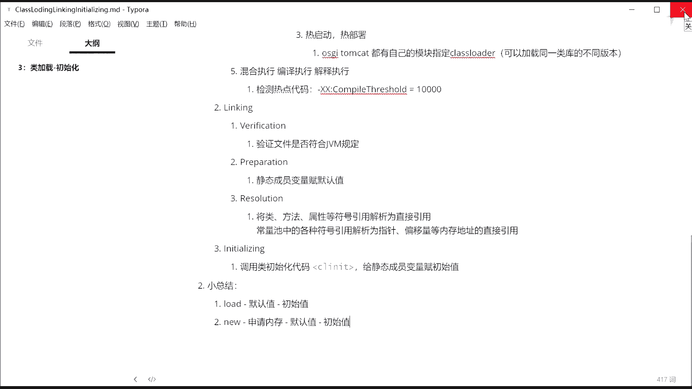
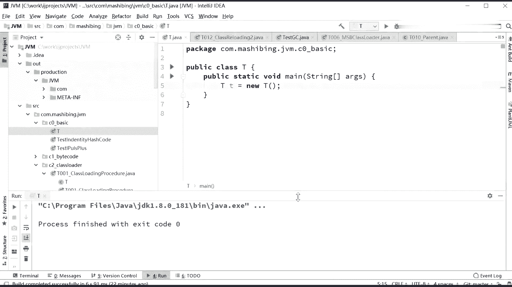
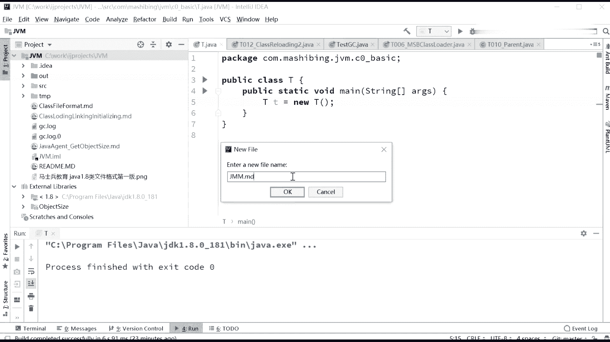
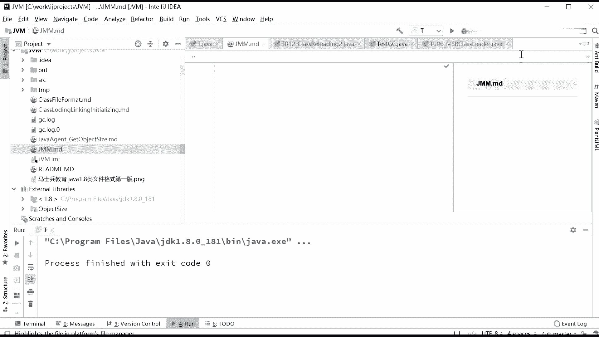
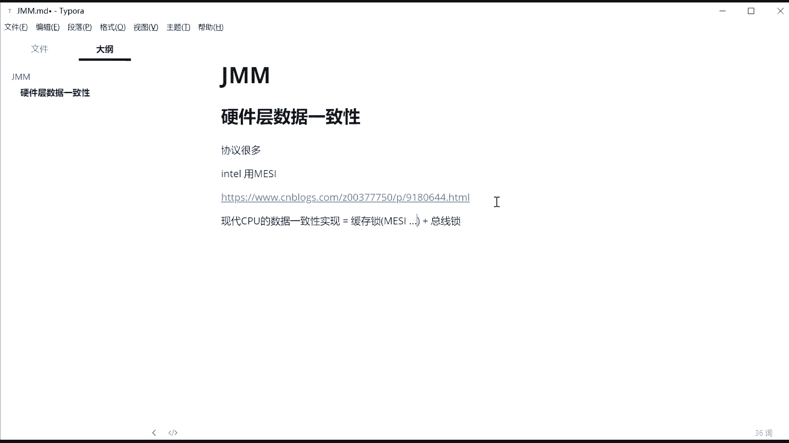

# 花了2万多买的Java架构师课程全套，现在分享给大家，从软件安装到底层源码（马士兵教育MCA架构师VIP教程） - P128：【JVM】硬件层数据一致性 - 马士兵_马小雨 - BV1zh411H79h

刚才呢其实留了很多坑啊，估计有很多同学会有疑问说这个你这底层到底是怎么回事啊，它这个重开序到底是什么东西什么东西啊？这节课呢我们开始讲java memory model，java内存模型。

那这块内容呢又细又多又繁琐，我也不知道呃能不能够给大家讲的很很清晰很透彻。呃，咱们反正咱们多增加互动，你什么地方听着有问题的。我们呃多多相互进行探讨啊。因为我我这个内容呢越准备越多越准备越多。呃。

主要是就是由于咱们学员里头呢，还是有一些人去追究这些细节啊嗯。所以越准备越细越准备越细啊，这个我们慢慢慢慢讲讲听啊，如果不成的话，再往里挖。啊。

我我们现在来聊这个javajava memory model，就这块内容啊是又细又多又繁琐。呃，我来尝试着一点点的来给讲给大家听。那有同学说这个java memory model其实我讲了不少了也。

但是呢。那个这里面我们要解决一些什么样内容呢？就在这种高并发的情况下，java的内存模型到底是怎么提供支持的呃。一个对象弄出来之后，他到底在内存中到底是怎么布局的？好，我们主要讲解这两方面。

解决这两方面的问题，好吧。我们首先来看呢硬件层的这些并发优化的基础知识。注意这里面呢我先讲硬件，然后再来讲。呃，java的内存的模型呢，到底是在硬件的基础之上去怎么实现的，好吧。

因为我们聊java内存模型的实现，我要跟你聊呃，指令重排是吧？然后跟你聊呃，happens before原则，跟你聊什么八大这个是这八八大原子指令跟你说半天呢，你也不了解怎么实现的。所以。跟你讲那些。

你也要扣到硬件上来啊，因此呢在这里。我先给大家聊硬件，好吧，我们先把硬件聊一聊啊，然后呢再来讲java的内存模型，它是实际上是呃在这些硬件上进行架构的。呃，我们首先来聊的是这个存储器的层次结构。

这个是大家可以看这本书，叫深入理解计算机系统的原书第三版的第421页这个图我给大家拿下来了。这个是什么意思呢？这个的意思是。现在的这种CPU啊，这种硬件啊和呃原来的不太一样。它增加了很多很多的结构。

这些结构呢是通过缓存啊来进行的。当我们有1个CPU。有这个CPU呢，大家知道它速度特别快，这它比内存的速度大概要快100个数量级。然后它比硬盘的速度那就更多了，可能快100万个数量级吧。

差不多就这这么一个概念啊。嗯，当然呃更慢的呢是那个远程存储，远程网络存储我就不说了。所以现在的这种存储机的层次结构呢，是这么一种金塔型的。就是如果你文件特别大，存取速度要求不高的时候。

你甚至可以存在远程，存在磁盘上，这是没问题的。但是你要求我访问它的速度特别快的时候，你就得把磁盘上的某些文件给它放哪去啊，放内存里。放到内存里。好，如果我要求速度还快的时候。

我内存里面内容呢会放到我们的高速缓存里。这个高速缓存呢我们称之为L3，这个高速缓存也是在主板上的，因此是被所有的CPU所共享的。但是即便高速缓存，对于CPU来讲，它的速度在他看来啊也是慢的多，太慢了。

你慢的受不了。所以这时候我存取你里边数据的时候还特别慢，我怎么办呀？我在我CPU内部。还有两层缓存，第一层呢叫L2，第二层叫L1。然后最快的实际上是寄存器，就CPU内部最核心的计算单元。

只存储那么几个数，拿过来之后，我就算拿来之后就算算完就走算完就走，这是最快的叫寄存器。所以CPU要想读数据的时候做计算，读数据，读数据的时候怎么读呢？假如有一个数据要被读到CPU里去执行啊。

12这个数它的躺躺在硬盘上。他首先被漏到内存。然后CPU读的时候呢，首先是去尝试去高速缓存里面找。如果这个数在这儿呢，我就直接拿拿拿给CPU直接拿来用。因为这个速度非常快，他们两个之间离得比较近。

如果这个缓存里没有。他就会去下一层去找有没有这个数啊？如果有把它漏的到我最近这一集，再交给CPU。像CPU下次再去访问这个数的时候，速度就快了。所以这是一层一层一层一层的缓存结构。好，关于这个结构。

大家伙有一些什么样的问题没有？如果没问题，能理解这个结构的话，我们就继续。有问题的话，你直接提。总而言之，这个机格结构就是什么呢？离CPU越近。它的容量会更小，但是它成它会速度会更快。离CPU越远。

当然它就更慢。🤧。这跟双天尾派有有有有个鸟关系吗嗯。😀呵呵。😊，所以我们就是说CPU读一个数的时候，首先去最近的缓存里找，如果没有再去找下一层。如果没有再去找下一层。如果没有再去找下一层。

到内存里找着了，首先放到上一层，再放到这一层，再放到这层，然后再回来。好吧。关于这个速度到底能差多少？呃，这里呢我截了一个图。从。寄存器啊，如果是大概CPU周期一个时钟周期的话，那么L一大概要3到4个。

时间上呢1一个纳秒一个纳秒，这个纳秒是一个什么概念来着？呃，秒，然后是毫秒微秒纳秒应该是。10亿分之1吧，差不多11分之1秒啊，一个大秒。然后接下来是L2的开，L2开始，你要访问的时候。

大概需要10个使用周期。那么L3呢就是所有CPU共享的那个L3是40个使用周期。啊，你要到总线的话呢，那就更长了。主存的话呢，60到20个纳秒。啊，60到80个大秒。嗯。嗯。😊，好。

这里就会产生一个问题啊这里就会产生非常严重的问题。现在呢就我们再重新换一下这个模型的话啊，这个模型呢是呃CPU计算单元和计存器，这是最快的计算单元直接跟计存器相关来做计算的。好，这这是第一个核。

或者这是第一个CPU这是第2个CPU。好，假如我们有一个数在储存里，在那我们的内存里。就是那在内存里的时候，这个数它会被load到我们的。L3这个缓存上，但是需要注意的是，我刚才大家也看到了这个。

L2和L1。这两级缓存是在1个CPU的内部的。那也就是说会产生一个什么情况？会产生一个。我们的L3里面的或者说主存里面的这个数，它会被我们漏到不同的CPU内部。既然会落到不同的CPU内部。

那假如我的第1个CPU把X变成一，第二个CPU把X变成2。同学们，你们考虑一下。就会产生这个数据的不一致的问题。我们这两个之间到底要怎么样进行同步，数据的一致性在这儿就会产生问题。好。我我讲到这里。

不知道大家能不能理解这件事儿。就是说我如果用这种模型，它加强加快了效率，速度会非常快，但是它会产生数据不一致的问题。同学们。那好，如果能理解这件事儿的话，那现在到底是怎么解决这种数据不一致的问题呢？

你比如说两个县程，第一个县程在这个CPU里跑，第二个线程在这个CPU里跑，也有可能是超线程，超线程就是两个县程可以在同1个CPU里跑。那好，不管怎么样。

总而言之是啊这个CPU或者说这个线程里它改了这个数的话，另外一个线程到底怎么才能知道呢？或者另外1个CPU里到底怎么样才能知道呢？这是硬件级要解决的问题。那么硬件你要解决这个问题的时候，怎么解决呢？好。

听我说。硬件级要解决这个问题的时候，有几种方式啊。就多线程一致性的硬件层支持。实际让我们去读那个外部外部缓存，读memory读L3的时候，我是通过系统总线的。所以最简单一个办法就是把这个总线给它锁住。

咔嚓给锁住，什么意思呢？这句话的意思是说哎，你比如说啊。我们这里头改了这个数的话，大家伙都是通过一条总线去访问里面内容。我把这个我把这个把这儿给给这儿加个锁。给这儿加把锁。加班索的意思。

我这个CPU去访问这数的时候，我另外1个CPU不允许访问。相当于我叫我我是我我只有这把锁，其他其他CPU防不了。好，这是老的CPU干的这么一件事儿。这个呢叫总线索，这叫总线索，叫bus洛，叫总线索。

这个总线索大家想想。有谁有一些什么样的问题没有？同学们，你们想想。效率偏低嘛？为什么效率偏低啊？最最可最可还不还不是说我这个CPU要去访问X的问，而是说我这个CPU要去访问X给总线整个上了把锁。

另外1个CPU要去访问Y也得给我等着。为什么？因为他把整条总线全给你锁了。只有一个员部，其他的全国踏实在那待着。所以这个总线索是老的CPU才会这么用。新的CPU一般用什么呢？新的CPU用。

各种各样的一致性协议，我再说一遍，叫做各种各样的一致性协议。虽然说我们一直聊可能聊vololatile底层实现到底怎么实现的，就一致性怎么解决的。我们一般来聊是MESI可是我需要跟大家强调的是。

其实和MESI相关的这种协议非常多啊，特别多。有MEMIMESIMOSIsapsfirefly dragonagon这些都是数据一致性的协议。只不过英特尔的CPU用的是MESI协议。

所以大多数人用的是英特尔的CPU。所以一一般我们聊就是说我们呃底层的一致性到底是怎么实现的呀？是用MESI协议来实现。好，那MES2的协议到底是什么意思呢？非常详细的内容，大家呢可以呃参考一下这篇文章。

好吧。我把这篇文章给他家复制下来。这你如果说你们上那个计算机组成原理的课。呃，应该会学习到这方面协议的内容。不知道咱们有有没有有有没有在学这个课的啊。这是雷加的初始化，我来新建一个文件啊。

嗯，不用这个文件了。

GMM点MD。

小怪兽说上周刚学过老师PPT翻过去了嗯。也正常啊。姐人们。硬件层。数据一致性。硬件层属于一致性的，协议非常多啊。协议很多。In儿的。一那用MESI又称伊利洛因协议。呃，这个MESI的协议呢。嗯。😊，好。

大家可以参考一下这篇文章。这篇文章呢讲的还是比较细的。呃，但是这个协议内容呢其上它非常的细致。我在这里做一个简简要的介绍。好吧，这个协议内容是呃什么意思呢？其实就是它给每一个缓存的内容。

这叫缓存一致性协议嘛，给每一个缓存内容呢，做了一个标记。比如说我这个CPU里面我读了一个数进来X好，我给这个缓存内容做个标记。这个X和我们主存的内容相比，我到底有没有更改过，如果更改过。

我标记为M就叫moddify。如果这个内容我所独享，我标记为exclusive独享。如果说这个内容被别人我我读的时候，别人也在读，我标记为share。呃，如果说我这个内容在我读的时候被别的CPU改过了。

前面三个都很容易理解。如果说我读的内容被别的CPU改过了，我读的时候，我读进来的时候是2另外1个CPU把这里面的值变成三了。那么说明什么呢？说明我读的这个数已经是inval的，已经是无效了。

那么至于说我这几种状态到底什么情况下要进行处理，那么是根据我这个协议来的，我也也是根据我的指令来的。好，所以这个MESI的大概的意思其实就是这几种状态的一个组合。我再重复一遍，我改过叫modified。

我这个CPUCPU改过叫modified。我改过了，别人那里就就就是inval的了。啊，只有我在用，别人都连读都不读，只有我在用，它叫exclusive。我读的时候，别人也在读，叫share。

我用的时候别人改过了，叫invald。那好。所以它叫MIMESI的协议。那MESI的协议呢是通过这个协议来让各个CPU之间的缓存保持一致性。比如说举个最简单例子，如果有我我观察到我这个数是inval的。

但是我马上要对这个数进行计算的时候，我观察到它已经是inval的，我怎么办呀？我再去从内存里面把这数再读一遍。他就已经变成有效了。所以这个协议是这么来规定的。啊，我讲到这里。

大家是不是能大致理解这个MESI的一个意思？modified exclusive sharely valid的就是缓存的四种状态，以及对这四种状态的一个特征的处理。好，大致的一个意思，先搞明白。

当然你要是非要不详细到那个硬件里这种状态，什么情况下处理，这种状况下什么处理，这个对咱们来说这也真的没有必要啊。像这个就变成真的是变成那个那个呃组成原理的课了，是吧啊？过没有关系啊。

你大概理解什么意思就可以。既然是四种状态，那应该用两位啊，两个比特就可以标识了。但其实啊需要注意的是，这个MESI呢并没有完全解决锁总线的问题。这个锁总线在现在的CPU也是需要。MS我们称之为缓存锁。

原来的内容呢，我们称之为总线索。总线索，我们说效率比较低，缓存锁效率会比总线索要高，可是又会带来新的问题。有一些无法被缓存的数据，数据特别大，或者跨越多个缓存的数据好，这个时候必须使用总线索。因此。

现代的CPU的底层的一致性。是通过缓存一致性协议缓存锁加上总线索来实现的。好，我讲到这里，看大家能不能够理解这一块就说。现在。CPU的。数据一理性。实现。是通过什么呢？很纯熟。叫什么？请申请。

那么M现在呢。就是看对不起啊。吃饭了。MBSI啊等等各种各样的协议，指的都是锁缓存的这种协议。啊。

