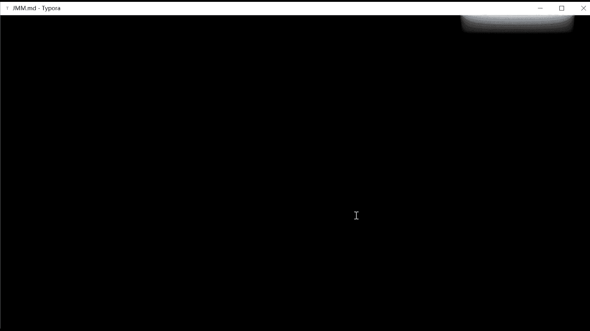
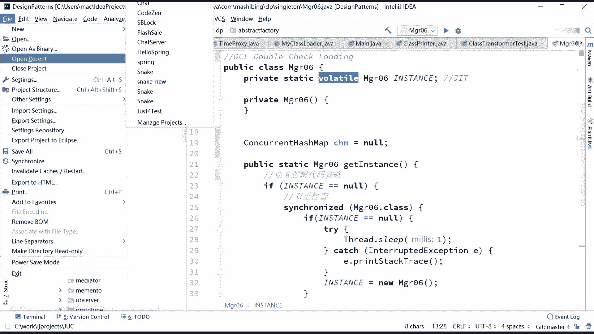
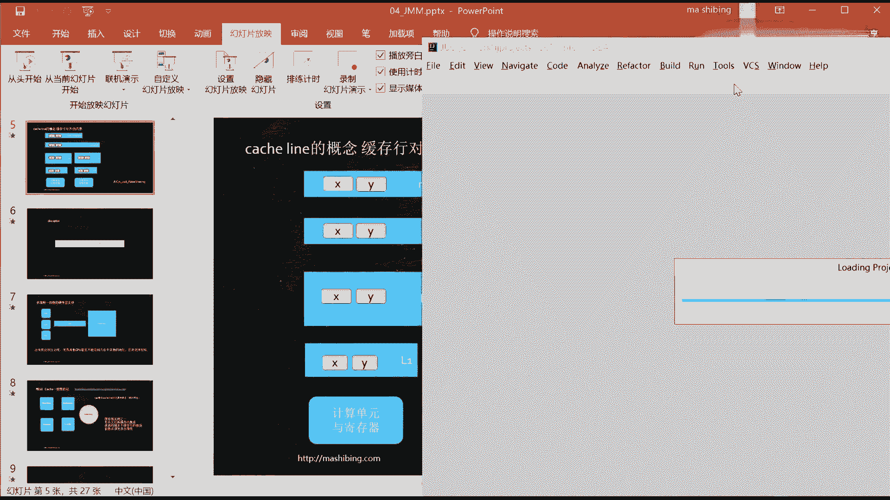
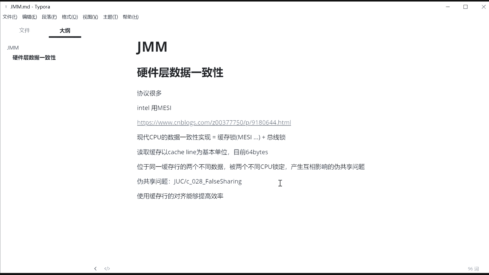

# 花了2万多买的Java架构师课程全套，现在分享给大家，从软件安装到底层源码（马士兵教育MCA架构师VIP教程） - P129：【JVM】缓存行、伪共享 - 马士兵_马小雨 - BV1zh411H79h

好，那刚才这小段如果没什么问题的话呢，我们来看缓存行的概念。好，这里是有可能会被问到。我再说一遍，缓存行这个概念是有可能会被面试中问到的。好我们来聊缓存行是什么意思？缓存行指的是什么呢？

指的是这样的一个东西。就是当我们要把内存里面的某一些数据放到我们CPU自己的缓存里的时候。他不会说把只只把这一个数据放进去。比如说我用到了一个数据，12，int类型，它只有4个字节。

但是我读这个缓存的时候，不会说只是把这四个字节读到我缓存里，而是为了提高效率，他会把四个字节后面的一堆内容夸机全都读进去。好，这个一般称作读读一个内容，把一块内容全读进去。

这一块内容是一个基本的缓存单位。这个缓存单位呢称之为catchline，称之为缓存行。这个缓存行目前多数长度为64个字节。

读取的时候。独取缓存以。can始 line为基本的。目前啊多数的实现64个字节。哦，那这里就会产生一个问题，产生一什么问题呢？就产生一特别好玩的问题。就是你分析一下，假如这个X和Y位于同一个缓存好。

我第1个CPU其实只用X，然后我一读的时候就把X和Y一块读进来了。假如我第2个CPU只用Y。然后我读的时候也会把XY1块读进来。哎，同学们，你们考虑一下，它就会产生一什么问题呢？会产生一个这样的问题。

就是如果我第1个CPU，我把X改了，我要通知其他CPU的话，注意我通知的时候不会只通知这一个内容，而是我通知说我整个缓存行被改过了，它是处于一个通知CPU啊，这个缓存行已经是inval的状态了。

麻烦你给我更新一下，结果他又重新把整个缓存行跨机又读了一遍。然后第2个CPU改完Y，他通知一下，结果第1个CPU跟Y没有关系，他只要读X，结果他又把整个缓存行又重新读了一遍。

两个互相无关的这样的值在这里变来变去的时候，竟然内部会产生这种缓存行的互相影响问题。因为他们位于同一行。好，我刚才讲的这个问题，不知道大家能不能理解好，这种问题叫什么呢？叫做伪共享。为共享什么概念呢？

就是位于。同一缓存黄的。两个。不同数据。对。两个不同。手据有锁定。产生互相影响。作共享问题。啊，这个问题面试确实是有人被问到过的。好，关于伪共享。是什么概念？在这里有没有同学不能理解的？没有问题。

你扣一。有问题啊，你直接提。杰杰潘生说，伟工想是不是不好，当然不好了。你想想看，我本来只用这一个数，结果呢。由于你用了我的邻居，结果你会影响我这个CPU在这里不停的跟这儿重新漏的整个缓存行。

重新漏的整个缓存行。那你是你想想看，你这你这个这个这个当然是不好的，对不对？那有同学我会说哇，这个老师会有会有这种情形吗？我告诉你有程序还能证明呢。所以我写了一个程序，但是这个程序呢实际上和并发有关系。

所以我写到了并发那个包里啊。他因为后面的这些东西呢，其实真的和内存的也有关系，和我们并发呢也有关系。呃我放在哪呢？都都有问题啊，我就挑一个仿，我放在了并发那个包里，我给大家记下来，记在笔记里。

大家看到笔记的时候去找就可以了。腿共享问题。好，是在这个文件里。这UC下面的。C208我把。项目打开这UC。

呃，大兵问为啥XY都会被引用，没有，都会被引用啊，是因为它位于同一个缓存行嘛，咱们去访问缓存行的时候啊。访问一个数据的时候，都会把整个缓存行都缓存起来。他俩是独立的，但是它位于同一行。他俩是独立的。

X四个字节Y四个字节。X4个字节Y4个字节，但是他俩挨着能能理解吗？所以1个CPU要去读X的时候，他会把整个行全都漏到自己的内存里。所以Y是不是就跟着进来了？另外1个CPU要读外的时候，整个行漏到内存。

X也就跟着进来了。那我这个CPU改了个Y。是不是整个行就数据都改了，我会通知其他CPU你你你把这行的内容全都给我更新一遍。所以我改了个外，结果导致我第1个CPU只用X的，就得把整个行重新重新一遍。大兵。

你听明白了吗？为什么会有混这种设计？硬件的设计上很多时候是按块来执行的，它并不是按一个字节一个字节一位一位来执行。读取整个块儿效率会更高。大兵在不在啊？不太理解这这个一行是个啥概念，一行就是一块内存。

你就理解就是一块连续的内存，64个字节字节数组能理解吧，64个字节。一个一个的字节数组，大兵能理解吗？嗯，对你就当就是1个6十4字节的数组就OK了。好吧，就这么简单。

不用理解他理解他给这6十4节起取了个名，就叫catch line，叫叫叫叫呃缓存行啊。不用去追究他的这个概念。缓存的一个一个一个级别的一个最小的单位，就是64个字64这个字节的数度，好吧。

64位是64位，这是64个字节。大哥，64个字节是多少位啊？64乘以8512位好吗？你这么晕呢嗯。😀H。😊，没事儿没事啊。偶尔被怼也是正常的啊，被老师怼也是正常，老师也经常被被被别人怼啊。嗯。

希望你们有一天赶紧怼怼老师啊。呃，其实教科学是一个互相促进的过程，有的时候你能怼怼我，也能促进教学质量啊。好不说了，主要主要是我还没有跟新同学们讲过这个自尊心的问题，我怕你自尊心受不了。

都给我放下子任写啊嗯。好。我说啊认真听认真听，我们来看这个缓存行的问题啊，缓存行就有产生一些很好玩的问题。你以前可能没有接触过。呃，但有一些优秀的开源软件，他内部已经开始考虑这个问题了。然后来注意看啊。

😊，嗯。嗯，说是 Sharon。好，你你认真看啊。呃我们来看这个小程序啊，这个小程序干了一件什么事呢？呃，我有一个呃class T这个class里边啊就只有一个volatile long。X到 L。呃。

就是一个浪类型，这浪类型是几个字节来着？大家还记得吗？8个字节对吧？将来呢我又弄了一个T的类型的数组，这个T类型数组呢呃呃呃耳瑞啊里边有两个值啊，第一个值呢是newT，第二个值也是一个newT。呃。

那大家想一下啊，这呃这就这个初静态初始化块完成之后啊，内存里面什么情况呢？内存里面是一个数组，这个数组呢有两个这这个数组里边指向的是一个new出来的对象啊。

这个对象里面的内容呢就只有一个8个字节的浪类型。大的字间。大个字典。好，这是第二个第二个是这个很简单啊。然后接下来呢我们来看我起了两个县程。第一个县程呢呃。第一个线流是循环了100万次。

然后把are零里面的那个X值不断的在产生变化。分析一下啊，听听我说，你看啊，这是第一第第一个线程，他会干嘛呢？把这个X的值啊不断的在里边对它进行变变第一个。对不起。这是八个字节，是一个数啊。一个数组。

010位置上一位置上指向了我们T那个对象，T那个对象里面只有一个值浪类小。这这边呢只有一个指浪类型。好，第一个线程呢会把这里面这个值不断的产生变化。刚开始是零，然后变成一变成二变成3。总而言之。

这个值是在不断变。第二个里面呢，这个值呢也在不断变。那大家分享，如果说刚好这两个位于同一个缓存行，这俩值。正好呢位于同一个缓存行。然后呢，又正好这两个县程是位于不同的CPU。

当然这两个线程应该是位于不同的CPU那就会发生什么情况呢？就是这第1个CPU啊，它是在不断的更新这个缓存行，第二个CPU也在不断的更新这个缓。我们就想模拟这么一件事儿。来看看他的执行时间。好。

关于刚刚才呃我讲的这一小段，有没有同学？有疑问的。啊，如果没有问题，哎，我来我来看看这个整个的两个线程的执行时间，好吧，跑一下 run。嗯。再再次跑一遍啊。再跑一遍。后一遍。反正大概的一个意思吧。呃呃。

三位三位，你记着前两位是28啊，扣掉后面6位，前两位是28就行了。21。28反正大概就这么一个数啊。呃，这是那个我们没没有。这这这这这个呢是我们这两个呢是位于同一个缓存行啊。呃。

然后我们再来看另外一种写法。你看这种写法啊，这种写法就就就比较好玩了。大家看能不能理解啊。这种写法首先来说呢，我们下面依然是啊依然是。呃。依然是这两个县程，这两个线程呢依然在不断的更新。

刚才的那个那个数那个X值。第二个线程呢也在不断的更新。另外一个呃X的值。然后这两个呢刚才是位于同一个缓存行。假如我想办法能让这俩不不位于同一个缓存行。我想个办法能让这两个呢不在同一个缓存行里。

它位与两个不同的行。那这两个县程之间互相呢就不会再有影响了。第一个线程会读第一个行进来。第二个线程会读第二个行进来。好，他们互相之间就不会再有影响了。理论上说，这个效率会比上一个效率要高。好，我这么讲。

大家能理解吧？所以我干了这么一件事儿。我定义了另外一个类，这个类呢叫padding。这类里面呢啥也没干啊，就来了8个浪类型的数。哥们儿这8个浪类型的数啊，对不起，7个啊7个P1到P7。七八五6。

64个字节8八64。对，七八五十6。然后我这个T是从padding继承，从padding继承的话。就会变成什么呢？我前面啊二话不说，先已经占了5656个字节。然后我会把我自己的这个存在后面。

所以这个东西自己就占一行。就这个T对象自己就占一行，因此他绝对不可能和另外一个T对象。位于同一个行列。那这种情况下，我们再来看它执行的顺序效率。109。109。不对呀，92。105。

这个数呢我除了1个除了1个100万啊，我把上一个数也除1个1100万做一个对比。我们先来看第一个啊，第一个是位于同一行的情况。我除以1个100万，让大家看清楚一点。不对呀。31。39。第二个没效率。

反而变低了啊。152。126。时间长了，什么情况啊，我看看啊。😊，实验没做成功啊，这个实验比较比较比较葛。有可能恰巧不在同一个混存行是吧？也有可能啊也有可能。1一startT2start。小爷。

Long。呃，我想想想问你可能出在哪儿啊？100万。哦，这是1000万啊，sorry。问题出在这儿啊，这个是1000万啊，那边是100万，对不起啊。😊，还说呢，看啊都都改成100万啊，对不起。

循环次数不对啊。😊，第一个啊都是100万，循环100万次。跑一下。50嗯，好。31完了来看那个第二个也循环100万次啊。好。38。17。23。23。25。第一个多跑两次。100万次还是太少了。

我们来来来1000万次，两边都改成1000万次啊。嗯，这个比较讨厌，我应该定义一个呃定义一个成员变量的啊。Iteration的是算了，懒得重新定一了。1000万次。这是第一个。第二个呢也来。

1000万次。然后第1个1000万次跑一下。270。好。311啊，大概就是二三百吧。第二个1000万次。176。107。115。好啦。现在大家是不是有点感觉了？呵。就是第二种方式呢。

虽然他多占了很多内存，就是他没事啊，把这些那个内存啊给那个缓存行做了一些对齐和填充，这叫缓存行对齐。然后。缓存行对齐对齐完之后呢，它的效率反而提升了。What。Yeah。所以这就是比较好玩的地方啊。

因此啊听我说。奇骏说100万L是什么型号？什么意思？这这这没看懂。你哪哪儿没看懂。浪类型L是浪类型。下划线是允许的。消防线是允许的呀。GDK哪个版本加的1。8还是哪个版本来着？啊，1。

8之后肯定是允许的啊。ok。呃。这个期是吧，这我就不不记得了啊，反正那个1。8之后肯定是允许的就行了。那通过这你就能看得出来，我们通过对缓存行的一个对齐，居然能够提高效率。这样能提高效率。好。

这件事呢已经被很多开源作者给用起来了。我在讲呃并发的时候讲过一个开源软件叫做drupor。大家还有印象吗？disruptor还有没有印象？号称那个单机效率最高的队列嘛，在它里面的原码里面有一个。

它里面关于那个它里面有一个。呃，这个有有有有一个它不是一个环嘛，这个环有一个这个我们叫它叫叫叫叫做cursor叫做呃游标，或者叫做指针。就这个指针大家还有印象吗？就这个指针呢用的非常的频繁。

而且是在多线程你要用好，它转来转去转来转去转来转去。如果说被多个线程，多个CPU所访问，互相之间缓存好有影响的，那这个效率就变低了。所以它这个指针里边内部定义的时候，居然是这么来定义的。

大家看看是不是能够理解了。在这个指针的前面，这个cursor的前面。他怼了7个long，在他后面又怼了7个 long。就保证这哥们不管是跟后面对齐或者跟前面对齐，他永远不会跟其他人混在同一个缓存行里。

啊，折子系说link transfer Q里边也有是吧啊。这个你可穿Q有没有我还真没有印象。既然折的细说有，那大家可以去读一下啊。那这就是这个缓存行怎么提高效率的地方。桃子说这样不浪费吗，浪费啊。

谁说不浪费了，肯定浪费啊。但是浪费的这点空间，跟我们提高的效率相比，只要还值不就行了吗？有利有弊，好吧。好，关于这件事情，我不知道大家理解理解清楚了是吧？所以这就是呃底层的这个MESI协议。

以及它的一些个实现细节，以及怎么能用MESI来帮助我们来够能够实现程序的效率啊。好听我说。呃，这个位共享问题怎么解决呢？解决的话就是使用。本存行的。对其能够提高效率。当然他会浪费一定的空间。

就看你浪费的空间值还是不值，以及你有多少个数要浪费这个空间嗯。

