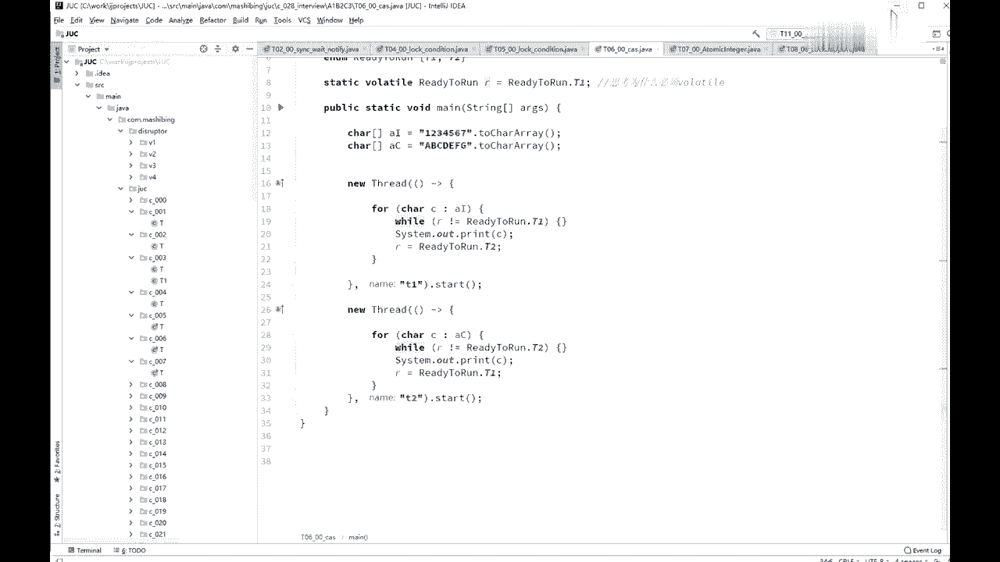

# 系列 3：P12：【多线程与高并发】课程规划 - 马士兵_马小雨 - BV1zh411H79h

好同学们，我们开始上多线程和高并发的，2019年的第一节课，我首先跟大家交代一下，在2019年的这个版本里头，我给大家讲哪些方面的内容，呃，那么老师呢会给大家讲多线程和高并发啊。

这两大块儿应该说怎么说呢，就这两大块啊，是现在面试他问的越来越多啊，也是你从一个一个相对初级的程序员，然后像比较高级，中高级的这方向的迈进的，一个必须要踏过的一道坎儿，呃，我先跟大家简单交代一下。

就是后面会讲的哪些方面的内容，无论如何呢，这些方面内容呢都会给大家讲完，呃我的预测是4~6个周末啊，这个不一定能够讲完，如果讲不完的话呢，呃咱们再往后就拖一拖，另外呢呃老师讲完这块儿之后呢。

会讲那个jvm呃，原来排的操作系统的课呢，排在jvm后面会比较合适一些，呃我后来考虑了一下，因为先讲操作系统，其实呢它里面呢也有很多同步的东西，那么同步的这块呢，实际上和多线程和高并方案有些冲突。

我们不如先学最直接的，学完这个之后呢，我们先学再学jvm，jvm也是离我们最近的嗯，金九银十，你要是想去跳槽的时候，马上能用得上的好，在这个之后呢，我们再来讲操作系统。

其实你理解起来呢会更加相对容易一些呃，我会尽量的不和其他的课冲突嗯，每个周末的上午，这个周六或者周日，为什么是，或者主要是要照顾一下，黄老师那边的源码课，因为黄老师那边他的时间并不是特别固定，呃。

他还是在一线在上班，所以呢我能照顾他一下啊，就是这个意思。

呃我大概讲六大块儿呃，第一大块的基础的概念，什么线程开始啊。

今天我们基本上就能把基础的概念，应该讲差不多，第三块呢是同步的容器，第四块线程池呃，第五块呢是高频的一些面试的东西啊，第六块呢是呃disrupter。

呃，不知道有多少同学听说过这个框架的，这个框架呢，它也是一个mq框架。

嗯，我把我的画图软件调出来，那么这个框架呢也是一个mq的框架，好，这m q叫什么呢，叫message q，小消息队列的是吧，消息队列呢非常多，后面还会有老师给大家讲那个嗯actim q啊，卡夫卡呀。

这些都是消息队列啊，好我给大家讲的这个，如果你能在简历里就体现出来，并且能够跟面试官说清楚，这是10000%的加分项目，呃这个呢是叫做destructure，应该来说是目前大家伙公认的，在单机环境上啊。

效率最高的，性能最快的这样一个m q啊，讲到的时候我们在聊这个问题啊，得需要了解前面的关于并发的。

这部分的内容。