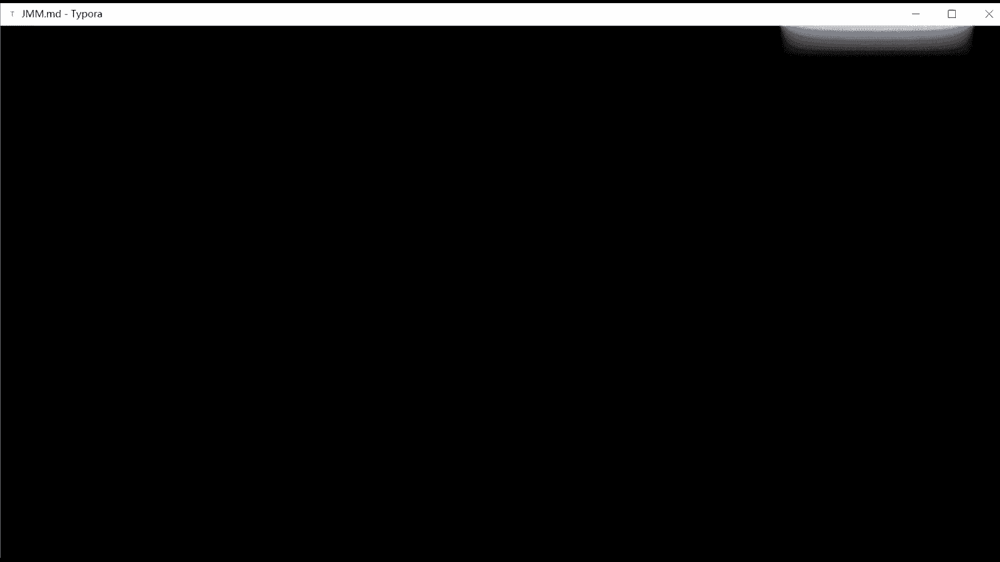
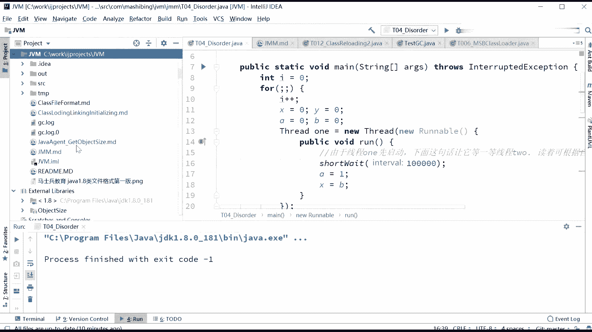

# 花了2万多买的Java架构师课程全套，现在分享给大家，从软件安装到底层源码（马士兵教育MCA架构师VIP教程） - P132：【JVM】硬件级别保证有序 - 马士兵_马小雨 - BV1zh411H79h

这是乐取执行的一个证明。但是有了乱序执行之后呢。如何保证？特定情况下。不乱去。比如说walllowalllo就保证有序嘛，就是它保证了一个有序性。哎，那行了，那这个有序性是怎到底怎么保障的呢？好。

硬件层面听我说，在你保证有序性的情况下，所以硬件层面的一个指令就是汇编指令CPU的汇编指令以汇编辑。他就做了这么两两个东西。第一个呢，当然是加锁，加锁是肯定的，加锁是100%可以完成的。但是。

为了提高效率，在呃CPU的指令级别，很多CPU啊，不同的CPU都做了这么同样的一件事儿，就是加内存屏障。好，听我说这个这个就是CPU级别的内存屏障啊，我这里说的是CPU级别的内存屏障。

跟java内存屏障还没有任何关系。这是CPU级级别的一个内存屏道。那么CPU级别内存屏障，拿英特尔的CPU来说，我再强调一遍，不同的CPU它的内存屏障的指令是不一样的，而且它的逻辑也是有区别的。呃。

你你powerPC的和那个mac的这个这个CPU它的呃。CCPU内存屏障的执行执行的逻辑是不一样的，有的设计的非常复杂。但是英特尔的CPU呢，它的内存屏障设计的就比较简单，就是。它就只有三条指令。

第一个呢叫save fence， fence是屏障炸栏的意思。load fence。save存存指令啊，存屏障load啊读屏障M分就是所有的两两个加起来。那么内存指内存屏障到底什么意思呢？

就是在S分指令之前的写操作，必须在S分之要的写操作完成。就这两个你别给我重排，有两条指令，你不想让它重排。这个往里头写了个内容，这个往里头写了个内容，这两条指令你不想让他重排，你不想让他重新排怎么办？

中间加到屏障。这道屏障就叫se屏障。这四有屏障的意思是屏障两侧的指令。屏障两侧的读写就写指令啊，这是save save屏障嘛，写指令不可以重排，你不能把下面的挪到上面去，也不能把上面的挪到下面。好。

这是斜指令。那读指令呢也就理解了。前面的读操作必须在后面的读操作之前完成。就是说。有一个我我要读内存里的一个数，有一条指令读了它了，另外一条指令也读了它了。好，这两条指令不可以重排。不可以重拍怎么办？

分开。ok。那读写指令呢读写指令就是上面的读读写操作都得完成，下面才可以继续进行。好，这个是在CPU级别的内存屏障，不知道我说清楚没有？有没有同学有疑问的？因为很多文章讲内存屏障的时候。

他会把CPU级别内存屏障，就硬件级别内存屏障和java的这些虚拟机级别内存屏障混在一块儿讲。所以很多同学可能看起来比较费劲。但其实你把这两个一分开就没那么费劲了。嗯。

那有同学在这里呢可能还会有一个疑问说老师，你这个同一个这个这个CPU指令来说，如果你读第一个和读第二个有可能是会产生这个这个这个强后的关系，它是和线程之间和不同的CPU有关系吗？实际上呢它是有点关系的。

你vololattail的一个东西。这是volttail的那块内存，在java的实现这个volttail内存的时候，实际上它前后都加了屏障。前后都加了屏证。前我加的屏障的意思是什么呢？呃。

jajava内存屏障的比较复杂啊。就是各种各样的组合啊组合起来的。我们先理解CPU级别内存屏障了。CPU级的级别内存屏障就是这个意思，反正就是加了屏障之后。前后的你不能给我哄抬。

这个值呃这个名这这个值叫X。那么我第一个叫in的。A等于X，我读了一下in特。B等于X又读了一下。好，这两个指令如果我中间加了内存屏障，你不可不不可以给我进行重排，这是内存屏障的含义。啊。呃。

但其实这个有序性来讲啊，像java的vol的那个实际当中的实现，它有可能是用lock汇编指令，就是另外一条另外一条指令也可以实现。另外一条指令也可以实现有序性。这个指令呢是java的汇汇编指令。叫洛克。

log什么什么什么什么什么什么啊。java内存屏障呢是几个的组合啊，各种各样的组合。因为内存屏障呢我我跟大家说一下，你们会什么地方呢？会有那种。你看别人文章的时候，会看不懂的地方。呃。

有很多文章呢写的是什么呢？就是java虚拟机级别的这种内存屏障，什么load load barrier ，load slow barrier，像这种东西，它都是依赖于硬件去实现的。

那么这些硬件实现是怎么实现的？硬件的实现不是说只有在硬件级别上啊，并不是说只有内存屏障能够实现JVM级别的内存屏障。这有点绕啊，就是说JVM级别的这种内存屏障，或者叫JVM级别的这种有序性。

他的硬件级别的实现。并不一定是依赖于。硬件级别的内存屏障，它还可以依赖于硬件级别的lock指令。然后这个指令也是非常有用的。所以它具体的JVM级别的东西和我们硬件级别的东西，它不是一回事。

有很多文章呢主要就把这两个混在一起讲。所以你产你你读的时候就会产生问题。啊。呃，也给大家一点预习的时间，好吧，同学们。还有呢像java里面很多的描述都已经废弃了啊。会发会发，我笔记就记在这儿了啊。

同学们。笔记就在这里。你注意看。我的笔记啊就在咱们的。这位M目录下面我提交到gitthub上，你自己就能看到了。

