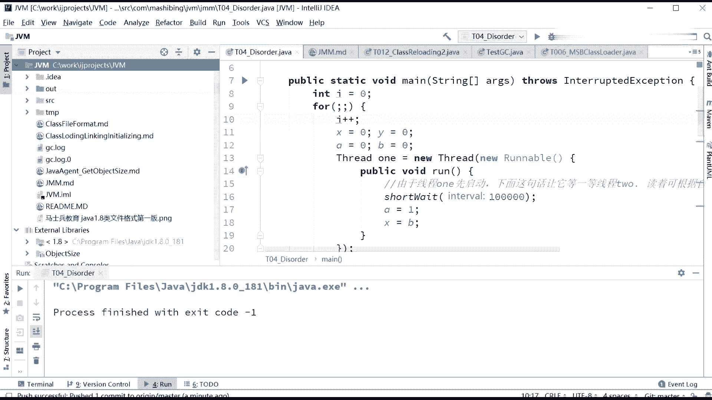
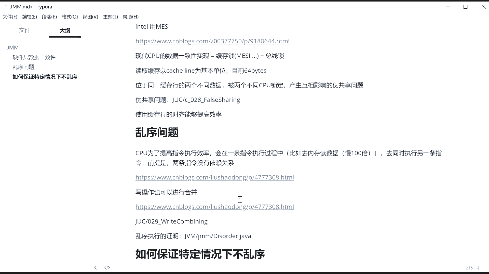
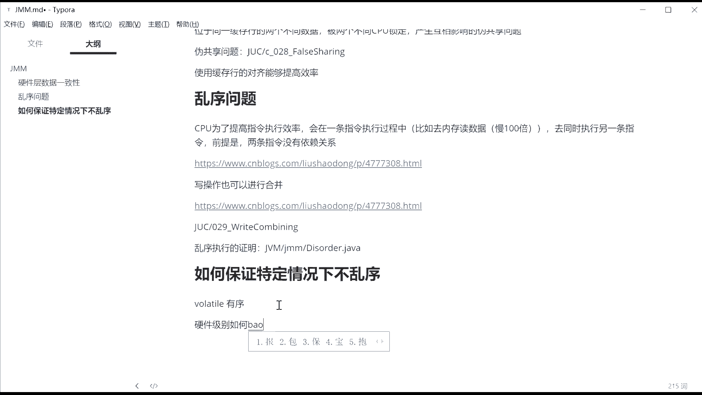
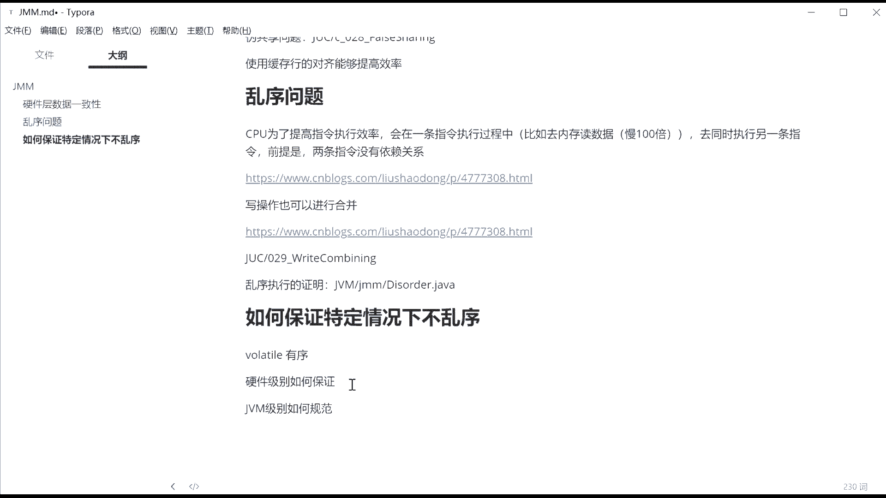

# 系列 3：P133：【JVM】第三天课后总结 - 马士兵_马小雨 - BV1zh411H79h

我来稍微回顾一下今天讲的内容啊，今天呢咱们先花呃半个小时呢，讲了那个class loader遗留的一些问题。就是什么情况下呢会破坏双清委派什么怎么怎么才能指定我的parent啊。嗯。

然后呢我们今天讲了一些底层比较细致的内容，就是我们讲了半初始化问题，讲了为什么要加vololatile才能保证双重检查单粒的一个可靠性。然后呢，我们分析了。虚拟机呃，这不是虚拟机了。

就是硬件的呃层面的一些东西。缓存行的一个对齐啊，合并写技术，这都是现在CPU呢提高效率的一种做法。那么像JVM这个级别到底是怎么利用这些CPU的。呃，你像java的话呢，你要是自己写的话。

你可以用那种各种各样浪类型来对齐。那么如果说。

JVM虚拟机的这种实现去怎么样要保证它的不乱续。咱们下节课再来聊这个问题啊，它主要是JVM级别规定了一些内存屏障，但这些内存屏障的实践实际上是还是要依赖于硬件。所以咱们先了了解清楚硬件之后。

你再来看JVM级别的这个实现的时候，相对来说就会简单简单一些啊，乱续的问题呢，我给大家举了几个例子。

写合并，还有呢乱序的一个证明diorder。大家呢。今天回去之后啊，先消化一些消化消化这种现有的小代码，好吧。

呃，然后。下节课啊，我们再详细的来给大家解读到底硬件级别的。嗯。vololaile的保证有序啊，到底是硬件级别。

如何保证？那么JVM级别。JVM级别呢实际上不叫保证它叫规定如何规范。它只是一个规范，它具体的实现还是要看硬件级别啊。

折子器现成工作内存是对CPU高速缓存的抽象吧。不能不能说的这么粗粗犷。如果要严格定现成工作内存，就是。GVM规范的一个规范东西。至于你虚拟机要把什么东西抽象进去，那是你虚拟机自己自己的事儿。呃。

但是现实工作内存呢，现在。嗯，是包括可以这么认为，就是包括CPU的那些高速高速缓存的。就是他他他他他是一个虚拟机实现上的一个映射关系，好吧。这个现城工作内存就大家伙啊在在书上看到这些图啊，就这个图。

很多人呢。就把这个图呢会和物实际当中的物理内存混在一起，就这这就是麻烦事儿。就这个图啊。所以这个图呢我刚才给大家就一滑就过去了。呃，就这个图，我相信很多同学呢也看到的都是这个图是吧？

有同学呢会把这些个东西呢。和你实际当中的物理层呢是到底是什么样的混在一起，不要混，这是JVM虚拟机规定的一个模型。这个模型到底怎么实现的，是看虚拟机各自的实现。

那这个工作内存也完全可以是我们物理内存的一部分，这完全是可以的，主内存一部分啊，是看你虚拟机怎么实现了嘛。

