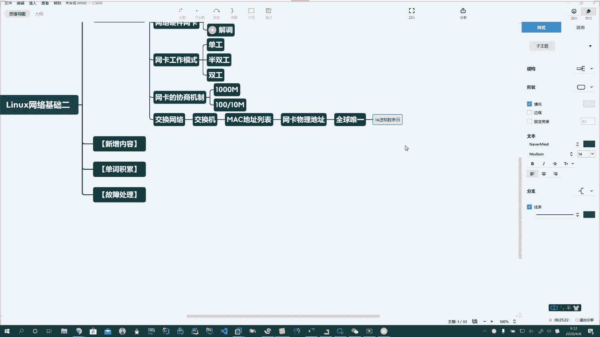

# 系列 3：P134：【Linux】知识点回顾 - 马士兵_马小雨 - BV1zh411H79h

🤧好了，咱们开始上课啊。昨天呢我们一起来学习了什么是网络啊。了解了网络的定义。那么知道呢他具有啊。分布式。是吧哎，分布式把分布在。各个不同地点的计算机系统通过传输介质连接起来。Oh。

然后计算机和计算机之间通过网络协议。进行数据共享啊，达到数据共享和资源共享这样的一个目的啊，这个就是网络。所以呢对这块呢咱们要有所理解啊。那么网络中的资源，咱们也给大家呢简单的去介绍了一下啊。

比如说你的CPU。对吧哎你的算力资源啊，你的存储资源，你的网络资源等等等等。那么根据它的覆盖范围啊，我们知道网络分为局域网、程域网、广域网。好。网络基本概念。Okay。网络的分类。啊。

那么除了覆盖范围以外，还有啊从它的拓扑方式啊，交换格式等等等等几种啊进行分类。那么这里头你掌握呢覆盖范围即可。啊。那么网络呢呃一说到网络呀，这个东西呢还有更深的内容可以讲啊。

我们在这个阶段呢给大家去聊一聊啊。那么在我们安全行业呢，还有一个网啊被称之为暗网，就是大家平时看不到的啊，一般人都接触不到的。Oh。但是呢这是非常有意思的一件事儿。啊，现在呢一个暗网的账号呢都能卖个。

啊。半间房一点不夸张啊，在暗网上呢，你能够做你自己随心所欲的事儿。啊，比如说黑客呀啊，比如说买卖军火呀。走私贩毒啊。啊，嫖娼了，对吧？哎。这个。这个这个这个这个这个雇佣杀手啊啊凡是。

你想干的上边都能干啊，所以这个东西呢。And。一般的呢。也不被报道。所以在安全行业呢，大家呢也会去防范它。比如说酒店啊，比如说酒店系统。你经常看外国的这些电影，那这几个女孩去住店了啊，然后呢。

第二天呃当天晚上对吧？哎，就让人家拐走了啊。呃，有这样的事儿，所以说呢这个。啊，这我们也是一带而过啊，然后呢我们掌握了传书介指啊。传输介指知道有导向式的和非导向式的。嗯嗯，飞导像是。

这两大类型啊导向式的呢又有光纤啊，有双角线，也就是我们的网线对吧？有我们的铜轴等啊，然后呢尤其是网线里头。

啊，他又有。两种接口标准RG45的。RG11的。啊。哎，RG45的呢又分为一类线到7类线啊，1到7类线。简单的啊，在这儿呢给大家提一次。然后呢，哎根据你接线方式。

又分为。正双角线。

啊和反双角线。

八根线线序记住啊，有可能到了单位呢，公司不能上网，就得找你掐一个水晶头，这是很正常的情况。啊。Okay。橙白成绿白来蓝白绿棕白素。啊，这是正的线序啊。

反的线序呢两端A端的还是啊橙白成绿白蓝蓝白绿棕白棕啊，另外一头1326线序对调即可。啊，非导向式的呢wifi光这个这个蓝牙、红外、微波、量子通讯等等等等，都属于非导向式的啊。

所以在这儿呢要把导向式的搞明白。Oh。好。Okay。

好，然后呢在这个基础上呢，我们介绍了啊。

说网络中传输介质是吧？哎，常见的网络硬件。

啊，网卡。Oh。

Okay。あ。

。啊，网卡，那么网卡的工作原理昨天也说了啊，它叫做什么呀？调制解调气。

啊，它起两个作用，调制和解调。

那么现在呢大家呢用的都是宽带了啊，那我小时候啊嗯这个宽带普及率不高。最早的时候，我们同学之间家里要有台电脑，那真的你至少是富二代。啊，你要说谁家有电脑，就我上小学的时候，哎呀，你说我们家里有电脑。

那女孩子都蹭蹭上你们家玩去啊，真的。哎呀，所以现在呢你在跟这个女孩子说，我们家有电脑，她都不鸟你是吧？哎。那时候上网啊是一件很奢侈的事儿，网速呢只有28。6啊K比特。4。啊。那。呃。

需要通过一根电话线啊，那时候电话都不是家，每家都有，就是你要装个电话，在北京，大概你要交3000块钱安装费。然后呢，你可能得排着号等那么一两年，都是都是这种情况。啊，然后呢，这个你要上网的时候。

还不能像现在你打开电脑，想上网就上网啊，那时候网速慢步说费用还相当高，特别贵啊。一不小心你家电话费就干好几百，那都是很正常的事。所以呢这个。那里头当时有一个叫猫的东西啊，你问问你的父母都听说过啊。

有一个叫猫的，也叫调制节调气。每次拨号上网的时候叫拨号上网。Oh。就跟我们每天上课之前听唱歌一样，一拨号他儿咯哇的叫一分钟，然后突我上去了。播上去以后呢，那你有同学说说在线看视频什么的那你想什么呢？啊。

你打开个搜狐，能看一些正常的这个文字版的，或者说呃有图片呢就已经是很奢侈的一件事儿。后来电脑慢慢升级，就这个猫升级到56K啊，56K的猫。28。6到56K。Oh。再后边才有宽带。

宽带我们最最最早的呢就有同说上来就一兆没到一兆啊，你想啥呢？那宽带贼老贵啊，没有到一兆，就是从这个512K起，然后慢慢的是有一兆的啊，有有有两兆的，有四兆的，有8兆的，慢慢到10兆，最后到百兆。

现在到千兆啊百兆200兆，500兆啊，1000兆。对吧然后呢比较奢侈的呢，还有用企业宽带，用万兆的啊，当然了，那资费也吓人是吧？所以呢这个东西呢咱们简单的说一说。那么将来如果您进到这个工作单位了以后。

我们的所有服务器大部分托管在IDC机房啊，如果你是自建机房的话呢，您你还要扯一根网线。然后呢，你再去接线。那么一般IDC接线的话呢，他们在骨干网上下来都是千兆的啊，咱们中国目前都是千兆的。

也有部分网络随着5G的普及，在骨干网上现在升级到万兆了。啊，声音到万兆。然后呢哎所以说机房的速度它是非常快的啊，你要得机房里头下片去，那真的你都不用下啊，就直接一点秒开。啊，所以呢速度是非常快的啊。

所以，了解网卡的工作原理，调制和借条。那么将来呢在你实际工作中，比如说你不能上网了，这都有可能会造成啊是硬件设备的问题，可能会有一套排查的流程啊，需要大家去注意。那么调制和解调这个过程啊，您呢把它。

知道即可啊。好，那除了这些个以外呢啊那么我们还要知道呢这个网卡它有一个特点啊。Yeah。网卡的工作模式。那么咱们现在的网卡呢都叫啊千兆或百兆，或者叫百兆或到1兆啊，自适应网卡。

。Yeah。啊，一般的都是这样的网卡。

啊，所以呢网卡在工作的时候呢，有几种。

啊，单工的。

双萝的。

Oh。还有介于二者之间的。

半双攻的啊，简单了解就行了。

。Yeah。

Yeah。然后呢，了解了什么呢？啊，了解了网卡的。协商。机制。

。Oh。自适应啊，俩人会协商。

好，这个是我们上一讲介绍的一些基本内容啊。还有一个呢就是我们说的就叫构建网络的时候啊，最小的网络我们介绍了交换网络。

啊，交换网络。

交换网络里头呢，我们介绍了谁呢？我们昨天提到的一个设备啊，叫做交换机。介绍了交换机的工作原理，它里头有一个麦克地址列表。

啊。那么一说到麦克地址了啊，我们说了他叫物理地址。

啊，网卡的物理地址。全球唯一的。啊，全球唯一的。

Okay。

好。然后怎么表示呢？对吧？哎，十六进制。十六进制数。表示啊。

好，这是他的工作原理啊。好，那我们今天呢在。

