# 花了2万多买的Java架构师课程全套，现在分享给大家，从软件安装到底层源码（马士兵教育MCA架构师VIP教程） - P135：【Linux】交换网络数据格式以及广播风暴 - 马士兵_马小雨 - BV1zh411H79h

好，昨天呀咱们介绍到了一个内容啊，说呢我们构成。构成我们现在。网络的一个最小单位。Okay。啊。Yeah。好，那么呢我们两台计算机啊要通讯，如果没有交换机，直接拿反双绞线接就行。啊，如果你有交换机是吧？

哎，我们也可以借助交换机啊进行。数据交换啊，构成这样的一个交换网络。好，然后通过谁呢？通过网卡。啊。通过网卡。通过传输介指。啊，然后来一根网线。插在一个孔上。这边也是通过一个网线插在一个端口上。啊。

这就是传输介指。网线k6。哦。好，那这样的话呢，我们就构成了一个最小的网络啊，通过交换机构成了这样的一个网络。那么交换机呢在这里头呢。交换网络啊。Good。好，那么局域网。通信。

那这两台电脑在刚才我们介绍的时候，它就构成了这样的一个。

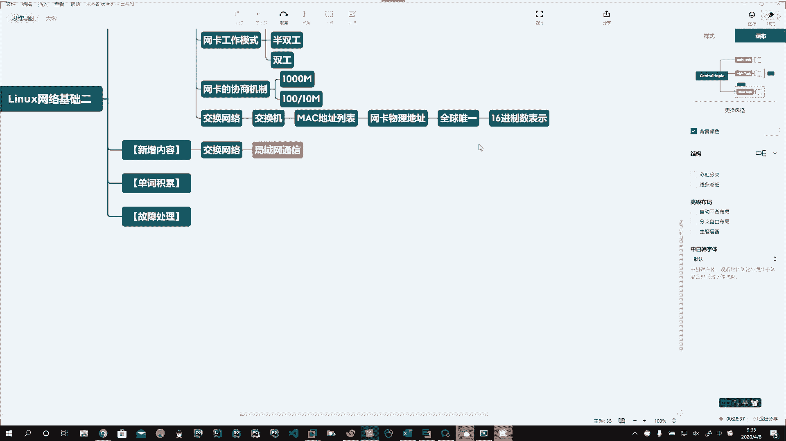

小型的局域网络。

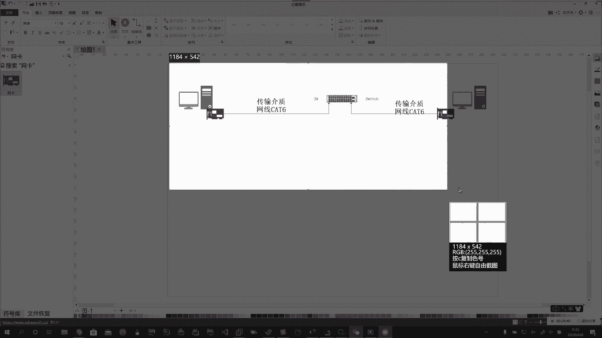

啊，那如果我有多多台电脑，比如说咱这是一个部门啊，咱们是研发部了。哎，你这有多台设备。啊，一样的，只是把他们插在不同的端口上就可以了。好，我们简单画几台啊，是那意思就得。いか。Oh。Oh。好。

他插在这个口上。啊，他插在这个口上。好，那这些所有的啊，咱们刚才在画这里头的。内容。都通过我们的传输介指啊，通过网线六类线。啊。构成了这样的一个小型的局域网。Oh。啊，小型的局域吧。Okay。好。

那么在这个网络中啊，那么如果我PC1。PCE要想发一个哈喽啊，这个信息。好，说他给谁呢？啊，我们找一个。PC2吧。啊。他把这信息发给他啊，那么这个交换机插电以后，那么他在。啊。

他的工作原理就是他每一个端口上啊要记录。啊，你这麦克地址列表，还有个麦克地址列表啊，获得到计算机一的麦克地址。然后呢，你一要给二发，那么你在传输的时候，他就会要找一个R的。

麦克地址说存不存在我这个列表中，如果存在这第二个麦克地址记录在。啊，哪个端口上，那么就通过哪个端口把数据给他转发过去啊，这个他们之间。就实现了数据通信。🤧嗯嗯。好，这样的数据过来了啊。那么在这里头呢。

大家要。需要注意的就是啊通过交换机。哎，通过交换机进行局域网内。的PC。和。PC的控隙。也不一定是PC。主机。主机。这里头的主机的概念你怎么理解啊？这里的主机可以是PC。可以是你的笔记本。啊。

可以是你的服务器。啊。对吧还可以是具备有网络功能的打印机等等等等，只要能上网就行啊。🤧。好，然后在这里头我们昨天说了麦克地址啊，这个东西需要你。掌握的。哎，需要你掌握的。那么我们说的交换机。

通常情况下啊。通常情况下，咱们这个交换机，我们说是二层设备。它对应的是OSI7层网络模型。啊，七层网络模型来的。好，那么有没有人能给我说两句，这个OSI7层网络模型呢？给我发群里头，我看看。

看看你们忘没忘。🤧。Oh。Oh。

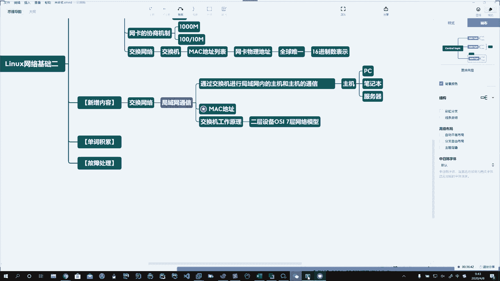

发这儿了哈。

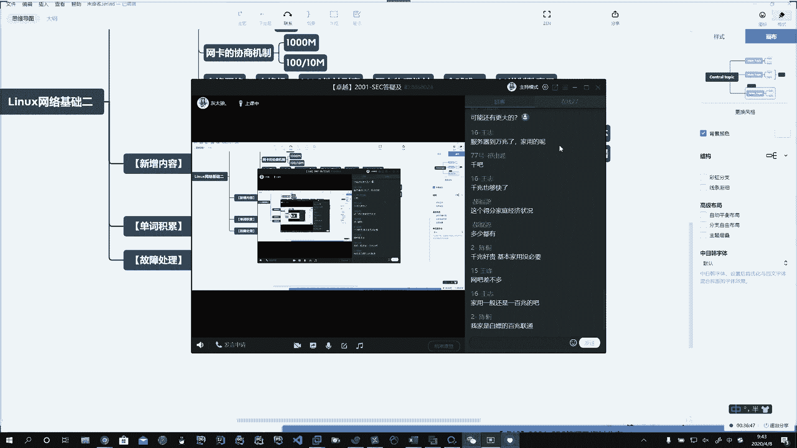

🤧うう。Go。好，哎，这是谁呀？我勇哥给我发了一个啊。啊，勇哥给我发了一个啊，好了，七层网络模型我们会讲啊。那么第一层。那么是什么呢？就是物理层。所谓物理层用的就是我们的物理设备。啊。

物理设备就是咱的网卡就工作在这一层。然后在它之上呢，有什么呢？哎，就是数据链路层。啊。啊，数据链路层，咱们的交换机就是在这层玩耍的。啊。那么数据电路层主要就是什么呢？哎，主要在这里头就是通过m克地址。

啊，卖的地址。也是基于它这个特点啊，所以我们说它一般情况下啊交换机是二层设备。啊，那么我们也通知为二层交换机。还有带管理功能的啊这种交换机。我们有时候啊还会见到一些三层的交换机。啊。

所以这儿呢我们简单的提一嘴，就是根据这个来的。好，然后呢他的工作原理呢，它有一个麦克地址列表。啊，那个地址列表。在麦克地址列表中，他记载了。啊，记录了。你这个端口。啊。和。😮，卖个壁纸。对应关系。Oh。

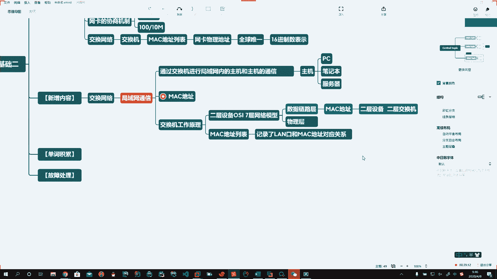

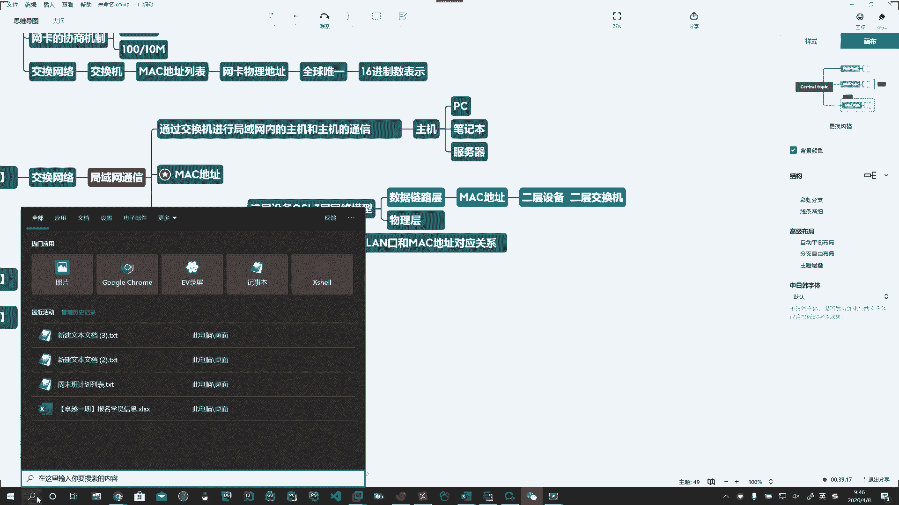

。

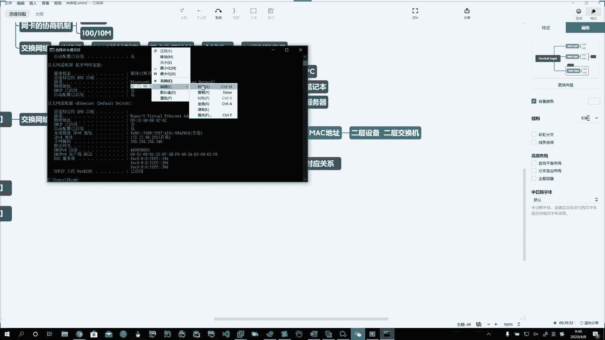

Oh。啊，比如是这样。然后呢，在你发送数据的时候啊，我们今天呢在这稍微啊说一说。交换数据格式。应该写在这里啊。交换数据格式。好。这个是重要的啊，交换数据格式也是重要的。那么交换数据格式。

当我一台啊计算机和另外一台计算机通讯的时候，说你一找二给他发一个hello。啊，到PC2能收到这条信息。实际上啊他在发送这个数据的时候是这样做的。目标。啊，目标地址。目标地址。加上。原地址。啊。

然后再加上。数据信息。那这样他就构成了。第一个。基本的。处理结构。好。Yeah。Yeah。啊，基本的数据结构。🤧。目标地址。啥意思？哎，我要找的啊。这个计算机。目标的麦克地址。啊。加上原信息。

圆就是从哪儿发来的？啊。原信息的那个地址。再加上数据信息，我发送了一个哈喽。啊，这个哈喽就会通过二进制，然后再通过OSI7层网络模型，每一层数据进行封包封包封包啊，到最底下物理层啊，实现了这个以太网啊。

以太的时候，到时候它是以真的形式存在。啊，然后我们在这里你就可以认为是咱们hello那条信息叫数据信息。Yeah。啊，这种形式。那么当这样的一个信息。啊，就是我们在发送一个哈喽的时候。

实际上是这么复杂的一个过程过来的。好，那这条哈lo这个信息。经过交换机时啊，从这儿过来，用这小信封，我们表示数据偷偷偷通过网线过来这条数据走走走走走走走走走到交换机。啊，交换机的话呢，它就会把。啊。

你这个数据拆开来看。到这儿，他要拆开来看，就跟我们写信要有邮编子似的，从哪收寄到哪儿。对吧哎，从哪儿记得啊，谁收。所以呢他就把这个信息啊拆开了一看啊，说你要记在那个麦克地址上，然后呢。

通过它比对里边的麦克地址列表，看看有没有啊，在哪个端口上。如果找到了他有这个记载，那么就通过这个端口把这个数据刷刷刷刷刷啊，通过这儿找到了传传传传传传传传传哎。그도 한 거야。啊，然后传给他的网卡。

网卡通过。对吧。我们说了。网卡的工作原理对不对？调制和解调对吧？哎，收到一个信号，然后开始把这个信号。拆包转化成数据，然后到内存中啊，根据OSI7层网络模型再拆逐层拆拆出来，把数据放到内存中二进制。

然后最终通过你的社交软件啊，把二进制这些数据再呈现给你的用户显示好了，这样的一个过程。啊，那如果他过来啊找不到啊，他去找找找找找。如果你的麦克地址列表存在。啊。如果。目标的麦克地址啊，在你交换机。对。

麦克地址列表中。那么。交换机就会。通过。列表啊。转发。给。该地址。对应的。端口。啊。Yeah。哎，存在就给你转发过来了。哈。那么如果。目标地。不在交换机。啊，没在。没在呢，咱们交换机。

就有一个叫广播域的。啊，广播域的存在，那么它就会通过广播的形式。什么叫广播？啊，就是对交换机上。所有的。烂口儿。啊，所有的烂口。进行转发。啊。进行转发。Okay。好，那这样呢就带来了一个问题啊。

这样就带来了一个问题。所以呢交换机啊这里头也会有一个弊端。就是广播风暴的问题。好。啊，那可能在我这个局域网里头，我不光就是PC1跟PC2聊是吧？哎，不光是你跟这小姐姐聊骚2啊。哎。

那突然间这哥们儿一看哎呀。小姐姐长得挺带劲，是不是哎她也想跟她聊。啊，这儿也聊着呢。Yeah。好，那哎这一看你们都跟他聊，他也不知道这小姐姐哪好啊，她也聊啊，这一看你们都聊他也聊。哎。那你们都聊的时候。

就有可能说你们都找他。啊，你们都发哈lo了。啊，所有人同时在工作传输信息的时候，这就有可能说你也没有他的这这个他也。找不着他他也找不着他他也找不着他。那么交换机就开始封了，他就开始全网的广播。

说你来一个啊，就相当于去村长家拿大喇叭广播。啊。是不是哎。谁谁谁又给谁挑水了啊，这又广播一遍，谁谁谁又给谁挑水了，挑水了，挑水了，挑水了是吧？哎，还带回音的这种啊。

那么大家都去用这种方式都去广播的时候呢，就造成了一个广播风暴的问题。所以呢我们就要想办法呢去抑制这个广播风暴的问题。😊，啊。好，那这个东西呢经常会有时候呢会给你问到说哎呀。

就你这个交换机交换网络里头你了不了解啊，哎，了解了解它都有哪些特点呢，是吧哎？会遇到广州风暴的问题啊。遇到广播风暴的问题呢，那咱就来说一说啊，说这广播风暴它会给咱造成啥影响？

首先第一个啊它会消耗我们大量的系统资源。啊，那么这个也可以说是它的危害。啊。那么这句话此话怎讲呢？有同人说那此话怎讲啊，啥意思呀啊。河。那么所谓消耗大量的系统资源，那你在这儿找他的时候。

是不是你你的网卡工作，他的网卡也工作呀？你们所有人在这乱发广播，我这里头比如说我这是48口的交换机，那我这48台电脑如果都开着，是不是我48台电脑都要接收到你的广播呀？😡。

那么这48台主机的网卡是不是都要？接收信息。对吧好，这样的话呢，第一个你就消耗了大量的系统资源啊。首先第一个就是你的网卡要不断的工作，网卡工作它就得耗电呀。啊。那他是咋工作呀？他接收一条信息。

不能就扔了呀。😡，是不是啊他收到这条信息，我们说了，收到这条信息，他就得把这个光信号转化成电信号，然后去处理这个事儿，对吧？一层一层的拆包去处理这件事儿。啊，他就得解条。对吧然后谁你网卡干活了。

那就是那光他干活也不行啊，你的操作系统。😡，系统也没闲着，系统是怎么跟网卡进行通信的呢？它通过驱动程序啊。啊，那你网卡接到这信息，网卡说，那你系统该干活了。是吧这收到信息了啊，有数据包了。😊，啊。

那最终系统是不是得干这件事儿啊？他把你这数据包就解包嘛。啊，解包的一个过程。解完了以后，把这数据信封拆开，看看里头有啥信息。啊，01010101对吧？哎，类似于这样的数据，二进制的数据啊。

那你这数据你得存着吧，我暂时不放硬盘上，那你是不是得。存在你的内存中啊。Oh。对吧然后你系统再调度，再调谁呀，说这个程序该谁去接收啊？对吧比如说微信。Oh。ま？啊。这玩意儿存内存里头的。Yes。嗯。

在这里头存的呢。啊，那操作系统呢又干了一件事儿，他又调度。啊，微信。告诉微信说信息来啦，姐姐微信来了啊。嗯。H。H。Yeah。好。这边就等噔。哈。提示。用户。打开。看到hello。啊。Oh。🤧嗯嗯。

这样的一个过程啊，它会消耗我们的系统资源。啊，让整个的网络变慢。啊，整个网络变论。好。可以啊。根据我们刚才说的这个哎，自己呢。去看一看啊。Oh。给2分钟，简单的呢。🤧。去记一下。嗯。呃。好。接着说啊。

说网络咋变慢的啊。那这有可能说一个网卡坏了。啊，有可能是网卡坏了。啊。说比如说一网卡烧了。对吧故障了啊，他就会一直给你交换机发送这些数据啊。好，还有哪些情况呢？啊，还有哪些情况呢？

就是大家使用的时候一定要注意啊，使用的时候注意。比如说有时候会造成你上不了网。🤧就是你网线接错了。啊，比如说你网线的两头。都接在。一台搅换机。Okay。🤧。有这种情况啊。有这种情况。

你这两头都插一台机器上了。啊，就可能造成整体没有外网。那这个其实呢就构成了一个网络的环路。啊，有这么干的。去年吧啊我就看有一个同学就这么干的。完了跟我说，老师，我不能上网啊，我说那。怎怎么弄的呀。

不知道啊，过去一看好家伙，我说你们是上不了啊，你这头插这头都在一个交换机上。所以造成网络慢或不能上网，就是因为广播风暴或者里头有环环路啊，那么这个东西呢，或者有时候中病毒了。啊，还有可能中毒。啊。

中毒造成的大量的发包。啊，造成网络风暴。🤧嗯嗯。Oh。Yeah。🤧啊，那么就整体就变慢了，网络特别卡顿。啊。好，这样的话那那你就觉得哎呀我网慢了啊。有时候啊有时候会造成你的一些业务就停了。那我们的。

这些服务器离不开网络啊离不开网络。嗯，导致。大量的带宽。啊，被占用。或者耗尽了。啊，那么如果当你的带宽耗尽的时候啊，就可能导致。你的业务不能正常运行。对吧网络瘫痪了，经常会出现这种情况啊。好。

这个是我们给大家啊说的一个广播风暴的问题啊，那么广播风暴呢出现这种情况呢，那就是很严重的啊一个网络故障。啊，严重的网络故障。Okay。所以呢我们要杜绝啊广播通暴。在这里头去大范围的产生啊。🤧嗯嗯嗯。好。

那么我们怎么去杜绝说这个广播风暴的产生呢？啊。好，第一个。啊，就是我们在接线的时候要特别的注意啊，说避免出现我们这种环路。啊。第二个呢，我们这个交换机啊啊你如果把它拆开了看，交换机里头也会有啊。芯片。

他也会有CPU，也会有我们的这个这个操作系统啊，那么所以呢我们来了以后呢哎。你大量的数据都广播，造成了就是你这个交换机。死机了。啊，就是他他的芯片比如说超过了它能承载的这个能力啊，就跟洪水一样。

瞬间的把它淹没了，它处理不过来了。🤧他可能就无响应了啊，所以我们家用的这个。家用的路由器也经常出现这种路由器的假死的情况啊，就是什么呢？啊，你买了1个100来块钱的，但是你家里头人用的比较多。

大家都下载啊，时间长了呢，就超过了他的这种负荷了。然后呢他就。司机了啊，所以呢哎我们企业级的一般会买企业级的交换机啊，企业级的交换机。嗯。🤧比如说。比如说我们企业啊，所以。可以采购。企业级的。交换机。

那么企业级的交换机有哪些呢啊？那么有国际品牌的。国内品牌的。早年间呢都用思科。啊，不管是路由器还是交换机，早年间都有4客。Okay。啊。网件。这是美国的品牌啊，但是呢你用它呢风险很大。他是美国军方的。

电信承包商啊，思科路由器有大量的后门。对吧这个东西都已经被爆出来了。所以说呢现在呢。Yeah。咱们中国大部分企业啊都已经下架思科的设备了，包括它的路由器，它的交换机啊。呃，这个通过斯诺登事件以后。

在中国的骨干网络全部剔除啊美国的这些个硬件设备。第二个呢，国内的品牌啊就是屌丝的最爱华为。啊，华为。哦。当然了，还有其他的啊，比如说。TP link。啊，我们叫普联的。啊，比如说华三的。HBC。

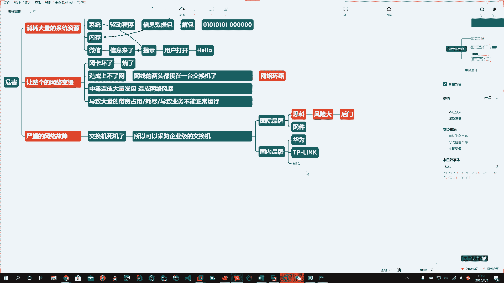

Book。🤧好，简单的给你们搜几个啊，咱们看一下。

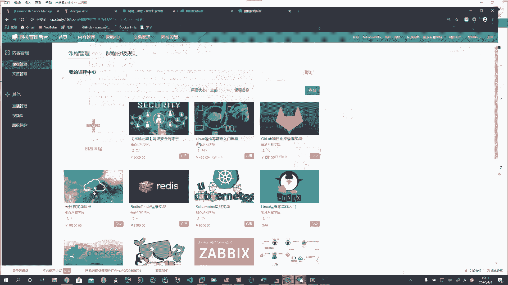

🤧嗯。好。Okay。那么你上来以后呢，我们通常啊啊找一些比较大的，你看对吧？这就是千兆2十4口的，当然了啊，你像这些小玩意儿，这都是家用的啊，这都是家用的，找那大个的，看着能当板砖似的那个啊，就可以了。

那么你像这个。啊，S185028P啊，24口的交换机对吧？但是企业中呢一般不用这么便宜的啊，会用更贵的。比如说48口这样。

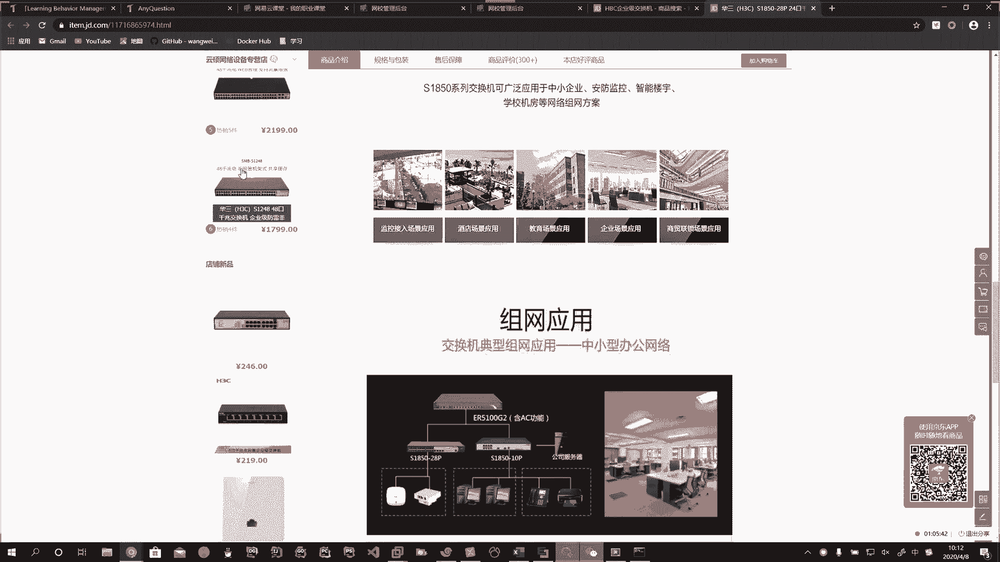

这个公司里头有啊公司里头有嗯，等大家来线下呢，到时候可以拿着看一看啊，就这种48口千兆的。

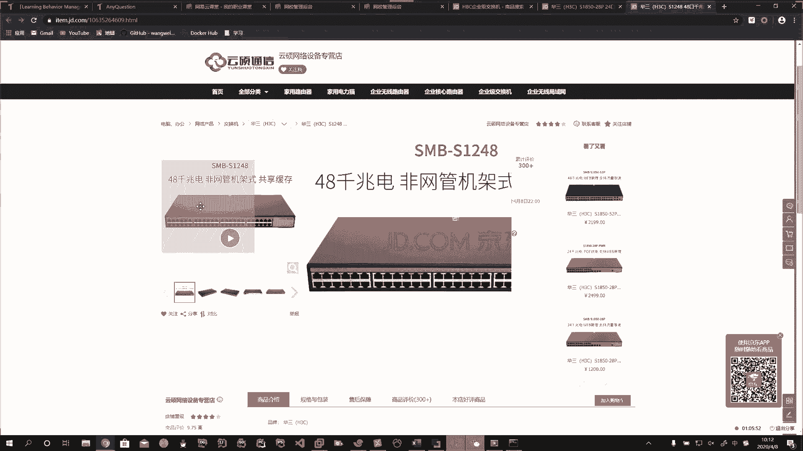

🤧啊，华山。

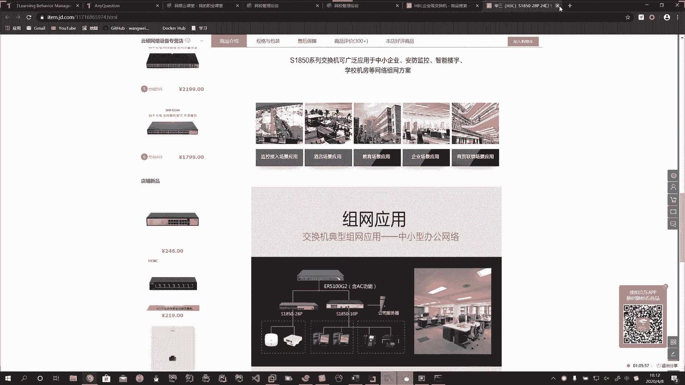

那还有呢，比如说这个TPlink啊。48口千兆式的啊，机架的。这样的啊。好了，简单的说一说啊，简单说一说。

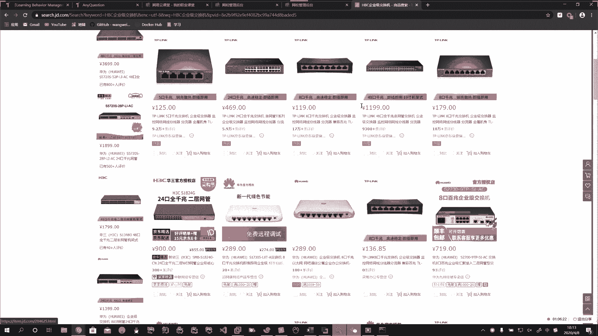

🤧。Yeah。看你公司有没有钱了啊，有钱呢你就用这个华为的一般稍微贵一点啊，那个没钱的呢，用华三的也可以。啊，TPlink个的也可以，这都能用。🤧好了啊，这个是交换网络啊，就是采用更强的设备。

第二个呢就要引入到什么呢？哎，我们要隔离。啊，隔离。网络风暴。也就是抑制他啊。好。那么我们在抑制它的话呢，那我们在一个局域网内。进行划分。进行隔离。Oh。啊。那么尽量去规避这件事儿。

说比如说我一个部门七八个人，哎，我就在这一个上面去做。然后呢，我通过一个什么东西呢？我通过一个叫路由器的。啊，我通过一个叫路由器的。あ。好。啊。那么我加了一个路由器以后，比如说我这是一个部门。啊。

我通过一个路由器以后，我就能够把。啊，我就能够把这里头的广播风暴一直在这个路由中。Okay。好，我们先说这么多啊，下课休息会儿。

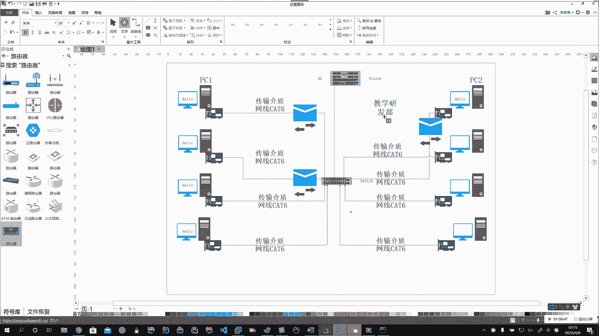