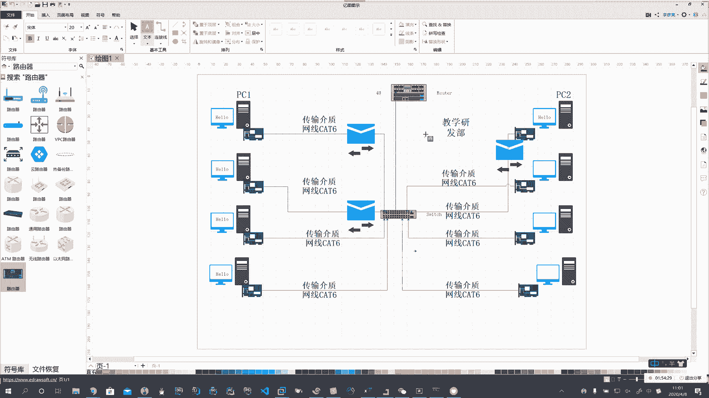
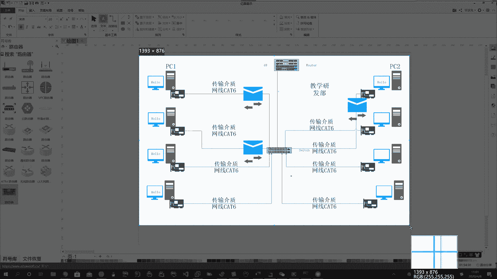
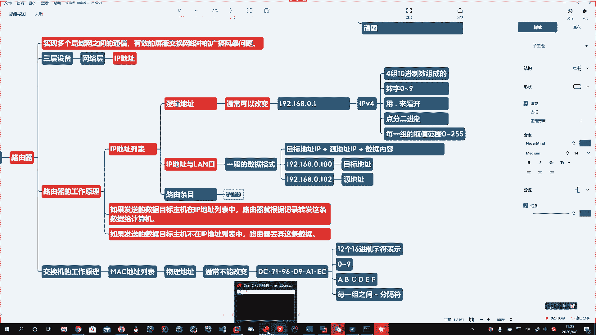
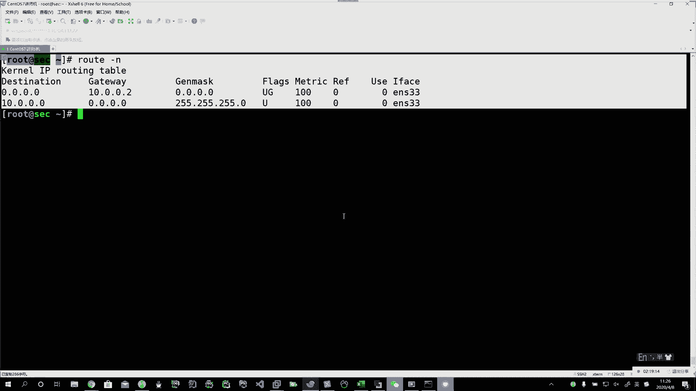
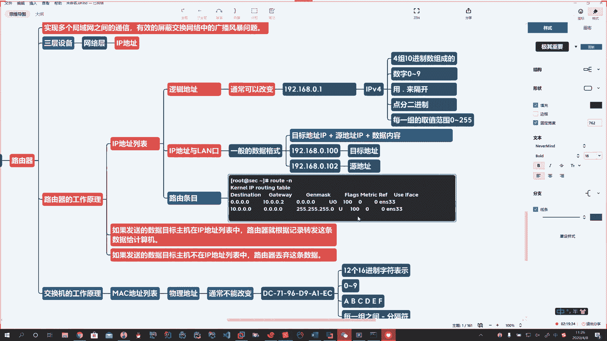
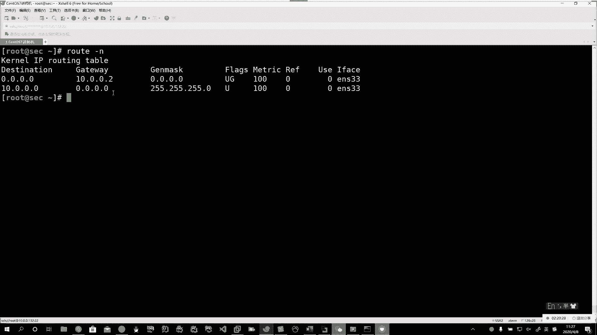
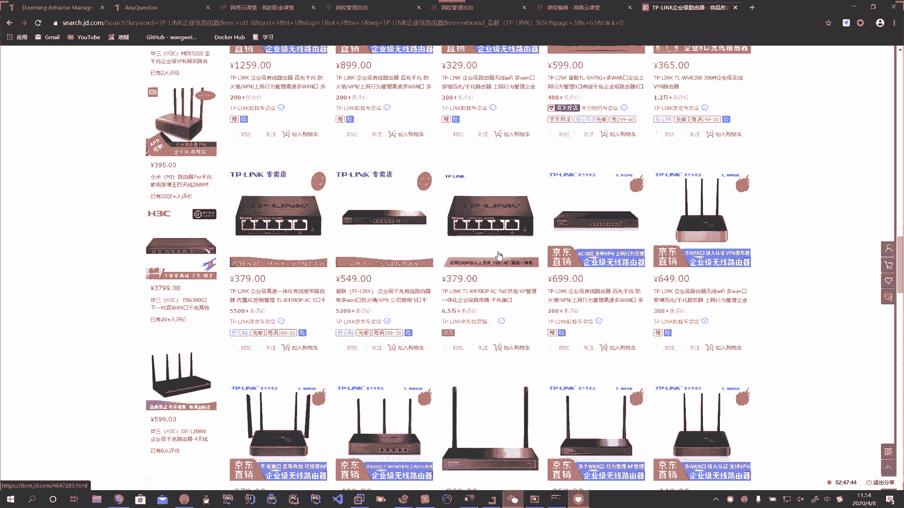
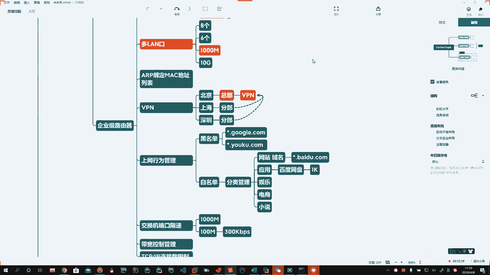

# 花了2万多买的Java架构师课程全套，现在分享给大家，从软件安装到底层源码（马士兵教育MCA架构师VIP教程） - P136：【Linux】局域网和局域网之间通信 - 马士兵_马小雨 - BV1zh411H79h

啊啊，广播风暴这个事儿呢，我们要想抑制啊，在这儿你就得买企业级的路由啊，企业级的交换机。交换机。那么企业级的交换机里头它提供一个什么好处呢？就是我们可以划分微烂。哦，可以啦。哎，化分为乱。

划分微烂以后啊，它就能够把我们个个的啊，比如说。172点16。0点。1到172点16。0。254啊，这个我画一段。比如说这个是教学的。啊，这儿我画了一个微烂。然后呢，我又画了一个172点17。0。

1到172点17。0。254。市场部的。围栏一。啊，比如说我又来1个172。18。0。1到172点18。0。254。Okay。172。19。0。1到172。19。0。254。172。20。0。

1到172。20。0。254。Okay。那么我可以认为我都是172开头的啊，我从1617181920啊，代表不同的段。比如说16给教学，17给了市场部，对吧？哎，18，我给了，我可以给什么呀？学生。啊。

给财务吧，对吧？这个19我们给什么呢？给教务啊，给教务老师20段给服务器。Okay。好，通过微烂的技术，我们也可以有效的啊来抑制这个广播风暴的问题。啊，所以呢这个东西在高级的设备里头啊，越高级。

我告诉你，没有花钱的不是。啊，没有花钱的不是你那设备越高级。它的功能就越多啊，贵有贵的道理，一分钱一分货。啊，贵有贵的道理。对吧。贵给你带来的就是用户体验相对较好。为什么我们去银行要弄VIP呀，对不对？

你不用排队啊，用户体验要好一些啊。所以通过这里头我们进行微烂划分以后。让他各个段啊各个段在不同的围栏里。啊，这样的话呢，比如说教学这个段里头你有8台电脑。🤧。我不一个个画了啊。啊。

PC1号到8号是不是有8台okK那你就在这个段里头玩，你们之间如果有啊广播风暴的话，也就是这吧台。所以我们有效的降低了每一个网段里头的PC的数量或你主机的数量。这时候就能有效的去抑制或减少广播风暴。

你要从根上解决，那它原理就是这样的，你不可能完全杜绝它。所以我们就划分网段以后，我让他尽可能的少放一些设备。啊，少放一些水。这样呢我们尽量的就能避免啊，还有就是呢如何去避免它。就是咱们这些高级的啊。

我说了企业级的，但是家用级的咱就别扯了啊，这个企业级的呢，它里头呢还会有一些啊关于拓普的一些内容。刚才我们说了一些环形网络啊，环形网络。那么环形网络呢，我在这儿呢，我给你说两句啊。环形网络。Okay。

环境网络的问题呢也得需要去解决啊，它也会造成这个广播风暴的问题啊，挺讨厌的。🤧嗯。环形网络出现两种情况。第一种呢就是刚才说了交换机接线的问题。啊，那如果一根线两头都接在一个交换机上。啊。

这个一般不会有傻逼这么操作啊，但是万一哪个傻逼晚上多喝二两啊，有可能。对吧插错线了。啊，咱们都觉得自己不会犯这个错，有时候越是你觉得你不会犯，最终你犯的越是这种低级的错误，真有这样的人啊。

满大街都是你到时候那些线头子特别乱的时候啊，你如果在布线的时候就没有一个好的习惯啊，你这线就满地汤，结果你有可能你就把这插错了，咔叽一下，大家都没网，真的就是这样的。

这就是典型的环形网络是交换机接线的问题啊。喝多的都说自己没醉，真是这样的啊，淹死的都是会水的啊，所以这些东西呢要是从习惯做起，线就要捋明白。第二个是什么呢？第二个就是在你的这个拓普啊，拓普图。啊。

你网络拓扑中。存在这种环形。就问题。这啥意思呀？说在做这个网的时候就没有规划。😡，啊，今天飞一条线，明天飞一条线，满脑袋上都是线了。어。对吧再加上你就是规划了以后，你也没有落出。

比如说这个网络拓扑图也没有人画啊，这里头主机也没有人规划IP地址，也没有人规划，所有东西乱糟都要往这一扔，那结果就出现问题了。好，再加上这哥们儿可能跟女朋友闹别扭离职了，分手了，不在这儿干了啊，走了。

交接上没有一个好的流程。所以后来人一看完全就蒙圈，所以这网络就是能将就就将就。所以一般你去这小公司基本上都是这种情况。你一看我就靠是吧？那玩意儿你就。哎，够你喝一壶的啊，所以运维人员。

你去到一个公司以后，你都先给前边这些人去填坑的啊，坑填满了你才能做自己的事儿。所以网络拓扑中存在环境问题呢，这个我们也要借助高级路由器啊，为什么叫高级呀？它里头有一个叫生成数协议的，可以做好网络拓扑的。

啊。可以有效的。有效的管理。网络。拓骨。中。存在的环形问题。Okay。Oh。那么在这种高级的设备上啊，它为啥高级啊啊，它里头有STP。STP呢是个算法。啊，通过STP算法。对交换机进行配置。哦。然后呢。

这个交换机啊，它就能够。能够给你生成。啊，生成一个你这个网络拓扑图。当里头出现环形结构的时候啊。出现这样的问题了啊。人家就可以提示你。啊，告诉你这么查不对。对吧所以从根本上消除这种环形问题的存在。啊。

这个就有效的杜绝了咱们广播风暴的问题。好，那这个真是有危害的啊，说你交换机死机也就得了啊，有时候最最最狠的是什么呢？就是它广播风暴特别多，你的网卡配置如果不够高，数据吞吐量不够的话。

那有可能造成你网卡故障。网卡就坏了。死交换机死机那都是小事啊，网卡就坏了，时间长了，交换机也有可能坏，就是这些硬件设备就坏了，然后呢造成你。整个的网络就拥堵了啊，所以这就增加了你的成本。你要买新网卡呀。

是不是啊，这都是维护成本啊，所以在交换网络中一定要认识到广播风暴的问题。好，第二个，那在这儿呢，我们就要引入到一个新的内容了。那么我就要对网络进行有效隔离。那这个就是也是交换网络中的。哦。写在这儿吧。

啊，那么刚才咱们说的是一个局域网内的啊，那么局域网。和。局域网之间。啊，他们怎么通信？哎，通过路由器。🤧。通过路由器。啊。

好，我这图我挺舍不得删了啊。

先发给你们。好，然后呢这个图我要破坏一下啊。啊。好，我们现在呢比如说我左边是一个小型的局域网络，右边是一个局域网络。啊。那么这个我们先呢画一个图啊，我给你画一个。所以在网络这块呢。

要耐心细致的去给他做规划。Oh。比如说我这坨有一个交换机。这坨我也有一个交换机。我如果不讲究说我随便我就随便一弄就就完事儿了啊，我管他那个你爱怎么着怎么着是吧？

那么这个问题啊真的有可能造成你几百台几千台服务器不能上网，都是有可能的。啊，所以左边我们是一个小型网络，右边又是一个小型的局域网络。啊。那如果我玩混的说我这儿我又拿一网线把这俩交换机连上了。啊。

当你这边发生广播风暴的问题啊，说你在这全网广播呢，这哇哇哇哇的是吧？他就会通过这一边把这边的广播风暴通过交换机，那全网广播，它又到这儿。啊，这儿又向这边去广播。所以比如说你这个是个什么呢？

你这是个教学部。对吧你这边是个销售部。那你这样一广播，哎呀，不但你这边可能上不了网，你还影响了这边也上不了网。啊。那如果说我这儿再接了一个交换机，这边又一个网络好，人家那边可能也上不了网啊。

所以这个时候我们就要有一个设备去出现了啊，我如何来隔隔离两边的网络呢？这时候我们通过一个叫路由器的东西。Okay。🤧呃。哎，我通过一个路由器的东西啊。这边接在这路由器上。这边也接在这路由器上。好吧。

咱就找个图吧啊。Oh。那路由器呢它就起到了一个作用啊，就是有效的隔离了网络。说左边教学是教学，销售是销售。啊，你这广播风暴。你这广播风暴发生时，比如说你这咔咔的这正广播呢啊这找呢。好，到这儿。Oh。

到路由器这儿啊，路由器就给你隔离了。不会把这个风暴再传递给右边的这个网络。啊。Oh。好，那这样的话呢，我们就。把路由器啊这个呢给大家简单的说一说啊。那么路由器呢，它这里头啊它的作用是什么呢？就是实现。

啊，多个。局域网。多个局域网之间。啊，之间的通信。它可以有效的。屏蔽。交换网络中。广播风暴问题。Oh。Oh。因为我们好多零基础的同学啊，你说网络吧，我们也不能上来就给大家打蒙圈啊。

所以你看我给你起的标题，我们叫网络基础啊，我们先讲点基础。好，将来有机会我们讲高级。啊。好，干这么一件事儿。啊，那么路由器他咋工作的，他怎么着他就能给他隔离了呢？啊，这咱们就得说说它的工作原理。

うんうん。Oh。路由器这个东西呢，我们也叫它。Okay。啊，我们也叫它三层设备。啊，我们也叫它三等设备。好。那么基于。三层设备我们说一下它的工作原理。啊，那么我们说到交换机，它会有一个麦克地址列表啊。

交换机有一个麦克地址列表。那么路由器有啥呢？路由器在第三层啊，第三层我们刚才给大家去介绍的时候，对吧？这七层模型第三层是属于什么呢？哎，有的同学去看了这个群里头。啊。那么我们在第三层的时候。

它实际上和我们第二层他们二者啊有区别。区别在我。第二层里头用的是麦克地址列表。啊。那么第三层就要到网络层了。啊，网络层了。啊。那么它的工作原理，网络层里头用的都是IP地址。

所以我们讲完路由马上就会讲TCPIP这些协议了啊，IP地址。所以路由器的工作原理啊，它里边有一个叫IP地址列表的。哎，IP地址列表。交换机呢是麦克地址列表。🤧嗯嗯。Oh。Okay。Oh。啊。好。

我给你放在这儿啊，就是方便你对比的去记。Yeah。那么麦克地址列表它叫物理地址。IP地址列表，它IP地址啊叫做逻辑地址。Oh。啊。物理地址不能改变。通常。不能改变。啊。逻辑地址。可以改变。2。Oh。

Okay。Okay。好，这二者对比着来记啊。那么你麦克地址的表示方式。是什么样的呢？Oh。我。好，拿一个过来啊。好，它是有多少位呀？12个。啊，12个。十六进制。字符。表示。Okay。

那么十六进制是什么？那么就是用数字0到9。啊，0到9。0到9表示几个数啊，10个数。啊，10个数。后边再跟啊字符。机。BCD。EF。啊，ABCDEF。啊，来表示到16啊这些个数。逢1榴就进一了。

那么我们IP地址是什么样的呢？IP地址啊，当然了。这个麦克地址啊。每一个每一组。之间。用。横线做分隔符。🤧共6组123456啊IP地址呢，比如说我们见的192点168点0。1。啊。

这样呢就是我们常见的IP地质。那么这叫IPV4的啊。IPV4的IP地址。那么我们还会见到一些呢IPV6的啊IPV6的IPV6的就不是这样的表示了啊。今天呢我们先了解一下IPV4到后边啊，我再会给你说。

V6和V4之间的区别。啊，那么它是由什么呢？它是由十进制数。四组。十进制数组成的。啊。十进制在我们这表示就是数字0到9。啊，数字0到9。好，那么用点儿。Okay。用点儿来隔开。

这种表示方式用点隔开的也叫做点分二进制。Oh。Oh。了解即可。每一组。做最大值啊，每一组的取值范围。0到255。啊，每一组的取值范围0。25。好，这是他们之间的一些区别和一些特点。啊。

那么工作原理它有1个IP地址列表。啊。那么在这个列表中就会记录你每台设备。啊。IP地址。与你在哪个烂口端口号啊相对应。好。好。Oh。Okay。当你这数据过来以后。啊。那么它是什么呢？目标地址。

加上原地址。再加上啊。数据内容。那么目标地址这里头是IP啊，原地址这里头也有IP的信息。啊。Okay。哎，这样的一个格式。那么路由器拿到这个数据的时候，那他把这包拆开了一看啊，路由器里头也有芯片。

有软件，他通过特殊的算法，把你这个包拆开以后，他拿掉了你的目标的IP地址。比如说192点168点0。100。啊，这是我的一个目标地址。🤧嗯嗯嗯。然后呢，我192点168点0点。102。这是我的原地址。

啊，就是我从哪发的，我从102上往100这儿去发。Oh。哦。就是这张图。Oh。比如说这台机器。嗯。192点168点0。100。他发的。啊，他发的，那么这条信息发给谁呢？102。他是102。Yeah。啊。

他是102。他是99。t酒吧。他是97。啊，每个人都有1个IP地址，不重复。啊，这边是102。那如果他发一条信息啊，那这样的网络是怎么着呢？说发一个hello。哦。发一个哈喽过来。

这101走走走走走走走啊，到这个交换机了啊，他要找这台电脑，这儿的原理是什么呀？是不是先找这个里头的麦克地址有没有啊，是不是如果有就通过这交换机，比如说就在这儿呢，那他就发过来了啊？

他到这儿这交换机过交换机。😊，交换机一处理这条信息发现，哎呀，这里头没有，我就不转发了，我就全网转发。对不对？广播了哗哗哗哗哗啊，走到这儿。然后这条信息到路由器了啊，路由器呢就把这包又拆开了啊。

三层是他工作，他就把IP这个包拆开，拆开以后发现啊，原来这条信息是101那小子发过来的。啊，然后呢他就在你这路由器的IP地址列表中找说102在我左边这坨还是在右边这坨啊，他找到了102啊，在右边这一坨。

好，那他就把这数据转发过来。啊。然后通过交换机啊，又到二层，他又解这个包啊，找这个麦克地址，这个麦克地址在他这记录着呢，然后呢他就把它传过来。啊，到这儿显示出来这样的一个过程。🤧啊，好。

这是第一种情况啊，说他知道。那如果他发送的这个IP地址啊不存在。说我来了1个200。啊。这200我也不知道在哪儿，但是我想让他发送一个，我这里头没有就200的这台机器，那怎么办？信息发出来走走走走走。

到这儿，他拆二层的这个包，拆完了以后啊，发现在左边这儿这这儿都不是好广播走走走走走到路由器这儿啊，问路由器，你认不认识这儿啊啊，路由器说我不认识啊，我这里头没有记录的一个是1921681。20这个事。

好，这条消息到路由器这，他就被丢弃了。嗯啊，丢弃了。好，所以啊他的工作原理就是这样了啊说。如果我们发送的数据。啊，我们发送的数据。目标主机在你这个IP地址列表中。那么路由器就会根据记录。转发。该调。

数据给计算机。Oh。哎，就是我第一次给你换那小信封，但是走走走的那个意思啊，如果列表有就给你转过去了。啊。如果咱们给他发的这个不在。あ。那么路由器就直接丢弃了这条数据。啊。那么这里头的一条一条。

刚才我们说了这个IP地址列表。啊。IP地址列表中记录了这个列表信息列表项，我们也称之为路由条目。Oh。Okay。啊。我们就称一条条的路由条目。Yeah。🤧好，我找一个路由条目，你看一看啊。

🤧嗯。呃。Yeah。好。🤧我通过一root杠N这条指令。来查询。啊。我。

这台。电脑上配置的路条条目。Co。Yeah。

我们看到的这一条。这就是一个旅游条目。ThePa。那么这里头啥意思呢？这上边写的叫destination0。0。0，它是表示我们任意的一个网络。说我们这台电脑通过ENS33这个网口网卡啊。

这个口要想访问。外网的地址通过什么？通过10。0。0。2这个get we，这叫网关。啊，这叫网关。好，咱们这里头的一条就叫做路由条目啊路由条目。那么它就会记载着从哪儿到哪儿，经过哪个网关，经过哪个网卡。

啊。那么这个路由条目。路由器啊。添加路由条木。Oh。Okay。啊，添加这个路由条目。有两种方式通过两种方法来实现的啊。写在这底下吧。路由协议。啊，路由协议。Oh。Yeah。Yeah。Okay。嗯嗯。

路由协议呢有两种，第一种呢叫做静态路由协议。Yeah。第二种呢叫动态路由协议啊。静态路由协议动态路由协议。🤧好，那静态路由协议我们先说一下啊。需要手动配置。哦。那么动态路由协议。那就是不需要手动配置。

啊。路由。自动。学习。Okay。Oh。Okay。啊，一个是需要手动配置，一个是可以自动学习，不需要手动配置。那么那定态路由协议呢，它的优点。他的缺点。啊。嗯。动态路由协议的优点和缺点。🤧诶。

我们一块来分析一下。Yeah。好。Yeah。那他的优点就是生效速度快。啊。执行效率高。通讯率高。说你嘎叽敲一条命令，一敲回车，啪叽就通了。如果你敲对了，马上就通。Oh。他的缺点。需要专业人士。董路游。

懂网络。啊。操作复杂。🤧好，举一生活中的例子啊。咱们家用路由。一般都是傻瓜式的。啊。都是动态路由协议。比如说你这听网课呢是吧？你这不能上网了，你离不开，你会喊，你说喊老妈，您过去把那路由器呀。

给我重启一下，把电拔了，重新上一下电。啊，这时候。老妈可以帮你。是吧啊，那你要是再出现不能上网的时候，那我们喊他说您过来给我添加一路由条目，我就能上网了。是不是非得拿着菜刀改变壮胆屋追你，对不对呀？哎。

做不了。啊，所以呢它有优点，也有缺点啊，就必须得是专业人士学这个的，他才能干这个，否则的话弄不了。那么一般在我们大型网络中，就是静态路由协议和动态路由协议，二者都是相结合的。啊。哎。

然后再往下说说正是因为我需要老师配来配去的，所以呢这个呀适用于。啊，适用于小型公司。网络不是特别复杂。啊。或大型公司。与动态路由协议。结合来使用。啊。比较复杂的那工作量太大了。哦。啊，工作量比较大。

工作量大不说，还需要专业人士，对吧？那么动态路由协议是什么呢？啊，它的优点就会自动记录。啊。自动发现。自动学习路由条目。啊。方便。吓。不需要专业人士来。配置。啊。哎，你要是设置成自动学习。

说你们家客厅一个路由器，卧室一个路由器，你要想让客厅和卧室能连上，怎么着，拿那网线口吧唧一怼行了啊，这就能上了。对吧这时候你再跟老妈说，我这头插在这儿了，您把那头随便找一个烂口，蓝色的那口插上就行了。

看见那灯闪就OK了。啊，这时候老太太能帮你，不会拿着擀面杖追着你满屋跑啊，这就叫做不需要专业人士来干。啊。那么当然了，优点就是这样比较省事儿啊，但是它的缺点也带来了啊，那么它就是生效慢。你得自动发现呢。

自动记录，自动学习呀，对不对呀？你得有一个让人学习的过程，所以是有时候效率比较低啊。不像那个静态的一敲回车，啪叽就生效了。这个你得等他，没准三五分钟以后他才学明白呢。🤧啊，生效慢效率比较低。

这是他的缺点。啊。那么。哎，学习路由条目。比较耗时。得等一会儿。啊，那么就造成了。通讯效率。比较低。啊，通电效率比较低。好。啊，所以呢它就适用于什么呢？小型网络。你可别弄那种超大型的啊。

那玩意儿操得学习一会儿呢，是不是啊，那呃怎么回事呢？咱们画一个啊，画一个把这条线去了。这条线也不要了。我这么做啊。哎，公司有钱了啊。咱在这儿呢来个三台。说公司啊有一台主路由。能上外网。啊。然后呢。

我这边这部门哎我这儿跟主路流连着，这边这部门也跟他连着。那么左边啊左边儿。比如说我这些设备啊通过路由器的时候啊，访问网络的时候，这个信息到这儿哎。我就学到了，说我这就有一个路由表。啊，就有路由杆。

对吧从哪到哪儿我就记录的去学啊，比如说我们学一条192。168。1。10是吧？1。0这个网络。啊。好，比如这边呢。啊，这边是多少呢？172。16点0。0。啊。哎，这一条啊叫一个路由条目。然后呢。

你这里头的主路由啊说你这个信息到这儿去了啊，访问网络去了，出去了。诶。😊，那他就会怎么着呢？他就会。把你。这个信息啊学习了。Yeah。好，自动的在这儿哎加一条儿。加一天儿。2。好，这路由器一会自动学。

他也自动学啊。然后呢，他发现了这一和2啊，他把它学习完了啊，他把它学习完了。如果说这里头路由条目有了，他就不再学习了啊他。这里头没有的，他就再补充一下讲啊，所以这样就是我们静态路由和动态路由啊。

两个路由协议。能自动发现，自动去学习啊。🤧嗯嗯。Oh。好啊，那么呢我们今天呀把我们这个啊。两个工作原理给大家呢介绍明白了啊，所以呢像这个静态路由动态路由协议也划重点了，回去呢好好的去看一看啊。

那么这个路由器啊这个路由器。Oh。Oh。那么我们也有有一些分类啊，简单的给大家提一下吧。常见的路由器。种类啊。有什么呢？叫soho级的。别整的这么洋了是吧哎？家用。啊。啊，家用。

还有的呢说这个soho级啊，就是这种小型的啊公司，说总共仨5人啊，董事长对吧？总经理啊，加财务加开发加什么啊，总共就俩人。哎，身兼数职，对吧？还有我们的企业级。Yeah。Good。Yeah。

所以呢一般的话呢你用一个什么呢？哎，你你你用一个家用级的就行了啊，家用级的就行，我写在这儿吧。梭学吓。不写了啊，写了我还得调。好，家用级的那你就随便了是吧？那你买个。哎呀，差不多的就可以了啊。

比如说你用个网件对吧？哎，能带。300人。Oh。啊，当然你对家里要求高一点，网速快的话呢，那你就弄一点好的啊，像网件大概几千块钱一台。那你要用普通的呢，就TPlink。啊，听不进了。

这随随便23百1二百的也能用啊，还带无线是吧？啊。🤧。华为。啊。什么水星。Yeah。啊，还有一个叫dlink的。嗯。Yeah。等啊。那么一般这样的话呢，就要求不高，能上网就行了啊，顶多拿个宽带自动拨号。

现在呢这些高级的猫上呢都直接就带路由功能，还带无线啊，所以呢这个大家呢都可以去看一看啊，我用的呢就是网件啊，我觉得。🤧嗯你如果设备多要求高的话呢，那你就用这个啊。那么现在呢我们可以买一些什么呢？

wifi6。啊，wifi6标准。你现在高级的电脑啊设备。就都支持wifi6，速度比较快。啊，老式的这些路由器呢最高支持到wifi5。那么如果你用iphone叉啊，不是不是这这这这对pro max是吧？

iphone11以上的支持wifi6的啊，那网速更快啊，就体现的快。说你就刷个抖音上个网，那没关系，wifi5也一样能凑合用啊。好，那么企业级路由啊企业级路由，那么这里头呢就带了一些特殊的功能。比如说。

🤧ARP。Oh。比如说带ARP。ARP呢可以绑定。麦克地址列表。好。啊，比如说我们有VPN。啊，比如说我们有上网行为管理。Oh。啊，比如说它内置的交换机。啊，可以对端口进行限速。啊。带宽。啊。

贷宽的控制和管理。儿子。TCP。IP。端口连接数啊。也可以进行限制和管理。啊，黑白名单。我们都放到这个行为管理啊，比如说他有黑名单。有白名单。Oh。啊。白名单里头我们要对上网啊管理的话呢，它可以分类。

分类管理。比如说可以管理你的网站。啊，网站就是通过域名。Okay。比如说星点百度。啊，所有百度的。域名的都能上。黑名单如果是星点儿。🤧谷歌哎，完了，谷歌访问不了了。听点优酷。视频看不了了。2。

所以呢我们到企业里头，你上班的时间，你会发现什么电商啊、购物啊，那些玩意子，什么小说啊、玩游戏啊，那些网站都打不开。啊，他上网行为可以进行管理。Oh。啊，那么然后呢他还可以干嘛呢？🤧可以分类。

比如说你有应用的。啊。比如这里头有百度网盘。啊，它可以通过上网行为管理啊，可以给你限速。Oh。你不下载吗？我给你1KB。对。我让你下啊，我我让你爽到极点，爽到爆就1KB，你自己就不下了。好。对吧有娱乐。

啊，有电商。有小说。嗯。😊，啊，还可以自定义。哎，就对你的上网行为进行管理。啊，包括谁下载，对他进行限速等等等等。VPN啊VPN说你有北京。北京总公司。你还有上海。你还有深圳。Yeah。啊。你这是总部。

你是分部。嗯。好，那么我如果。我这俩分部也想跟总部在一块啊，用一套网络，一套系统，那怎么办？那就得通过VPN技术。做一个虚拟网络。啊。然后你这俩分布。连到总部上。访问总部的网络。

比如说他的邮件呀啊等等等等。Yeah。交换机端口限速啊，比如说我是千兆的网。对吧。好，我保佑我的主要部门签着其他的。我给你限到百兆啊，限速。或者玩最狠的限速300K。所以在企业中这个宽带资源是有限的啊。

我们一般呢会给大家限速。你想快也快不了啊，这个速度让你打开百度听个QQ音乐就了不得的了啊，就不错了，能收个邮件。啊，带宽的管控。比如说你这带宽占用到50%啊，我就采取什么策略。

比如说限制你连接数等等等等啊。那么企业级路由呢，那你怎么办呢？你就是捡好的来。啊，就上来就这个起步就4万，就来这个。好了。明啦。Yeah。对不对啊，上来就来光高端的啊。

高端上的你企业有钱的那你就你你就整呃，企业没钱没钱来来点便宜的啊。这个啊这个哎那咋这么便宜啊，这不行。4000不行。Yeah。这这真的这这国产太不争气了，你这这卖这么便宜，这谁买呀，对吧？找贵的就这个。

啊，这也不贵这。万绕。对吧哎，这才像哪样子嘛？咋的，那你也花个2万块钱嘛，是不是八口万兆的啊，就这样。那么家用的跟民用的跟这个这个企业级还有啥特点呢？啊，家用的一般都是。在万口上。啊。

万口个数上限制了你。😡，家用一般都是一个。到两个。好。通常都是一个。啊，说一家里头装三条宽带的，这样的家庭很少。啊，一般你就装一个就够用的了。那么企业级路由呢，它支持一个什么呢？它多万口。说企业呀。

比如说咱就游戏公司吧。啊。🤧游戏公司你是不是得保证我。中国电信的能访问，中国移动的也能访问。是不是啊中国联通的也能访问。那怎么才能保证他们都访问的快呀？啊，那我就可能企业里头有。中国联通。中国电信。

中国移动。什么这个这个这个这个教育网。啊，你可能就都要考虑到。啊，当然了，IDC机房它就是BGP啊。Okay。好，多个腕口，也就是说我可以拉多个宽带。啊。多个宽带。多万口，这样的话呢。

我可以做一个链路聚合。Yeah。啊，满足我，那你中国联通的来，哎，我也能访问中国电信的用户来了，我也能访问。中国移动来了，我也能访问。教育网的来了，我也能访问啊，就是这么一个意思。😊，多万口啊多万口。

然后的话呢还有一个特点呢，就是什么呢？家用的呀，一般的就是哎百兆。啊，这是万口的区别。烂口呢。烂口呢就是连接在你电脑啊。啊。其他的4个啊，一般在家里头四个烂口。Okay。啊。那企业的多。🤧嗯。8个。啊。

6个。是吧。然后呢，这个速度。啊，家里百兆，他千兆。啊，家里千兆他万兆。好。Okay。Oh。あ。啊。速度快。是吧哎，家里个数少。白照。I。你签着。🤧嗯。好啊，那我们今天的内容呢就给大家说到这儿啊。

。