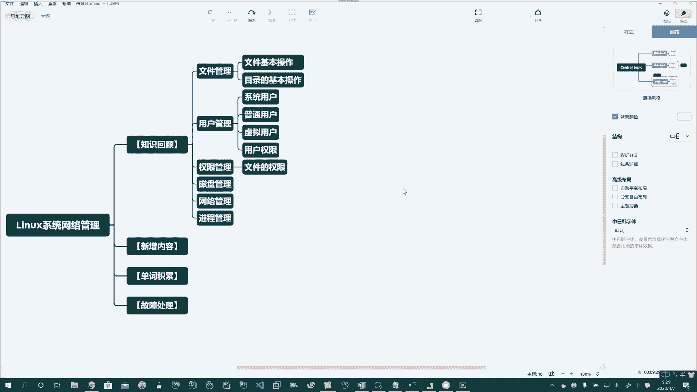

# 花了2万多买的Java架构师课程全套，现在分享给大家，从软件安装到底层源码（马士兵教育MCA架构师VIP教程） - P137：【Linux】知识概要 - 马士兵_马小雨 - BV1zh411H79h

好啦。啊，文件的基本操作。

。

目录的基本操作。Oh。Oh。Oh。咱们就不展开说了，如果展开说这里的东西就太多了。除了基本的命令，文件的权限，文件的属性，文件的压缩，文件的备份，文件的传输等等等等啊。

我们有很大的篇幅都是围绕着文件啊来展开的。

第二个呢啊就是用户的管理。

Oh。好。啊，除了文件以后，哎，系统中我们有很多的用户啊，这里我们掌握了。

管理员用户。啊。比是系统用户，是不是？哎，我们掌握了普通用户。

。Yeah。虚拟用户。Oh。

好。

哎，用户啊以及用户权限。

，啊，你单拿出来讲也没问题啊也没问题。

Okay。好，然后呢我们学习了什么呢？哎，我可以把单拿出来一块啊，我们说一下啊，权限管理是不是？

啊，权限管理。比如说这里头我们介绍了哎文件。啊，文件的权限。

用户的权限啊，然后呢再往后呢，我们介绍了什么呢？哎，我们学到了。磁盘观。

Yeah。

啊。那么再往后呢，我们还可以学习什么呢？我们再往后呢，我们要学。网络管理。Yeah。Yeah。啊。

啊，再往后呢还需要学习。进程管理。啊，所以我们到现在的这个课程都是围绕着linux操作系统啊来展开的。

好，这是我们把我们之前这几周啊之前一直从开学到现在这几周所写的内容简单的做一个概括。

