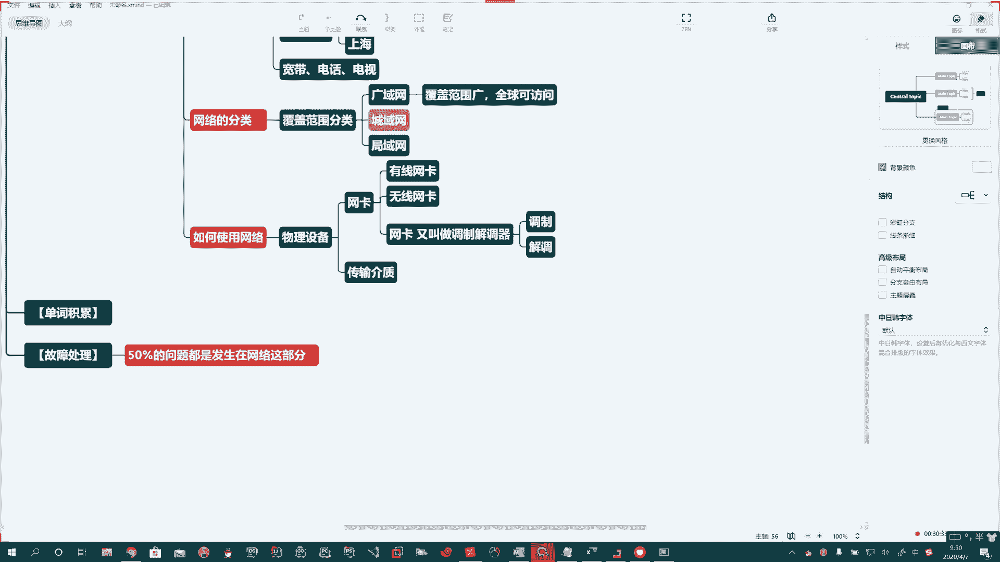
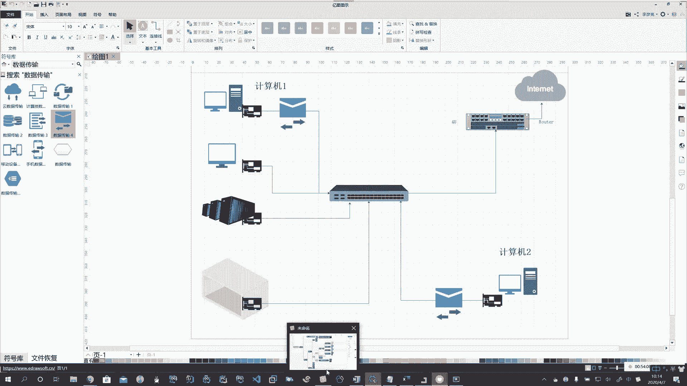

# 花了2万多买的Java架构师课程全套，现在分享给大家，从软件安装到底层源码（马士兵教育MCA架构师VIP教程） - P138：【Linux】网络基础 - 马士兵_马小雨 - BV1zh411H79h

。那么今天我们主要新增的内容呢就是网络部分了。啊。那么网络呢是我们将来在运维阶段啊，将来从事安全行业非常重要的一块内容啊。那么你将来在处理故障的时候啊。50%的问题。都是。发生在。网络这部分。啊。

经常是这又不能上网了吧啊，那个路由又不通了吧，对吧？哎，出现这种情况。那么我们学习网络应该如何去学习啊？你从以下几个内容来学习。首先第一个什么是网络？啥是网络？哦。好。

那么我们一块儿呢跟大家来深入的去学习一下啊。这个网络。网络。最早诞生。最早诞生的这个理念不是为咱们普通老百姓用的。啊，那么他最早诞生。侍卫。美国军方服务的。啊。

所以我们先从宏观上从大面上让大家好接受的方式给你说啊，最早是为了美国军方服务的。所以先讲故事，这是一个故事。那么当初啊。啊。当初这个美苏冷战的时候啊，他们两个国家。都拥有相互摧毁的能力。啊。

就你能干死我，我也能干死你啊，所以美国人就怂了。美国人心想呢说，万一你这个对吧？苏联人一个核弹过来，那老毛子这是敢说敢干的是吧？哎，真要把美国几颗核弹炸没了，那怎么办？所以呢。

美国呢就要求这些科学家说你能不能啊给我创建一个具有如下特点的第一个分布式。啊。说把我这指挥中心呢。我放这一坨放那一坨啊，再放这一坨。啊，咱们老话讲叫鸡蛋不放在一个篮子里头。啊。把。指挥中心。可以放置在。

啊，各个不同的。比方。哎，你干掉我一个，我还有其他的。啊。那然后呢。哎，然后还得实现了一个什么呢啊。数据。这么小。Yeah。Yeah。啊，说你把纽约给我炸了，然后呢，我这个数据马上就能。啊。

马上就能通过网络把这个数据传输到其他的地方，其他的指挥部。啊。诶。😊，最早呢这个网络就是这么来的啊，它和我们尤尼克斯操作系统和我们C语言诞生在一个实验室里头，叫做贝尔实验室。

那么最早的我们的尤尼克斯系统是干啥使的呢？咱们最早的尤尼克斯系统是美国人啊，这这个呃做导弹啊的这个操作系统。哎。要做导弹用的。然后呢，这个导弹我们得计算弹道啊，是吧？他们又发发明了一个编程语言。

叫做C语言。所以我们现在发现这些普及率非常高的东西，最早都是军用的啊，现在才开放到我们民用领域，觉得这东西挺好。Yeah。好，那么我们概括一下啊，说啥是网络。网络就是把。分布在。不同。地理。位置上。啊。

的主机你看咱说了前半句，这句话的意思就是分布式，把分布在不同地理位置上的主机。啊。逗号。通过传输介质。啊，什么叫传输介质？比如说通过网线。啊。还可以通过卫星。啊，通过传输介质，咱们写个等。连接起来。

实现。主机之间。啊，这些主机之间。数据。能够快速啊能够。数据。共享。的目的。数据传输和共享的目的。哎，这就是网络。啊，这就是网络。Oh。好啊，这是最简单的啊，我们给大家介绍了啥是网络，哎，他是咋来的啊？

是吧哎给你介绍了啊，他是最早啊是服务军方的啊。Okay。好，第二个。哦。如何使用网络？啊，如何使用啊？Okay。Okay。网络的特点。啊。我们概括一下特点吧啊。嗯。好，那它有啥特点啊。

或者说他如何去分类，它是干啥的啊，那在咱们现在呢引入到民用的这个级别上来说，那么它就可以啊有各种各样的来使用。啊，各种各样的来使用。首先第一个啊。好，分布式，这是它的特点。第二个可以数据共享。Yeah。

啊。第3个哎，数据交换。Oh。Okay。好，哎，他有如下几个特点。啊。那么能够分布式，也就是说把。分布在不同地域。啊，简单写就是跨地域。北京跟上海两台服务器要通信怎么办？哎，你不能打个车去趟上海。

坐个高铁去上海，那怎么办？通过网络远程进行传输。啊，那么这个是他的一些基本特点。啊，那么网络在我们生活中的应用有哪些？那太多了啊太多了。那么我们一块儿来回忆一下啊。比如说。Yeah。咱们都有啥呀啊。

平时用哪些网络呀，都干啥了呀？啊。比如说我们的。宽带。我们的电话。我们的电视。啊，这是最传统的。过去我们讲哎，三网融合，三网融合干的其实就是这。啊。包括咱们现在同学哎呀，说我不行啊，我得我得上网啊。

上网呢你要干啥呢？比如有同候给我浏览信息是吧？那你浏览信息是有人发布，有人看，那这不就是数据共享吗？对不对？那什么是数据交换呀？有同学说我上个QQ，我登录个微信啊，我要。这个跟人家聊天啊。

所以这个都是社交。是吧哎，社交软件。啊。对吧哎。比如说我从网上下载。아。下载数据。是吧。看电影。听音乐。啊，等等等等。Okay。那么放到我们。运维领域咱还可以干很多事儿。啊，放到运维领域可以干很多事。

那么我们就可以通过网络啊，它的这个特点，它能跨地域啊，然后能够进行数据交换，我们就可以进行数据备份。啊，数据备份。Yeah。把我们的这个数据啊，北京。备一份儿。啊，深圳这一份啊和上海这一份。

这种备份方式啊就叫做异地备份。北京是一个地儿，上海是一个地儿，这就叫两地。啊，两地。那么通常我们讲的两地三中心啥意思呀？哎，就在北京，比如说我这有一个测试中心。啊，测试中心我有个开发中心啊。

上海呢我有一个数据中心。对吧两地三中心。那么这是一些网络的特点啊，能够快速传输。哎。就是数据交换里头啊。那么成本比较低。性价比高。啊。比较便捷，刚才说了，你不至于哈你坐个飞机，坐高铁。

再去上海去一趟去调，是不是哎，远程就处理了啊，这就是我们所说的网络的一些特点。啊，那他能干啥啊？啊，他能干啥？那么这些东西通过它的特点，咱就给大家啊介绍了一下啊，那网络的。分类。Oh。Oh。Oh。

Yeah。Yeah。好，那么网络呢我们一般是怎么去区分的啊？首先我们网络从地域上。啊，不对。系。那么这个也是我们常见的一种分类方式啊，就也就是说。网络的。覆盖范围。啊。经营分类。

那么比如说咱们常见的这个因特网啊，它就属于广域网。哎，广域网啊。全球都可以访问。Yeah。Oh。Oh。Oh。啊，还有什么呢？唉，范围比较小的啊，比如说我们全北京市的网络，哎，这个东西呢就叫做城域网。啊。

成语啊。Oh。比他的范围小一点点。啊，比他的范围小一点点。啊。那么还有什么呢？局域网啊，说我们某一个小区对吧？整个的网络哎。渔欲网。好。这个是我们从范围上啊进行的一个分类。好。如何来使用网络啊？

Yeah。还有其他的分类啊，我们回头遇到了，再给大家去介绍。如何去使用网络？啊。首先我们需要有一些充分必要条件啊。首先第一个你得有。啊，得有，也就是物理层面。啊，我们需要物理设备。

那么这个物理设备我们都需要什么呢？首先你得有一个网卡。Yeah。啊，你得有一个网卡。其次，你需要有传输介质。Oh。Oh。啊，说你这网你要想上网，必须得有网卡。啊，那要么呢你是有有限的网卡。

要么呢你用无线网卡。啊，但是必须得有网卡，没有他。你上不了。啊。那么网卡它起到了一个什么样的作用？啊，网卡起到了一个什么样的作用？网卡其实。又叫做。调制解调器。啊，网卡又叫做调制解调器。

那么他的工作就两件事儿。调制。解条。啊，调制和解调。Yeah。好，那啥是调制，啥是解调啊，它是干啥用的？好，那咱们就一块来分析一下啊，画一图。

咱们在家里头，咱那电脑是啥样的呢？哎，比如说你是个。台式机。你是个一体机。对吧啊，你还可以是笔记本电脑。你还可以是超级计算机。你还可以是个机房。啊，这里头可以放N多个主机，对吧？所以我们都把它称为主机。

A。那么我们不管你是啥样，各式各样的，还有你的笔记本啊，咱们这些个电脑要想上网，就必须得通过一个叫网卡的东西，长这样。啊。那如果是PC机，说你是DIY的这个主机，哎，那你可能把这个机箱拆了啊。

拿出来看一看。那如果是一体机，那它可能是直接在我们主板上集成的。啊，直接在主板上就集成了。所以你能看到的是一个什么？哎，你能看到的就是一个网口。啊，看到的是一个网口。啊。然后我们要想上网，那怎么办呢？

哎，我们需要通过有一个叫交换机的东西。啊啊。通过你的网卡和它进行连接。啊。然后交换机接了谁？啊。Yeah。交换机呀这头接了一个路由器。啊。Okay。Yeah。好，这路由器这头能上网。

所以呢我们家里的网络呢是这样去干。啊，这样去干。那么如果说。我们家里头啊或者咱们两台计算机要进行通讯。啊，说计算机一。嗯。想和计算机2啊，他俩。进行通信啊。一跟二说姐姐小姐姐约吗？啊，小姐姐说不约。

滚犊子。哎，那你这一个他们之间啊。Yeah。需要有网卡。啊，那么这里头传输的这个过程就是什么呢？哎，你在。你在计算机一上啊，比如说你打一一个字儿，是不是哎，哈喽。

然后啊我们的操作系统就会把你输入这个哈lo进行编码，在内存中啊，就会变成二进制数据，然后操作系统驱动网卡啊，然后把你这个二进制的内容啊，转化成电信号或者光信号啊，所以你看我们现在遇到的都是什么呀？光纤。

对不对呀？啊，我们会有一个光纤猫。啊，那么你把这个数据哎就变成了。啊，电信号通过我们的这些个网线呀，对吧？看一条条线连着呢，网线啊，通过我们的网络啊，中国联通、中国移动chander mobile是吧？

哎，把这个数据传输给他。Okay。Oh。Yeah。好，那你这里头写着hello的信息就从这走走走走走走走走走过来了啊，计算机二收到你这样的一个数据。啊，收到了一个信号。

那么呢他就把你发过来信息层层打开啊，把这个0101这个先收到一个电信号和光信号，然后把这个信息转化成二进制，最终再把这二进制信号翻译成我们能认识的hello，啊呈现给你。

那么左边啊你通过操作系统到网卡啊，把这个把这个数据逐渐分包。啊，最终把这个信号进行转变啊，我们的二进制数据变成电信号或变成光信号。这个过程我们就叫调制的过程。

啊，调制的过程。啊。8。二进制。数据。转化成。哦。电信号。或光线哈啊。哎，这个过程。啊。就是调制的过程。那么如果反过来啊。把电信号。或光线哈。啊。转化为。二进制。对吧这个过程就是解调的一个过程。啊。

协调的一个过程。我们简单的这么说，其实他的工作原理很复杂啊，便于我们的理解。好了，这个是我们所说的啊，网络里头我们需要掌握的内容啊，你得有一个网卡啊，且这个网卡得能正常工作，能调制能解调，不是坏的。啊。

第二个就是网络。我们在使用的过程中啊，我们需要有一个传输介质。哎，啥叫传输介质？啊，什么叫传输戒指？咱也得说一说。啊。传输介指就是主机和主机之间构成网络，大家能够相互连接的这个东西就叫传输介指。啊。

传输戒指。可以分类成导向式的。和非导向似的。导向式的呢，你可以理解为我看得见摸得着的。啊。比如说大家知道的这个光纤。啊，比如说大家看到的这个网线。啊，比如大家看到的铜轴电缆。啊，这些都是导向式。Oh。

那么非导向式的呢，比如说大家看到的哎，说我蓝牙。啊，红外。对吧我们看到的Wfi。啊。我们使用的手机啊，微波。啊，比如说现在最先进的啊量子通讯啊，这都是非导向式，看不见摸不着。It。啊。

那么光纤呢它又分为比如说单墨光纤。多么光鲜。啊，单模光纤和多模的光纤。

。Yeah。咱们看看啊。

单模光线。大家看到的这样的啊。大黑区去的这些线子，哎，这就是一个单模的关系啊，一般呢做什么呢？做我们室外啊。

做室外的。李根啊啊。

这单模光纤有啥特点呢？你看这里头就这这蓝色的啊，一根线外头呢这黑线呢是它的这个橡胶的皮。然后呢，他这边有两根钢丝。啊，两根钢丝。来保护这光纤的啊，防止你在拉扯的过程中，穿线的过程中一拉它断了。Yeah。

有粗的啊有细的。一般都是用于外墙布线。好。哎，你要是赶上哪个倒霉孩子，一看墙上有一根线挺好玩的，咔机拿剪子给你绞了，那完了都上不了网了啊，单模的就只了这里头一根心啊一根心。

那么通常由于什么呢？咱们家里宽带。

啊，咱家里宽带，中国联通啊、中国移动啊、中国电信呢到你们家都是啊，然后呢这个是接口。

啊，这是接口。Okay。今天下课啊，或者检验一下你们家光线猫啊。哎，那么有黑的，还有白色的啊，还有白的，像这种。

啊，哎这种。啊，都一样啊都一样，外边颜色不一样。但是里边啊你看都是一根心，有两根铜丝啊。中间这蓝色的是光纤，外边两个是保护它的，是钢丝啊。

あ。

好，这个是我们单模的啊单模的啊。

还有什么呢？还有多模的光纤。

啊，多么光鲜。

Yeah。那这个时候呢这使用起来呢就不一样了啊就不一样。

Oh。对吧那么就会遇到一些高级的地方，数据中心机房啊，比如说那里头要求的网络要求比较高，所以呢这里头啊人家用的设备也更高级啊。

这没有给我们拆开剪开的呀，我搜一张剪开的，看里边的啊。

Yeah。

Oh。没有啊没有得了啊。

好，这块呢我们有所了解啊。🤧那谁是我们的重点呢？啊，网线。这是咱的重点。啊，光纤了解网线，我们需要知道。这网线呢它又叫做双绞线。啊，什么叫双绞线？脚就是脚缠在一起的意思。那么我们拿到的网线里头是8根线。

八根线。啊。分四组。两根缠绕在一起。嗯。哎，每两根绞在一起，所以被称之为双绞线。啊。🤧。那么这个。四组线都是什么？啊。第一个是成白。成白。也就是说，橙色和白色相间的。

。

啊，那这样就是网线啊，那里头八股线啊。

🤧。

好。都是做好的了。

。

啊。这剥开了以后啊，这里头。

澄白和成。你看这个就是啊橙色白色相间的。

这儿呢啊搅在一块儿，里头好一点的有铜心的。啊，次一点的有铁的。啊，所以网线越便宜的。越不行啊，因为经常有时候我上网嘎嘎掉线了，对吧？网速慢啊，跟你的网线有直接关系。

好。

好，第一组我刚才说了啊，成白成。啊。第二组。第三组第四组啊，第二组呢绿白蓝。绿白。绿。Yeah。蓝白。懒。钟柏。中。Okay。Yeah。好啊。四组线是这样的颜色。

那么我们这个双绞线又分为正双角线和反双绞线。Oh。这指的是我们的线啊这指的是线。那么平时呢我们在使用的时候啊，还有一个东西。叫做水晶头。你光有线不行，你还得有水晶头。啊。这个水晶头儿。

在ISO国际质量体系认证里头有一个标准。啊。那么有两种，一个叫RG45。一个叫RG11。Okay。

。

RG45水晶头。

哎，这个是我们和。

啊，网线通过水晶头和我们的网卡进行连接的。啊。那么上边这8根线对应的是8根铜片啊，八根铜片。高级的还有金子座的。啊，还有镀金的，还有镀铜的，越高级的越贵。啊，一个水晶头好的，甚至卖几10块钱一个啊。啊。

也有几块钱买一堆的。啊，所以越贵，这东西就越好。啊，有的人说我这是纯金的那太好了啊，那你这个接触就非常好啊，信号损失就比较少。那么这个头啊也有不同材料的，有塑料的。啊，也有用水晶做的。啊。

所以你看比较便宜的毛毯俩的那个就是塑料做的啊，一点都不透亮。就是说你在看的时候不透明。高级的那些水晶头啊，你看到的是透明的水晶做的，要不叫水晶头，水晶头，晶莹剔透的啊。你将来要有机会去机房啊。

你抓一把水晶头啊，揣兜里都好几百。啊啊，这是水晶头。那么我们看到这样标准的就是RG45的。

啊，8根线，那还有什么呢？类似于电话线的RG11。

哎，比较小的这种。Yeah。哎，里头四根线。啊，这是RG11的。

啊，8根线的RG45的啊。

好。那么有水晶头了，有双绞线了。那么咱们用的正双绞线。

啊，就是画图，你这电脑通过网卡这一根网线连接在交换机上。那这样的水晶头啊壳。网线做成的双绞线，我们就称之为正双绞线啊。我们说一下这个线序，说完了咱再下课休息啊，你不四组线八根吗？它的线序是这样的啊。

成白城。绿白蓝。蓝白绿。棕白棕。Okay。八根线的线序。啊。Yeah。🤧うん。好，反双角线我也给你说一嘴，说完了我们。就下课休息啊。反双角线就是一头是这个。啊，另外一头。Yeah。

另外一头1324对调啊，顺序是1324对调。Okay。线续。1324。啊。注定。

