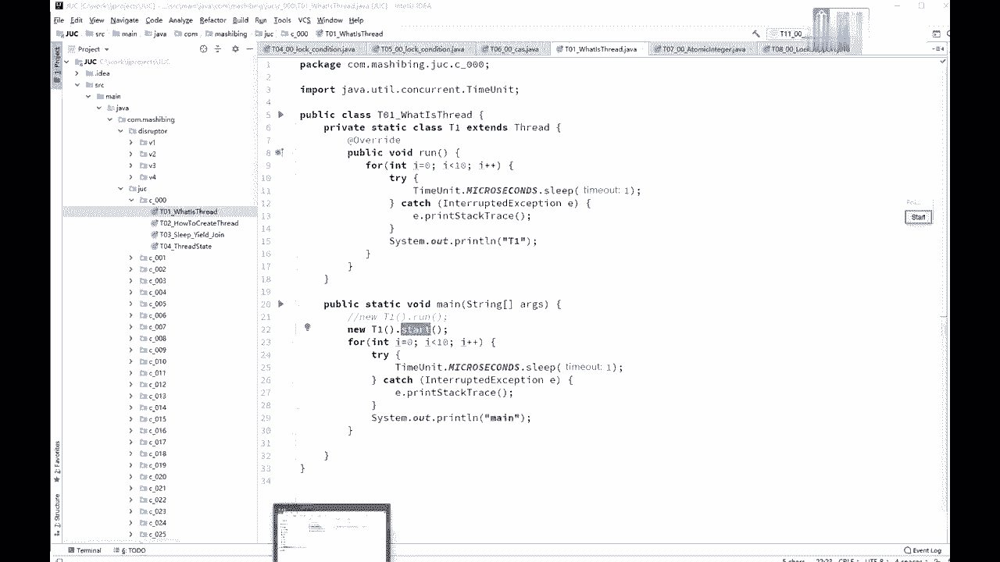
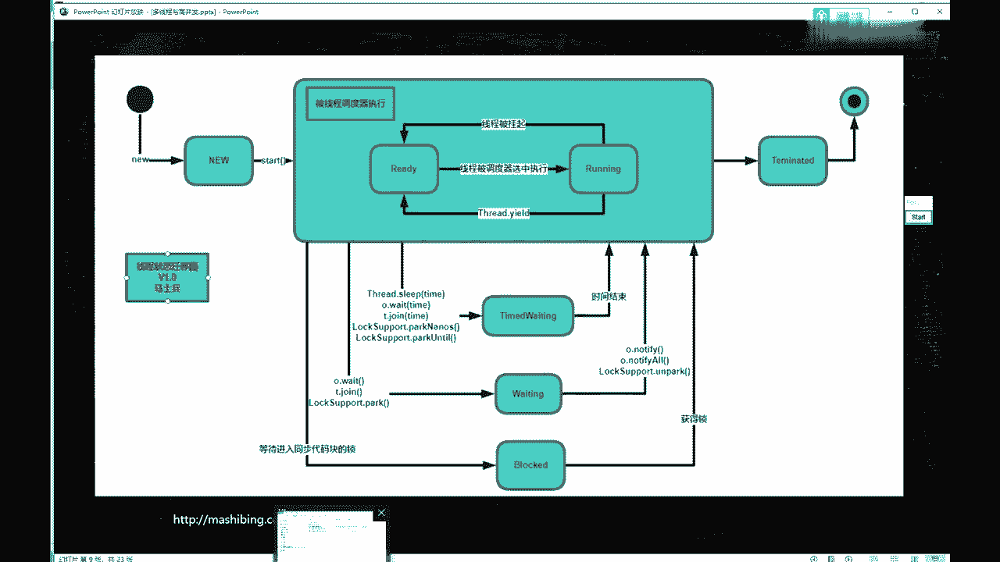
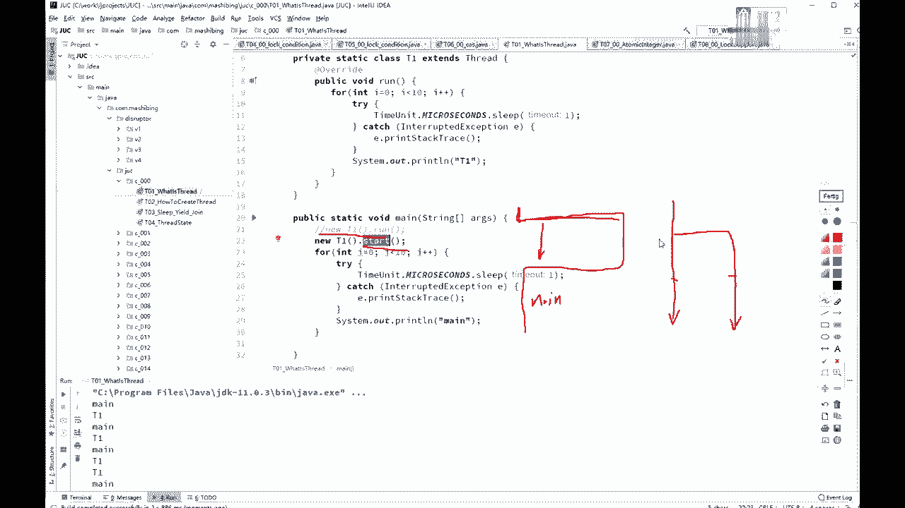

# 花了2万多买的Java架构师课程全套，现在分享给大家，从软件安装到底层源码（马士兵教育MCA架构师VIP教程） - P13：【多线程与高并发】线程的概念 - 马士兵_马小雨 - BV1zh411H79h

多进一些，复习的时候找视频比较难，呃这个嗯不用着急，我讲完之后呢，会把这些个总结为单独的一门小课，到时候你复习起来呢就容易的多了，今天呢我们来讲第一次课，我叫多线程高并发啊，内容上我就唯一重复了。

刚才跟大家说过了，这个xy的关掉机器有点慢，呃我先说一下，为什么要讲这个多线程高并发啊，原因是什么呢，原因是现在啊，嗯如果你想拿到一个比较高的薪水，在面试的时候呈现了两个方向的现象啊，第一个呢叫上天。

第二个呢是入地，那么入地的这部分呢，相当于就是那个很多特别基础的内容，就越问越基础，上天这部分呢高并发缓存，大流量是这部分的内容，今天我要讲的县城呢，实际上是入地这部分内容啊，土行孙这部分的内容。

我们呢先讲第一个，就是我们先从那个什么是线程开始，给大家复习，这个是给大家稍微复习一下啊，不知道有多少同学是基础不太好，说，什么是县城都不知道的，不知道有没有，如果确实有的话。

听我说这部内容我花的时间肯定不会太长，呃，老师的那门基础的课，就是特别特别老的那个视频里头，那个讲的基础的课程，如果你现成的概念不清楚的，先去那个课里头找到县城，那一章是第11章，先把那部分内容看完。

看完你才能听得懂后面的课，早不知道说清楚没有啊，同学们，那个亡命天涯说老师并不是很清晰，这个没办法，他是好多年前录制的嗯，那会儿那个屏幕最大的分辨率，还比不上现在的1/4呢。

所以这个是没有没有办法的事情啊，不过在代码应该是大致能看清楚，我看过，那么今天呢，我先从到底什么样是一个线程啊，来开始给大家复习，什么是县城。

有这么几个概念啊，第一个呢是什么是进程，什么是程序。

什么是进程，什么是线程，什么是先程是吧，这几个概念呢，嗯，现在啊我是在哪块儿给大家讲的，这，就这么几个基本的概念啊，第一个呢什么是呃一个进程，什么是一个县城，什么是一个携程，或者叫什么是一个先程。

那这个我们后面还会讲，这个不多说，那什么叫一个进程，什么叫一个线程，做一个简单的解释，你的硬盘上有一个程序，这个程序是什么呢，叫qq。ex e，这是一个程序，好吧，叫做program好。

这个程序是一个静态的概念，就是他扔在硬盘上，没事也没人理他，但是当你双击它唉啵它就弹出一个界面来，然后你输入你的号码密码，你就进去了，ok这个时候呢叫做一个进程，就是他起来之后。

一个程序运行起来之后叫一个进程，所以进程呢是相对相对于程序来说，它是个动态的概念，这个意思呃，作为一个进程里边儿最小的一个执行单元，其实呢它就叫一个县城，这块儿呢估计有的同学如果基础差，可能听不太明白。

我在这儿呢给大家做一个小小的演示，看这里啊，怎么样子才能起一个线程，线程启动的方式呢，我一会儿再讲啊，我们现在呢先定义一下呢，到底什么是县城呃，我定义了一个class，这class呢从哪个类继承呢。

从thread这个类继承好，重写它的run方法已经重写完了，在这里面我要想调这个run方法有两种方式，认真看，那么第一种是news net一点run，我就直接掉了。

可以在main方法里面我调的nt一点run，在这里面呢它会输出t1 ，然后在我的main方法里，调完了t一的run方法之后呢，又会不断的输出t2 ，sorry，不是t2 ，是main运行一下。

跑一下看看啊，好结果你会看到是吧，t一先输出t一或输出ma好，这种方式叫做方法调用，你直接弄了个t这个对象，然后调了他的run方法，先执行run方法，完了之后马上执行后面的输出main的内容。

但是呢你想运行这个run，还有一种方式，就是net一点start，为什么他用star的方法，是因为thread这个类里面有star的方法，裸体一start，然后与此同时main方法开始运行输出的结果。

你会看到的和原来大不一样，是may和t一交替输出，原因是什么呢，当你调star的方法的时候，从这个地方会产生一个分支，这个分支会和我的主程序一块运行，如果用图来表示的话。

run方法的调用相当于main方法开始，然后奔跑到run方法，那执行，执行完了之后再回来继续那方法执行，所以他先输出t1 ，然后再输出main，说来说去，在你的程序里头呢只有一条执行路径。

但是如果当我们调start的时候，好到这儿了，到点儿了，那个方法继续运行，与此同时，run方法同时运行，ok这个呢就叫做不同的线程同时运行好了。

所以现成的概念用一个最简单的啊，不用那个书上，书本上那些刻板的那些术语来定义的话，非常简单，一个程序里不同的执行路径。

