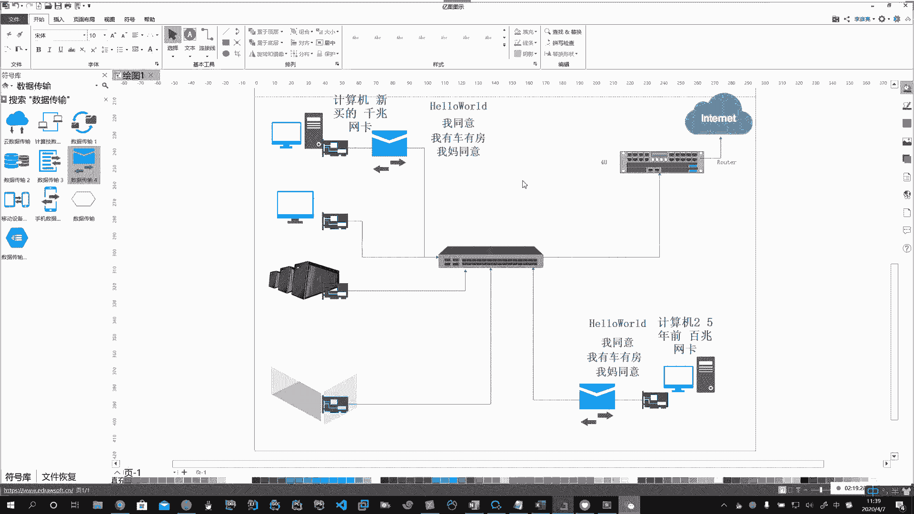

# 系列 3：P141：【Linux】网卡的协商机制 - 马士兵_马小雨 - BV1zh411H79h

啊，在后边我们会详细的来介绍网络传输协议啊。Yeah。好，那么我们传输数据的时候，是靠它来传输的。啊，靠他来传输的。好，那么我们有了这些充分必要条件以后，那么咱们就该开始。

啊，就该开始。说使用这个网络了。那么构成网络的最小单位。啊，构成网络的最小单位。两台。或两台以上的计算机。Oh。两台或两台以上的计算机。你要一台主机跟那玩呢啊，那你叫单机的。😡，啊，一台叫单机。没有网。

啊。啊，单机。你需要联网了，哎，至少需要两台或两台以上的计算机才能构成一个最小的网络。啊。那么计算机和计算机。构成了网络以后，他们需要借助。硬件传输介质网络协议进行数据传输和数据共享，对吧？

以及资源共享。好。通过物理硬件。通过传输介质。通过网络协议。缺一不可。Oh。那么通过这个干了一件啥事儿。数据传输。数据共享。资源共享。好。这儿就需要我们解释一下了。数据传输。

比如说咱们用的rthink全网备份啊，从A传给B。

啊，数据共享你有我也有，这个能理解资源共享这块，那么它就比较抽象，咱就一块来给大家解释解释啊。那么在计算机中，啥叫资源呢？啊，就是你的算力。也就是你的CPU。啊。你的算力。😡，也就是你的GPU。

CPU和GPU都称之为你的算力。Yes。吓。那么有时候GPU的算力要比CPU高。速度更快。所以将来有机会你如果接触到啊区块链技术的话，你就会发现有很多虚拟币的加密算法是用GPU来挖矿。

是用GPU来提供算力。我们也称之为显卡挖矿。🤧Yeah。啊。比如说可以用啊，我们。这个这个这个NV的显卡啊，GT叉1080。啊，1080钛2080钛啊，一张网卡干好几万，一个机箱里头8K网卡。

用AMD的R叉580。啊，里头8块网卡，11不是8块显卡，11块显卡。啊，这样的设备我有我大概有二十几台，等大家呢来北京线下来学习的时候啊，单位里头我都放着呢，可以做算力机，可以做AI人工智能的学习。

等大家到北京了，我那有，你打开你看看啊，你看看亮哥土豪不土豪是吧？咱开一台机器看里头R8R580的显卡里头8张十0多台。啊。对吧这都是哎我我挣这俩钱没事干，我我都我都买这个玩了啊。

所以呢就是哎咱们做IT的不容易啊，苦逼苦逼挣点钱全投资在这些设备上啊，所以资源共享。第一个就是算力，第二个是什么玩意儿？第二个就是存储。啊。比如说后边我们讲NFS共享存储。说你这个主机。

你的存储空间特别大。😡，啊，你这动辄几十个T，对不对？P。那把你的资源共享出来吧，大家一块儿跟着用，这就叫共享存储。啊，共享存储哎，还会有一些东西，什么叫资源呀？网络也是资源。啊，网络。啊。🤧嗯嗯嗯。

那啥意思呀啊，比如说你能访问。😡，哎，你能访问谷歌，我不能。当然通过你共享了，咱俩都能。啊。Yeah。Okay。等。啊，这个意思叫资源共享。你可千万别理解成，哎呀，我就电脑上那点片儿跟人家去共享了。

不是啊，这里头的资源。指的是我们主机里头的这些个内容。当然啊当然也会有这些数据啊数据。Yeah。数据也是我们这里头存的一些资源。啊，你的data。啊。可以共享。所以这时候你反过来你再去理解网络的时候。

刚才我们说了，把分布在世界各地的这些个主机，通过传输介质连接起来。啊，通过传输介设连接起来。那这时候在跟人打仗的时候，比如一个指挥中心被人干掉了，马上另外一个。指挥中心又有。啊。

所以那么我们网络的一个特点就是能够快速分布式啊，数据共享，快速传输。资源共享啊。这些个的作用。好，这个主要让大家理解资源共享这样的一个概念啊。去理解他。嗯嗯。好，那两台以上的计算机啊。

那才能构成一个最小的网络。啊，最小的网络。好，那这样的网络啊这样的网络我们就。

可以给大家再说的说的啊，网座能干啥，这不说了。网络的分类。刚才给大家介绍了广域网、城域网、局域网啊，那么网络我们在这里头就会有网络的拓扑，对不对啊，什么叫网络的拓扑啊，其实就是网络里头的结构啊。

所以按结构网络拓扑去分类也可以啊。

Okay。は。按拓普结构。Oh。那么这一块呢啊不会要求你。

去啊做网络拓扑这一块啊，但是呢在这儿呢我们要有所了解。啊，这一块呢一般的是有专门做网络方向的。比如说网络工程师啊。哎，他们去干这些事。啊，那么我们通常呢咱们运维工程师，那我们主要是系统层面的。

啊，在这儿呢我们了解说，按照拓普结构分类有总线型的。啊。还有什么呢？环形的。啊。还有啥呢？还有。新型的。啊。对吧还有网状的啊等。了解即可。Okay。啊，那么除此以外呢，还可以按信息的交换方式来分。

啊。那么这个东西啊啊现在呢呃提的也越来越少了。现在流行的呢就是按照你的地域和啊刚才的拓普结构来分。

啊，那么还可以按照信息交换。方式分类。Oh。Okay。啊。好，比如说有电路交换。啊。比如说有豹纹交换。啊。比如说。豹纹分组交换。Oh。嗯。好。Okay。好。Okay。好，标一下重点啊，这个这个。两个。

Oh。好。Okay。Oh。Oh。Yes。嗯。对。Ha。导向式的非导向式的啊这两个。Oh。Oh。Oh。Oh。好。好，网线分类的啊至少要了解。六类线啊。六类起步。哎，我这有一个七类线，怎么弄没了呢？好。

你去机房啊，起步就是六类线啊，六类线、七类线。哎，好像跑这儿来了吧。🤧。She。

好，非导向式的啊，简单的呢你有所了解就行了。比如蓝牙呀、wifi呀。啊，微波呀对吧？哎，这些有啊。好，咱们接着往下啊接着往下说介绍完了传输协议以后啊，那么呢我们就要看看这个网络的基本构成了。

那么两台计算机。啊，这里头网卡就要进行工作了。啊，网卡的。工作模式。Oh。Oh。啊。嗯嗯。好，那网卡呢刚才我们说了啊，有这个无线网卡，有有线的网卡。对不对？啊。好。那么在不同的网卡之间。啊。

那么他们工作的方式就是不一样的。哎，比如说咱们常见的这个有线的网卡吧。好，那么网卡的工作模式啊有三种。你记住有单工的。啊。有半双攻的。哎，还有双攻的。Oh。Yeah。好，那么谁是双攻的？我们的有线网卡。

啊，就是典型的。双攻的。啊，代表工作模式。那么什么叫双攻？就是。能上传的同时能下载。啊，上传的同时能下载。就叫做双宫。啊。就叫做双攻。好。好。哎，能上传能下载啊，同时进行的。所以有同学会发现说。

哎呀说我在平时使用的时候，我感觉我这个呃我这个这个这个呃有线的啊，我插上一根网线，要比我无线的这个网卡要快得多。啊，所以这个就根据他的工作模式这个特点来的啊，一边上传的同时能下载。

那么我们无线网卡啊无线网卡它就是属于半双攻的。好，暗装工。啊的特点。说。下载的时候。不上传。啊，下载的时候上传。哎，他不同时进行。所以有时候你在使用无线的时候让，你感觉哎它就没有有线的快啊。

网速有区别就在这儿。啊。那么我们生活中说我不接触网络，我有没有这样的例子，有啊，比如说这个单供的那他就只能干一件事儿是吧？那么比如说我们在家里头都用过收音机。😡，好。啊，收音机。Okay吧。哎。

这就是单攻的模式。你是不是只能接收啊，对不对？你可以调台。换台啊，但是。你只能听。啊，你只能听。Okay。Oh。你是听88。7呀，103。5啊，90。0啊是吧？哎，那半双攻的典型代表对讲机。要么你就听。

对吧听的时候没法说。对不对？啊。这边拿着啊，喂喂喂，冲A口冲A口。对吧，哎。你关了，他说。那么双宫的代表点化。对吧哎，你拿着电话跟女朋友吵架，你骂他，他骂你。啊。可以同时骂。对不对？好啊。

这几种模式简单的有所了解啊简单有所了解。好，那么他有一个工作模式，完了以后，这个网卡还有一个意思啊，网卡。Yeah。网卡在数据传输的时候啊，他还要做一件事儿。啊，那么就是协商机制。哎。

王凯在数据传输的时候，他有一个协商机制啊，所谓的协商机制，刚才说都建立在两台或两台以上的计算机上。

啊，比如说计算机一跟计算机二，他俩要说话啊，说计算机一新买的。啊，配置比较高。计算机二用5年了。啊。5年前的呢。他们俩的配置就不一样啊，说计算机一你这个网卡啊，你这网卡。对吧。

你这个网卡用的是一个什么呀？千兆网卡。哎，这网卡是千兆网卡。它是什么呢？它是一个百兆网卡。Yeah。啊，你处理速度是它的10倍。你十句话说完了，他刚说一句话。😡，啊，你收了1条信息了，他刚收一条。

所以你的你的速度比他快。😡，当这两台计算机他俩要进行通讯的时候啊，你说你发了10条数据。好，他发了10条啊，别十条，这十条得画一会儿呢啊。不行，还真得失点啊，要不你不好理解。哎。好。

说你发了十0条数据啊，你是千兆的吗？那你是它的10倍呀，对吧？好，那它不叫慢吗？对不对？那如果说按照这个逻辑，那你发十条，我只能收一条。那我其他9条不就丢了吗？😡，对不对？万一很重要的。啊。

你这正跟小姐姐表白呢，I love you呢啊，那后边这几条人没听见，那完了。啊，姐姐生气了怎么办？所以计算机在传输的时候，那他俩就往各两个网卡之间就会有一个协商机制啊，说你不牛逼吗？啊。

你一下能发1条，对不起，人家2号机说，对不起，我一次就能接一条。啊，说大哥，你等等我吧啊，要不一会儿你一表白，后边数据全丢了，那完蛋了，你就分手了啊。所以说这计算机一一听，哎呀，那你只能收一条。

我发十条，好吧，那我就。按照你的标准。啊，我往下降，我从千兆降到百兆。这样咱们之间我发一条，你收一条啊，说hello。啊。对，小姐姐直接就说。我同意啊，你说你这个没出息的劲儿，你怎么着，你也矜持一下啊。

是不是？啊，这直接就同意了，后边不用说了。啊，有来言有去语，一条一条的说，不至于丢。啊。对不对？哎，然后你接着说啊，我有车有房，父母双亡啊。哎，他又收到了啊。好，人家又发一条啊，我妈也同意。啊。

那你这不就搞定了吗？是不是哎？ううん。😊，这是一个协商机制啊，所以我们这些网卡，我们又称之为自适应网卡。

，啊。那么。为了让大家这个数据不能丢啊，咱们就来协商。比如说你是千兆的。啊。对吧哎，他是百兆的。咱俩商量一下吧啊，用咱们生活中的案例就叫木桶原理。啊，木桶原理。木桶原理是啥意思呀？

最短的那块板决定你能盛多少水。所以计算机他们在通讯的时候，如果是两台进行通讯，它会协商。啊，他会写商。那么这个所谓的协商机制。其实就是为了保证。兼容性。啊。就要保证它的兼容性。那么你这个高端的卡。哎。

他就可以。向下兼容。啊。这才能体现你高级啊，你能向下兼容，没有向上兼容的。你的100兆到头顶天了。啊，石勾圈K尖了，顶天了。啊。所以这一块啊，大家对于这种兼容的啊这种概念了解即可。啊，了解即个。好。

这是网卡的。

