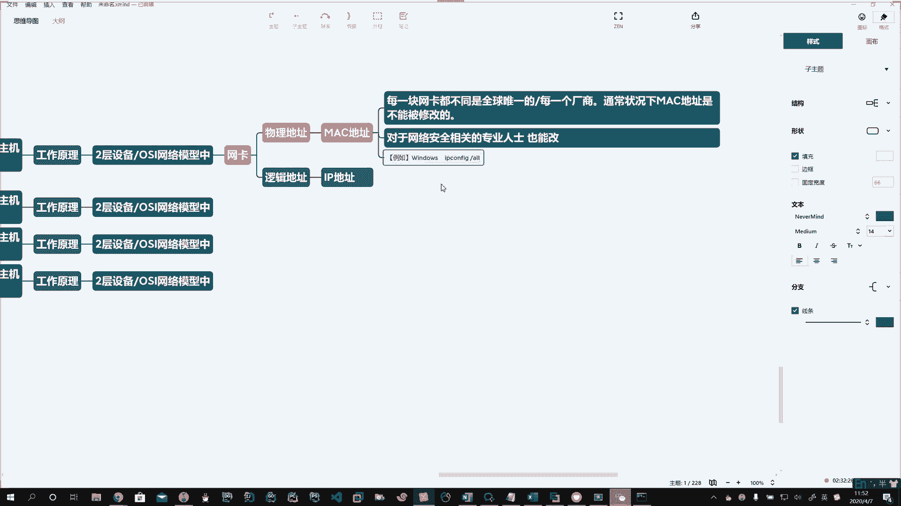
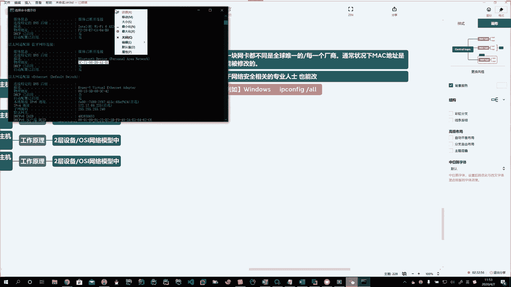

# 花了2万多买的Java架构师课程全套，现在分享给大家，从软件安装到底层源码（马士兵教育MCA架构师VIP教程） - P142：【Linux】交换网络 - 马士兵_马小雨 - BV1zh411H79h

好了，那么我们也有网卡了，咱们也知道他的工作原理了啊，说有他的工作模式了，咱也知道他有协商机制了。行了，咱现在开始考片吧啊，构成一个网络吧啊，那么我们常见的网络，这里头就给大家介绍叫交换网络。

。啊，交换网络。咱们在生产生活过程中啊，最常见的网络就是交换网络。

啊，刚才咱也画了，这就是一个交换网络。咱们通过一个设备，什么设备呢？交换机啊来进行。交换。啊，来进行交换。Okay。好，所以呢这个我们在学习的过程中，这个也是一个小型的网络。

好。哎，局域网。Yeah。啊，区域网。举个例子吧，在公司就有这样的小型交换网络啊，是局域网的。比如说咱们公司有开发部门。

🤧。财务部门。

。市场部门。

当然还可以有更多的啊，比如开发部门给他一个网络，小型的局域网，它是一个独立的网络。啊，你财务部门独立的一个小型网络，市场部门，一个办公室，独立的一个小型网络。啊，那么他们都是一个局域网。🤧嗯嗯。Oh。

好，那么通过什么呢？通过啊在这一个局域网中。张三。

李四。

王五。

赵六。啊。

这些个人。每一台主机。通过传输介质啊，通过网线。Yeah。啊，通过网线。

跟谁呢？跟交换机。Yeah。进行连接。啊。那么交换机啊，通过交换机这些人啊使用的计算机可以进行数据传输、资源共享，进行计算机之间的通信。啊。局域网。之间。主机和。主机。进行。

好。那么。😡，它是怎么样进行通信的呢？那么我们就得说一说交换机的工作原理。啊。交换机我们又称之为啊二层设备。啊，那么他是在OSI网络模型中。哎，七层网络模型中工作在第二层。啊，所以我们。

就给它称之为二层设备。啊。那么二层设备呢主要是通过什么啊来。进行区分。那这时候还是跟我们网卡有关系。啊，网卡有关系，我们我们在计算机的网卡。啊，会有两个地址。一个叫物理地址。一个叫逻辑地址。

。

啊，一个叫物理地址，一个叫逻辑地址。物理地址呢又称之为mac地址。逻辑地址又称之为IP地址。麦克地址啊。每一块网卡。啊。都不同。是全球唯一的。啊，全球唯一的。每一个厂家。啊。就是你这网卡每一个厂商啊。

大家都会。

相互进行区分。不重复全球唯一的。通常状况下。麦克地址。是不能被修改的。我说的是通常状况下。

啊。通常状况下是不能被修改的。那么有通常就有不通常。

啊。对于。网络安全相关的。专业人士也能改。

啊。Okay。普通运维的就算了，他们根本就不知道怎么整啊，但是我们能够去做。啊，那么怎么去查看呢？说我咋能查看我这里的这个麦克地址啊啊，windows下也能查看啊。

Yeah。windows下输入IP。Okay。啊。没有哈。杠A。啊。哦。然后我们在你的这个网卡这儿以太网适配器啊，你会发现这儿有一个物理地址。

啊，物理地址。

例如啊windows下。windows下你输入。IP configurefi斜杠O。

Okay。

，可以获取到麦克地址啊，那么在这里头有一个物理地址。

。

。

好，这个物理地址。啊。Yeah。十六进制。方式表示。啊，16进制数的方式表示。那么有几组呢？1234566组。

。啊。六组16进制数。

表示。分为6组啊。

。每组。有。两个。16进制数。构成。每一块网卡。

之间。的麦克地址都不同。

。Okay。

啊。你看我这一块，它是DC7196D9A1杠EC下一个就是00155D683C42。啊，每一块物理的网卡的地址都不同。

Yeah。好啊，记住啊，物理地址啊不能改。

好，然后我们的交换机啊我们的交换机。

那么他是怎么工作的呢？那么他就会记录。啊，咱们每一个设备就每一个主机的麦克地址。

哎，他会有一个麦克地址列表。

。他就是通过这个麦克地址列表来管理。连接在交换机上哪一个端口，你看这个交换机啊，这里头有多少多少口？

我们通常在企业里头啊能见到1六口的。啊，32口的。24口的啊48口的。

啊。那么然后它每一个接口。啊，有一个编号，然后这个列表哎就记载着你上边这个接口。比如说我01号口对应的是这个地址。啊。我0二口对应的这个地址。啊。

通常咱们见到的企业的这些交换机啊，企业交换机。比如说有16口交换机。诶。还有什么呢？比如说有24口。

啊。48口交换机。

一般呢24口的居多啊。十6也有48也有。

啊。一般这样的较为常见，它会把每一个接口啊，这上边每一个口对应哪个地址来找。啊。当你两台计算机要通讯的时候，说你发信息了啊，要想连接给他，那么这个数据发过来，经过交换机的时候。

这交换机就会去这列表里头去找。

看你是否在麦克地址列表中。

啊。比如说这一跟二通讯啊，那你发送的时候，他一找在这麦克地址列表，它对应的是2号口。那这时候交换机就会给你。

进行数据的转发，从1到22要想找一好，他发一条信息过来，那么交换机再次通过麦克地址列表去找啊，有就通过端口直接给你转过去了。啊，这是第一个通过麦克地址列表。

那么如果我找了一个计算机3。啊，找了一个计算机3，如果这个计算机三不在这个麦克地址列表中啊，那么我们的交换机，那么它就要通过它的广播域。

如果。主机不在。交换机的。麦克地址列表中。啊。那么就通过。交换机的广播域。啊。全网。广播。

。啊，所有端口他都发。就跟咱们过去村里头那大喇叭一样，广播村东头老王家那个小寡妇，今儿谁又给他挑水了啊，这这这这大喇叭广播去了，是不是？哎，当你找不到的时候啊，他就全网广播，所有端口都发送一遍。啊。

好，那我们今天呢啊关于网络的一些基础内容啊，咱呢就先说到这儿。

