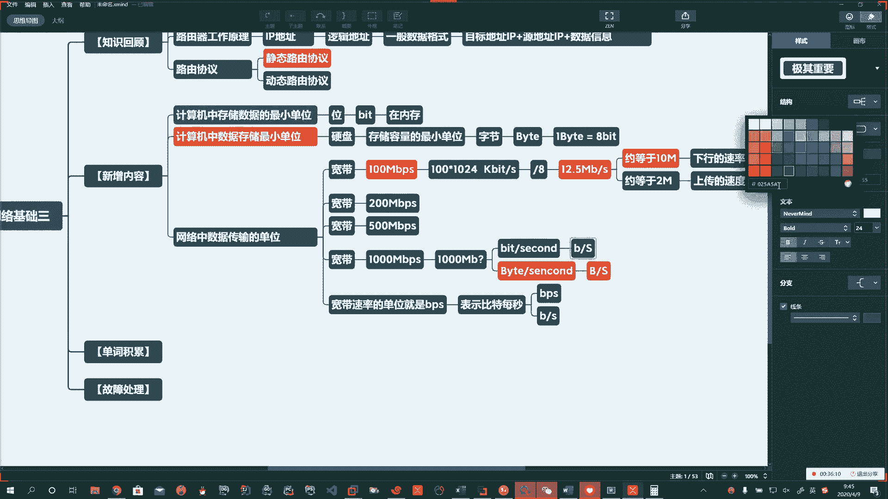

# 花了2万多买的Java架构师课程全套，现在分享给大家，从软件安装到底层源码（马士兵教育MCA架构师VIP教程） - P143：【Linux】网络速度计算 - 马士兵_马小雨 - BV1zh411H79h

啊，存储单位刚才说了位啊，然后呢存储在硬盘上，我们通常基本单位是字节啊，网络传输的单位啊，这儿我们先通过我们的假宽带给大家引入一下啊引入一下。Yeah。好，那咱们琢磨琢磨。

我们经常会看到这个新闻呢啊去报道，那报道啥呢？啊，报道说这个中国联通啊、中国移动啊、中国电信呢又被告了，说他们涉嫌虚假宣传啊，你标称的这个网速达不到啊。

，But。好啊，那我们说一说啊，那么通常咱们的网速啊咱们的网速怎么去计算呢？对吧？那么它也就是说你每秒传多少位或每秒传输多少个字节。啊。所以算完了以后，要么就是。啊，比特除以秒。啊。

比特除于秒秒是时间的单位，也就是说我一秒传输多少位。啊，一秒传输多少位？

还可以表示成。啊，比如说我也可以说一秒钟传输了多少个字节。啊，一秒钟传输了多少个字节。

所以可以写成。啊，比特每秒。啊，下边就可以写成字节每秒。Oh。啊。好，那么也就是说我们标称的这个100兆1000兆。那么它比如说啊我们来一个说100兆的宽带。

啊，100兆的宽带。

他相当于是什么呢？咱们就拿它为例啊。100。乘上1024。啊，乘上1024。然后这就转化成了我们叫KB。啊，KB。K比特。每秒。啊，K比特每秒。然后我们还要转化成什么呢？字节每秒。啊，字节每秒。

所以你是这么涣算过来的。那么你字节每秒，我们说了一字节等于8位，然后你现在拿出多少位了，反过来推多少字节。那在这个基础上，你再除以8。啊，你再除以8。

所以你100兆的啊100兆。

好，我们家这宽带，你随便算啊，你除以8。12。5。啊，12。5，也就是说你100MBPS这样的一个网速的宽带啊。

它最大的下载速度啊，理论上是12。5兆。啊，12。5兆。也就是说你标称的这个百兆的这个宽带啊，这标的是百兆的。实际上你的下载速度最大啊，这是理论上的，最大就是12。5兆。但是由于你的设备，由于网络。

也由于信号的衰减啊，所以约等于。啊。约等于10张。啊，那么这个算出来的这个是什么呢？

啊。这个就是我们下行的速率。什么意思呀？那你下载的时候的速度。啊。那么我们运营商在民用，也就是家用的时候，他会在这做了限制，说你下载是这么快，你上传没有这么快啊，你上传的速度约等于。

啊，约等于两兆左右。

，所以这就是为什么你在。😡，啊，家里头使用的时候，你觉得哎呀我下载速度挺快，但是你往上传一个东西，你就发现你很慢。啊。那么有这样的一个啊真实的速度在里头。所以最早的啊，如果你那个宽带要是512K。

那完了啊，那完了，那还不如现在这百兆的啊，你到千兆的也是这样。所以千兆的理论下载最多也就到百兆。啊，也就到百兆。但是呢随着你的设备人员等等等等，最后衰减一般的能达到九十来兆啊九十来兆。好。

这儿呢我们简单的给大家去说一说啊，我们去算这个速度啊算速度。好了啊。所以咱们宽带速率的单位啊。

。就是。BPS。RBPS。

Yeah。BPS的意思就是。BPS的意思就是。Okay。表示。啊。比特每秒。啊，比特每秒。啊，可以用。BPS来表示。

可以用。B。杠S这两种表示方式。

啊。

哎，每秒传输多少位啊，后边为了方便换算啊，每秒传多少字节。啊。

好，所以呢我们现在就知道了啊，你一照EMBPS。啊，这意思就是赵。照。😡，比特每秒。啊。

。照。😡，比特每秒。啊。

注意后边这B是一个小写的B啊和EMB。PS。

一字吃叉，这俩就不是一个意思。啊，这二者不是一个意思。Oh。后边这个叫做什么？这个叫做。照。😡，字节。每秒。啊，所以呢咱们中国联通用的是第一种方式，咱们中国所有的宽带用的都是第一种标称。

忽悠普通老百姓啊，你不懂，我人说100兆100兆是后边这比特，这是字节，这俩不是一回事儿。啊，这俩不会是一回事。

好，那么这里头会有一些换算关系是需要我们知道的啊。比如说我们一个字节等于8位。啊，一个大B等于8小B，这么表示没毛病。啊，那么。一亿比特每秒就等于。8。一字节每秒等于巴比特每秒。啊。

或1BPS就等于8BPS。

这么来表示。啊。那往深了说，哎，那我们进一下是吧？那有同学说，那我要1KB呢。

啊。1KB这就等于1024。啊，1024B。Yeah。啊。所以后边哎那要1KB每秒就等于。啊，就等于1024。B除S。啊，那再往下呢。

我们就写到赵就行了啊。说一兆。啊，一兆字节等于1024KB。啊，所以我们说的。哎。😊，以照字节每秒。啊，那这个就等于。啊，1024KB每秒。所以要注意下头这个跟上头这个啊，他可真不一样啊。真不一样。

🤧虽然都叫这个，但是下边的显然更快啊，下边显然更快。好了，这儿呢我们有所了解。即可。啊。🤧嗯嗯嗯。好，这是我们数据传输啊。那么在我们数据传输的时候，我们需要通过什么？我们需要通过网络协议。

啊，网络协议。那么数据是咋传输的啊，我们这还需要通过网络模型。

Okay。