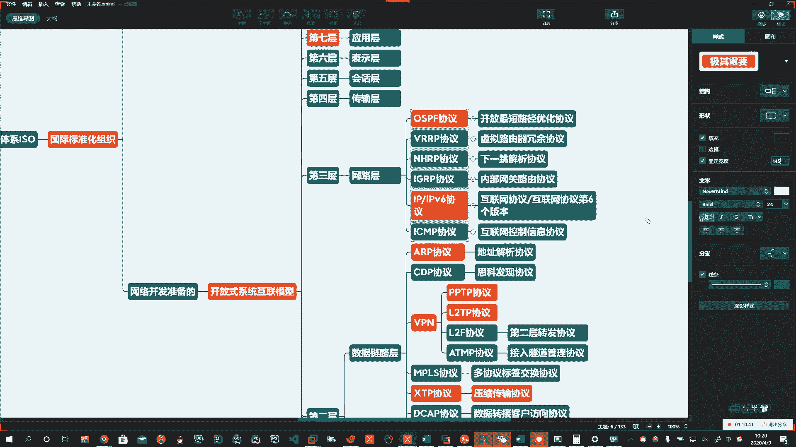

# 系列 3：P144：【Linux】OSI网络模型上 - 马士兵_马小雨 - BV1zh411H79h

。🤧。好。Yeah。🤧哎呀嗯嗯。Okay。咱们用这个互联网的本质啊。我们互联网的本质其实就是一个网络协议。好。网络协议。计算机之间怎么才能说话，怎么才能认识那你认识我。

我认识你咱们每一个应用之间怎么来区分，都要靠网络协议来区分。所以说呢一个应用啊，那它需要有网络协议的支撑。啊，网络协议的支撑。那么网络协议就规定了说啊我。在传输数据的时候，我有一个规范。

你在传输数据的时候有一个规范。那么这个传输数据的这个规范是由谁设定的？啊，由谁设定的，肯定不是我设定的。啊，肯定不是我设定。那么他是由谁去做的呢？啊，那么我们有一个叫做国际质量体系啊。

翻译成英文就是ISO。咱们经常听到有一个什么ISO什么9001什么9002认证。啊，那么这个ISO就叫做国际标准化。组织。由他们来制定。Oh。国际标准化组织就是全球的。啊，所有国家。统一的一个规范。哎。

举一最简单的例子，他在咱们生活中有没有影响？有RG45RG11。嗯。啊，RG45RG11。这个就是最简单的一个规范啊，它约定了什么呢？约定了咱们这个网线。水晶头。Okay。Oh。都长这样。啊。

你到日本了，你拿这网线插上也能用到美国了，插上这网线也能用。好，那么一说到网络传输的时候，这一块呢相对来说较为复杂。那么他一开始啊啊他是为什么呢？就是为我们网络开发准备。那么我们在运维的层面啊。

咱们这些同学，你其实到三层就没了。你玩的就是三层以下的这些设备。啊。如果真的开发的话，OSIIOSI的7层网络模型都要用得到。啊，都要用的呢。所以呢全球的这个国际化标准组织，人家就制定了一个叫做。啊。

开放。开放式。系统互联。啊，这样的一个模型。Yeah。🤧好，翻译成英文就是open system。Interconnect。Okay。啊，他们这帮人没事儿干，在这坐着啊，制定出来的。一个模型叫这。

简写成OSI。啊。被称为。O赛。model。🤧嗯。好。这就是大家说的OSI7层网络模型啊，在这儿。他怎么来的？在这儿。啊。那么这个OSS7层网络模型，它都约定了什么，有哪7层？啊，有哪几层？好。

这个网络模型啊，首先第一个它制定了什么，制定了所有的硬件标准。啊。所以第一层。硬件你不就是玩物理设备的吗？所以第一层又称之为物理层。Oh。啊，物理层。那这个层面啊就规定了很多的标准规范RG45。啊。

RG11。典型的啊这些个规范。那么还有一个组织啊。也是美国的啊IEE。啊，比如说802。2。对吧比如说为什么我们这里头插上这个网线以后啊，这个东西叫以太网，它为什么不叫别的？

诶。因为这些东西都是因为已经在这里头做好了规范啊，所以大家看到的。

ETH。啊，ETH。那么有很多的虚拟币。叫做以太坊，如果加上net就叫以太网。啊，你太晚。好，那么在这一层其实就有这么多的东西。🤧哦。Oh。Yeah。好，光有它也不行。那么在这上边的基础上啊。

我们要通过传输介质，把分布在世界各地的各个地方的计算机相互的连接起来，连接起来咱要干啥呀？啊。我们就要传输数据。那么传输数据的时候，我们要做的一件事儿就是构建了数据链路。所以第二层又叫做数据链路层。啊。

第三层。🤧うんうん。第三层。那么在你构成数据链路了，就要传输了。在你第三层，我们称之为网络层。啊，网络层。🤧嗯嗯。我要给你发数据，我通过什么原理发。啊，通过什么原理吧？对吧好，一会儿我们再解释啊。

第四层。传输层。第五层。绘画层。第六层。表示层。Okay。好，还有我们。跟用户进行接触的第七层。应用层。🤧嗯嗯。这七层啊。Okay。Okay。好。Oh。Yeah。Oh。🤧好。

每一层都具备有相应的标准和规范。Oh。好，由下往上我们说一说。啊，由下往上，我们说一说。🤧Yeah。好，第二层有什么？啊，第二层在构建数据链路层的时候。比如说我们这里头啊ARP协议。

那为什么我们在搞邪恶的时候说ARP协议很有用啊，能让你断网攻击啊啊，在这个数据链路头。啊，通过ARP协议，我们可以。🤧嗯嗯。做地址解析协议啊，它就叫。地址解析协议。啊。非常有意思。啊。

那么还有很多在这个数据链的链路层的，比如说。CDP。啊，CDP我们经常听说有一个设备公司啊叫思科公司。哦。Yeah。CDP协议。美国的网络通信巨头。啊，那么这个协议呢又称之为。思磕。发现协议。Okay。

斯科发现协议。啊，那么在这个二层呢还有很多啊，比如说我们的VPN啊。VPN。VPN呢大家应该了解到说有一些朋友啊想这个上网打鱼访问谷歌。啊。对吧。哎，谷歌你就有。啊，你看人家谷歌多坏呀。啊。

美国人可坏了。一艘疫情咔机中国给你排第一，其实美国挺高的。啊，让普通老百姓一看，我就靠这这中国。这么多人啊排第一，其实美国人多。好。好啊，VPN那VPN在这块呢，就咱们说的说的啊说的说的。

那么这里头呢就要介入到了你要构建虚拟的数据链路。所以说呢这里头VPN就有PPTP协议。啊，VPN里头还有LRTP协议。🤧嗯。啊。还有什么呢？还有L2F协议。啊。那么这个协议又叫做第二层。转发协议。啊。

还有什么呢？还有ATMP协议。啊、接入隧道。接入隧道。管理协议。Okay。Oh。所以如果真正的我们要把这个网络协议学明白了，我跟你说呀。啊。你给我俩月。我们不讲别的。咱就讲这个。都不一定能够啊。哎。

这里头太多了啊。那么还有很多啊数据链路层的一些协议，比如说MPLS协议。啊，比如说叉TP协议。比如说DCAP协议。啊，比如说SLE协议。啊，比如说。IP音IP协音。Okay。啊，都是哪制定的？

都是刚才我们说的啊，这个组织。制定。好。我给你标一下啊。哪些需要你？了解了。Yeah。哎，大家学习起来没有啥负担的啊。Yeah。好，这些个协议你就听我一说就行了，你就累我一个啊。

你就累傻小子一个就行了啊，您不需要有太多的负担，我就给您介绍一下啊，让你呢开拓一下演技。那么这个MPLS协议是什么呢？就是多协议标签。交换协议。嗯。啊。叉TP协议。

我们经常在用arthink全网备份的时候看到了一些参数啊，有同学说那压缩传输它咋压缩的？啊，是他自己跟这打一包吗？在传输过程中数据链路层的时候，那么他要通过传输协议，这个叉TP就是压缩传输。协议。啊。

压缩传输协议这些事儿其实在你运维的过程中，你看不见，通过操作系统底层sockit啊。链接在这里头编程实现的。哦。啊，编程实现。对吧哎，等你有时间啊，将来参加我们周末班网这个周末班或我们的网课的时候。

我在周末班会给你讲更深层次。比如说我现场给你写一个。啊，网络服务器端客户端哎，这边发一hello服务器能收到，咱们就通过编程编码看底层操作系统底层是咋回事。啊。好，DCAP协议。啊，叫什么呢？

叫数据转接客户访问协议。哦。SLE协议。啊，ISSLE协议。串行的。连接封装协议。好，IP因IP那就是IP套IP。封装协意。好。好，这就是咱们数据链路层的啊，我简单的呢给大家说一说，那么数据链路层啊。

数据链路层它主要要干一件啥事儿？啊，要一概念就是做物理寻址，同时将原始的。刚才我们说了，这叫啥呀？传输速度这儿啊。啊，每秒传多少个比特是不是啊？那这东西就叫做比特流。啊，比特流。转变为逻辑传输的线路。

Oh。好，描述一下吧，物理层就是机械。电子。定时接收啊定时接口。通信管道。通信应该叫信道是吧？哎，通信信道。啊。通讯信赏。上的原始比特流。开始。啊。好啊，第二层就是物理寻址。啊，物理心智。同时。将。

原始。比特流。转化为。逻辑传输。线路。Oh。啊，逻辑传输线路。第三层网络层啊，咱们做运维的朋友到这儿就得了啊，所以说啊你要跟人家去做开发的去扯，人家就说啊你。玩的这设备就带三趟设备，路由器就再见了。啊。

那么这个三层网络这一块啊，它有哪些协议呀？哎呦这个东西就。多了，咱们说说路由器啊，路由器它里头有芯片，它也有自己的操作系统。所以路由器里头有OSPF协议。Up。好。Okay。那这东西干啥的呀？😡，啊。

它叫做开放最短。裙止。啊，应该叫最短路径。优化协议。Okay。诶。啊，还有很多啊再举个例子，比如说VRRP协议。VRRP协议。那叫什么呢？虚拟路由啊，虚拟路由器冗于协议。啊。还有很多啊还有很多。好。

还有什么呢？啊，比如说IGIGRP协议。Okay。啊。内部。网关。啊，路由协议。好，还有什么呢？哎，我们明星该闪亮登场了，就是我们的IP和IPV6协议。好。好。啊，就是我们经常说的IP协议。叫互联网。

协议。那么V6指的是版本啊，后边写的V6就是。互联网协议的第六个版本。啊。那你见到了IPV4。第四个版本第V6第6个版本。啊，那比如说我们。在windows下。啊。我拼一个百度。Oh。我操丢人了。

百度打不开是吗？🤧嗯嗯。Okay。Yeah。

，我开着VPN呢，我找一个啊。3W点儿。百度。Oh。啊，那我们听百度以后，这儿有1个ICMP啊ICMP所以呢。

哎，在我们这一层。还有。ICMP协议。Oh。ICMP。啊，那么ICMP协议是什么呢？互联网。控制信息协议。啊，通常我们用拼命令的时候。就会有。好啊，当然了，还还还可以有啊还可以有。

所以说呢我们简单的给大家介绍这么多啊介绍这么多，这个呢是啊。我们这里头有的数据啊，其实还有还有再说一个吧，NHRP。Yeah。啊，NHRTC。因为将来有可能有一些人去做网络了啊。

所以呢我们这儿呢给大家说两嘴啊。吓一跳。啊，吓一跳。解析协议。好，当然了还有更多啊，我们这里头呢就呢暂时给大家介绍这么多啊。又11点20了啊，下课休息会儿啊。

