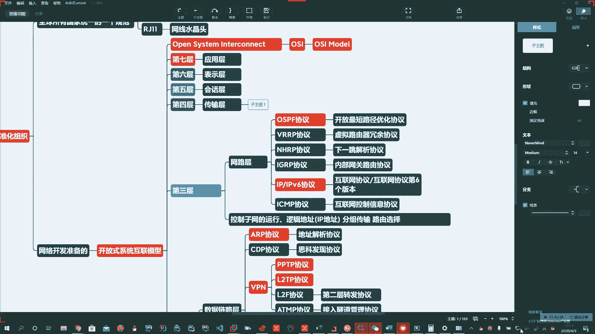
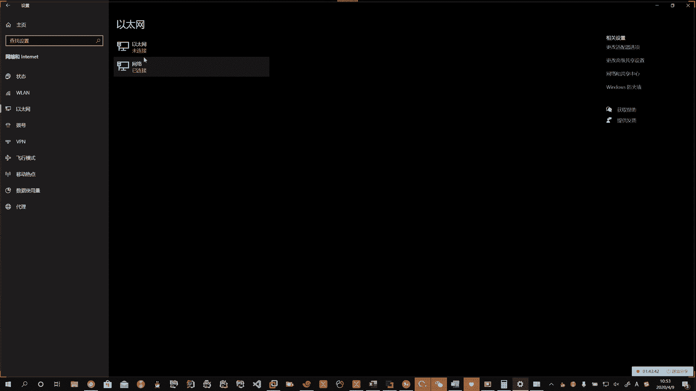
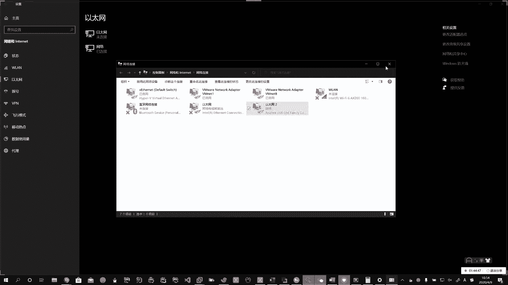
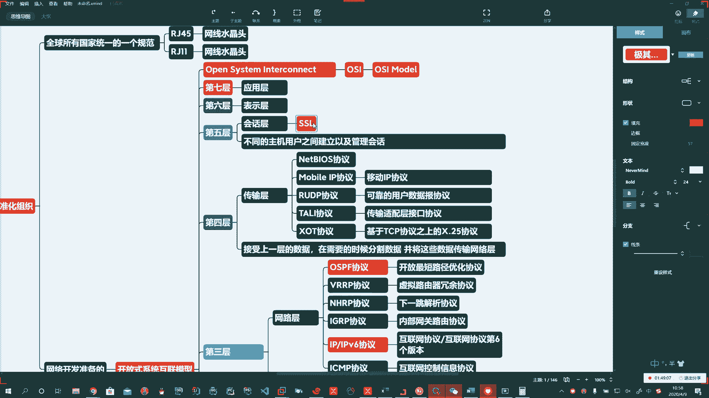
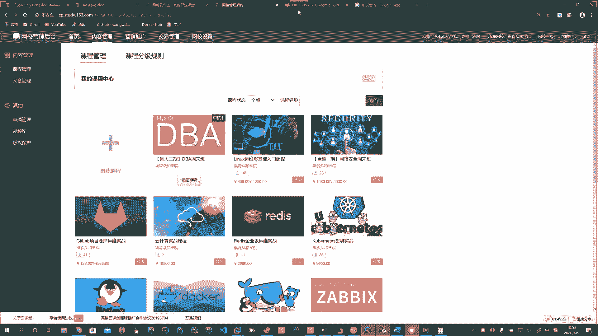
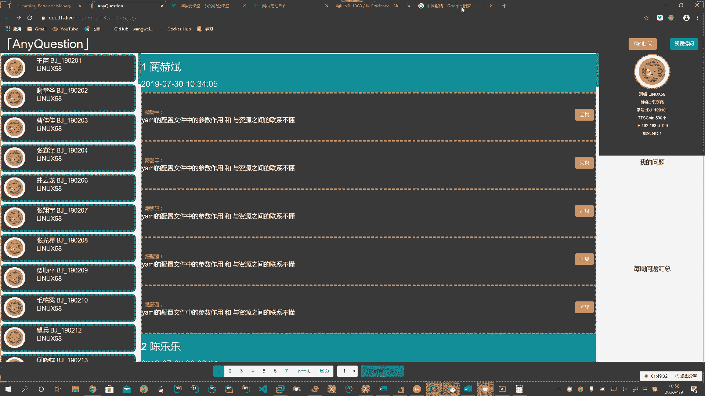
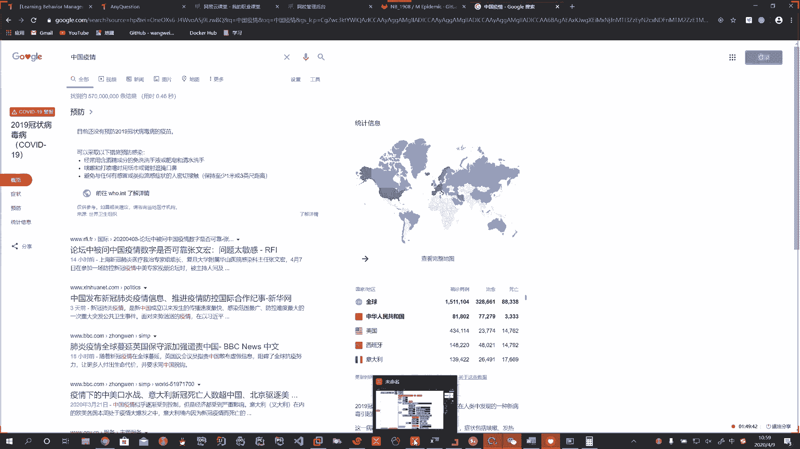
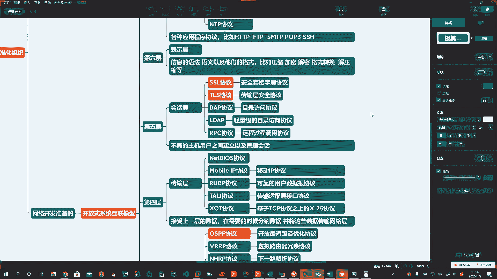
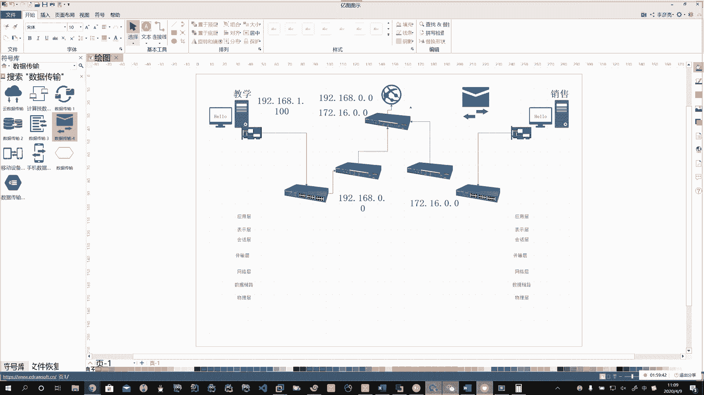
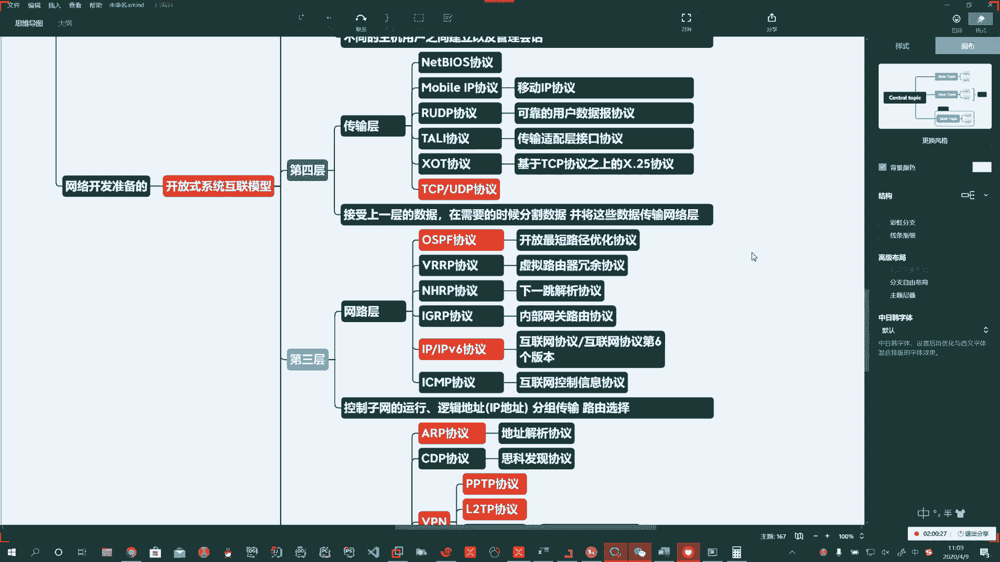

# 系列 3：P145：【Linux】OSI网络模型下 - 马士兵_马小雨 - BV1zh411H79h

🤧T。She。好啊，我们看看第四层啊，传输层呃，第三层啊第三层解释一下啊，他主要干了啥啊，他主要干了。控制。子网的运行。啊，子网的进行。比如说逻辑地址。啊，这里头逻辑地址也就是IP地址。

因为你有IP地址协议嘛，对吧？IP协议啊，逻辑地址的。啊，逻辑地址还有什么呢？比如说这个分组。分组传输路由选择。都在这一层来完成。嗯。Yeah。好，第四层啊，传输层。

那么传输层呢这一块啊啊主要就是我们客户端和服务器端，它在建立连接的时候，是用TCPIP协议来建建立的啊，所以传输层这儿我们知道的典型的啊典型的。这些个。谢意啊，你比如说呃我们的。

这个这个这个TCP协议啊，IP协议啊，比如说。我们的。这个。嗯，我想想啊，说点啥呢？我们windows啊大家在用的时候呢，经常能看到，我看看我给你找一下啊，咱们找一个。

好。好啊，比如说我们这里头有一个叫netbels啊，netbellls。这里头的协议啊就在我们的第四层的传输层。那么它主要用于什么呢？啊，咱们第四层它就是接受第五层啊上一层的数据。啊。在这里头呢。

他进行一些数据的分割。啊，然后把这些数据交给下边的网络层，然后保证了这些数据啊有效的啊到达。所以呢这个在中间的时候呢，这些协议呀啊我们。

简单的跟大家说几个啊说几个。那么这里头比如说刚才说的啊。Metterbellls。啊，协议呃，那还有什么呢？比如说呃。呃，比如说我们这里还有mobil啊。No mobile IP协议。移动IP协议。啊。

移动IP协议。嗯。还有什么呢？还有比如说叫啊RU啊RUDP。啊，RUGP。叫。可靠的。用户数据。啊，豹纹啊。协议。还有什么呢？还有呢比如说TALI协议。那么就是传输适配。层。接口协议。啊。好。

还有一个啊还有一个叉OT协议。简单的介绍几个嗯，够我们了解了。那么就是基于TCP协议。之上的。啊，X点。25。协议。Okay。Okay。啊。Okay。好，传输层啊。接受上一层。的数据。在。需要的时候。

分割数据。啊，分割数据。然后。并将。这些数据。传输给网络层。啊，在这儿进行传输。第五层绘画层啊。那么绘画层这块呢，它就是不同的。主机。用户之间。建立。啊，以及。管理绘画。Okay。Okay。

干这个事儿的。啊，那绘画层呢啊那么有哪些协议呢？这里头的东西也多了去了啊。绘画层，比如说我们将来做网站的时候啊。哎，做网站。SSL协议。

那么大家在访问一个谷歌的时候，你会发现前边有一个小锁，你看。啊。那么还有的网站没有锁显示不安全。

啊。有的网站都有锁，那么有锁的这些呢，就是我们配备了啊我们配备了啥呢？我们配备了SSL协议啊，它叫做什么呢？它叫做安全套接字。

啊，安全套接字。也就是说我们在使用一些较为安全的网站，上边有小锁啊，安全套接字。从。け。Yeah。哦。那么还有什么呢？还有TL。啊。TL协议。传输层安全协议。Okay。好，那么还有我们什么呢？

比如说DAP协议。哦。叫目录访问协议。Yeah。LDAP。啊。轻量级的。目录访问协议。Okay。Yeah。啊，轻量级的。目录返问协议。那么在这里头啊还有啊还有。那么呃比如说我们远程控制啊。RPC协议。

啊。远程。过程调用。协议。好的好。啊。我们简单的在这儿给大家说这么几个啊。嗯，还有往上啊表示层，那表示层它是干啥的呢？它就是信息的语法语意。啊。以及。他们啊以及这个这个。诶。以及他们的格式。啊。

以及他们的格式。比如压缩的。啊，加密的。解密的。啊。还有什么呢？比如说嗯转格式啊。转额是。要格式转换。啊。压缩解压缩啊。到就在这儿。还有一些呢是编码。Yeah。好，表示层一般的说在这块咱们呃。常见的。

协议啊有。但是呢我觉得呢这一块呢，大家呢其实可以呃不用着重的去呃去记忆它啊。嗯，第七层第七层应用层应用层就是咱们操作系统上，大家装的这个微信呀，QQ啊，你能看到的啊，它都到应用层，就是各种应用程序协议。

啊。比如咱们HTTP。FTPSMTPPOP3。对吧SSH。啊。Oh。等啊这要一说，这里头东西多了去了啊。好。HTTP协议。啊，咱们访问网页都要靠这个。啊。HTTPS。对吧哎，他们都是一家的啊。

FTP协议。搭1个FTB下载站点。啊，SMTP。啊，POP3POP协议这种东西是邮件的。啊哈。对吧哎，SSH协议。啊，加密的隧道的远程连接的。啊，IMAP协议。也是邮件的。啊，还有什么呢？还有tnet。

啊。tailelenet协议。比如说远程连接的。啊，跟SSH协议一样。比如说我测端口通不通的等等等等都可以啊。包括呢我们log in。啊，远程连接协议，这都是。啊，包括呢我们看到的将来看到的DHCP。

啊。包括我们后边要学的。NTP。啊，我们做时间同步的。对吧哎。等等等等。这里头还有很多啊。Okay。Okay。好。Okay。好，那这样的话呢。

我们就把OSI的7层网络模型啊啊简单的给大家呢做一个呃介绍啊介绍。那么这个模型中啊这个模型中，那么他这个用户我们在使用的时候。

说。😊，这台计算机如果和右边的这台计算机进行通讯的时候，实际上啊那他们在建立连接这个过程中。他们俩的模型是一致的。啊，他俩的模型是一致。好，咱弄一个啊，把这个模型咱说一下啊。好，最底下的物理层。

Yeah。啊，数据链路。好，数据链路层啊，网络层。Okay。Yeah。传输层。啊。然后上边是什么呢？绘画层。表示层。应用层啊，那么你左边这台机器啊，左边这台机器你在发送数据的时候。Yeah。

跟右边啊这台机器。那么比如说他在建立的连接的时候，每一层都是对等的。啊，左边是啥样，右边就是啥样？好，这个是我们简单的啊给大家呢介绍了一下。我们呢。OSS7层网络模型。这块啊大家呢要把它。

呃，记住啊，那么在传输层哎传输层上啊，刚才我说的TCP啊，UDP协议。咱们念走了，没往上写啊，那么实际上这个东西。是重要的啊重要的。好，那么我们看下来这七层网络模型是非常复杂的。啊。

真正在编程的过程中说你这个这个理想确实做的挺丰满的啊，但是现实呢有时候挺骨感。那程序员再要你。

