# 花了2万多买的Java架构师课程全套，现在分享给大家，从软件安装到底层源码（马士兵教育MCA架构师VIP教程） - P146：【Linux】TCPIP模型上 - 马士兵_马小雨 - BV1zh411H79h

的话那就疯了。那怎么办呢？哎，那么我们就需要把它简化一下啊，我们就需要把它简化一下。那么简化到什么程度呢？就把这七层网络模型啊给它变成TCP啊，IP的网5层模型。

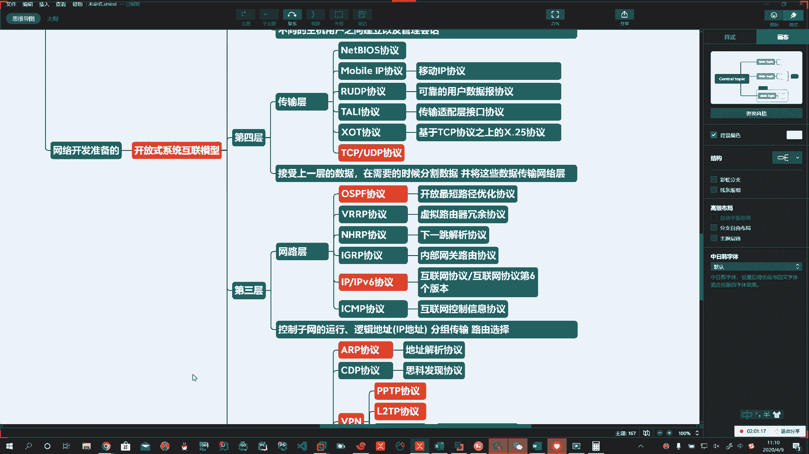

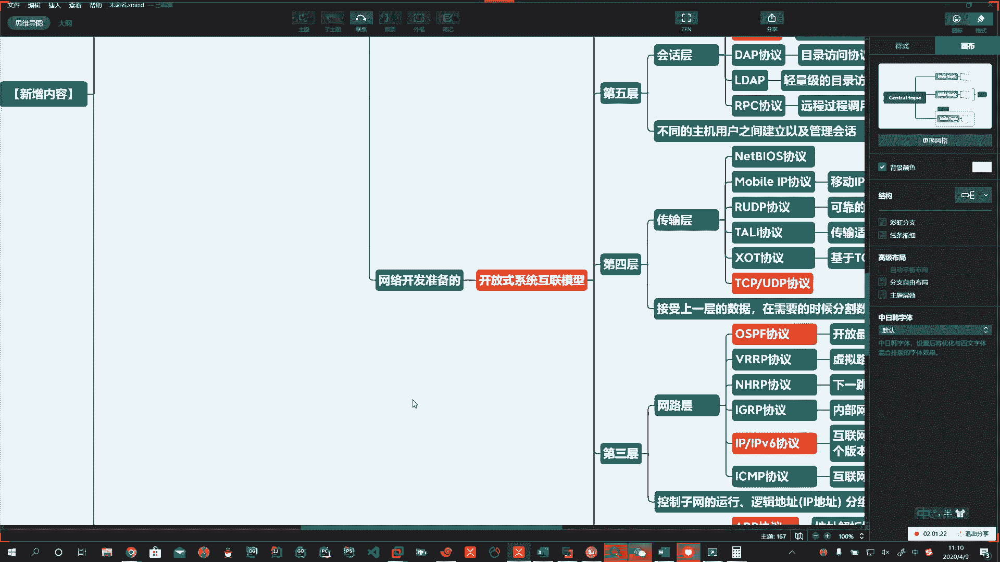

。Yeah。

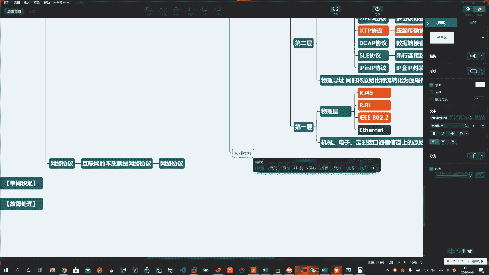

啊，TCPIP网络模型。

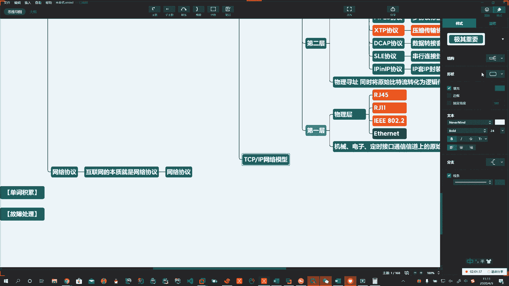

那么咱们这些程序员啊，为什么要给他简化一下懒呗啊，你天天的都这么写，那谁受了啊，对不对啊？写写的疯了，为什么这个这个这个这个。嗯这个程序员这个对吧？头发都不富裕啊，是不是啊？那你要老这样的话。

写写的就疯了啊，确实是啊。对吧所以说呢我们在哎使用的过程中啊，这些个。这个咱们这些个这个程序员呢啊在使用的过程中，我可以不完全遵照你啊的这种方式。我对它进行简单的优化啊。

那么对于7层啊就可以呢给他来简化简化。电话电话。所以在TCPIP网络模型中啊，这也是我们在面试的时候经常容易被问到的一个内容。啊，经常被问到的一个内容。那么上来以后比较经典的问题啊。

那就是TCPIP协议。他们在建立连接的时候啊，这些。模型以及建立这个连接的过程。所以经常会有些人啊上来就问你说TCPIP协议熟不熟悉啊啊，你说我会会完了以后呢，人家就开始深层次的去问你。啊。

那么实际上呢，他还是把这几层。啊，放在一起，只不过对于这些个层的叫法啊。划分用法发生了一些变化啊。嗯。那么这里头的叫法和用法呢不一样啊不一样。那么这个。

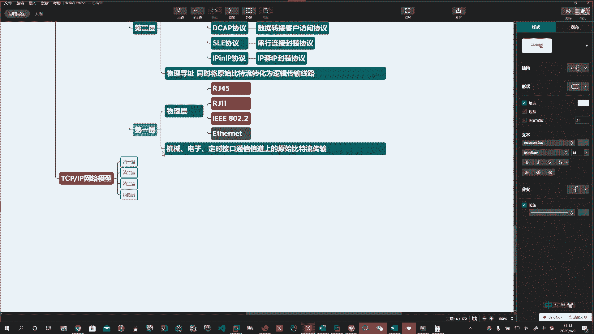

也是因为什么呢？在国际上也没有一个特殊的准则啊，说规定它到底应该是怎么着。啊，所以说呢你在看一些文献的一些资料啊啊。那么有说的是三层的啊，有说四呃，不是有说这个这个这个这个四层的啊，也有说五层的。啊。

有说四层的，也有说五五层的。那么我把这个两种模型呢，我都给你说一下。啊。

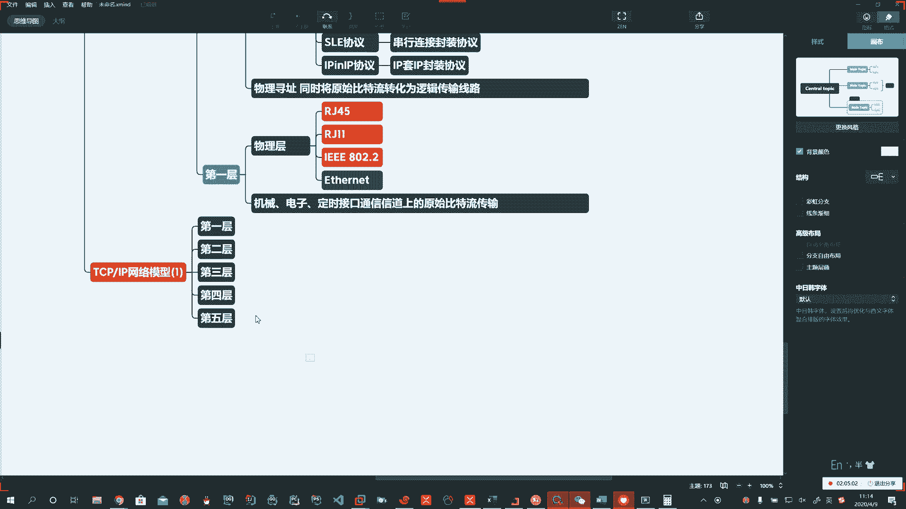

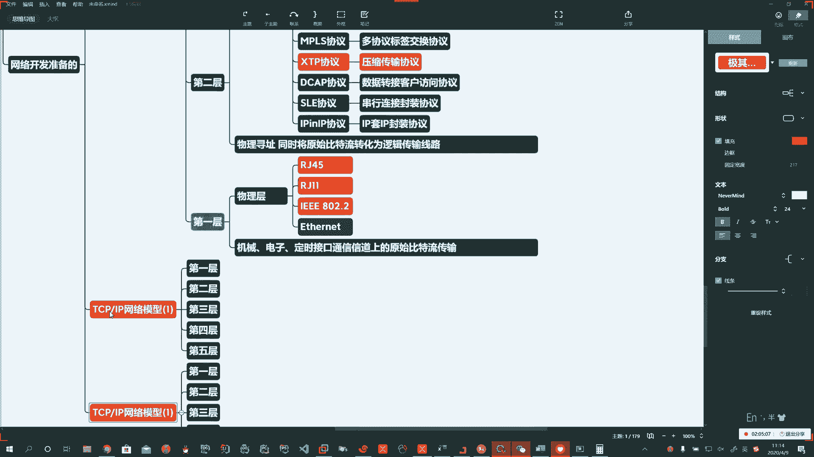

Okay。这个东西呢它容易打架。

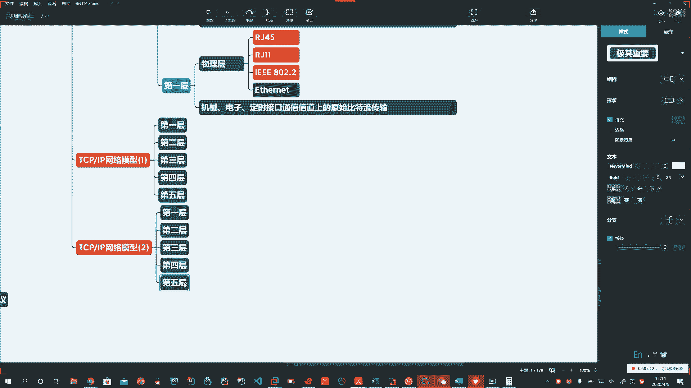

啊，容易打架。啊，人家说我做五层的那你有五层的道理是吧？我做四层的，有四层的道理啊。好，咱先说说五层模型，人家是咋说的啊。第一层。啊，第一层。那么还是把你的物理层拿这不变。啊，第一层还是物理层隔热不变。

啊。第二层啊第二层。

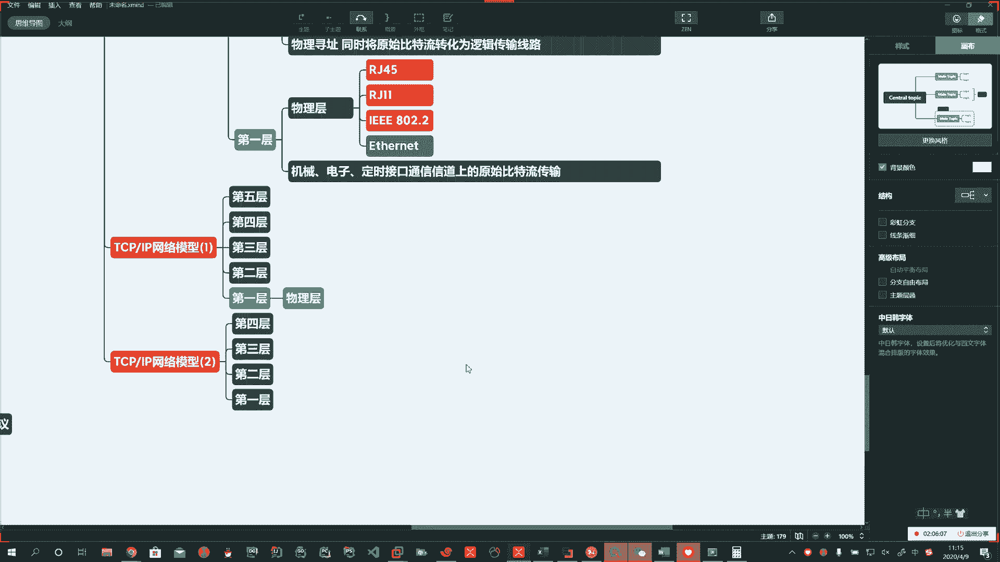

数据链路层也不变。Okay。数据链路层。好，这又有一个数据链路层，在这最下边的基础，这儿没有发生变化啊没有发生变化。那么在哪儿发生变化了呢？啊，在哪发生变化了呢？在我们上边的这个应用层表示层绘画层。

你看咱们七层网络模型是吧？哎，应用表示绘画啊，那么所以说它在第五层做了一个调整。那么第五层它还叫做应用层。

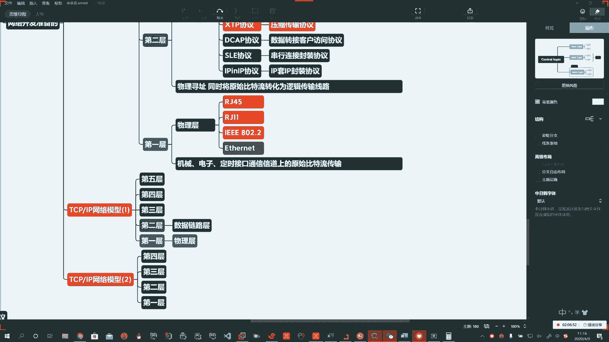

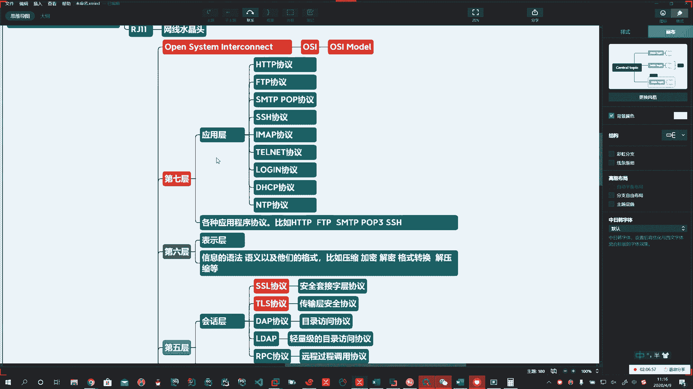

啊，还叫做应用层。但是他这个应用层，他就把七层模型中的应用层。

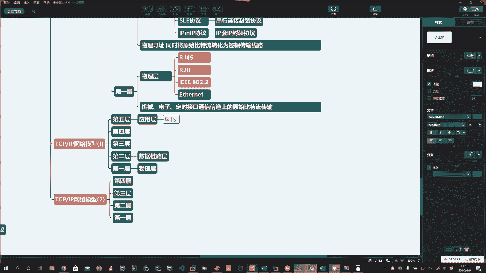

表示层。

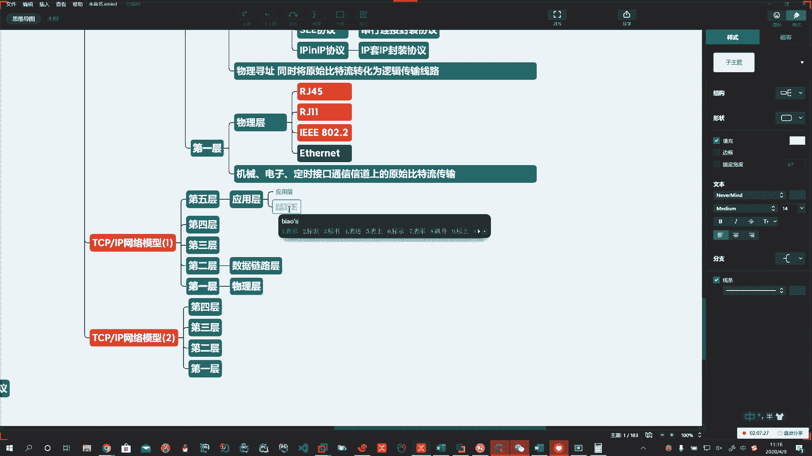

绘画层。啊，他把这三层搁一块儿了。

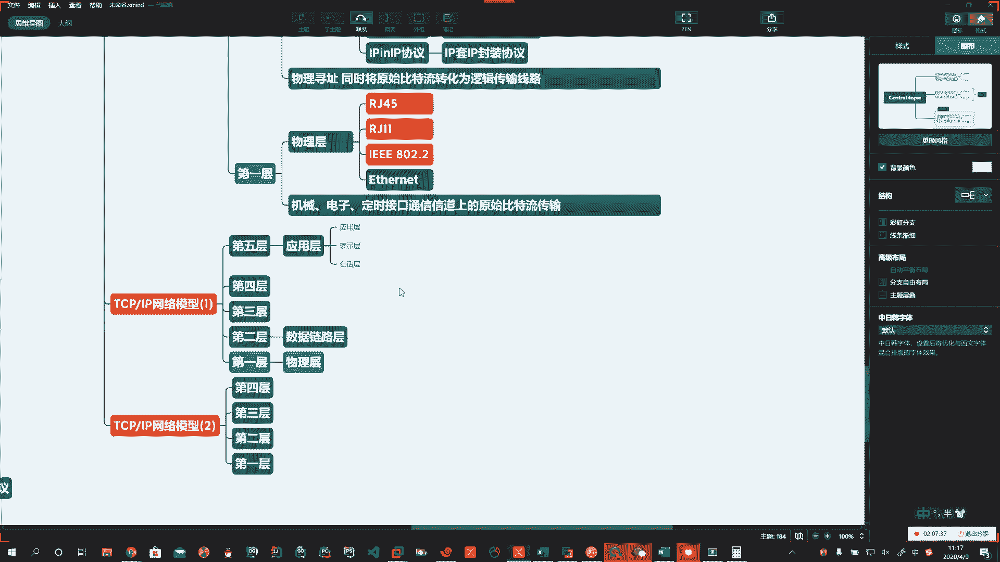

Yeah。啊，他把这三层搁一块儿了。那么我们这个第三层还对应着啊这东西叫做什么呢？网络层。啊，网络层。第四层它还叫做传输层。嗯。那你现在你看这4加3，其实还是7，它只不过把它换了一种表示方式。

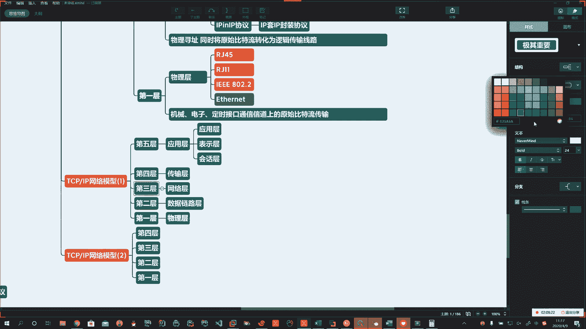

啊，换了一种表示方式。

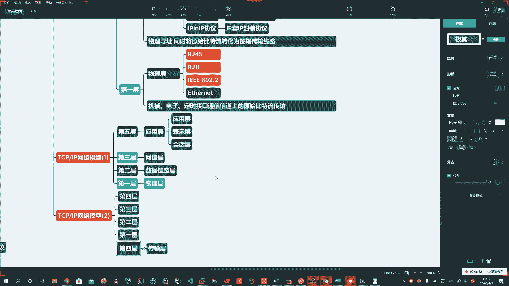

嗯。Oh。好，12345啊，说五层的，人家就基于这个理论来分的。啊。好，说四层的啊，人家四层的这儿玩的更狠啊，四层的呢就是掐头去尾。你上边五层的实际上就是把头部的这些玩意儿给合并在一块了啊。

那你说四层的呢，那更狠。他是把。啊，物理层。和数据链路层，这俩他觉得哎呀你这俩我都可以放在一块儿。

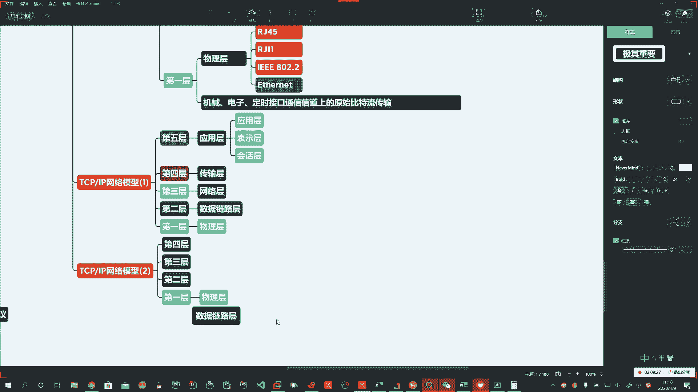

啊。他把这俩给放在一起了。啊啊。然后把他们俩放到一起，起一个名儿。叫做网络。接口。Oh。Yeah。这就是往这一坐吃饱撑的，没啥事儿干啊，就老天搞事情。是吧哎，搞了一个网络接口层。啊。那然后呢。

你你你你这就占了两层了，是不是啊？所以那就向下减一呗啊，那这就是网络层了啊，然后呢这儿呢就是传输层了啊，这儿呢就是应用层了。

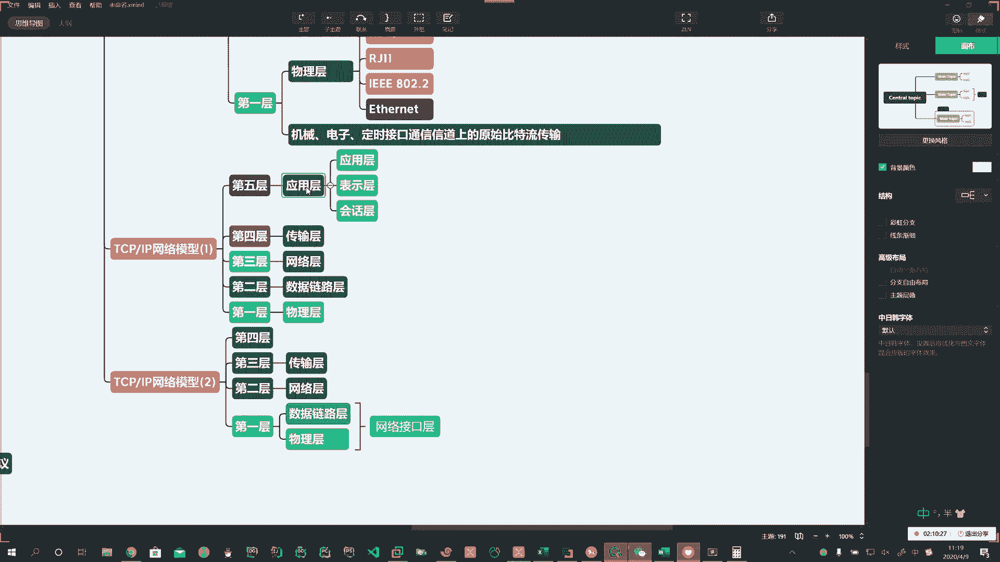

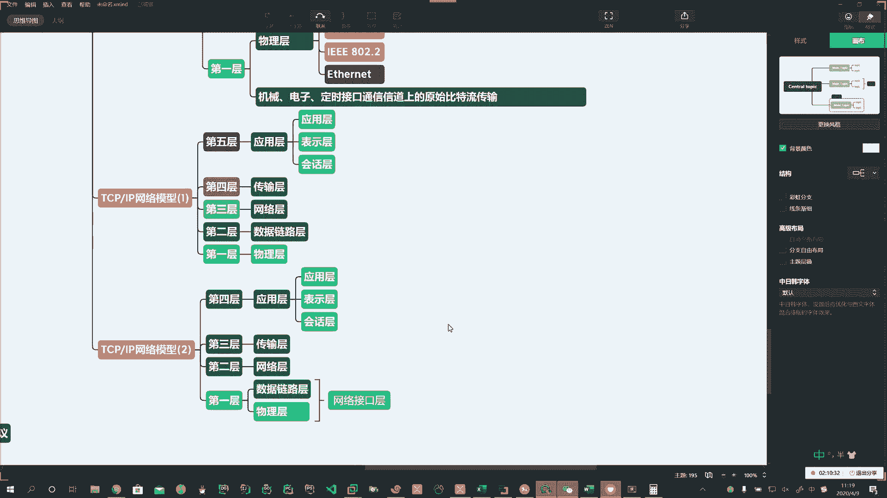

啊，这么算1234啊这么算12345。

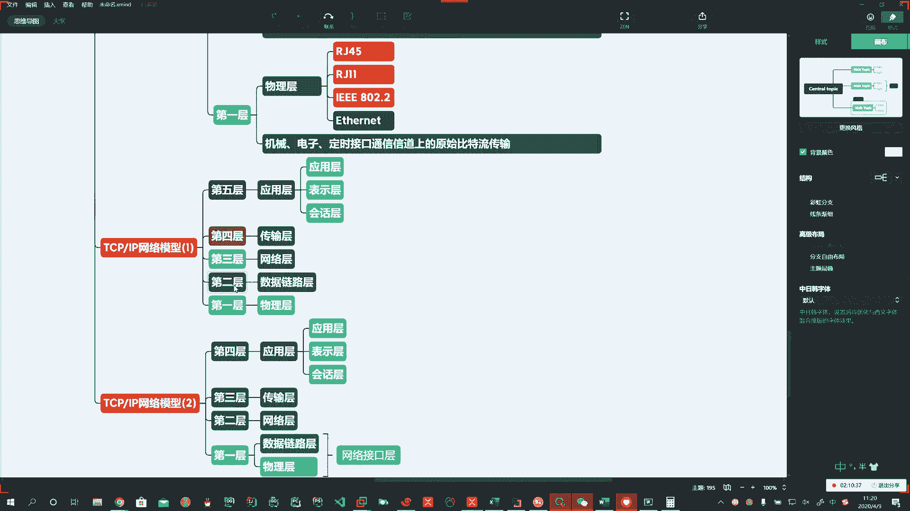

。好，那我们就通过啊这两种说法，咱都给他介绍了啊。那如果呢到了这单位里头，人家要说哎呀这个TCP是四层网络模型。那你马上对应的我说的这底下这种人家要说五层模型的那你就对应的我说上边这一种啊。

你不要跟人家白话，你说你个傻狍子四五层，你搞不明白，这叫法没有定啊，咱两种都说了。那关于网络模型这一块啊，TCPIP的OSI的咱就都说了。

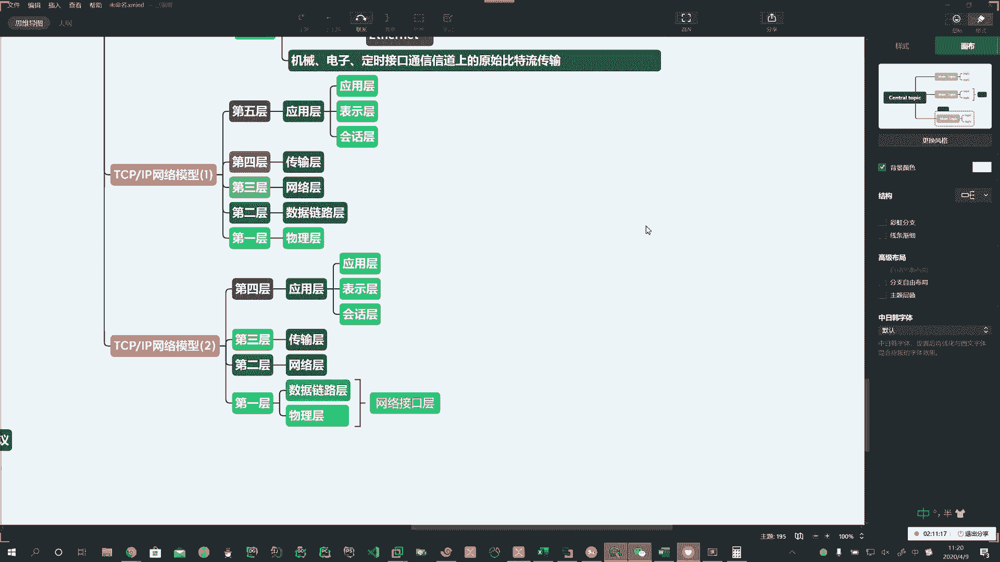