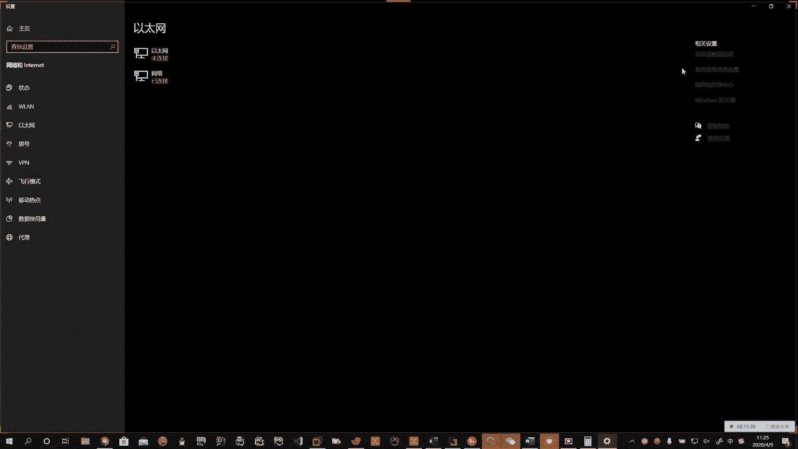
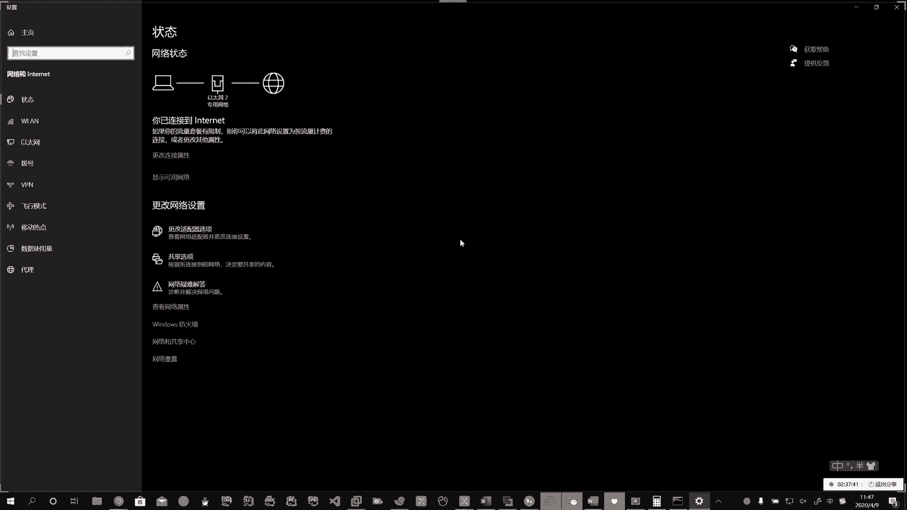

# 花了2万多买的Java架构师课程全套，现在分享给大家，从软件安装到底层源码（马士兵教育MCA架构师VIP教程） - P148：【Linux】网关介绍 - 马士兵_马小雨 - BV1zh411H79h

网络模型中啊它体现出来的重要的信息，那就是网络协议。啊，那我们得说的说的网络协议。那么咱们最常见的网络协议。首先第一个啊，最重要的咱就得先学IP协议。Okay。IP协议干一件啥事儿？

他给咱们提供IP地址的，如果咱们不说IP协议，咱就没法往后讲IP地址。啊，所以通过IP协议，我们的目的就是咱要学IP地址了啊，那么在这上边右键点。

啊，右键点windows现在弄的怎么？

点详细信息的时候，你就能查看你本机啊。

的IP地址。啊。

那么有IPV4版本的和IPV62个版本的。

Okay。哈。那还有一种方式呢，如果在linux下啊，我们可以通过。IPA。的方式啊来获取IP地址。如果在snoOS6的系统下，可以通过IFconfi。啊，一样能获取到IP地址。在森到OS7上。

可以通过IPA的方式获得IP地址。啊。那么如果你在centOS7上，你输入if configure啊，没有或提示command not found怎么办呢？你需要ymin store杠外啊。

n tools。就是我们在安装虚拟机的时候，你有一些安装包没有选齐。啊。通过yminstore杠外net tools可以啊去安装。

Clock。好，那么这个IP协议啊，它重点的体现就是IP地址。啊，IP地址。啊。那么IP地址。Yeah。就是。IP协议提供的。啊，一种统一的。地址格式。啊。统一的地址格式，那他是干啥的呀？

IP协议是干啥的呀？他就是给咱们互联网上每一个网络中的每一台主机分配一个逻辑地址。啊，分配。一个逻辑地址。啊。所以IP地址也叫逻辑地址。Oh。哎，IP地址也叫逻辑地址。所以我们在讲交换机原理的时候。

我们就多次的我给大家提到了啊物理地址和逻辑地址。那个词候就是为了咱们现在讲这儿打着埋伏。2。哎，那么这个逻辑地址。啊，干什么呢？说乙。😮，用来屏蔽。物理地址。啊。屏蔽物理地址的差异。

这里头我们知道物理地址就是麦克地址。啊。每一个机器。都有一个编码，不带重复的。啊。那么正是因为大家都不重复，那么我们如果。啊，如果用那12个是吧，十六进日的字符表示我们的可读性很差。

所以我弄了一种大家都能够读得懂的一种方式。아。加强。可读性。就干这个的啊，那12位的那东西记起来比较麻烦。啊。Okay。对吧如果让你记1个IP地址，192168啊，0。1，你马上就记住了。

我让你记这个数，好家伙，你背5分钟可能你记不住啊，所以咱们出这些东西就是为了加强这些的可读性。这样的话。啊。不好记。啊。哎呀，有的同学好家伙要没学过英文，这字母还不认识，是不是啊哎，可读性差。好。

我就是为了屏蔽这个差异，我弄了一个可读性比较好的。啊，比如192点168。点0。1，哎，记住了。哎，那你就记住了，是不是啊哎，非常好记的一个东西。好，那么这个IP地址啊，它还有啥呢？啊，那么是32位。

啊，32位。二进制数据。啊，32位来表示。啊。分为四段。每一段那就是8位。啊，8位。如果是8位的话，它最大值是多少啊？啊，是256。啊，256。那么就是用0到255来表示。还是取值范围哈。Oh。哎。

通常。是以。十进制的方式。表示。所以你看这个数啊，192168是吧，哎，192。168。0。一啊这些数都是数字啊十进制数。中间用点格开。每一组。中间用点儿。啊。符号隔开。一个地址。

就表示网络中的一个主机。主机设备。啊。这里头的主机设备可以是。路由器。可以是。PC可以是服务器。可以是手机。啊。可以是摄像头。可以是智能门锁。啊，可以是电视。等等等等。那么凡是基于。

TCPIP协议的智能设备。都可以。被分配。IP地址。啊。啊。手机。啊，对吧能上网的，还有什么智能手表等等等等啊。那么这个东西都加一块儿，它叫做什么？这个东西就叫做IOT。啊，叫物联网。

就是所有这些玩意儿都能上网了，这东西就叫物联网。好。Yeah。好。Okay。好啊，这个就是咱们给大家介绍的啊。那么如果在一个局域网中。啊，在。同一个局域网中。啊。也就是说，本地啊本地局域网。IP地址。

是唯一的。啊。啥意思？就是咱们在一个网络的时候，在一个网段的时候，1个IP地址只能分配给一个主机。啊，你们俩不能都用一个。对吧比如说192。168点点0。1。啊，100。他不能同时分配给一个手机。啊。

再给一个ipad。这种方式是不对的啊，如果你手动去给的话，那这时候就冲突了。Oh。啊。就会有其中一个上不了网。所以一台主机就是一个啊192。168。0。100啊，那这时候我们就给的是亮的iphone。

11。pro肉 max。啊，然后下一个你再给。192点168点0点101。你给。亮ang的。IPad。Pl。啊。就是他们的这些设备啊要有所区分。一人就是一个，咱别重复，你干你的，我干我的啊。

不要重复重复就上不了网。好，这就是咱们说的啊，IP地址啊IP地址。那么这个IP协议啊IP协议。咱也说一嘴。啊。那么就是什么呢？反过来理解它就是网络之间互联。啊，网络之间互联的协议。啊，咱俩连接在一块儿。

啊。你看那个这个这个这个咱们呃开这个奥运会的时候，那个刘欢唱那个我和你啊，那说的就是咱的网络啊，我和你心连心嘛，说的就是IP协议啊，同度济球村嘛，我们在同一个网络里。啊。

对吧所以呢这个IP协议呀说的就是啊网络之间的互联协议。啊，他是咱们所有的互联网。啊，互联网。包括物联网。Yeah。包括物联网。的。😊，所有计算机网络。实现。相互通信的一套规则。啊。

说不光是你这些服务器啊，不光是这些。IOT那些智能硬件也都要遵循这套规则。啊。那么它规定了什么呢？那你规则你就得有规定啊。他规定了计算机在。啊，网络中。进行。通信是。应当。遵守的规则。哎，简单的说。

任何的这些啊IOT的设备，计算机服务器，只要遵守了IP协议，就可以与因特网互通互联。啊。所有设备。只要是。遵守IP协议。啊，就可以。在网络中。互联。互通。Yeah。你看看是不是这样的。

你现在手机如果连上你的摄像头，是不是哎，可以啊，手机能联网，摄像头也能能联网。啊。好啊，那么我们简单的呢就给大家介绍了一下这个IP协议啊。那么IP协议里头我们刚才说了。啊。

那么有IP协议来给他分配IP地址。哎，IP地址。有了IP地址完了以后呢，我们就可以进行相互的通信。啊，通信。好，然后我们还有几个概念啊，说光有IP不好使。啊，那么还有一个概念呢，叫做什么呢？叫做网关。

网关其实就是路由器。啊，路由器就是网关。Oh。啊，网关就是路由器，路由器就是网关。啊，尤其是在windows下。windows下默认就叫网关。啊。网关就是路由。陆游就是网关啊。不要蒙。那么他是干啥的啊。

所谓的网关其实啊就是一个网络。啊。通向。网络通向其他。啊，网络的。IP地址。啊。嗯。啊，所以我们比如说。咱们从一个地方到另外一个地方，从一个国家到另外一个国家。这个啊你在出国的时候是吧？哎。

我们一般的都称之为什么呀通关。啊，你从一个地儿到另外一个地儿。那么网络里头我们好比是啥呢？说你从A网络。啊，进入到B网络。哎，A网络进入到B网。啊，那么网络A的IP地址范围。

对吧有一个网络B的地址范围有一个。啊，那么如果从A到B。对不对？是不是我们就完成了？网络的通信。是不是哎，从一个网络数据到另外一个网络的数据啊，所以A如果是一个路由器的话，那它就代表了一段网络。

B是一个路由器，哎，它就代表B的一段网络。那么A就是A网络。到网关。B就是B网络的网关。啊。那么网关的IP地址一般是有特色的啊，你比如说192点168。0。1，哎，可以是一个网关地址，底下这个是172。

16。0。1OK那么上边是A网络的地址，B，下边是B网络的地址啊。他们两个。他们两个。啊。表示不同的网络。Okay。那么除此以外，我们在企业上啊在企业工作的时候，我们实际上还有另外一种表示方式。

那么我还可以用192点168点0。254。Yeah。下边还可以用172点16点0。254。啊，所以网关的特点在这个IP地址里头，我们通常可以掐头去尾。Okay。啊，掐头去尾。要么就是尾巴这占一个。

要么就头上占一个啊。所以如果你到了一个公司以后啊，你输入你要想看一个网关是吧？输入点0。1不好使的时候，那你就输点254。那么怎么判断我在哪个网关里头呢？那还是比如windows吧啊。

你看你这个网卡，你状态，你查看点详细信息，这里头就会有一个默认的网关。啊，这里的写的是192168点1点1，这就是你路由器的地址。啊，路由器的地址。所以说默认网关就是路由器的地址啊。

