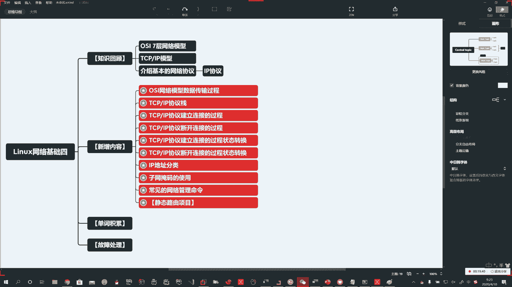
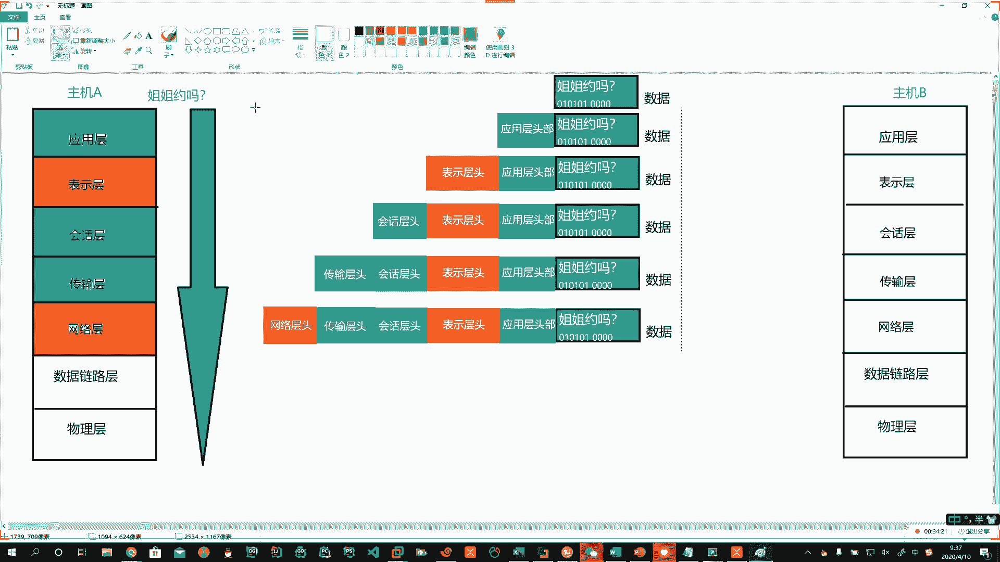
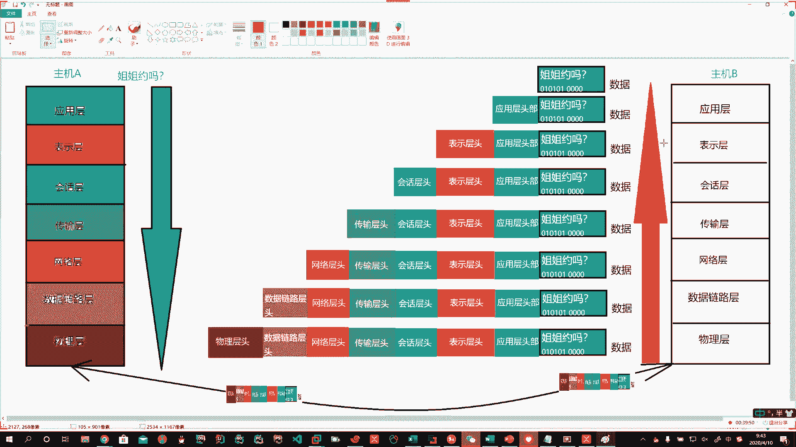

# 花了2万多买的Java架构师课程全套，现在分享给大家，从软件安装到底层源码（马士兵教育MCA架构师VIP教程） - P149：【Linux】OSI7层网络模型数据传输的过程 - 马士兵_马小雨 - BV1zh411H79h

好，OSI网络模型数据传输过程啊，说我们这数据啊从这儿传到那儿它是怎么一个过程。这个你必须要知道啊，为什么我们要介绍这样的模型，它实际上跟我们数据在网络中啊，在传输确实是有关系的啊。好，那我们画个图啊。

帮着大家呢一块来理解一下。

。Yeah。啊，一块来理解一下啊。那么。大家呢跟我一块儿啊大家跟我一块儿嗯，在这个我们的嗯群里头吧啊在我们的QQ群里头，大家呢可以把这个7层的模型啊来说一说我就不点名了啊。用哥吧。勇哥勇哥。

永哥家停电了是吗？啊，勇哥家停电了，看谁呀，换一个。啊，靖哥郭靖在吗？Oh。好啊，回答正确。那么在这里头啊那么我们自下而上的啊这7层。那么最底下呢是什么呢？就是想我们的网口，我们的网卡。

所以在物理层啊物理层。Okay。在它上边呢是什么呢？就是我们的麦克地址啊，就是要建立数据链路。啊，所以是数据链路层。啊。然后呢，再往上呢，哎就是第三层，你就想啊，谁在这儿工作呀。

路由器在这工作路由器的工作原理是啥呀？那不就是IP协议吗？IP协议呢就是网络层。嗯。哎，这就是第三层。啊。第四层呢对吧？那你有网络了，上边呢哎数据传输，所以叫传输层。啊。那你靠啥传输的呀？

那你靠ITCPIP协议啊这些东西进行传输的。那再往上呢，那就是哎绘画层啊。再往上呢，那就是表示层。啊。再往上呢就是应用层。好，我把他们大概的捋一下啊，大概捋一。好啊，分层吧。Okay。Yeah。好。好。

首先第一个啊，通过这个例子，我们说什么啊。通过这个例子，如果我们两台主机相同的应用啊在进行数据传输的时候，它每一层都是对等的啊。

物理层对物理层数据链路对数据链路网络对网络传输对传输绘画对绘画表示对表示应用对应用，它每一层都是对应的。那么我们如果从一个机器向另外一个机器发送数据的过程中，那么它到底是怎么样的一个过程呢。啊。

我们一块儿来看一下啊。它的底层原理就是自上而下。好。自上而下。啊，我一层一层的进行处理。啊，这就是主机A。这就是主机B。说我A想跟B发一个数据啊，他发了一个啥呢？姐姐约吗？啊。哎，那你要想传送给别人。

实际上我们看到的是人家微信上嘣弹出一条信息，但是底层的原理它可不是这样的。啊，他是这样干的。啊，比如说我们用一个。哎，用一个方块，我们表示这个数据。啊，我们表示这一条数据。大家都知道啊，那你这个应用层。

那么这时候他是不是哎就得把这条数据先放在我们这里头，是吧？啊，当然这条信息会被处理成二进制数据啊。But。好，那这一条啊，它就是一条数据。Okay。Yes。Yeah。好，他在应用层啊。他在应用层，那么。

开始啊一层一层的进行传输。那么这条数据我往上画一点啊，往上往上画一点。他到了应用层以后啊，那他做了一个什么样的处理呢？说这条数据往下走。到了应用层，咱们对应的在应用层。啊，然后在应用层的话。

那么他就给他加了一个豹文。啊，加了一个应用头的报文。Go。干不。应用。层的头部。啊，头部。Yeah。Oh。好，这个过程就是一个封包的过程啊，说我们一个小姐姐约吗？这条数据哎。

从OSI7层网络模型往下走到应用层的时候。啊，到应用层的时候，这时候就先加一个应用的头部啊，头部，然后再往下走。再往下走。啊。到表示层了。Oh。到表示层了呢，这时候啊他再给他这条数据，咱们再往下走啊。

Yeah。好，到了你表示层以后，这儿又加了一个表示层的头。Okay。对吧哎这儿又有啊，那他继续又往下走了，那又往下走了呢？😊，这回呀都到绘画层了啊，那么绘画层这儿，他继续把这条数据。处理。Yeah。

Good。好，那这个就是啥呢？哎，这个就是绘画图啊。它每下一层哎就多加一个啊头部信息，就是这就是封班啊，往下走。好，到传输层了。哎，再来一个传书层的。投信息。Yeah。Okay。Oh。Oh。好。

继续往下走啊继续往下走。就到了我们的网络层了。Okay。Okay。网络层呢，那他还是啊说你。下来。加一个网络的啊网络的头。Good。Yeah。Okay。

。好，那网络子走完了啊，接着再往下。😊，一层一层的啊添加这个封包。Yeah。Okay。数据链路。从。头。啊。最后到你这个物理层。Okay。Oh。Oh。Oh。は。好啊，这条数据你看从你发出去到下边啊。

它一层一层的加缝包，多一层多一层多一层多一层多一层啊。最终这一条数据。通过你的网卡。啊，通过你的网卡，然后实现了。啊，你这个数字信号。像电信号这样的一个转变。然后顺着网络。Oh。Oh。好。顺着网络啊。

把这个信息发出去了。当然啊这里头是双向的，你能发，你也能收。这就是传输介质。啊。然后。这条信息通过这样的一个封包啊，通过网络把数据传走了。Yeah。Oh。哎，然后呢发到哪儿了呢？发到姐姐的。电脑上了啊。

或者他的手机上。那么。人家收到这条消息以后啊，人家收到这条消息以后，会拿。咱们这条数据啊拆开来看，那么正好它在拆包的时候是一个反过程，他先拆物理层的头啊，到这儿了，对应的物理层，他把物理层的头拆掉。

然后再往上走数据链路层，他把数据链路层的头拆掉，到网络层了，他把网络层的头拆掉，到传输层了，他把传输层的头拆掉，到绘画层了，他把绘画层的头拆掉，到表示层了，把表示层的头拆掉，到应用层把应用层的拆掉。

最终啊最终。用户呈现的就是这条数据。所以这一条数据从这儿到这儿啊，两台主机之间的传输。这边走啊。这是一个封班的过程。他收到信息解班的一个过程啊，这就是基层网络模型中数据传输的这样的一个过程。

