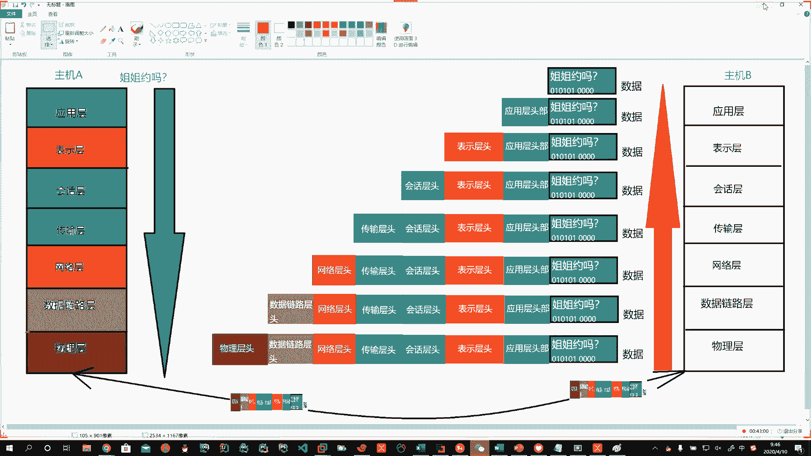
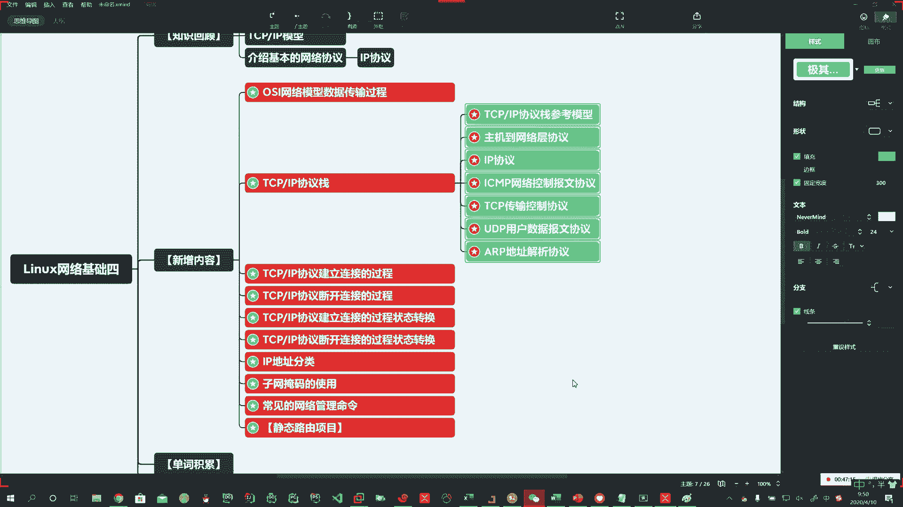

# 花了2万多买的Java架构师课程全套，现在分享给大家，从软件安装到底层源码（马士兵教育MCA架构师VIP教程） - P150：【Linux】TCP_IP模型和协议栈介绍 - 马士兵_马小雨 - BV1zh411H79h

好啊，第一个啊OSI数据的传输模型，数据传输过程咱们给大家画明白了。

第二个TCPIP的协议站啊，说我们做编程也好，我们做这个学习也好。那么对于这一块啊，我们给大家介绍了TCPIP的模型啊，所以它的协议站里头，首先我们介绍了。TCPIP模型。对吧在这儿呢啊。

昨天已经介绍过了，不管人家说四种还是说五种，说多少种，那您都知道啊，所以这个模型很重要。好，这是第一个啊。第二个TCPIP。啊，那么都用到了哪些协议呢？啊，所以这个协议站里头都包括什么呢？主机到网络。

啊，到网络层。协议。比如说昨天我们介绍了IP协议。啊，也叫internet协议。那么IP啊就是internet protocol啊，internet就是网络part就是协议的意思啊，所以说是IP协议啊。

那么以及什么呢？我们的。Okay。我们的。呃，ICMP。叫网络控制。豹文协议。啊。好。还有哪些呢？除了ICMP以外，那么就是我们今天的重头戏。TCP协议。TCP协议。TCP协议呢叫做传输控制协议。啊。

传输控制协议。那么还有UDP协议。啊，UDP协议叫做用户数据报文协议。好，以及在这个协议促中啊，非常有意思的一个内容，就叫做ARP协议。ARP协议叫地址。解析协议。Oh。那么如果将来不搞邪恶的同学啊。

那你了解即可了。搞邪恶的同学呢，将来呢可以往深层次的去研究它啊，比如说ARP啊，这就是非常有意思的事儿。对吧哎，想让谁没网，谁就没网啊，让谁能上网，谁就能上网。好。还会在我们实际的这个网络中啊。

会遇到一些这个问题啊，比如说ARP攻击了啊。这种怎么办？好。好，这个是我们所介绍的TCPIP的协议站。哦。那么我们在这里头呢，我们就要给大家啊详细的展开来说一下。

