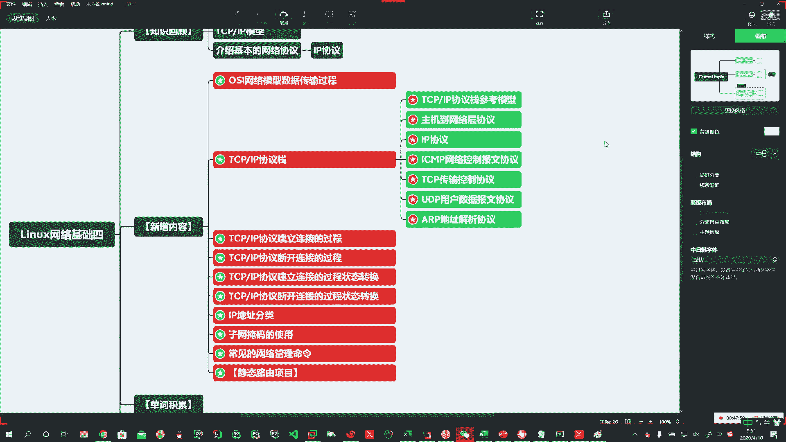
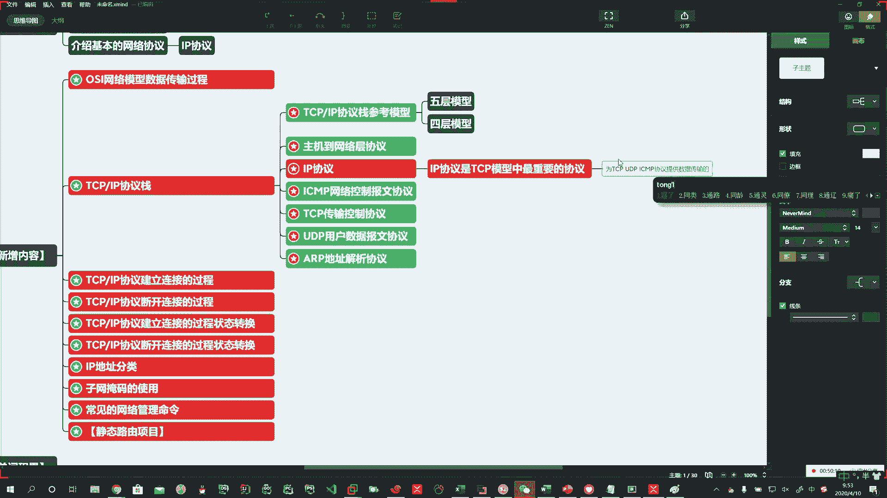
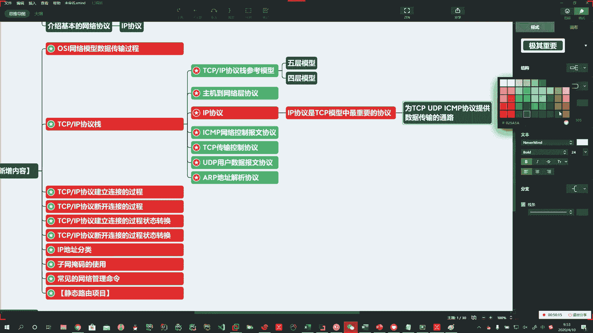
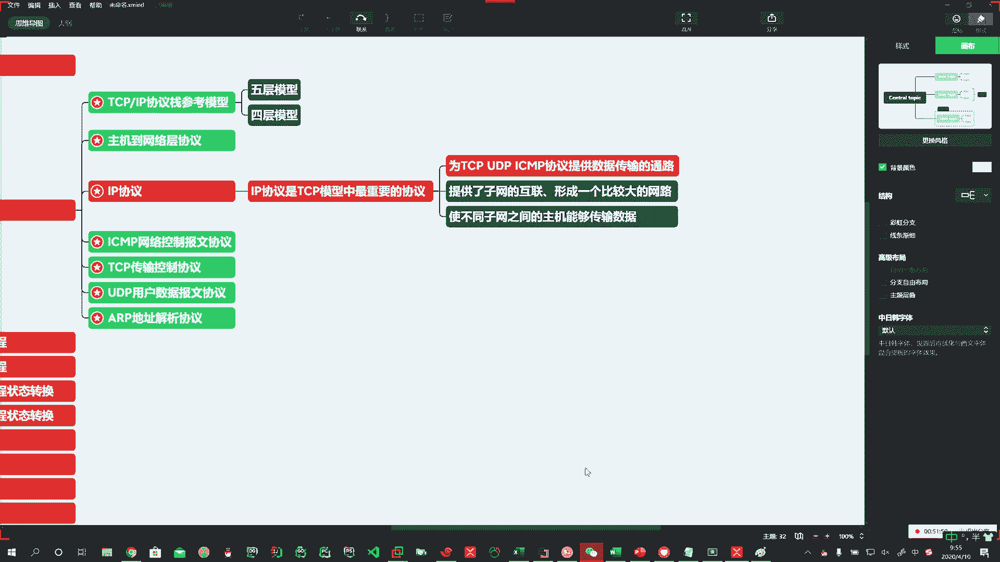
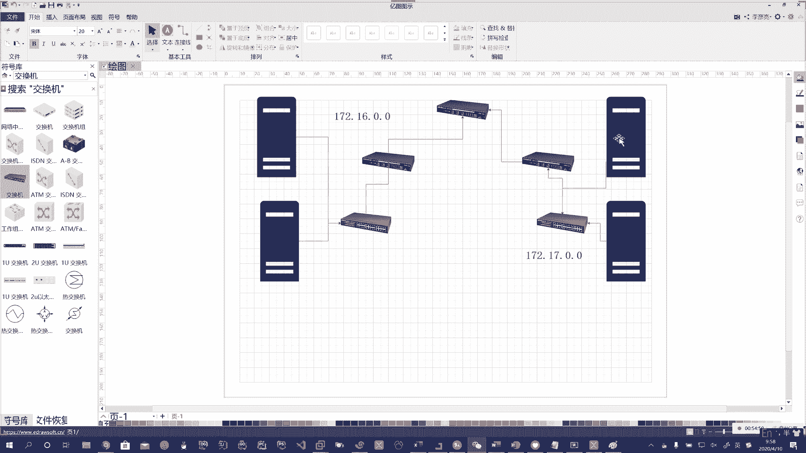
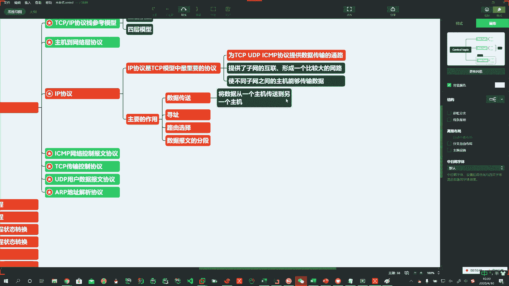
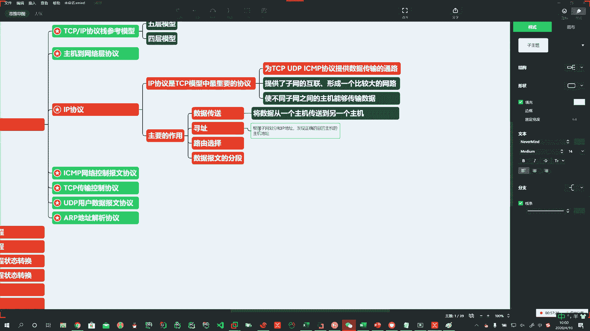
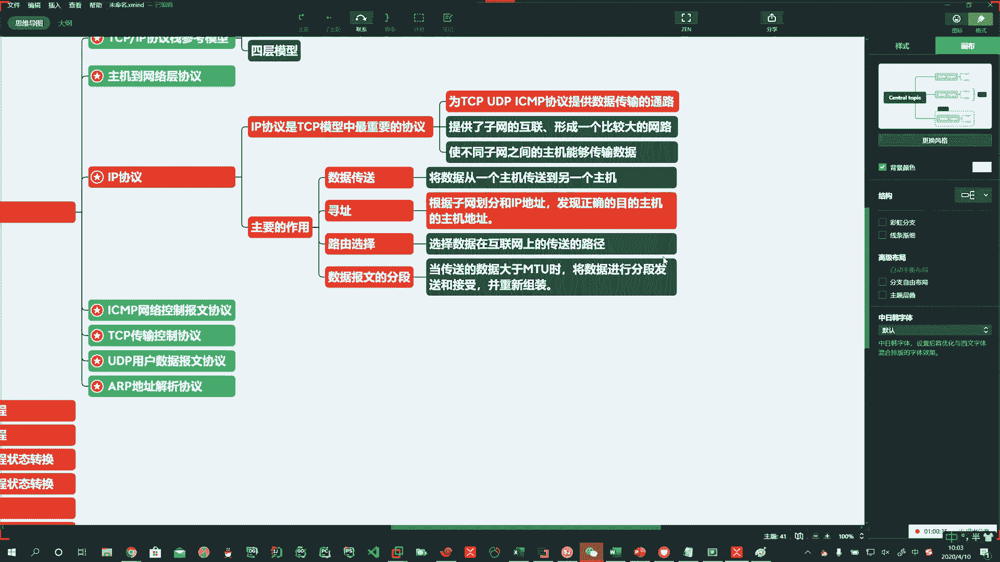

# 花了2万多买的Java架构师课程全套，现在分享给大家，从软件安装到底层源码（马士兵教育MCA架构师VIP教程） - P151：【Linux】IP协议介绍 - 马士兵_马小雨 - BV1zh411H79h

Yeah。Yeah。嗯嗯嗯。

Okay。好，首先呢我们介绍一下。嗯。模型已经介绍完了。啊，在这里头呢你要注意啊，不管说是TCIP的5层模型。还是说是四层模型。现在在国际上有不同的叫法啊，他们正打架呢，哎，你别管啊，四层也好。

五层也好，那么我们都能够使用，也都能认识他就挺好啊，让他们打去啊，你别掺和。好，这个就是四层和五层的模型，咱要把它搞明白啊。那么然后呢，在这个协议站里头呢，刚才我们说了，我们介绍了哎不同的。协议啊。

那这里头谁重要呢？啊，IP协议是非常重要的。啊，IP协议。Yeah。好，那么这我说一下啊，主机到网络协议啊。不用掌握IP协议重要。Oh。昨天已经给大家介绍了，所以这儿呢我就不再介绍概念了啊。

IP协议是TCP。模型中。最重要。啊，最重要的协议。Oh。把这句话记住啊，最重要。没他不行。2。他为什么呢？他为咱们的PCPUDPICMPAARP啊。喂我们下边的TCPUDPICMP。协议提供了。啊。

数据传输的通路。

啊。

没有他是不行的啊。所以这个呢我们就一块得了解一下啊，我们就需要得一块了解一下，说呢它IP协议啊，它主要是在哪儿呢？啊，它在哪一层去玩呢？刚才我们说了啊，他肯定是在网络层去玩。啊。

那么它主要的作用就是提供了。子网的互联。啊。形成。那你大家子网你都能连在一块了，那就形成了一个。比较大的网络。啊。那么形成比较大的网络了，那能就能够什么呢？是不同子网之间啊的主机能够传输数据。Oh。

Oh。好。

。这话啥意思啊，这话啥意思？哎，你这边有主机，这边有主机。哦。Yes。Okay。对吧你这边就构成了两个网络啊。左边是一个子网，右边是一个子网。对吧啊，他这边的子网也这子网IP地址段可以是这样的。

比如172点16点0。0。啊，点0。0。好，比如说我来个杠24。啊，别216吧。Yeah。先不带啊先不带。一会儿我们讲这个掩码的时候再带啊。否则容易乱。好，这边是一个网。啊。这边是一个网。好。

这是一网段这是一网段啊，那么通过IP啊，然后他们都在主路由上啊，那这边的主机就可以和这边的主机进行通讯。

啊，是这样的一个意思。嗯。学。那么IP层主要啊有什么作用呢？我们可以往下去说一说啊。主要的作用。好。Oh。主要作用第一个。数据传送。哦。第二个。寻址。第三个路由选择。哦。第四个那就是数据报文。啊。

的分段。四个弓四个作用。Oh。Oh。啊，四个作用。那么数据传送。简单的说啊，就是从一个主机传送到另外一个主机。哎，一个主机到另外一个主机。啊。荀址。Oh。

，Okayello。Yeah。啊，荀址啥是荀址啊？根据子网划分。和IP地址。啊，也就是说子管延嘛啊。发现正确的。墓地主机。的主机地址。这个过程就叫做寻址。

啊。他是怎么来的？他有他算法。啊，他有套算法，回头呢我们可以给大家说的说的啊。🤧路由选择是什么？路由选择就是选择数据在互联网上的传送路径。啊，传送的路径。就指道的啊，说你怎么走。啊。村中头老王家啊。

对不对？哎，那王寡妇啊，那他们家怎么走啊，这村里的人都知道啊，那一直哎从这儿走近啊，从这儿走到后门爬窗户近也可以啊，那他们都熟。所以就是选选择数据在互联网上的传送的路径啊路径。Yeah。

数据报文的分段啊是告搞什么事儿的呢？当这个传送的数据啊，比如说我们里头会有一个叫MTU的值啊，这个东西呢你一般的。呃，你不搞底层的话呢，也也没什么用啊。但是你如果去搞了啊可能呢十年8年以后。

没准你可能会涉猎这个行业啊，因为你再练十年对吧？你也可以啊，你也可以。所以说呢当你传送的数据大一个固定值时啊，就可以将数据进行分段发送啊和接收，然后呢，再重新组装一下。当。数据啊传送的。数据。

大于MTU值。Oh。该以下课了是吧？诶。将。数据。进行分段发送和接收啊。并。😡，重新组装。这个MTU值呢啊是多少呢？回头呢我们给大家呀啊我看我找一台企业机路由啊，我家里有。我登一台啊。看一下MTU值。

嗯，改得切换一下网络。嗯，行，那我们先下课休息啊，然后回头我切换一下网络。然后因为我一切网可能。你这边就得断啊。呃，这些不做掌握啊这些不做掌握，主要掌握荀址。其他了解。

