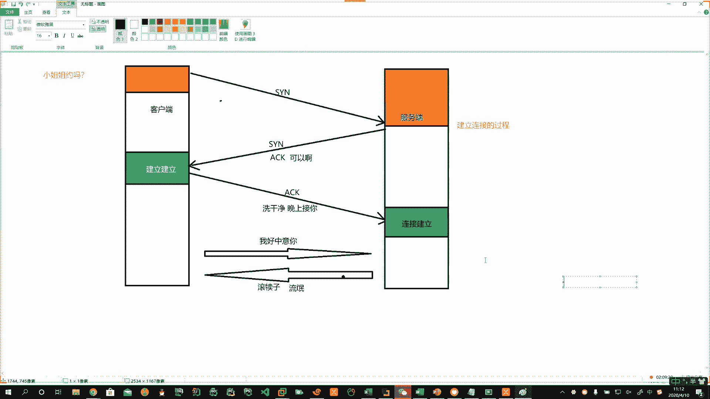
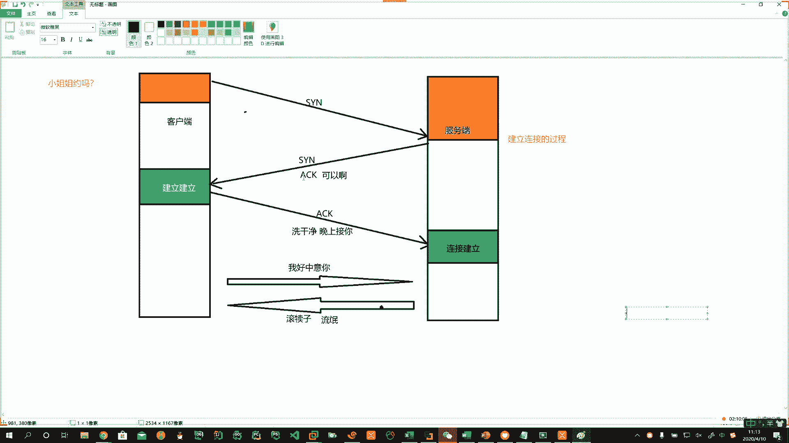
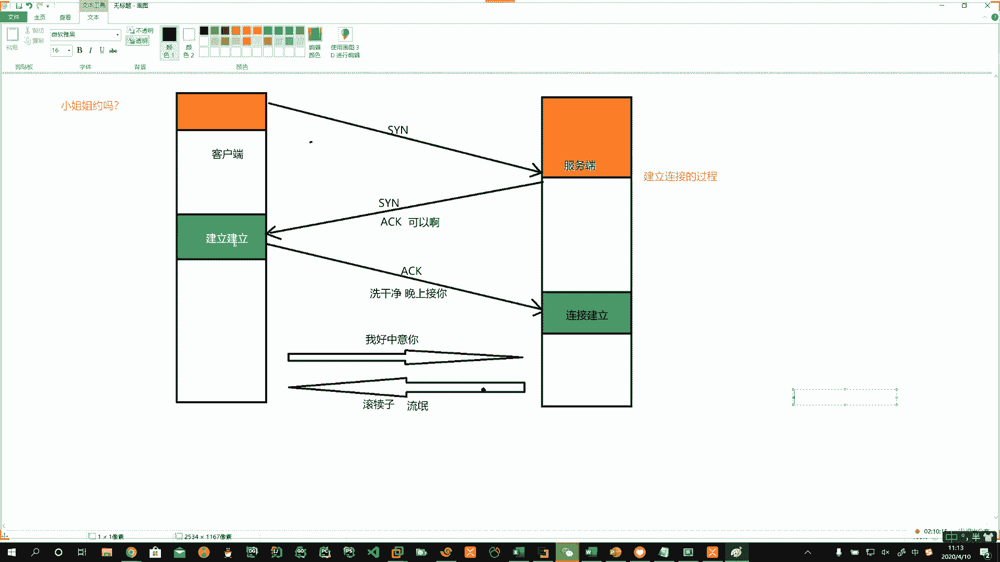
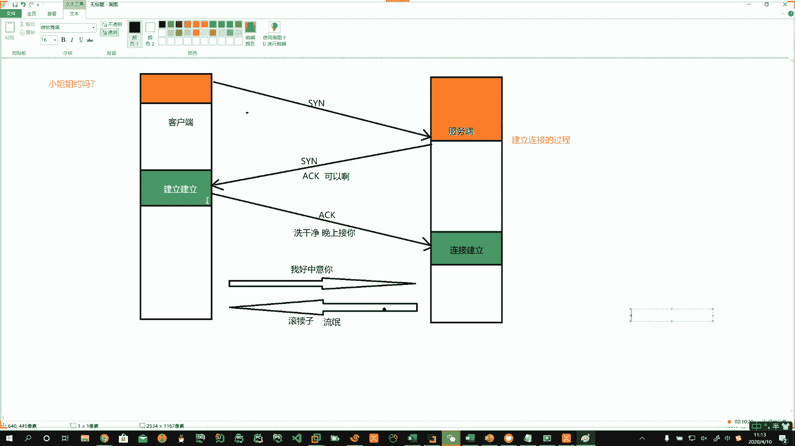
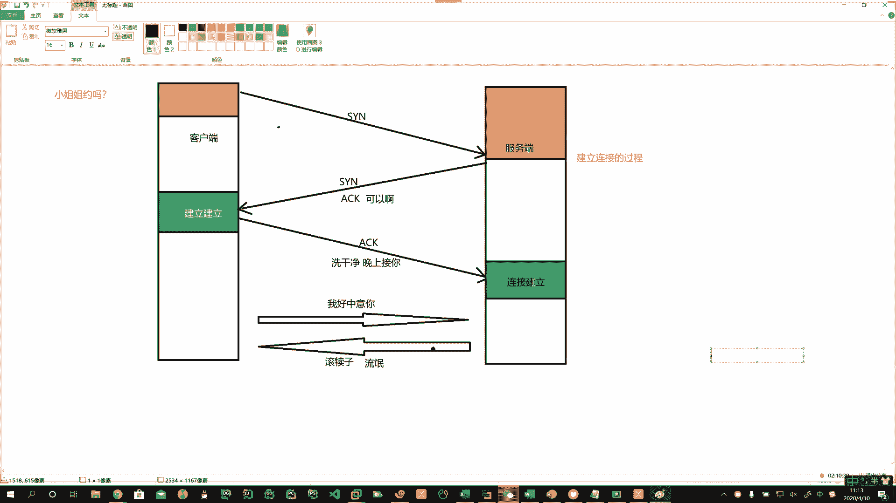
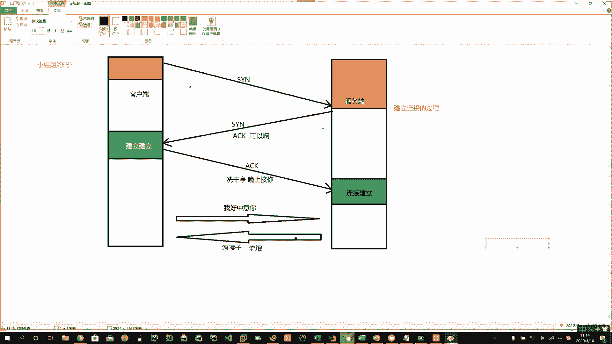

# 花了2万多买的Java架构师课程全套，现在分享给大家，从软件安装到底层源码（马士兵教育MCA架构师VIP教程） - P153：【Linux】TCP建立连接的过程 - 马士兵_马小雨 - BV1zh411H79h

🤧好啊，TCP3次握手的过程啊，客户端先发送SYN码SYN这个码就表示建立连接啊。

客户端先发起。给服务器端，这是第一次握手。当服务器收到你SYN请求以后，需要应答。我们说了单波，有来源有去语，这就叫来源，这就叫去语。说服务器端给你1个SYN说我确认连接。然后再给你发1个ACK码。

ACK码是确认。所以这儿发了1个SYN和ACK是两个字段。

啊，两个字段。那么当客户端收到SYN和ACK的时候，他就在这儿等待了，就已经建立连接了。

那么客户端再给服务器端发送1个ACK码。这时候服务器端啊也说了，那我就不约别人了，他也就建立了链接。

然后在你这个通道建立以后啊，我们说面向连接的对不对？通道建立以后啊，然后相互之间进行数据的传输啊，数据的传输。

