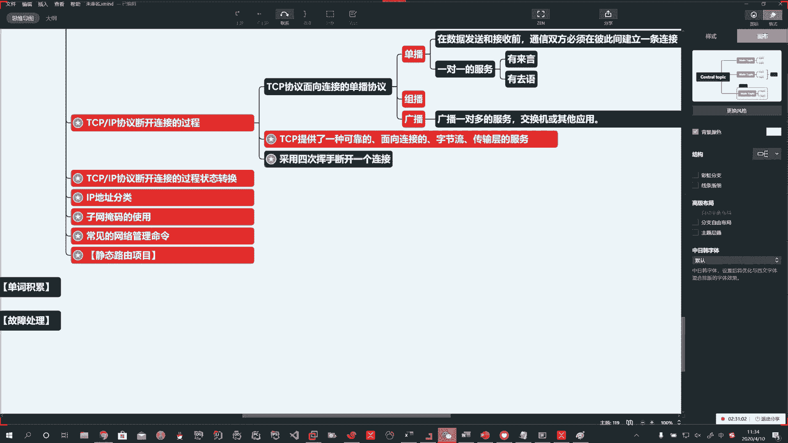
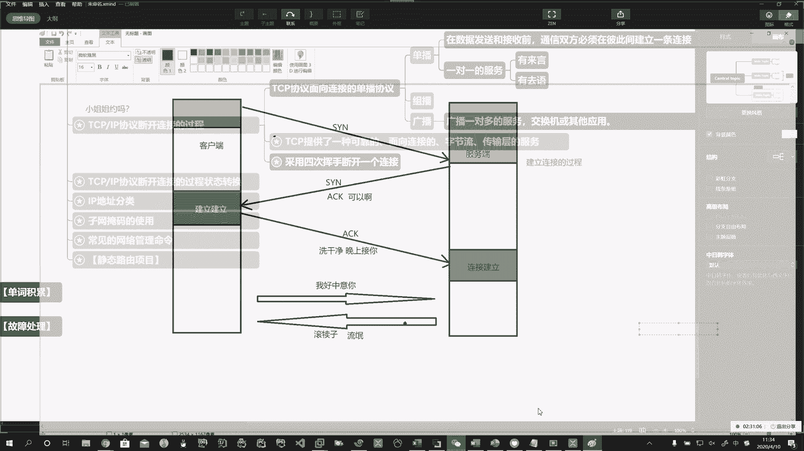
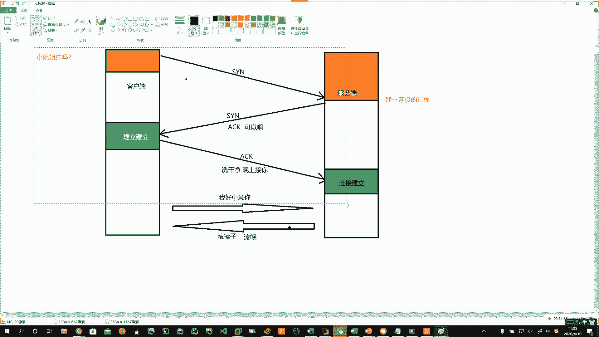
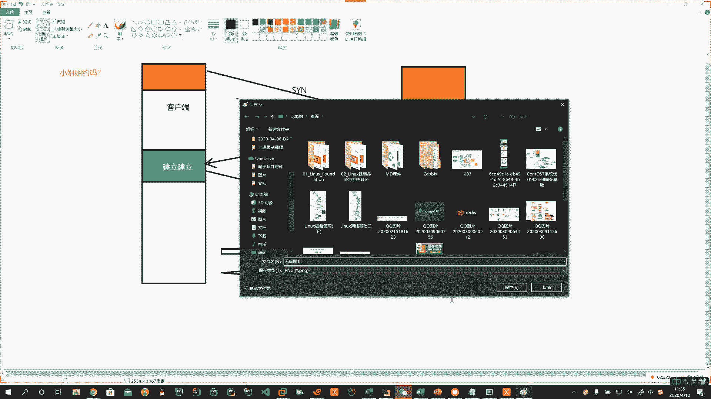
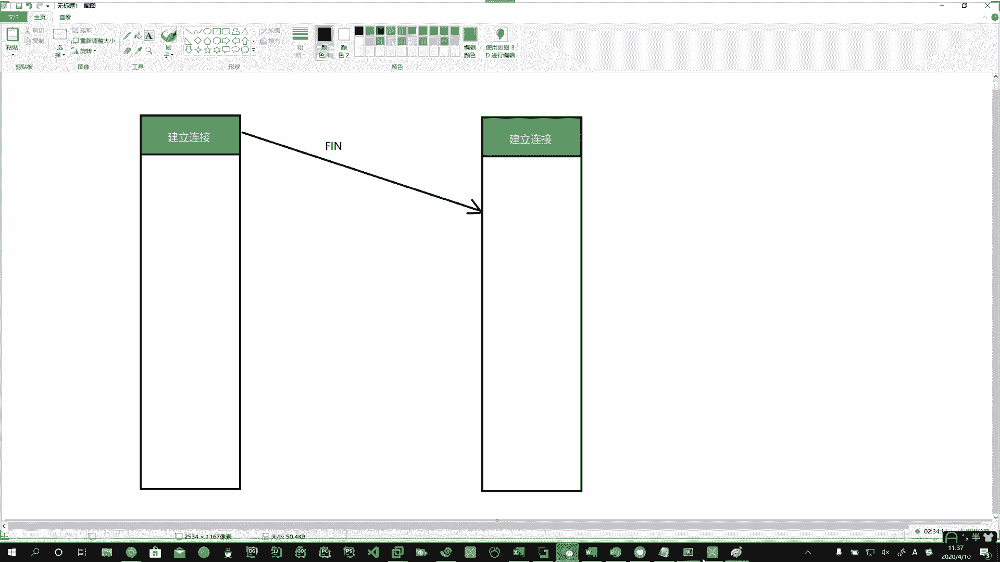
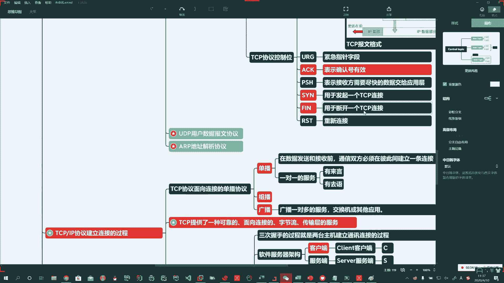
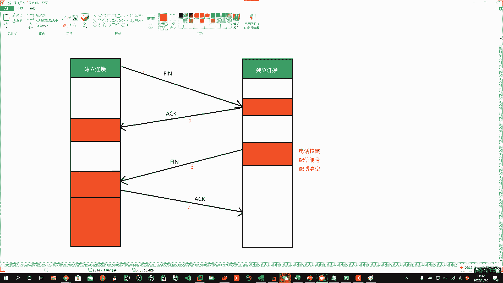

# 花了2万多买的Java架构师课程全套，现在分享给大家，从软件安装到底层源码（马士兵教育MCA架构师VIP教程） - P156：【Linux】TCP断开连接4次挥手 - 马士兵_马小雨 - BV1zh411H79h

嗯。断开链接的一个过程啊，那么首先啊。你们得建立连接的基础上啊建立连接的基础上。那你没有建立连接，那你咋就断开了呢？

啊，好，我们看看啊怎么断的。

。哎，在这个基础上啊在这个基础上。吃饭了也。看电影了啊，然后回来以后。这个是吧。你觉得这妹子不行？啊。对，就是妹子一说，哎呀，我前面谈个谈过10个男朋友啊，都没成。对吧那你这玩意儿你不急了吗？

那还得了啊，这10个都没教导出来，那到你这，你不也得翻车吗？是不是？哎，所以呢在你建立连接的这个基础上，你就说再见吧啊，对不起，再见。

好，那咱们看怎么跟姐姐再见啊，那你也不能是吧？说的太直白呀，那玩意儿一会儿人家急了，打你一顿怎么办，是不是啊？🤧嗯。诶。那这时候呢，那我们首先得有一个渣男的心态啊。这儿刚最上边啊。

我们刚才已经就绪了an，对吧？所以呢刚才这是建立连接了。你断开是你已经在建立连接的基础上啊，说您俩这儿都已经建立连接了。操懒得打了。嗯。啊。不嗯。好，那这时候呢。啊，我建立连接以后。我现在这个渣男啊。

要分手。渣男提温柔。啊。呃，不行，这玩意儿太吓人了啊，他发了1个FIN了。刚才咱们是不是介绍了呀啊。

FIN断开1个TCP链接，哎，提分手了。

嗯。那这时候咱的这个。服务器端啊就收到了。人家小姐姐其实还挺中意你的啊。但是呢没想到你是这样的人。啊。那人家也不含糊啊，是不是啊人家就骂了一句渣男啊。好。发了1个ACK。哦。发了1个ACK。

这是第一次第二次。啊。Okay。好。嗯。所以呢这边就收到了一个信息。啊，小姐说同意。啊，赶紧给我滚。对不对？Oh。好，然后呢小姐姐就把一看说你是这样的人啊，你是渣男。小姐姐就把微信给你拉黑了。

手机号也删了。啊，全拉黑。Okay。嗯嗯。人家就把你。拉黑了，再见了，goby了啊， sayaygo了。Okay。就断开了哈。电话拉黑。微信。32。啊。微薄清空。哎。对吧一次、两次、三次。嗯。好。

还差最后一步啊，那你这儿还对吧？你虽然是个渣男，但是你这不也得是不是？哎呀这个哀悼一下，是不是？Yeah。啊。这儿他还没有断呢，这还留着姐姐照片呢啊这个。哎呀，这还后悔呢，那那也没办法了呀。

人家都给你拉黑了。他最终一看，哎，既然你这么狠。哎，他再给姐姐说一下。好，这时候就发现啊，你已经不是对方好友了啊，已经不是对方好友了。那么最终。ACK分就分吧啊，就是这么一回事啊。

那这时候人家已经被拉黑了。啊，你这边。诶。也就可以。关闭了啊，这就是四次挥手的这么一个过程啊，这儿你。2。三。4。Oh。好。

