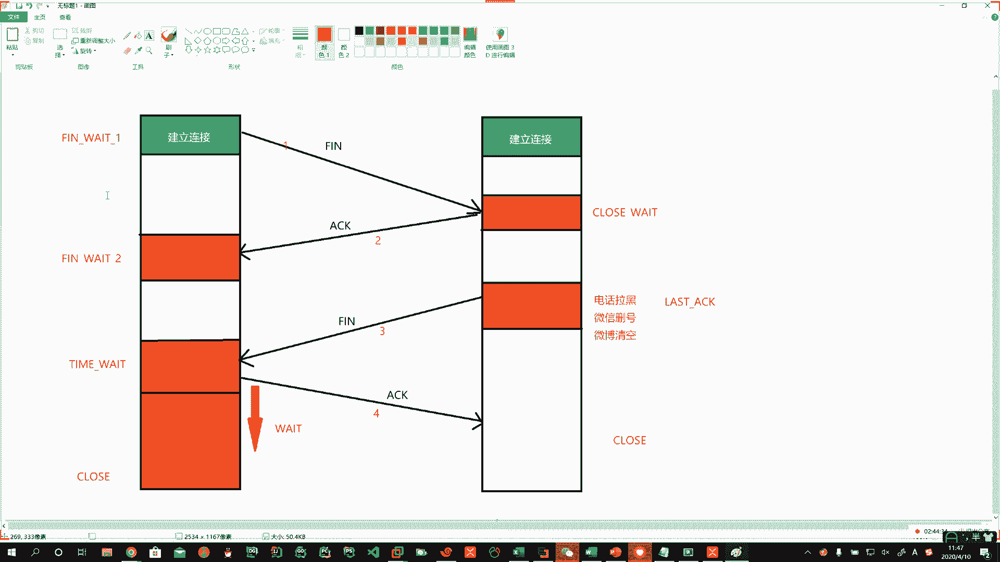
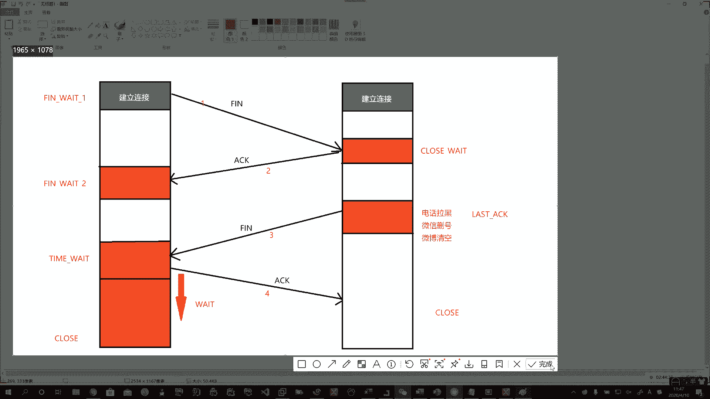

# 花了2万多买的Java架构师课程全套，现在分享给大家，从软件安装到底层源码（马士兵教育MCA架构师VIP教程） - P157：【Linux】TCP断开连接的7种状态 - 马士兵_马小雨 - BV1zh411H79h

是。4次呢，然后呢它还是有状态的啊，所谓状态呢，那我们就。这个了解一下渣男的心理变化啊，那说他第一个他处于叫SYN。meat杠1。第一个状态就是FYNw1等待人家确认呢。啊，你发过来1个SY。

当然这上边就表示我们三次会手已经建立连接了，这里连接建立着。啊。到这儿以后，人家直接就给你close。啊，关闭等待。是吧哎，关闭等待，那最后再聊两句啊，你们俩买那个狗买的项链，买的什么东西。

手机什么乱七八糟的，是不是？啊，财产分割一下啊。好。然后呢，你给人1个ACK确认了啊，这里头他还你看虽然是渣男，但是男的和女的心理变化是不一样的啊。他还犹豫呢。啊，他还犹豫呢。

所以他处于一个叫FNV2这样的一个状态。啊。系。好，那其实呢姐姐这边发了两条啊，说发了1个ACK，最终呢还发了1个FFIFIN的啊。啊，那这个就是人家就做决定了。last aK他就已经做决定了。

最后一次确认说我再给你最后一次机会，你现在啪叽就给我跪下，说我错了，哎呀，哎，我还能原谅你啊，给你最后一次机会。但是你没有。啊，没有人家就卡删号跑路，对不对？哎。

所以呢这个里头它就进入到了啊叫time wait。Tampade。啊， ham made。在这等。这个等待的过程中，可能你时间很长。那么我们客户端和服务器端去沟通的时候。

这里的time wait就要等等待你超时啊，它一直等有time wait一和time wait2。所以在这段的过程中，它需要等待一段时间。就你打电话不接，发短信不回，那你就等让他冷静冷静。啊。

所以这个就是readit。啊，read。没。好，实在不行了，人家就一看给你拉黑了哈，那你就close。最终才可能。Oh。这边最终也closse。4加3得7。断开的时候啊。7个状态。啊。建立连接的时候。

四个状态。所以加在一块儿11种状态。啊，那么这个东西呢，你将来你要想面试别人的时候呢，就是第一问啊，说给我简述一一下TCPIP连接三次握手四次挥手的过程。啊，咔拉基咔基写，对吧？哎。

第二问马上说在建立连接和断开连接伴随着多少种状态的转换，答11种每一种状态是什么？通过刚才这个非常悲惨的故事啊。对吧一开始高大上的白马王子最终变成了渣男啊，就这渣男的故事。11种状态啊。

汤汤汤给他写出来要1万块钱以上薪资玩的一样啊，所以这块一定要注意啊，这里头7种状态。

Okay。哎，你看。26号泥霄位啊，你看这小子肯定干过这事儿啊，你原来总结的还挺有道理，你看。是不是？啊。哎。

好了啊。😊。