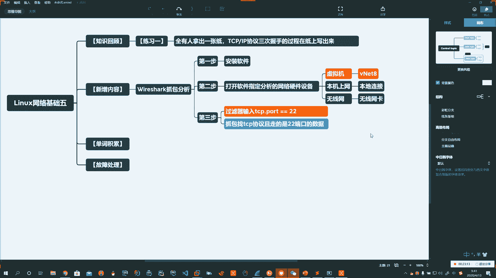
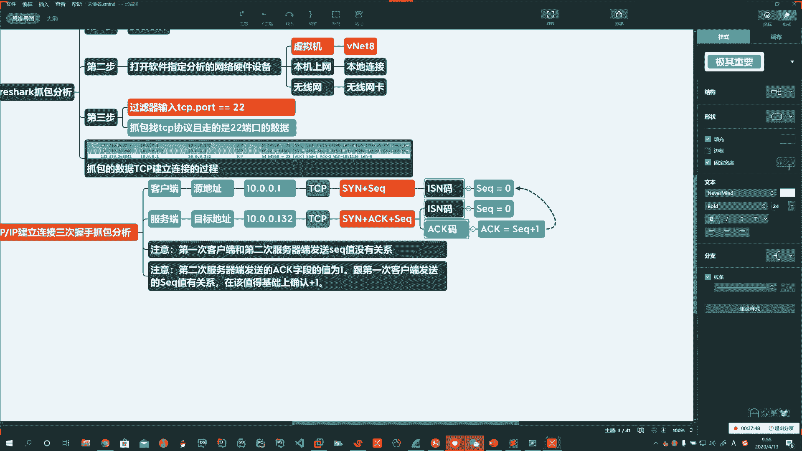
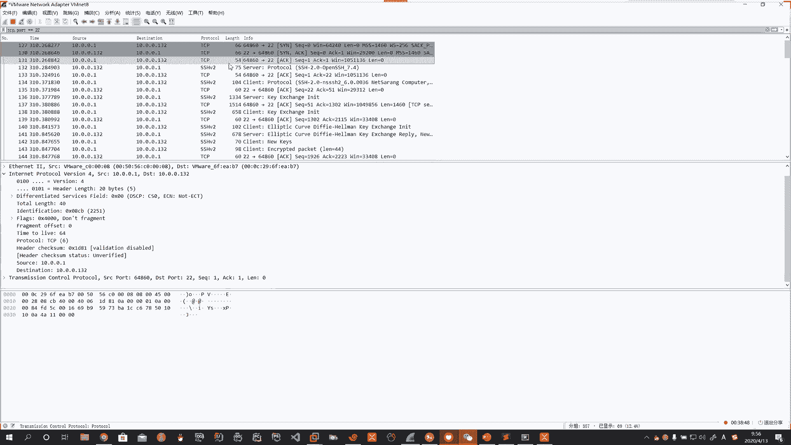
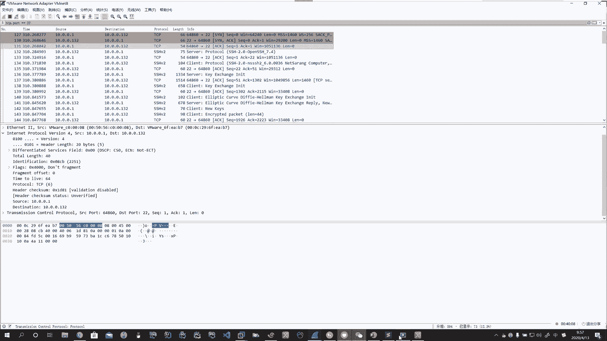

# 花了2万多买的Java架构师课程全套，现在分享给大家，从软件安装到底层源码（马士兵教育MCA架构师VIP教程） - P159：【Linux】wreshark抓包分析TCP三次握手 - 马士兵_马小雨 - BV1zh411H79h

看一下啊，我们实践一下。那么这里头呢我们要用winsshaer啊，然后呢我们要抓一下哎我们的网络数据包。啊。Yeah。我们抓包分析一下啊，把TCPIP的这个哎三次握手，四次挥手，我们都抓包搞一下啊。

让我们呢把这块呢好好的哎理解一下。打开你的win12这个软件。Oh。打开它啊打开它。然后呢打开你的虚拟机。Oh。Oh。Okay。注意啊，在这一步啊在这一步。它上来以后呢，会有波形图。啊。

上来以后啊会有波形图。那个波形图呢它干什么呢？它就是检测你有多少网卡。啊，检测咱有多少网卡。然后每一个网卡它现在跑的有数据，你看有波形的就是有数据。啊。如果我们想连虚拟机抓包。

你选net8Vnet8VM worknet VMnet8。啊。那如果你想抓你本机的，就是说咱们这电脑的啊跟外边联系的那你就可以选本地连接。看你那写的是本机链接一啊，二啊，哪个有波形，你就选谁啊。

我们这里头用虚拟机来演示，就大家都选note8。双击他。啊，双击他。好啊，那你看他走了一些啊NTP的啊这些数据。首先第一步啊说一下步骤啊。第一步。安装软件。啊，我们在上一讲已经把这个软件安装了。第二步。

啊。打开软件指定网卡。Oh。好啊，这里注意，如果是虚拟机。抓Vnet8这块网卡。啊，如果是你本机上网。抓本地链接。啊，等级链接。Okay。好，这个本地链接指的就是你本地的有线网络啊。

有线网络如果是无线网。Okay。无线网，那你那无线网卡叫啥，你就抓那个名字。Okay。Yeah。好，咱们这里头统一的都选mateote8啊。

Oh。好。然后在上边这有一个显示过滤。啊，那你直接输入。TCP点port等于22。啊，在这儿有一个绿的线，这个叫过滤器。

。咱们SSH就是典型的TCPIP连接啊，咱们后边会详细的去讲这个过滤器输入TCP点破等于22。这意思是什么？是我们要抓。啊，抓包。Oh。找。啊，TCP协议。且走的是22端口。的数据。Oh。Okay。

Okay。Yeah。Okay。好，这一步很重要啊。那如果你不这么处理呢，那你后来下边就会走很多啊这个乱七八糟的数据。

指定好啊指定好。指定好22端口以后啊，这上边有一个红的是停止，绿色的是刷新。

Okay。红的是停止，绿的是刷新。

Oh。啊。好，然后打开你的终端。

叉c连接你的虚拟机。

啊。然后这时候啊我们这里头就有数据了。咱们就捕获到了数据。啊，捕获到了数据。好。在我最上边。

Oh。啊，在这个位置，我们就抓到了。Oh。TCPIP。

协议在建立连接的过程。啊，TCPIP建立的过程。那么中间这一块啊，中间这一块就是我们TCPIP的网络模型。

最下边这个啊对吧？哎，transmission controll portal头啊，什么呀？这就是传输层的协议。啊，再往上internet portable啊，port什么意思呀？IP协议。

你看这就是IP层。再往下啊，这里头有一个以太坊。😊，啊，你太网络。对吧前边是sourcece，后边是destination，这里头有m克地址，这就是我们数据链路层，二层网络。啊。

再往下这有一个frame啊，66比特on什么什么什么什么什么什么什么interface，后边这就是你的网卡驱动。

ID0，这就是你的物理层。所以这就是你的TCPIP协议的模型。啊，你的模型。那么我们看一看啊，这这个东西就是一个网络的风包啊，我们看一看是不是跟我们说的是一样的呢啊，拿我们的鼠标点到第一行。啊啲行。

第一行这里在传输层的时候啊，传输层的时候，那我们这里头有一个flag。啊，flag0叉002发的是一个什么SYN码。Oh。啊，SYN码。Oh。所以这个东西就是一个网络封包。那么就像我们说的啊。

第一句话发的是1个SYN的字段。

啊，在这里头。

SYN字段。再发SYN字段的时候，他还干了一件啥事儿啊，我们看这个数据。第一次客户端。像服务器端。Yeah。

。다。这个过程刚大家已经都画的非常明白了啊，真的非常开心啊，大家都画出来了。😊，哎。可能我们今天一激动，又多得奖10块钱了啊。那第一下这个客户端。服务器端。Oh。客户端就是原。啊，原数据或叫原地址。

服务器端就叫目标地址。啊。Oh。在我们抓包里头能不能体现出来，能体现啊能体现。那么前面这就是圆，后边这destination就是目标。

Okay。

。Yeah。Oh。好，那如果你抓到数据的同学啊，那你就可以看自己的没抓到的同学啊，你看我演示。

Oh。Yeah。Oh。Oh。Okay。は。Oh。Oh。我这里的原地址。就是客户端啊，10。0。0。1。目标地址。啊，服务器端10。0。0。132。Oh。Yeah。Okay。客户端啊服务端已经都弄出来了。

What。好，我们注意看啊，你客户端后边这个。TCP指的是走TCP协议。啊，他俩都一样，指的是走TCP协议。아。在后边啊在后边它是端口，谁到2264860到22啊，这个我们不管，那客户端我们都知道。

他首先他得发1个SYN码，没问题，没毛病啊。他发的是SYN。这时候。除了SYN以外，他还发了一个什么呢？加啊SEQ。啊，SEQ。这个也叫做ISN码。就是你客户端TC啊，在建立连接的时候。

它用于一个识别码。那么这里头SEQ的值发的是多少呢？发的是0。啊，发的是0。记住啊，客户端在发SYN码的时候，这个SEQ第一次发的是0。这就是我们第一次握手。

啊，客户端发送完了以后，服务器端收到你的链接啊，然后他发了两个字段，在这儿看中括号，我们抓到两个字段SYN逗号ACK也就是发了俩。

啊。那么他首先会给你发SYN加ACK。Yeah。发这俩字段啊，然后他也会给你发1个SEQ值。SEQ码。ISN码。啊，注意看这里头有学问。

啊，他也发了1个SEQ等于0ACK等于1。那么这里的SEQ和上边客户端发的SEQ，它俩有没有关系？SEQ的值，它俩各自是各自的，没有关系。啊，但是ACK的值等于一，它和客户端发送的信息有没有关系。

有关系。

我再说一遍啊。

，第一次的SEQ和第二次的SEQ的值，他们之间没有联系。

Oh。Oh。注意。第一次客户端和第二次服务器端。发送的。SEQ值。没有关系。啊，自己发自己的，他俩没有啥关系。Well。好，但是。注意2。Okay。第二次。服务器端发送的ACK字段的值。唯一。跟。

第一次客户端发送的SEQ值有关系。啊，是在该值的基础上。确认。加一。Oh。Oh。所以他发了两个码，一个也是ISN码啊，用于识别你这条TCP的链接，他发零，他也发零，这俩没关系，各自是自己的啊。你是你的。

我是我的两个不同的颜色来区分。啊。但是第二次他发了SYN，这是SYN发的ISN码ACK的码。ACK的码跟第一次建立SYN的。啊，请求这个码跟它有关系，是在原来的基础上，你的SEQ。加一。就等于。

ACK的值。Yeah。Oh。啊，颜色给你标一致，这个颜色这个ACK。是它的值加一。Oh。Oh。好。Oh。Oh。

好，注意看软件啊，效果是不是这样的。说第一次发了1个SEQ0啊，第二次服务器端给你发送了什么？看这flag标志SYN加ACK。啊，SN加ACK。啊，这是第二次发送的。啊。

发送的那你发送了这个ACK以后啊，发送ACK以后，那么这个ACK的值到底是多少呢？啊，多少呢？这个ACK的值就是在你原来的SEQ的基础上加一你SEQ是随机的确认码。好，我在你基础上加一，证明我应答你了。

说的是应答了你的这个请求。😡，啊。第3个。

啊，第3个收到了这个ACK以后，客户端再次的发送一个，他也发送1个ACK的。子断。Oh。啊，ACK的字段。那么这时候连接才会建立。啊，连接才会建立。那么这个ACK和谁有关系啊，这第三次发的它的ACK码。

注意看我们看抓包。

第三次的ACK也加一了啊，这个值也变成一了。那么这个ACK的值，你看这个SEQ的number。啊，SEQ的 number。Oh。啊，SEQ的number。等于一了。啊，等于一了。好。

这也就是说最后你这个ACK码也是等于S1Q加1。

啊，也是SEQ加1。这个SEQ是哪的SEQ？是你第二次服务器端给他发的。这个S1Q值加1。2。Oh。Oh。Oh。好吧，哎，这就是我们通过抓包给大家来分析他们SEQ值ACK值。啊。😮。

那么发ACK的码同时啊，它再次发了一个啊SEQ的字段。SEQ值。Yeah。这个SEQ码。由最原来的SEQ0。啊，SEQ0。变成了SEQ。二。Oh。Okay。Yeah。🤧好啊，这是专业软件啊。

是网络安全黑客入门啊，黑客要用的这些抓包的数据这些软件啊。那么我们只是让它更底层的让大家深入的来了解啊这个过程。啊，深入的来了解这个过程。好，那么呢您呢把这个过程掌握了啊。

Okay。