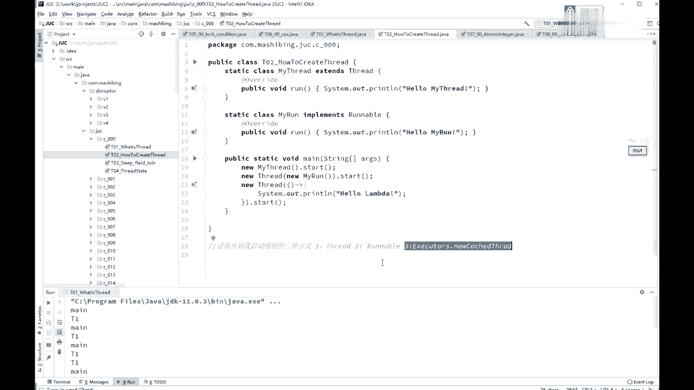
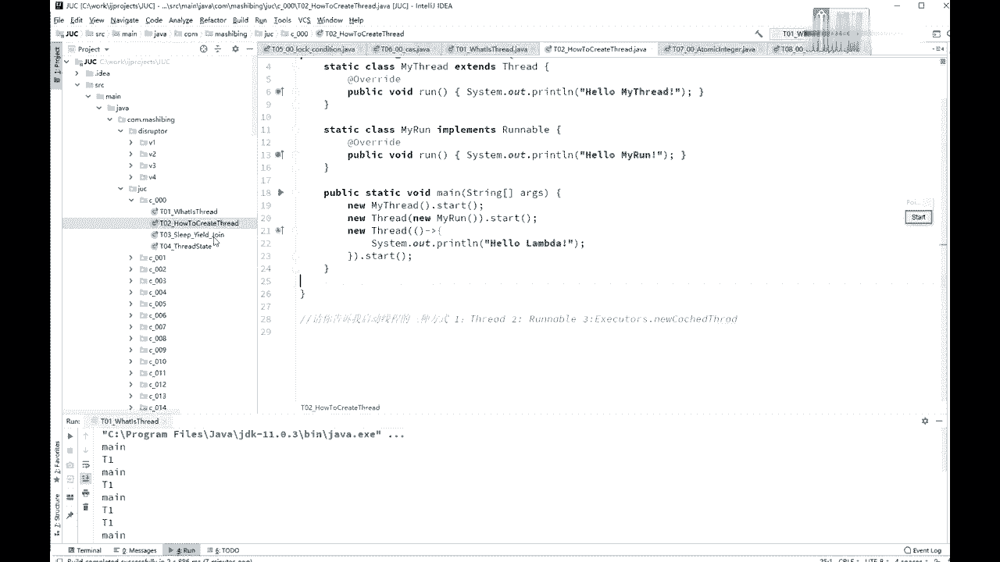
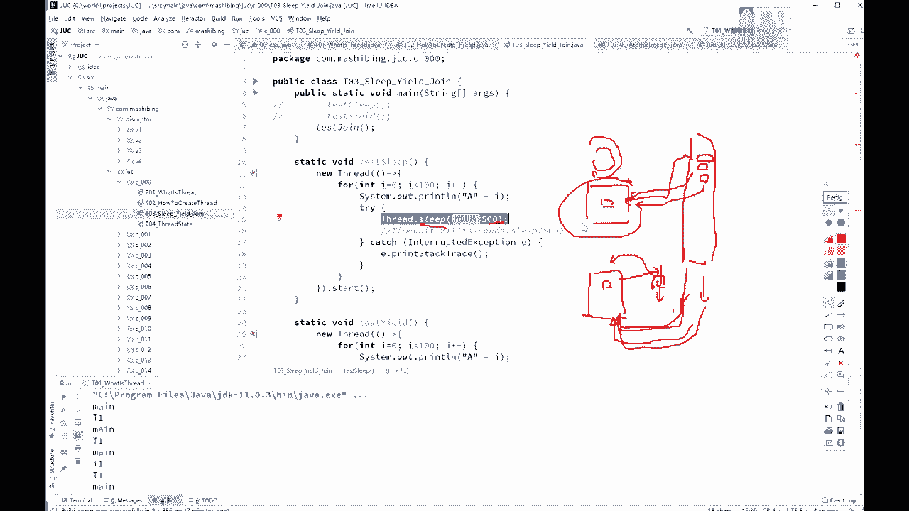
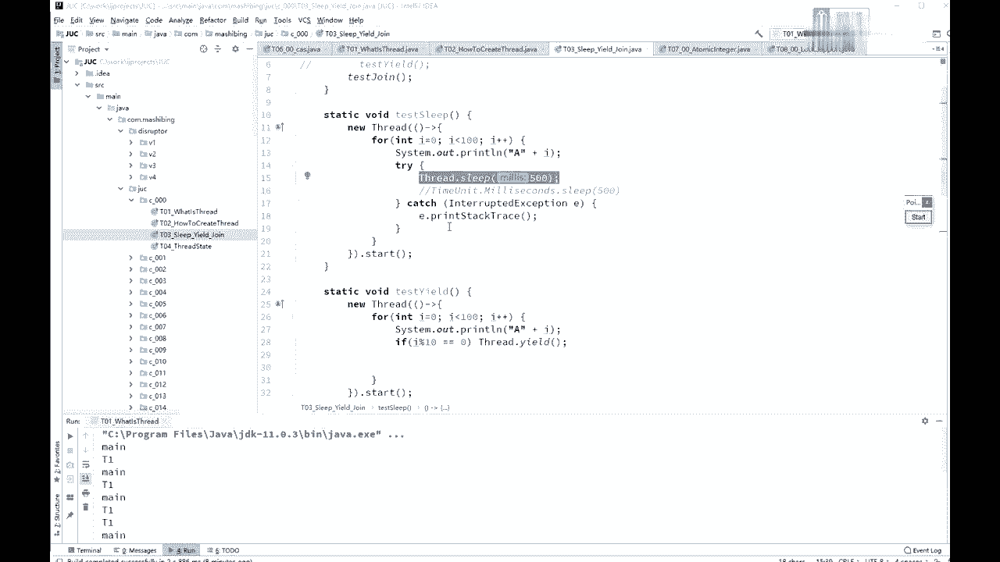
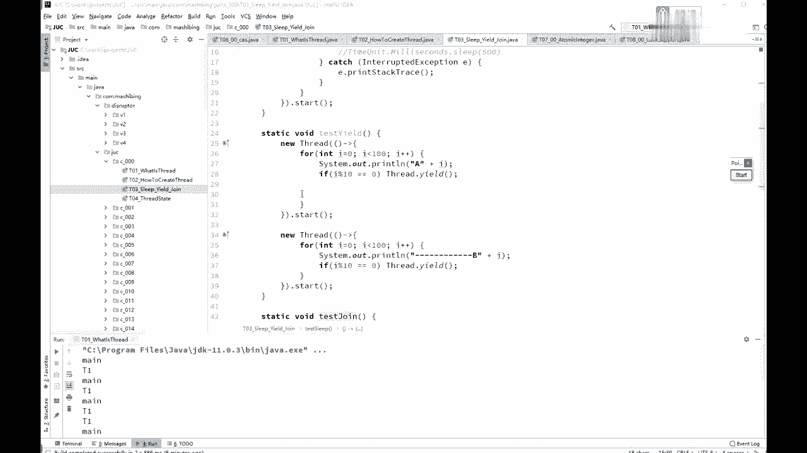
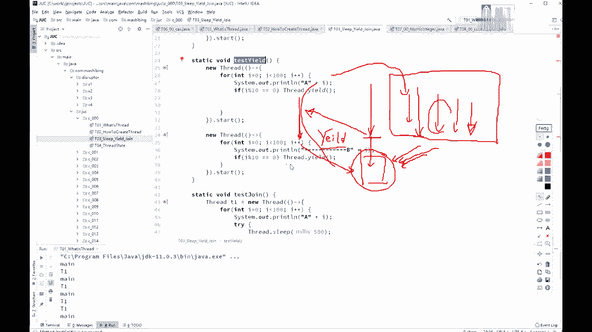
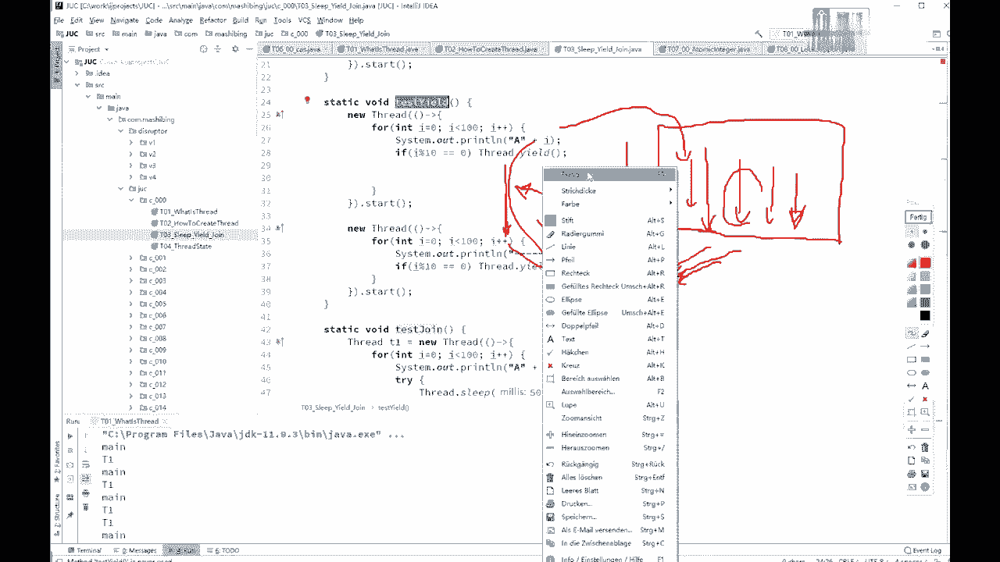
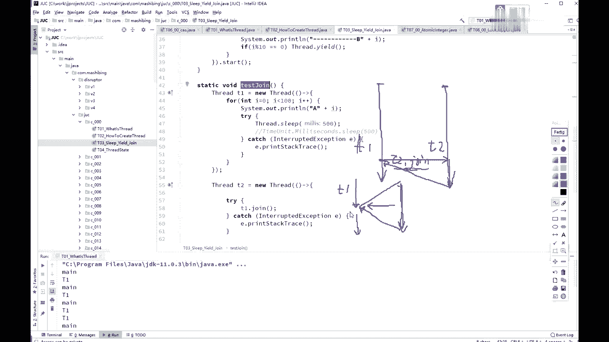

# 花了2万多买的Java架构师课程全套，现在分享给大家，从软件安装到底层源码（马士兵教育MCA架构师VIP教程） - P15：【多线程与高并发】线程的3个方法 - 马士兵_马小雨 - BV1zh411H79h

可以起一个新的建成。

ok这是现成的最基本的概念，我们来认识几个现成的最基本的方法，那么第一个方法呢叫sleep，sleep就是睡眠，所以睡眠的意思，当前线程暂停一段时间，让给别的线程去运行啊，是这个意思好。

那既然讲到这儿的话，这个睡眠让给别的县城到底是什么概念，如果从操作系统的角度来讲的话，这是我们的cpu，cpu呢是一个特别土的，特别土的这么一个元件，这个原件呢在他的概念里头，是没有现成的概念。

他只知道干嘛呢，就是他就是不断的一个死循环，这个循环啊，就是从那个内存里头把指令拿过来运行，拿下一条指令运行，再拿下一条指令运行，一直就这么不停的循环，不停的循环，不停的循环，没有指令了，歇着就这意思。

所以其实对cpu来说没有形成这个概念呃，但是我们这多线程的是什么意思呢，其实呢是有好多不同的线程，每个人在如果只有一个cpu的话，那么每个人呢就在这cpu上执行一会儿，每个人在cpu上执行一会儿。

执行一会儿之后，不是把你扔出去，把第二个线程再拿进来，然后呢波再把第三根线程哎拿进来吧。

第二线程扔出去是这么一个概念，而这个sleep的概念是什么呢。

就是说这个线程麻烦你啊，跟我这睡500个毫秒。

然后在500ms之内，你a别人别的线程可以去运行，让给别的线程去运行，是这个意思啊，test sleep，那代码我就不跑了，太简单啊，好第二个呢叫ield yield，的意思是非常谦让的退出一下。

这个代码呢我就不演示了，你们如果有没有同学对you有的有疑问的，如果有疑问，一会儿有一会儿一会儿找我问啊，我先讲好，yd是什么意思呢，比方说我一个线程在运行，另外一个线程也在运行。

然后当前这个线程在cpu上运行的，运行到某个程度的时候，它掉了个eu的方法，那e的方法意思是哎哥们，我先退出一下，我从cpu上先离开，离开之后呢，别的县城是有机会在这儿执行的，当然我离开了之后。

如果说别的线程没执行，我还可能继续回来，继续执行所有的离开，就是进入到一个等待队列里头，等着干嘛呢，哎我从本来我正在上面运行呢，结果呢我又一下又一下，就是bl又回到等待队列里，回到等待队列里。

在操作系统的这个调度算法里头呢，还是依然有可能，把你刚回去的这个县城拿回来继续执行，当然更大的可能性是，把原来等待那些拿出一个来执行，所以yd的意思本质上就是我让出一下cpu。

至于后面你们能你们能不能抢到，不好意思，那我不管。

好这是you的意思，折腾去说返回就绪状态没错，就是返回到就绪状态去，那第三个呢叫join，join的意思还是画图啊，如果这是我们第一个县城，这是第二个线程o这个中文的意思，如果这个线程叫t。

如如果这个线程呢叫t一啊，左边这线能叫t1 ，右边这个线程呢叫t2 ，他调的过程呢，如果是在t一的某个点上调了t2 点join，认真看，在某一个线程里调你自己的点，john是没有任何意义的。

掉了如果是掉了t2 点join，join的意思叫加入，那意思就是麻烦你跑到t2 去运行，t一干嘛，t一在这等着什么时候t2 运行完了，继续t一运行，所以join的意思就是诶，当我本来我这县城到这儿了。

然后我掉了个join，我就跑到另外一个县城去运行，运行完了之后，我第一个来运行，所以相当于把这个县城给加入到了，我当前县城里面，这样你常经常用来干嘛呢，经常用来等待另外一个线程的结束。

t一完了之后调t2 点join，t2 点join的意思就是诶我等t2 结束了，我t一才继续运行，所以以前有个面试题说，诶我怎么才能保证另外一个线程运行，t一运行这个t1 t2 t3 ，我起了三个线程。

怎么才能保证这三个线程能够按顺序执行，完，这个事儿太简单了，你运行完运行起来之后。

你在那个主线程里先调用t一中，再调用t2 中，再调t3 中就可以了，还有一种那个更加精确的方式呢，就是你t一里面掉t2 转，t2 里面调t3 转啊，保证是t3 。

