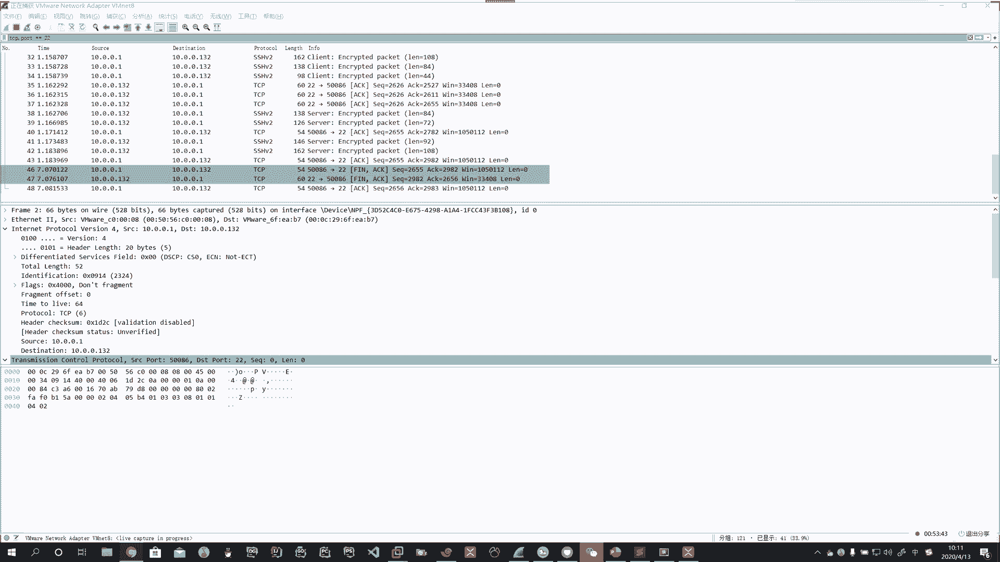
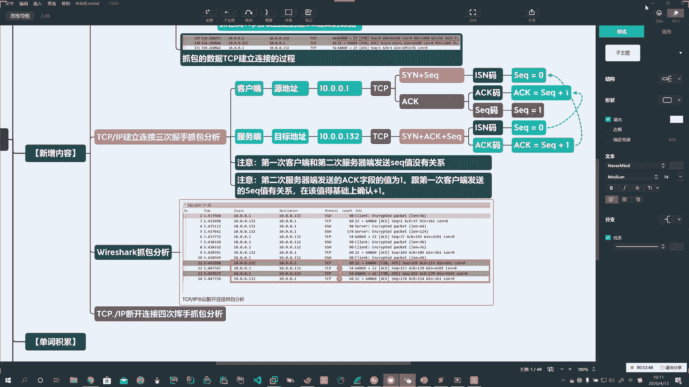
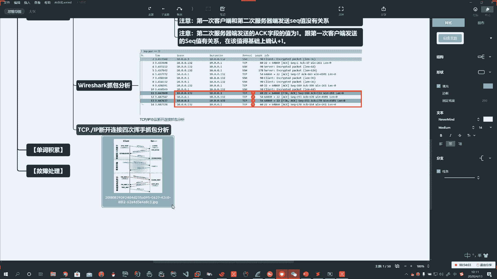
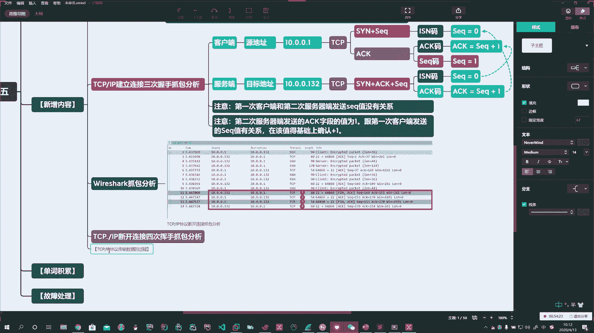
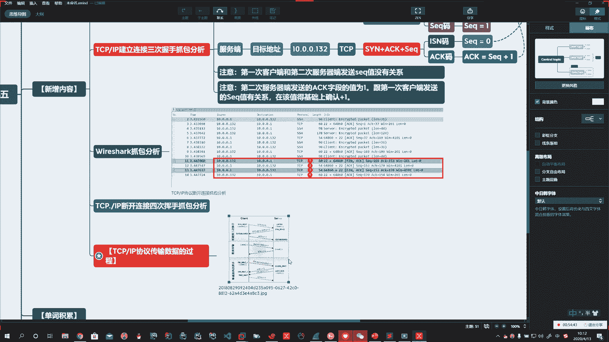
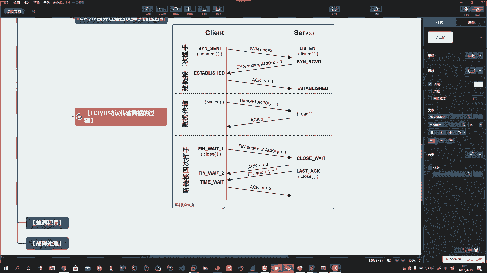
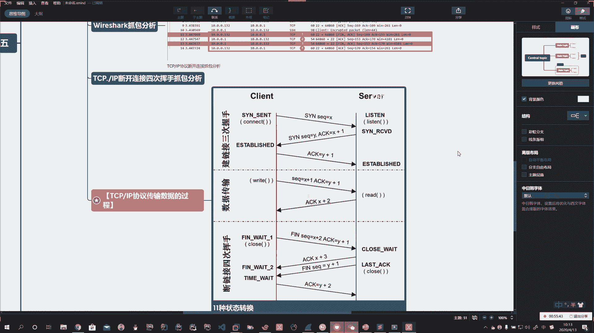
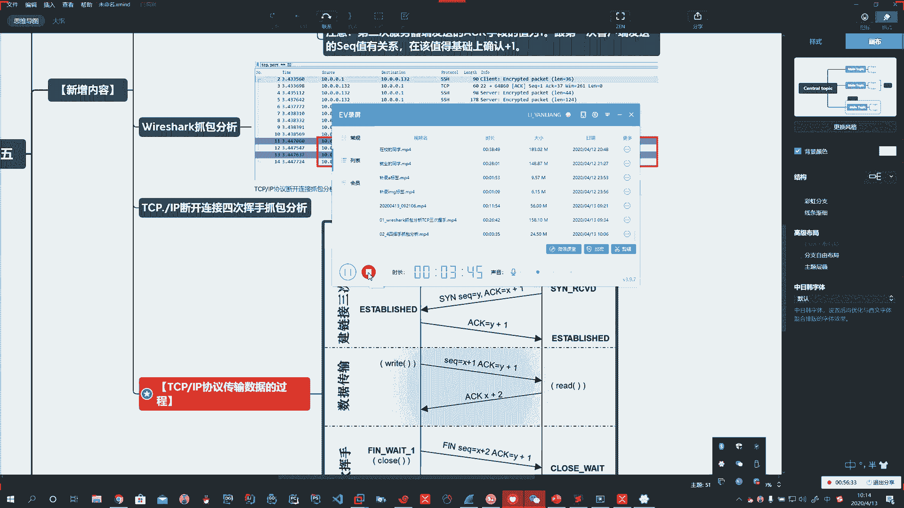

# 花了2万多买的Java架构师课程全套，现在分享给大家，从软件安装到底层源码（马士兵教育MCA架构师VIP教程） - P161：【Linux】给图 - 马士兵_马小雨 - BV1zh411H79h

Yeah。好，那这整个的这个过程它是什么样的一个状态啊，是什么样的一个状态？就是我们建立好了这个。🤧TCP链接通道以后。啊，他们要开始去传书了。啊，他们要开始去传书了。呃，有一张图啊一张图。Okay。

就是讲啊这个TCPIP的状态的啊，我把图呢发给你。

あ。Okay。好。那么通过我们的数据加图啊，我们把它好好的去深入的去学习一下啊。

Yeah。🤧。Okay。

Okay。Okay。She。Oh。这个过程是重要的啊。Oh。Oh。

Yeah。嗯嗯。

🤧。🤧嗯。😊，那么上边啊以后你再记这张图的时候，这一张图就OK了。🤧啊，他又有。三卧四灰的过程又有SEQ和ACK的值啊，然后呢又有传输过程啊，下边呢是断开连接的过程。所以呢这一张图概括我们整个的阶段。

那么第一次啊第一次断开连接的时候，是建立在你原来的基础上呢。

啊，建立在你原来的基础上。🤧嗯。你这个数据啊在发送的时候，首先它要发送1个FIN码啊，FN码。Yeah。FIN码的时候啊，它也要发送1个SEQ。

那么我们看一看这个SEQ跟他之前的啊这个SEQ是不是啊相关的。啊，是不是相关的？🤧。先下个休息会儿啊。🤧不舒服嗯嗯。好。

