# 系列 3：P162：【Linux】TCP断开连接的四次挥手抓包介绍 - 马士兵_马小雨 - BV1zh411H79h

手啊这个抓包的过程跟你说一下，在这里头需要注意啊，我们这里抓的这个包是由服务器提出分手的。所以你看你这个数据是10。0。132，就是讲师机啊，他先发了FM码给客户端，10。0。121。

那这里呢他就完成了角色的一个转变啊，是服务器提出的断开。啊，服务器提出了状态。🤧那么如果。如果你要想啊有同学说我客户端提出断开，就是你10。0。0。1提出断开，这时候怎么办呢？啊。

这俩数据包是不一样的啊，你要注意，如果是你提出，那怎么办？你就叉 shell。Okay。啊，chcha。叉C在连接的时候，你直接把叉CL叉掉。

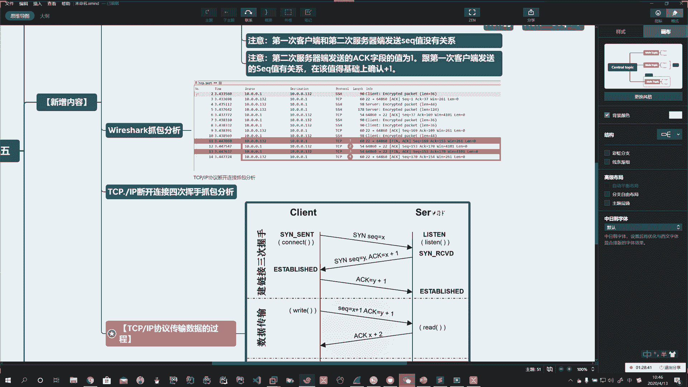

，啊，比如说你这连上了，直接点叉子。啊，这是你客户端。😡，掉线了。啊，就相当于它会向服务器端会发送这个请求。所以你抓包的时候，这两个数据是不一样的啊，注意看啊，我给你演示一下。Okay。

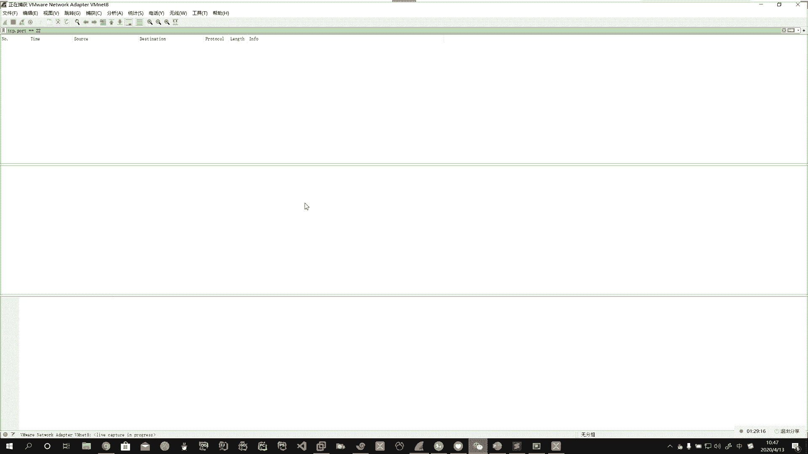

。Yeah。好，我们我们的方式只是直接断开啊，或者在这里头你直接摁cttrol加D退出了，是不是？啊，好，比如说。你看我先来一下啊，咱们先断开，先连一下，让那有数据。

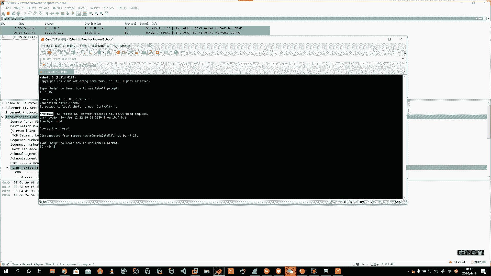

啊。那这时候你看这时候，比如说你直接点这儿链接的这就是客户端发起。

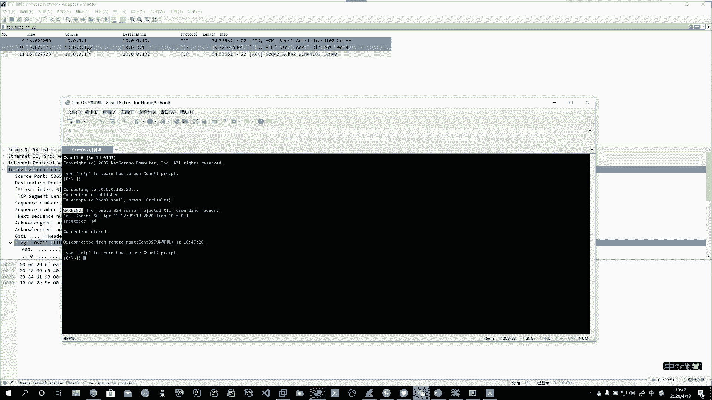

啊。这就也有。Oh。Yeah。

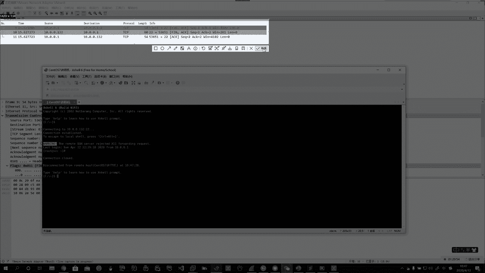

Oh。Okay。啊。或者呢你看现在连上了。啊，连上了，那你直接在右边点那个。

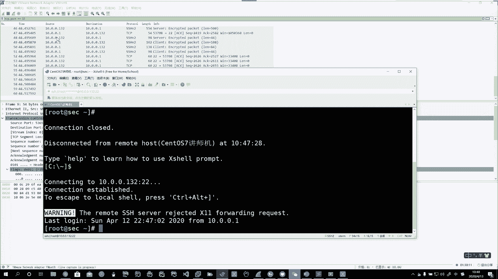

窗口啊断开它。

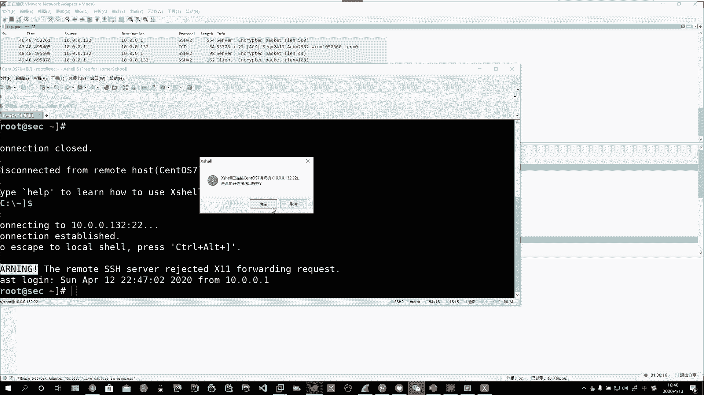

这也是由客户端发起。哦。好。

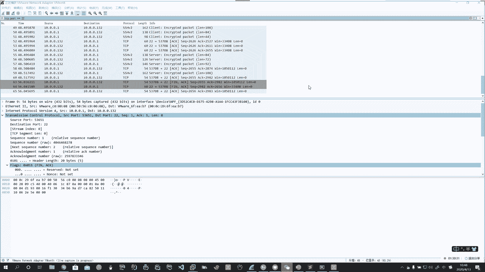

啊，这你自己要注意啊这你自己要注意。

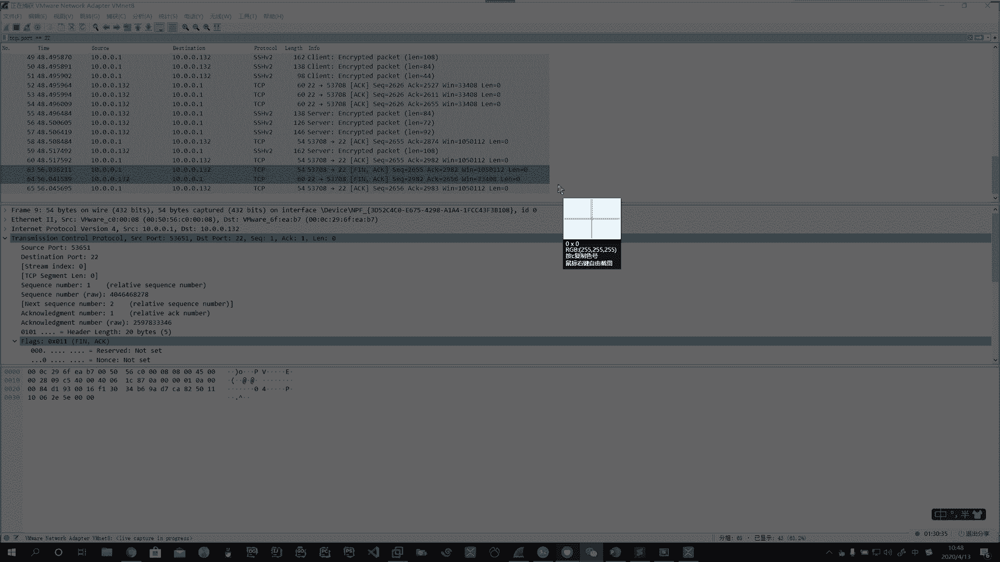

Yes。Oh。Okay。好，如果是你客户端发起的，和你服务器端啊，跟你断开那个链接，你抓到的包个数是不一样的。如果是客户端，你发起的，你在这里能体现出的是其实是三个包。啊，是三个包。

但是如果是客户端发起，如果是服务器端，10。0。132，它跟你断的时候，它是四个包。啊。这儿要注意。但是不管谁啊但是不管是谁。我们在分析啊这个包的过程中，那么。他的数据传输都是一样的。

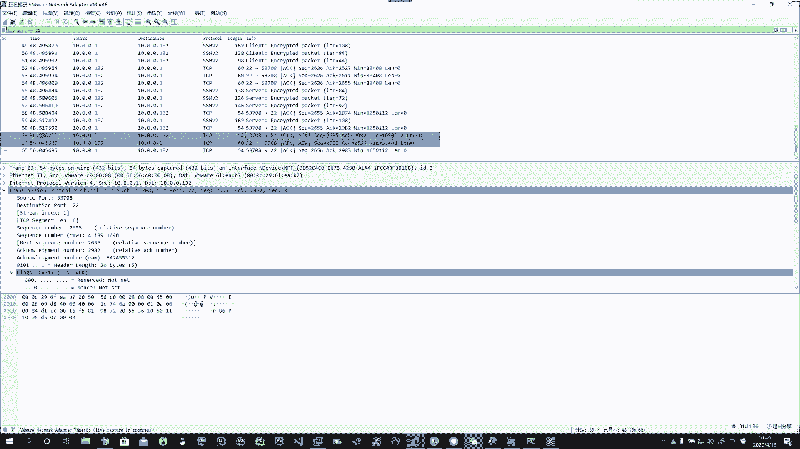

啊，我们简单的说一下，断开的时候。Okay。Oh。好，四次挥手，这个四次挥手是我们形象呢给人家的一个比喻。啊，谁主动对吧？你看。我们。给大家发的这个图，这里头有这里头就有4个班。啊。

那么咱们就按照这个图来说。这个就是。服务器端提出请求跟客户端。啊，来断的。所以服务器端充当了原数据啊，你现在这个叉 shell这边充当的是。目标数据啊，你看他谁到谁。🤧。对吧首先第一个他都要发送。

FIN码。啊，FM码。好，这里头啊发送FM码以后，你注意看啊，它是有1个SEQ的值的。啊，加SEQ。Oh。啊。Okay。好，那你看这个ACK啊，也就是说我这里的还有1个ACK。啊，ICK。

这个ACK的值啊这个ACK的值是你上边建立连接的时候啊，跟它有关的这个ACK。好，那么我们关注这里头的SEQ值，那我们抓到的是多少呢？注意看啊，SEQ。这个SEQ也跟你上边有关系。你看你建立连接以后。

这个SEQ值等于169。啊，是你建立连接好了，你们传输数据那里头的这个SEQ。他就不会再从零开始了。所以这里头的SEQ，我们这里头是等于169。Okay。啊。好。😊，第二次呢，他发送什么呢？啊。

他要发送。ACK。你看这里头谁确认了的呢？10。0。0。1啊。这台主机。刚才是谁发的呢？10。0。0。132啊，他发的这个。这个主机接收到了。FIN码以后。他要回应。回应他就得确认，那就发ACK码。

这时候的ACK等于170。啊。ACK的值。就等于第一步的SEQ。加一。说我发的这个确认是你刚才的那个链接请求，我确认要断开。啊，确认断开。然后他再给他发一个。向10。0。0。132发送FIN码。啊。

Okay。Yeah。好，发送XM码。最终。と。10。0。0。132啊回应。啊，回应10。0。0。1。1个ACK。Oh。然后啊这些他们就断开了。啊，断开了。所以你看该第三步，他发送FIN码的时候。

他也给了1个SEQ。对吧。这个SEQ值。你看看是多少呢？这个SEQ值等于153。啊等于153。然后最终在断的时候啊，你这个ACK字段的值。啊。就是在153的基础上加了一。Okay。

对吧所以这儿加一的是在上面这儿加一。啊。底下这个加一。Okay。是在第三步这儿加了一。好啊，简单的通过抓包给大家呢说了一下啊。

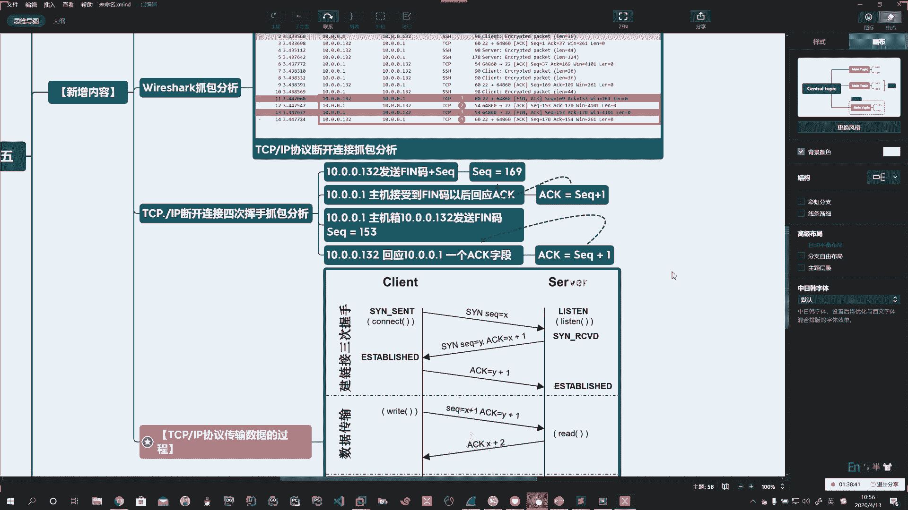