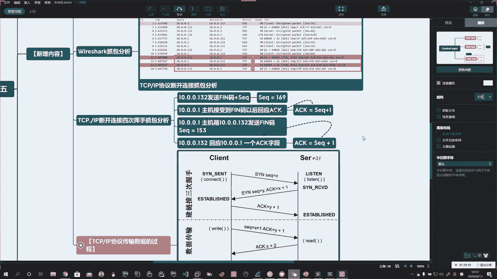
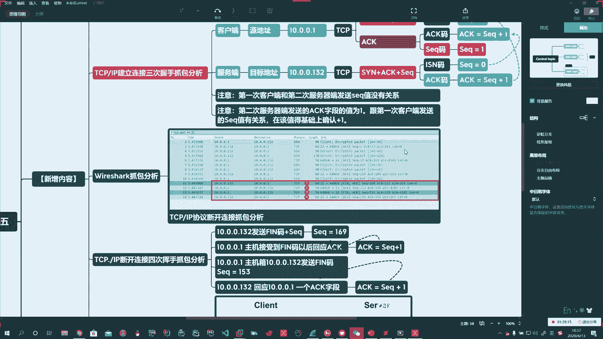
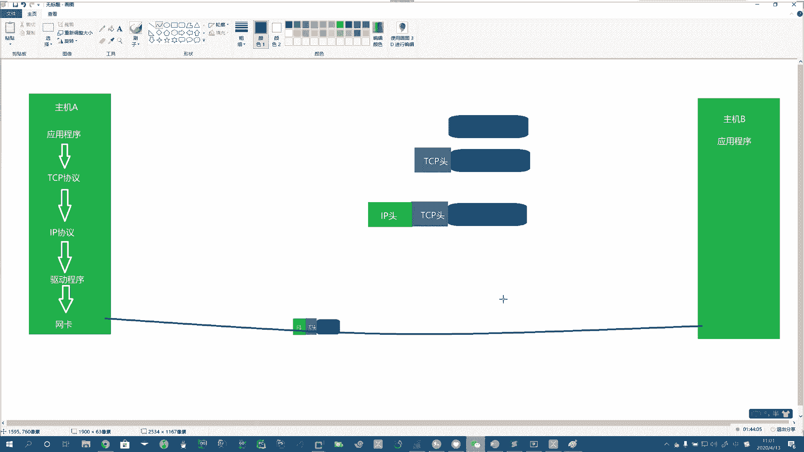

# 花了2万多买的Java架构师课程全套，现在分享给大家，从软件安装到底层源码（马士兵教育MCA架构师VIP教程） - P163：【Linux】TCP数据封装过程 - 马士兵_马小雨 - BV1zh411H79h

好，三次握手呢和四次挥手呢就给大家说完了。

啊。Yeah。这块呢啊不要求你掌握，它是帮助你啊。对于我们前边讲的这个内容的一个理解。好了。好。然后呢，我们需要干嘛呢？我们需要介绍一下啊。说你这个UDP在传输过程的时候啊，不是这个TCP啊。

在传输数据过程的时候啊，它是怎么样的一个流程？我简单的给你说一下。主机A。主机B。应用程序。Yeah。应用程序。那么我们刚才使了啥应用程序啊？哎，我们用的就相当于是SSH。啊。那么这个应用程序它会。

通过TCP。啊，通过TCP协议。去建立这个链接啊，然后再往下。啊。再往下是什么呢？再往下就是IP。啊，就是我们那个几层模型里头的。啊。好，然后再到底下，就是我们。数据链路层。对吧哎，数据链流层。

这是啥玩意儿啊？驱动程序。啊，最终到什么呢？最终到你的。网卡。啊。也就是你的物理层。啊。这个应用层的数据，比如说这儿有一条。对吧哎，这就是一个数据。它和我们OS在7层网络模型的时候是一样的。啊。

说每道往下走一步。他都会在原来的基础上。增加一个。豹纹。啊。那么到这儿，它就增加了1个TCP的头。啊，然后数据继续往下走。好，往下走走到哪儿呢？走到IP这块，哎，再加1个IP的头。Oh。啊。Okay。

好，然后最终啊这个数据比如说再往下走啊，底下加mag是吧？最终这个数据。啊，通过网络。把它传输过来。Yeah。Yeah。啊，是这样一个简单的一个过程啊，我这个图画的比较糙，但是这意思啊。

跟OSI的那个类似啊类似。只不过呢把7层换成这么多。Oh。

