# 系列 3：P166：【Linux】IP地址分类与IP地址分类开始字段 - 马士兵_马小雨 - BV1zh411H79h

好，IP地址叫逻辑地址。啊。标识网络中。主机用的。啊，原则上。Yeah。在一个网络中。主机的IP地址。是唯一的。啊。那么这个目的是防止冲突。Yeah。啊，防止IP地址冲突。

所以原则上是唯一的那有同时我就想改成一样的，行不行？行？啊，行。但是它会冲突。所以这里头也就告诉你。逻辑地址是可变的。啊，可变。好，IB地址分类。从协议上啊大的面上可以从协议上分。啊，分为IPV4。

可以分为IPV6。Okay。那么现在呢我们面临着IP地址枯竭的啊这种方式，指的就是IPV4这个协议。啊。Okay。那么IPV4呢，它是什么呢？啊它是由32位。啊，32位。十进制数。一。点儿隔开。啊。

分四段。啊，也就四部分。表示。那么这种方式也叫点分二进制。好。哎。举个例子啊。举个例子。大家见到的192。168。0。1。你见到的192。168。1。1。啊，你见到的10。0。0。1。哎。

你见到的172。0。0。1。你见到的127。0。0。1。啊，等。啊，你见到的114点114点114。啊，你见到的233。5。5。5。你见到的233。6。6。6。啊。你见到的39点105。2。1。

这些都是。啊。Okay。那么在这里头我们介绍了点分二进制。啊，每一个部分。用8位来表示。啊，每一个部分8位。啊，所以每一部分能表示最大的数。256。啊，但是从零开始，所以这值的范围就是0到255。好。

那么1个IP地址。啊。那么我们就详细的来说说IP地址的构成。Okay。I地的构成，这是重点。Good。Okay。那IP地址啊。它由三部分来构成。啊。这个东西有很多人都不知道。很多人都不知道。啊。

那么由哪三部分构成呢？首先第一部分叫做类别。Yeah。第二部分叫做网络标识。第三部分叫做主机标识。Okay。类别啊。网络标识。这个颜色有点骚啊，主机标识。啊，还好落着了啊。好。这三部分啊类别说的是啥？

用来区分。啊，IP地址的。类型。网络标识。你查一些文献，一些资料，他们也可以称之为网络位。啊，网络位主机标识也可以称之为主机位。Okay。啊。对。那么网络位是干啥的啊，我们也称之为叫nightwork。

ID。啊，主机位host IDD。Yeah。Okay。Good嘛。好。那网络ID网络位，那么就是表示。主机所在的网络。啊，house IDD。就表示。主机在。网络中的标识。哦。

这个就是我们所说的IP地址的构成。好，今天呢我们先简单的介绍IPV4啊，明天呢我再给你介绍介绍IPV6，省的呢你学多了以后容易混淆。好。第二个IP地址在分类的时候啊，需要你知道的。哎。Okay。

就是IPV4。地址还可以细分啊。Yeah。Hello。好。在这里头，通常我们IPV4的地址可以分为五大类。啊，五大类。那么被称之为。A类。啊，A类。B类。犀类。D类和E类啊。Yeah。

所以我们也可以说啊A类地址B类地址啊。こ。好，那么呢我们一个个给大家介绍一下啊，A类地址。A类地址。那么A类地址啊。Yeah。好，它的网络标识位。啊，网络标识。

那刚才我们说了IP地址不是主机网络标识和主机标识吗？对吧？哎，它的网络标识占。在。一个字节。啊，一个字节。最高位。为0。这里的最高位指的就是网络的类别。啊。好。A类的网络地址。有128个。啊，允许。

不允许。支持127个网络。每个网络。大约。啊，大于允许。有。1670万台。主机。啊，1670万。啊。这一般都是属于超大型的了啊，超大型的了。好，我们看看这个A类地址长啥样啊，A类地址长啥样。

A类地址刚才说了啊，网络标识占了一个。

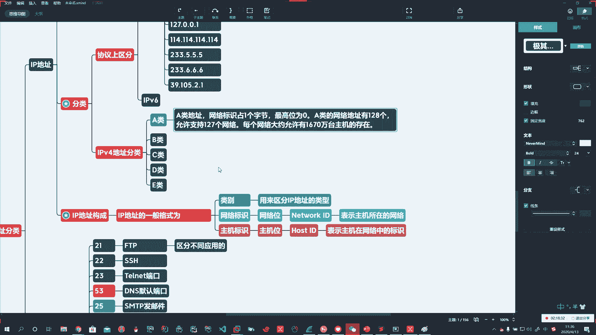

Okay。好。Oh。好，画1个IP地址啊。好，这就是1个IP地址。我们说了IPV6的啊32位，从零开始，0到31表示32位。啊，表示32倍。刚才我们又说了啊，说呀他前边。用于做网络标识的占了一个字节。

啊，一个字节。一个字节是多少位呀？😡，对吧？七位啊8位所以0到7啊，0到7，这是一个字节，后边就是8到31。所以如果我这么画的话呢，0到7，这就是前八位。Okay。啊，前八位一个字节。

那么在这个一个字节里头，这八位啊，它又拿出了一个字一个位。拿一个二进制位啊。做网络标识啊，这个标识就标识成0。所以这零这就叫网络标识。啊，零这块叫网络标识。那么这个绿色部分1到7啊，这个位置。

我们就称之为网络标识。啊，网络标识。这里头7位。啊，叫网络标识。也就是我们所说的网络位。啊，后边标识。主机位。啊，主机位。也就是我们所说的。主机标识。啊，主机标识。好。

那么这个A类地址我们通常用作为啊这种超大型的网络啊，就可以用到我们的互联网上。

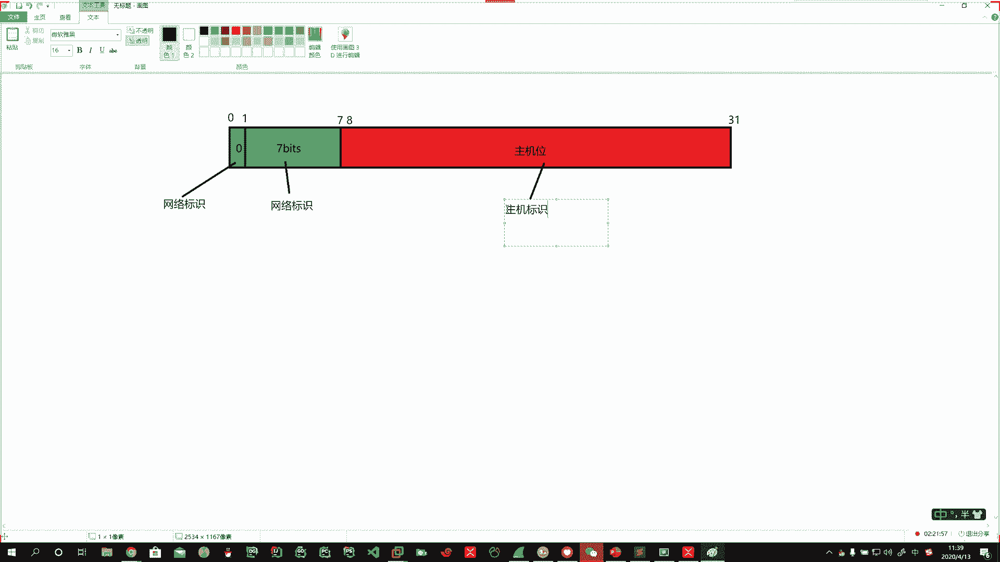

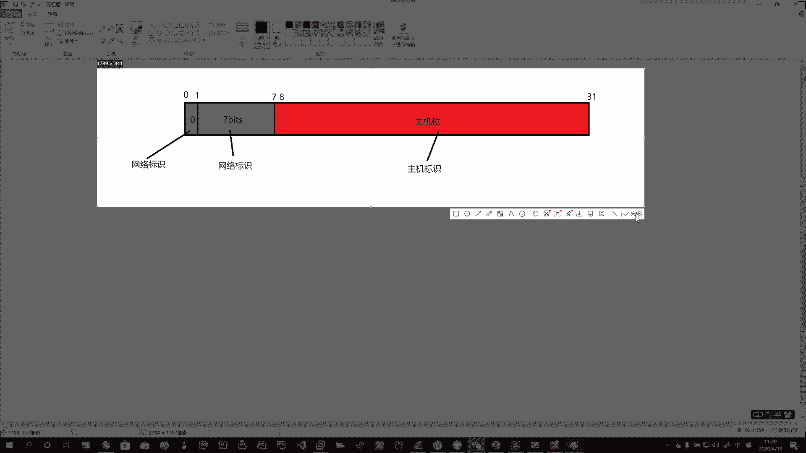

啊，那么通常在我们去使用的时候啊，不会分配给我们啊。你包括你的公司不会给。那么像这样的网络，一般的都是运营商啊啊然后咱们这些internet的骨干网络啊才能给你。

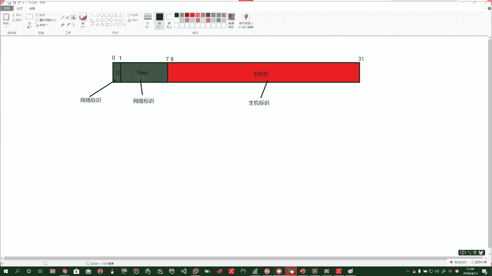

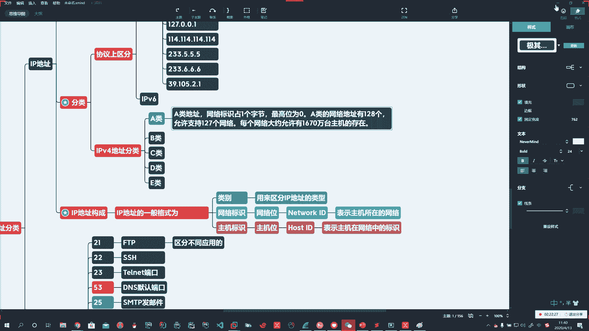

这样的网络IP啊，否则家用的不可能给你个A类地址，用不起啊，那是巨大的资源浪费。

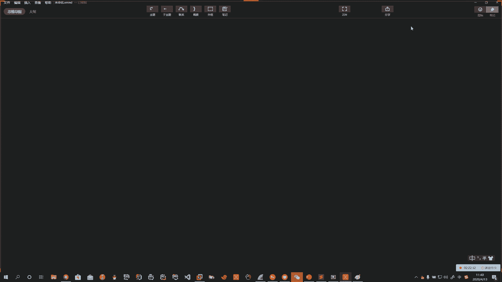

。A类地址啊。通常。用于。啊。网络运营商。啊。对吧哎，internet。就是我们的互联网。主干网络。啊。或超大型公司。啊，比如谷歌。啊。比如IBM。Okay。啊，等。那这些公司人说为什么谷歌呀啊。

你像谷歌的服务器遍布全球，每个国家基本上都有。2。哎，这就是A类地址啊。那么B类地址。Wish。B类地址。Oh。还有C类地址。B类地址啊啊。😡，Yeah。B类地址呢其实呢跟A类差不多。啊，跟A类差不多。

那么也就是前两位。啊，我们也称之为。高位。啊。高位，那么也叫做高两位。🤧嗯，嗯。

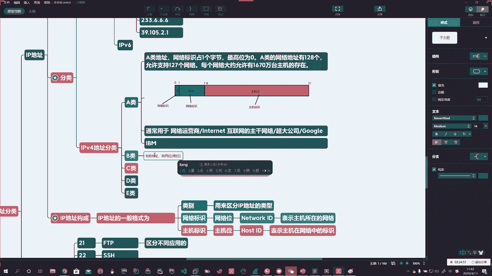

从编程的角度啊，我们再给大家介绍这个网络位的时候，由右到左从低到高。所以这边啊左边这边叫高位。右边叫第一位。啊，所以一说高两位就是从左边往后数俩。啊，就是高两位的意思。

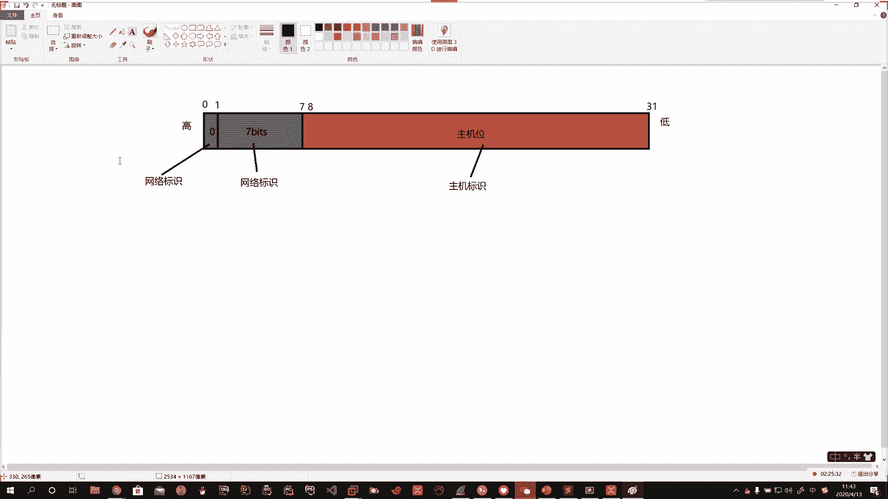

好，那么。B类地址呢就是高两位啊，是表示它的网络标识。Okay。Okay。高两位来表示网络标识。Oh。好。中间儿啊。16位。啊。那也就是说钱啊两个字节。啊，两个字节。表示。网络。哦。标识。后边两个字节。

表示。主机标识。啊。两个字节两个字节，也就是前16位。和后16位。啊。那么B类地址通常。用于。节点。比较多的网络。啊，比如说区域网。啊，所以前两类地址都用的比较大。啊，都比较大。好，那我们也画一下啊。

我简单的也给你画一下。

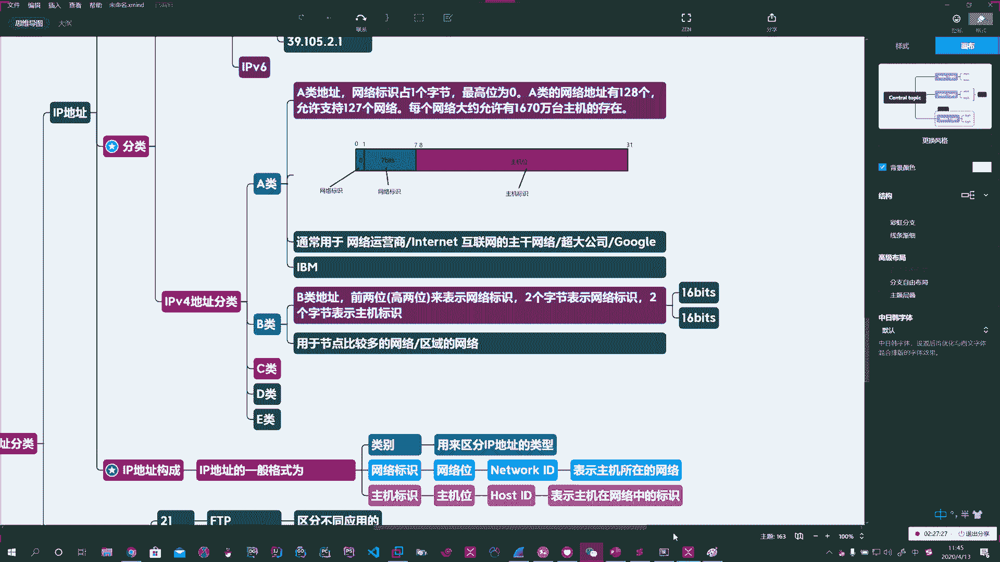

B类地址。哎，复制一下啊，C类的。好，咱先说B类啊，32位对半匹。好像画的不是多对半啊，是这意思吧？这边16位。这边16位。啊。0。31。啊，0321。那么中间撇这多少呢？16位。

16就是0到15表16。啊，后边这边是16到31。Okay。然后前两位啊高两位，那就。高一位。高两位。啊。一。2。Yeah。啊，12，那这就是标识，就是注意啊，它B类前边是一。后边是0。

说在它转化成二进制，在这数据存储时，一遇到这儿啊，10就是B类的啊，遇到零就是A类的。啊，然后2到15这是多少呢？16刨2，这是14。所以这前14。哎，这14位。网络标识。啊，后边这16位。主机标识。

Yeah。啊，这就是B类地址。

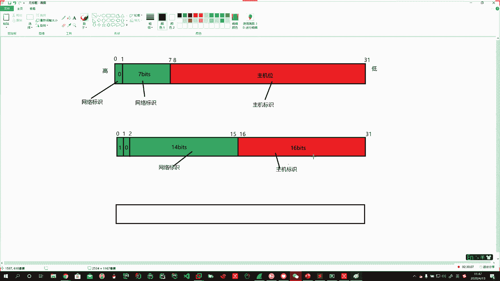

好，那么这个B类地址啊B类地址。我再多给你说两句啊，说10块钱的。哎。B类地址它允许有。16000个。网络。每个网络。大约啊允许有。66000台。注地。啊，所以这个东西呢66000台。

那你一时半会儿的你也用不着。啊。好，跟我们息息相关的很重要的啊C类地址。C类地址是最常见的。网络标识位。啊。也就是说，高三位。啊，高三位。用于表示类型。啊，用110。表示。网络标识占三个字节。

主机标识占一个字节。加一块儿正好是332位啊。一个字节8位。好，前边那你既然前边网络标识占三个字己啊，那就是24位，对不对？所以C类地址啊支持有多少呢？大约有。20多万个地址啊，20。啊，20。呃。

这是多少来着？这值。我记不住了啊，大概是20多万吧。啊。大约20万个。网络。啊。那么最后一个字节，那就是8位呀啊最后一个字节表示主机。啊，标志主机。那么最大值我们说了，最大值是256。

但是实际上能表示254个主机。啊，最多能表示254个。Okay。好，这句话怎么来的，怎么去理解？你不说能表示256个吗？但实际为什么又254个？因为有一些。特殊的IP地址。啊，用不了。Okay。

比如说这个值是从零开始到256啊，到255。首先第一个这个零你就用不了。啊，零就特殊。通常不能分配给主机。啊，他表示IP地址断。通常我们用来来表示一个段啊。比如说192点168。0。0啊。

这就表示这个地址断，但是它不分配给主机，所以你256这就减1。把零减去，这就剩255了。另外有一个啊255这个数也不能分配给主机啊，这个也是特殊的。啊。在网络中，这个255它是广播地址。啊，系统预留的。

他用的你也用不了，所以256又键一啊，这是254。所以192。168。0。255这样的数据啊，你用不了不分配给主机的广播地址。啊，所以你就记住啊，掐头去尾就行了。

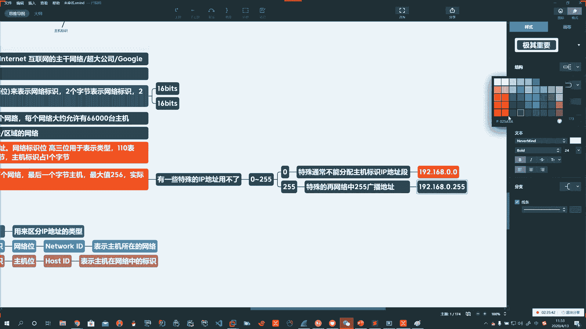

掐头。啊，掐头去尾法。前面跑一个，后边跑一个啊就行了。哎，这是咱们说的C类地址啊。呃。呃，通常啊就是我们小型网络啊。你看你们家里头啊，对吧？哎，家里头就是。对吧比如办公室。小型局域网。啊，小型菊有啊。

别大了啊，小型局吧都可以。

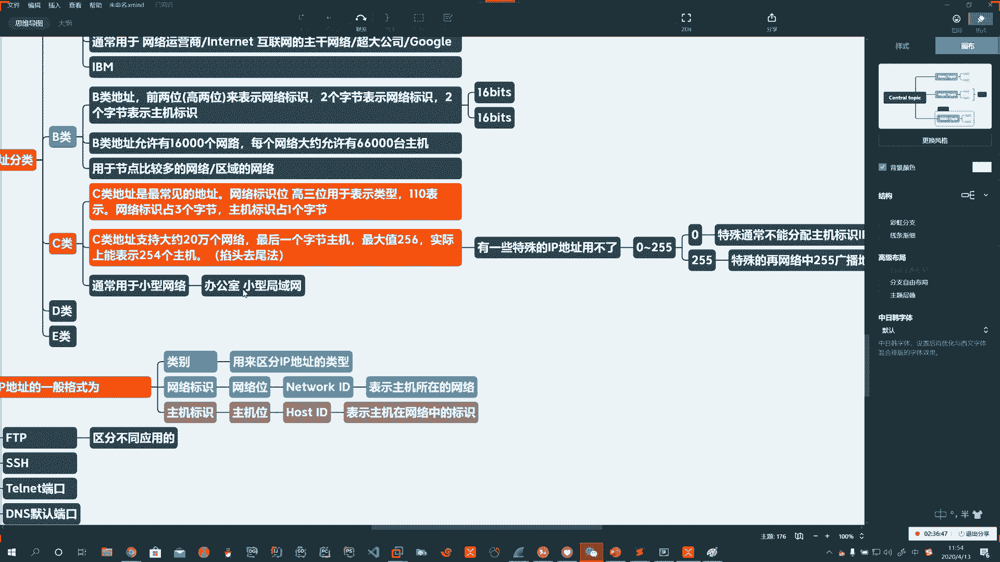

那么C类呢，这个IP地址呢，我们也给大家画一下啊。大概是这样的啊，分三份嘛。前边都是标识网络的，后边是标识主机的。Yeah。Yeah。啊。那么还是那你32位呢，前边是0，这儿到31。Okay。啊。8位。

啊。那么这儿呢他占了多少呢？三个字节啊23。后边24。啊，欧罗尔斯。那么高三位啊，24减321，也就是21位。啊，表示标识去了，高三位把高三位拿出来。个二。高2。Call3。啊。那么他的代号是。1。1。

了。一。2。3。Okay。好，前边表示支持多少个网络，后边支识表示多少个主机啊，那这就是A类。B类。死咧。

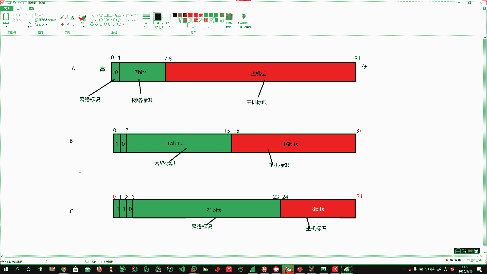

。

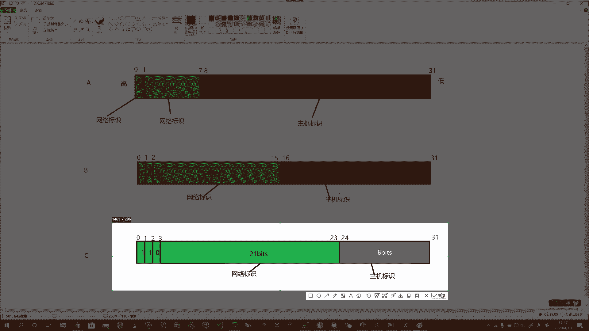

Yeah。

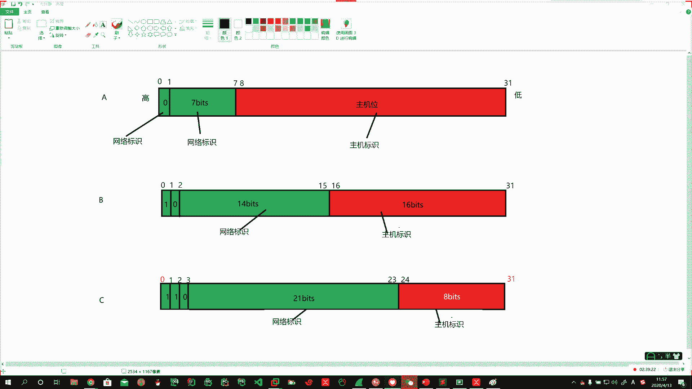

哎。

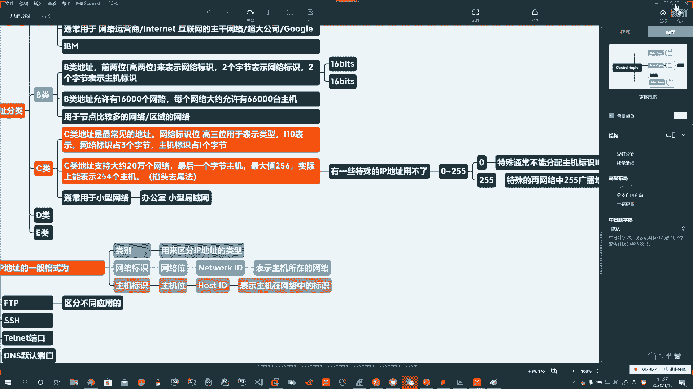

。

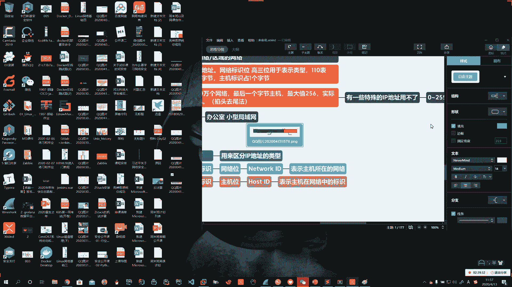

。好，还有D类和E类啊，D类和E类。D类地址呢这个地址呢都比较新。啊，那么地类呢一般呢就用于多波地址。啊，我们也称之为多波地址。啊，E类地址呢现在基本上还没什么用。啊。所以E类呢现在都是啊此类地址。

为保留地址。Yeah。啊，E类地址呢就是保留地址啊，那根据往下推，D类呢就是在啊你C类的基础上高4位啊，就是前四位呢，它是用来表示什么呢？啊，用11。10表示。啊，表示用于主播的。

比如说做视频会议啊等应用，就得实现这个主播的技术啊。所以说呢他这里头主播地址，它这么占。啊，他这么站，就是高。高4位。表示网络。啊，标识。1110。后边啊24位。就是多波地址。啊，多个地址。

我就不给你画了。啊，我就不画了。E类呢这玩意儿现在呢那个你哎呀。了不了解，我觉得意义不大啊，也是高四位。网络标识类型啊，注意啊，高四位1111。啊，知道这儿就得了。好啊，然后哎12点正好啊。

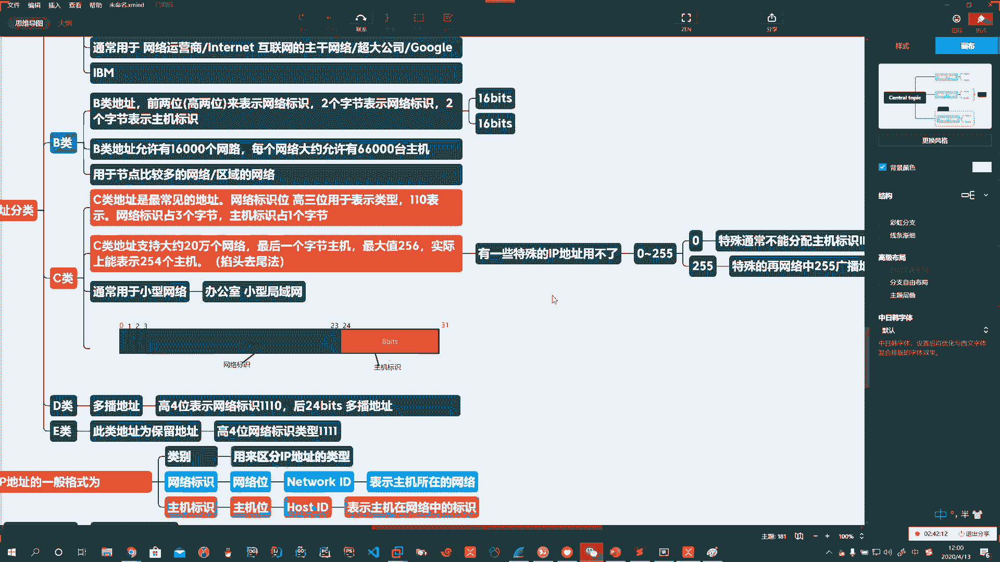

好，然后还有一个知识点，我说完了咱就吃饭啊，你忍2分钟，一分钟就能说完。IP地址的。分类开始字段。啊。好，A类。B类。C类。D一类。E类啊，我们先说C类的啊，最重要就是什么开始啊，192。啊。

192开头的。到233。你只要见到这样的地址，开头的都是C类的。啊，A类地址呢是从什么时候开始呢？000。啊，到127。B类呢就是。128啊到191。D类啊。224。到239。E类。240到255。は。

好，重点掌握C类。啊，其他的了解即可。

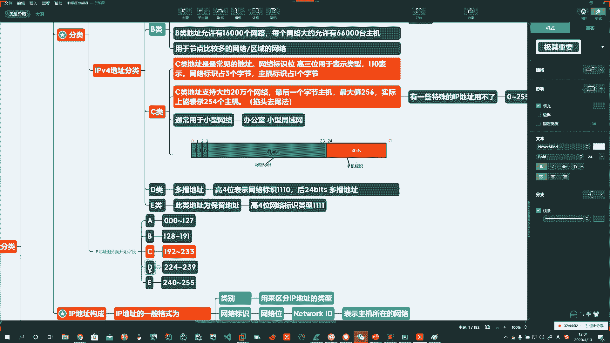

好，那咱们今儿啊就说到这儿。