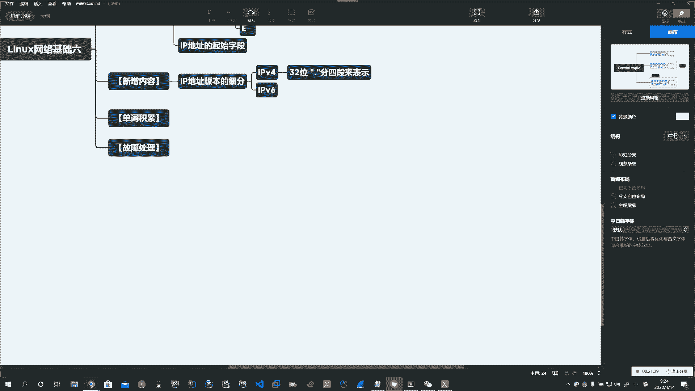
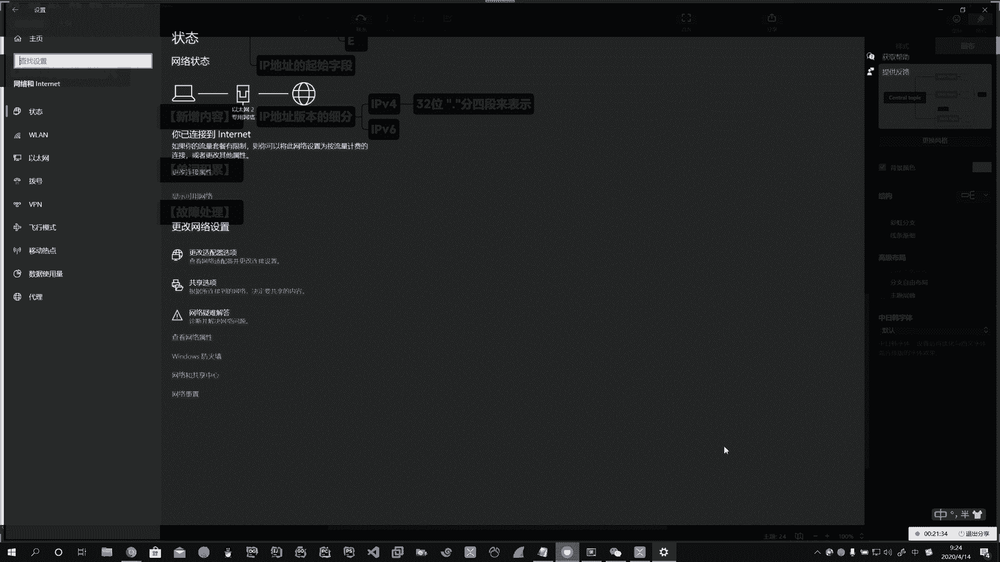
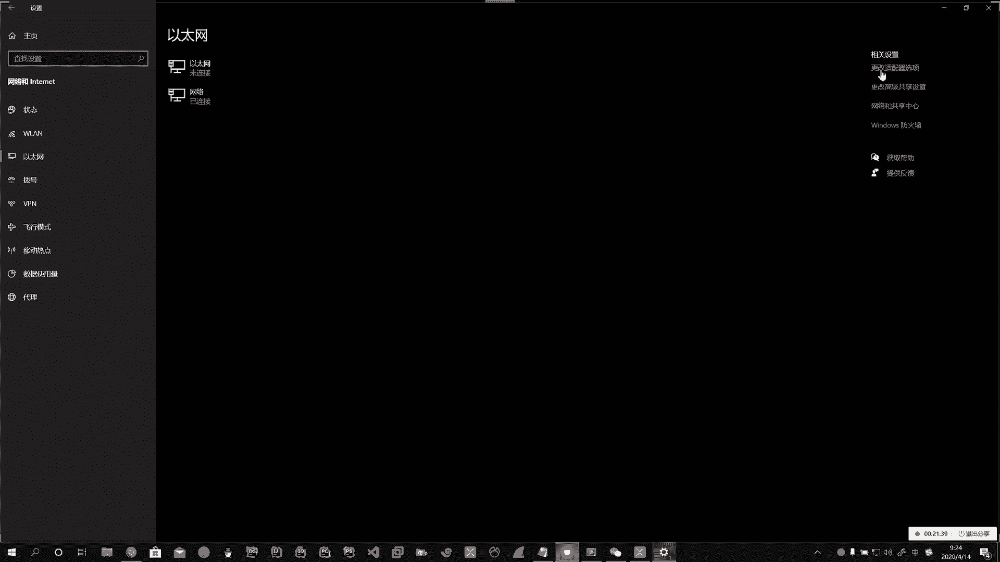
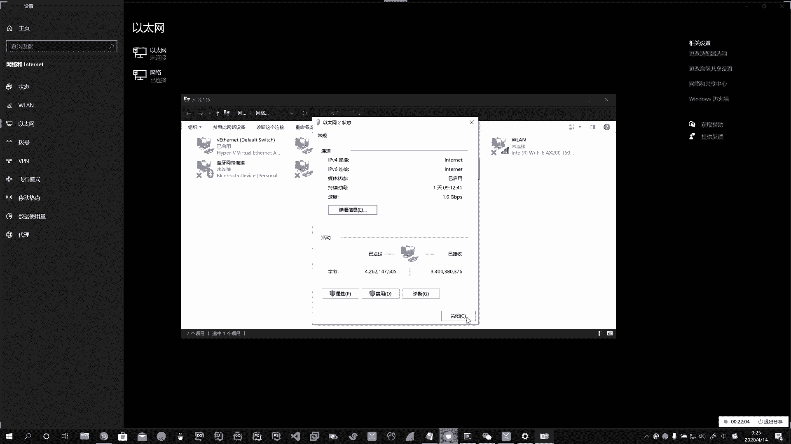
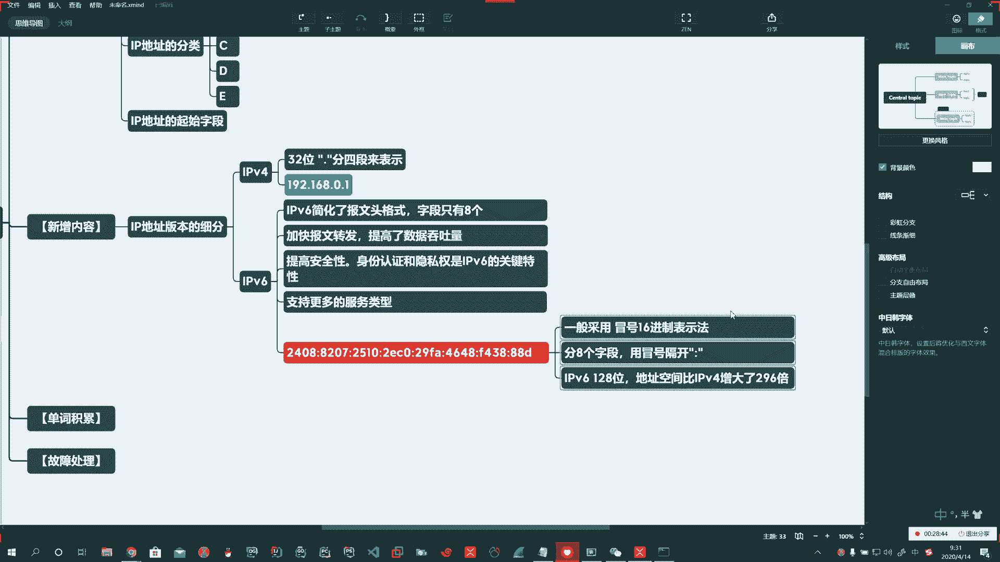

# 系列 3：P169：【Linux】IPv4和IPv6介绍 - 马士兵_马小雨 - BV1zh411H79h

好，在昨天的基础上啊，我们。需要深入的去学习。啊。那么今天新增的一个内容呢，首先第一个啊，那么就是对。IP地址。版本的细分啊。我们介绍了IPV4，那我们也要介绍一下IPV6。

因为现在一些大厂呢已经开始了。啊。使用它了。后边这个V4V6啊，就是IP协议的啊后边的这个版本。那么我们说到了啊IPV4呢，它是32位。啊，中间呢用点隔开。啊，分四段。来表示啊。

对吧所以我们说的点分二进制的形式给大家去表示了这个。啊。好了，这是第一个啊，咱们给大家介绍到了这个IPV4。啊，和MPV6。啊。那么除此以外呢，IPV6。啊。也已经在我们平时的啊这个工作中啊和生活中。

大家呢也能够见得到。好，那么IPV6长啥样啊，你可以呢在你的。啊，在你的这个右下角的小窗户这啊，网网卡标识这。

啊。状态。对吧哎，这里头就有IPV6的地址。好。

复制不了啊复制不了呢，我们到。终端线。输入IPconfi斜杠O。啊，斜杠O。那么本地连接的IPV6的地址。啊，IPV6的地址，这里头就有。啊。对吧哎，上边也可以啊，IPV6的地址。

你看你那note8都有IPV6。对吧。好啊，这是IPV4和IPV6的地址。好，到IPV6了呢，我们简单说一下啊，简单说一下。那么。IPV6和IPV4啊，他们在爆文格式上略微有所不同。啊，那么IPV6啊。

简化了。豹纹格式。啊。は。好，在原来的版本上进行升级。啊，那么简化了报文格式呢，它字段。只有8个。啊，只有8个。那么。好，用IPV6的好处呢能够加快。报文转发。提高。数据的。吞吐量。哦。

这是用它的一些好处啊。好，然后能够干嘛呢？能够提高安全性。身份认证。和野私。啊。我也是。呃，身份印证呢和隐私权呢是这个IPV6啊。关键的一个特性。Yeah。但是呢我们在国内啊，你见到的还是少啊还是少。

但是呢未来呢是个趋势啊。现在呢还是传统的IPV4多一些。明白吧？啊，那么在这个IPV6呢，它支持更多的服务类型。啊，所以呢我们有一些在学习的这些协议啊，将来呢它也可以继续演变啊，演变到支持这个IPV6。

那么这里头就是我们1个IPV6的一般格式啊，那么它的表示方式。它的表示方式，那么跟我们传统的表示方式是不一样的啊。那么IPV6呢，它一般采用。啊，它一般采用了什么呢？啊，这个叫冒号。十六进制表示法。

Okay。啊。十六进制表示法12345678。冒号隔开刚才不是说了吗？字段有8个啊。分。8个字段。啊，8个字段。用。冒号隔开。啊，然后他表示的这些数是十六进制数。아。哎，那我们说了说IPV4是32位啊。

IPV6是多少呢？IPV6啊是128位。啊。那么地址空间就比啊IPV4。增大了296倍。啊。所以IPV4啊，我们这么多年了，可能会面临着地址枯竭的问题。哎，IPV6就能很好的解决这个问题。哦。Okay。

好，这个是我们说的IPV4IPV6啊，你掌握这些即可。

