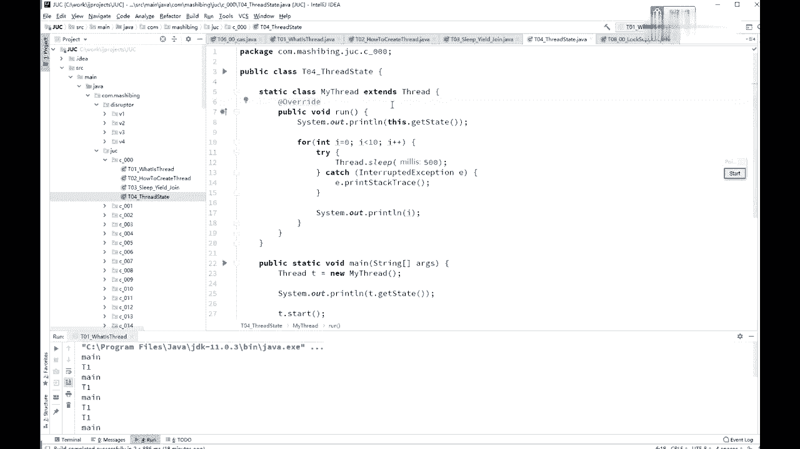
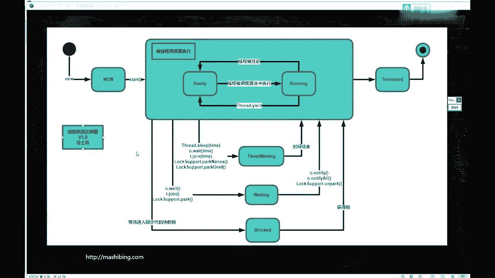
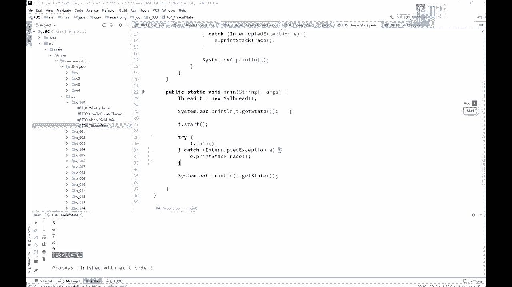

# 花了2万多买的Java架构师课程全套，现在分享给大家，从软件安装到底层源码（马士兵教育MCA架构师VIP教程） - P16：【多线程与高并发】线程的状态 - 马士兵_马小雨 - BV1zh411H79h

讲下一个小节呢叫做thread state，the threat state的意思是thread常见的一些个状态啊，这些状态呢有的是你能够用程序测试到的，有的那是不一定能测试到的，但实际上确实存在的。

那么这个状态呢我画了一张图，图呢在process on里面，我我就不专门打开process on了，这是，java里面的现成的状态的一个迁移图，我们来大概的，来看看一下啊。

这是我们的线程状态的一个清晰图，这个县城呢目前其实有这么几个状态，一共是几个状态呢，1234566个状态是最常见的啊，呃听我说这个状态呢叫new，当我们new一个县政府。

就是他最新创建出来还没有调用start new thread，完了之后，诶这个时候呢他是new状态，当你调用了start方法之后，它会被线程调度器来执行，也就是交给操作系来执行了，那操作来执行的时候呢。

这个整个的状态叫rav，java里是有这么一个这么一个状态的，叫rnb，所以我才会说这是1234566个绿颜色的点啊，这个大的它代表一个，然后来说是666个状态。

但实际上这个radio呢实际上它内部有两个状态，第一个呢叫ready，就是就绪状态，第二个叫running，确实在运行的状态，所谓的就绪状态指的是什么，就绪状态。

就是说嗯我们扔到cpu的等待队列里面去了，在这个等待队列里面等着他排着队，等着让cpu运行呢，就是这个概念好，这是叫ready，真正的扔到cpu上去运行的时候，这个状态呢叫running。

这两个呢都叫做rnv，所以thread ero的一旦调用的时候，会从running状态跑到ready状态去，现场被调度去选中执行的时候哎，又从ready状态跑到running状态去，这个意思。

当然你如果顺利的执行完了好，进入terminated的结束状态，大家需要注意的是，你terminate完了之后，还可不可以再调用str，回到new状态，再调用star的不行，这是不被允许的。

你完了这事就结束了，你想thread结束完了之后再调用那个thread的start方法，sorry，没有不行不行，不可能，在radio这个状态里头会有其他的一些状态的变迁，还有什么状态呢。

time waiting，等着，waiting，等着，还有block的阻塞，那什么叫用什么情况下进入阻塞，synchronized，加上同步代码块，进入到那个代码块里头的时候，没有得到那个锁的时候。

我这段代码写了synchronize，但是呢我还没有得到那把锁，阻塞状态，获得锁的时候，诶跑到就绪状态去运行，在运行的时候，如果说调用了weight，调用了join。

调用了park进入waiting状态，调动了notify，notifall或者on park又回到rable状态，这个rable状态是ready和running的两个两个状态。

好的time的规定呢其实就是说过一段时间按照时时长来等待，过这时间的自己，时间结束自己就回去了，就这意思，sleep wait join techinos以及puntil。

这些都是关于时间的等待的这些方法，ok看看这些关于线程状态里面有没有同学有疑问的点，真的是说哪些是操作系统管理的，哪些是jvm管理的，这些全是jvm管理的，因为jvm要管理这些状态的时候。

也要通过操作系统，所以呢你你你你说哪个是通，哪个是操作系统，哪个是jvm，他俩分不开，j vm是跑在操作系统上一个普通程序，现场什么时候状态会被挂起，挂起是不是也是一个状态嗯。

对这时候这个就是没有讲操作系统的一个毛病之所在，但是我讲完这个操作系统这个可这部分你也就听明白了，很简单，就是running的时候，你在一个cpu上会跑好多个线程吗。

然后cpu会隔一段时间执行这个线程一下，隔一段时间执行这个线程一下，这个是cpu内部的一个调度，把这个线程扔出去，从装那个状态扔回去，这就叫线程被挂起，cpu控制它，这就叫线程被挂起，听懂这意思了吧。

就这么简单啊，别想那么多，就这cpu路到时间了，我可能隔十个毫秒运行这个隔十个毫秒那个，然后十个毫秒呢，我把这个线程扔出去，那个线扔出去，这个县城就被挂起了，杀死县城算不算terminated，算啊。

你现程都结束了，都已经杀死他了，当然算terminated的了，这个线程和操作系统里面的线程是一对应的吗，要看你jvm的实现，gm的以前的时间是一一对应的，现在是不是一对应，不好说。

最起码先程和里面的线程10000%是不是一一对应的，所以这个东西呃，其实想想看，你也没有什么其他的方式应该来讲啊，我虽然没有读hobo源码，但是在hospital的实现里头，正常应该就是一对应的。

连体的操作系统里有贪的东西状态，你去查一查，操作系统里都看，你这个，你操作系统啊，他也现在这个课程呢也在不断地往前进，理解这个状态是什么意思就行了，他们的规定就到时间了，加一个定时器嘛。

到时间了就会刺激它，ok回去你可以继续运行了，这意思啊。

好我们来看这个小代码啊，在ths lat头写了一个小小的代码，代码呢呃，怎么样得到这个线程的状态呢，是通过这个线程的get data这个方法就可以得到这个线程的状态，ta start嗯。

你比如说你刚开始new这个thread还没有启动的时候，那在什么状态呢，就像我刚才讲的那个那个那个那个图，这时候什么状态，new状态对不对，start完了之后呢是rable状态啊，然后t。join。

join，肯定他结束了，最后是terminated的状态，好不好看，嗯得等他结束啊，612345678 90啊，上面那个。

ok那么你自己如果想说是呃waiting和time waiting block的这些状态的时候，呃，像blog的那个状态，你很难测试出来，为什么，因为他block你那个在它中间做输出的时候，啊也可以。

你用另有另外一个另外一个线程正好在他等待的时候输出，必须得正好在这个线程等待的时候，另外一个线程做输出，这时候可以达到得到这个现状的状态，那那我再说一下啊，这个线程状态啊不是很重要的一个知识点。

问到的人也极少，面试问到的也特别少，我们作为学术上的研究，只能说是这样了解就行了好吧，当然学术研究有好处，你了解了这个现状状态之后，后面我要讲操作系统的时候，其实呢九分钟这个状态呢是一样的。

只不过在操作系统层面呢，它叫做进程的状态，ok，呃在linux上的线程的实现呢是叫做轻量级的进程，所以它和一个进程的区别并不是特别大，它是一个技能的概念啊。

