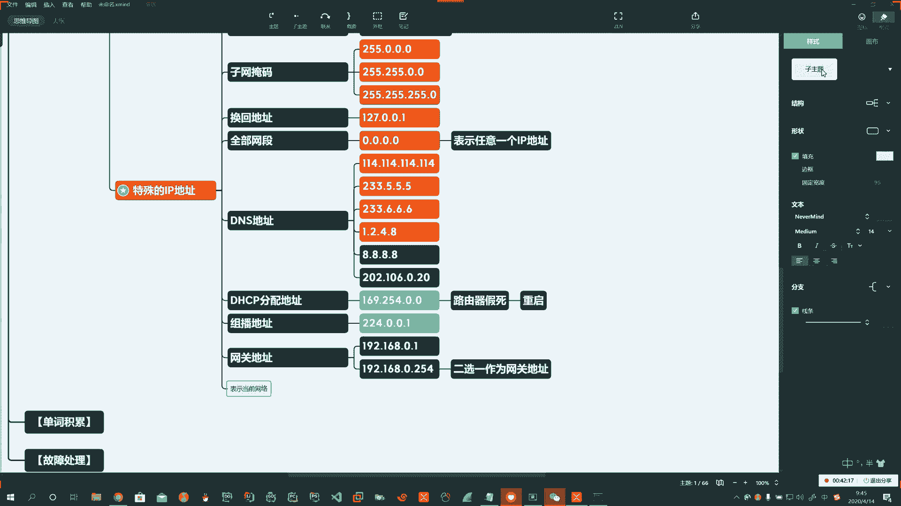

# 系列 3：P171：【Linux】特殊的IP地址补充 - 马士兵_马小雨 - BV1zh411H79h

哎。还得再补一个啊网关地址。

我们所说的网关地址啊，一定要注意啊，你这个网关地址啊，它也是一个主机。啊，就是你一台路由器，它也会分配1个IP地址，它也是一个主机啊，它首先它是一个可用地址，所以我们通常见到的192。168。0。1。

啊，这就是起始的第一个有效地址。

然后获者192。168。0。254。啊。

，这里头选一个。作为网关地址，我们通常是这种情况啊，通常是这种情况。那么有通常就有不通常啊，有的同学说我用一个。192168。0。2行不行？可以啊，可以，没问题，那也对。啊。

但是我们通常都用第一个或最后一个掐头去尾，这样的话呢好记。啊，主要是好记。

明白了吧，哎，主要是好记。啊。

那还有呢表示网段的啊部分网段的。

表示当前网段哎。

，说我现在IP地址是1921680。100。

那么如果要表示。当前你所在的网络。啊。那么也就是说我用192点168点0。0来表示。

这点0。0啊就表示你当前所在的网络。

