# 系列 3：P172：【Linux】私有IP和公有IP的介绍 - 马士兵_马小雨 - BV1zh411H79h

除了从协议版本上分，我们也可以通过国际通用的办法，可以分ABCDE类。那么还可以对IP地址进行细分。比如说我们这里头从它的用途来说啊，还可以分为私有IP。

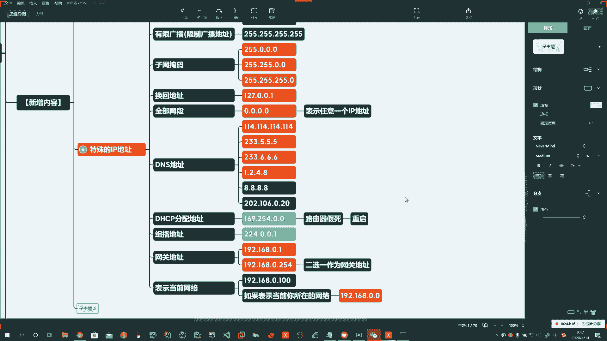

和公有IP。Oh。好，这又多了一个分类哈，私有IP和公有IP。那么我们先说说私有IP啊。公有IP。这两个东西呢就对应了两个网络啊，私有IP就对应的私有IP的网络。公有IP呢就对应着公有IP的网络。啊。

私有网络是干啥的呢？哎，就是不接入。私有网络就是自己用的。内部网络。就是我们通常的内网。不接入。啊，不接入移动互联网啊。啊。就是你通过外部的，你访问不了。好，这就是私有网络啊。

咱们所说的这A类、B类、C类，如果再细分，它们都属于啊。

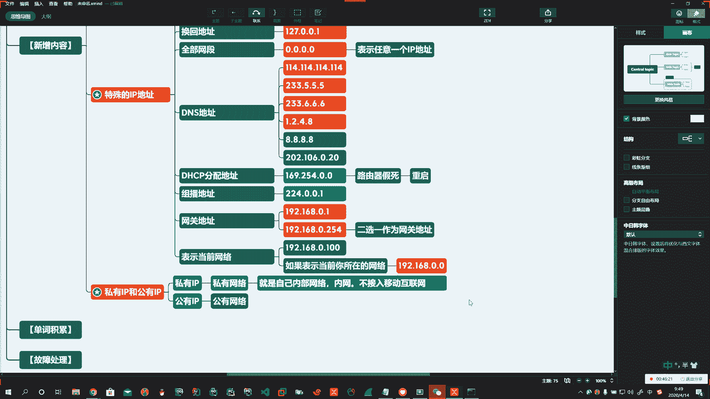

像咱说的A类地址。B类地址。对吧？C类地址，这样的地址等啊等。

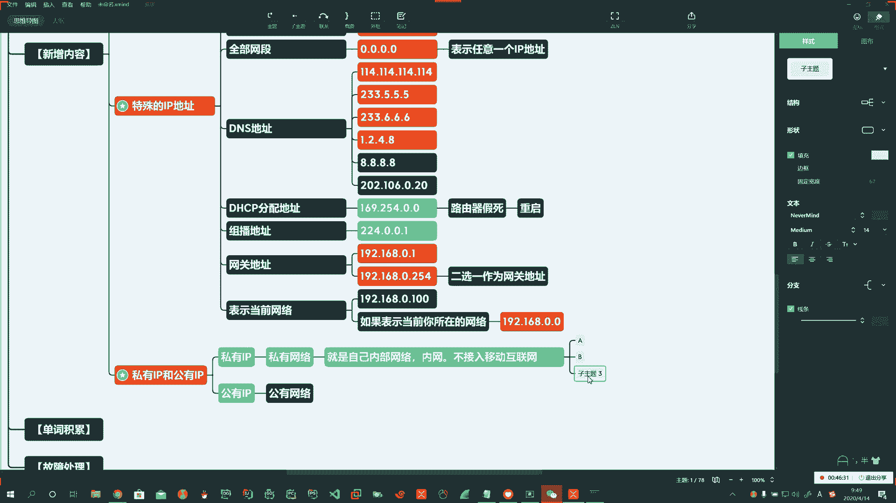

Okay。都可以是。啊，比如说A类的是吧，10。0。0。1的这样的哎，私有的对吧？C类的，你那192。168。0。1的啊私有的。这些IP地址你在外网去访问他的话，都不能直接去访问。啊。

都不能直接访问得到。所以这些东西都是我们自己私有的IP地址段啊，私有的IP地址。那么公有网络很显然啊，那么你就接入的是啊。就是在移动互联网啊，移动网络和互联网络啊。网中的主机。啊，有公网IP。

在全球可访问。所以如果你要有公网IP呢啊那就比较方便了。通常呢都是咱的服务器网站。

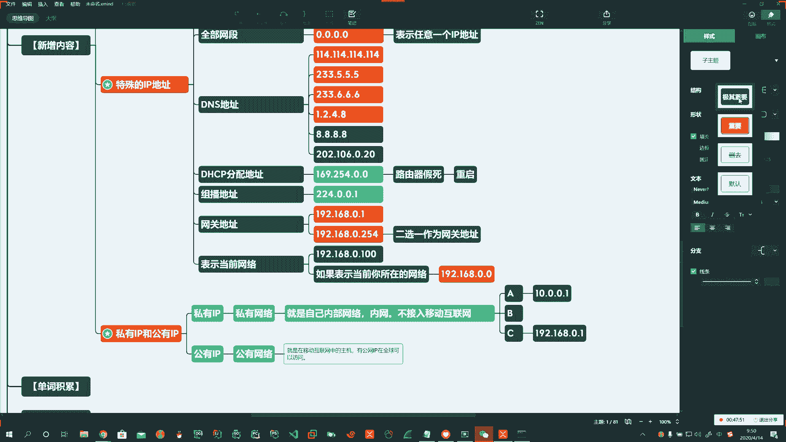

啊。比如服务器。Oh。Okay。诶。全球都可以访问。当然这是理论上的啊。在我们国内。部分网站。受限。这是人为造成的啊，其他国家都可以的。Yeah。比如说youtube你上不了，比如说谷歌你上不了。啊。

比如推wi特你上不了，比如facebook你上不了啊。那么我们就需要使用一些。科学上网的啊办法，你才能访问。

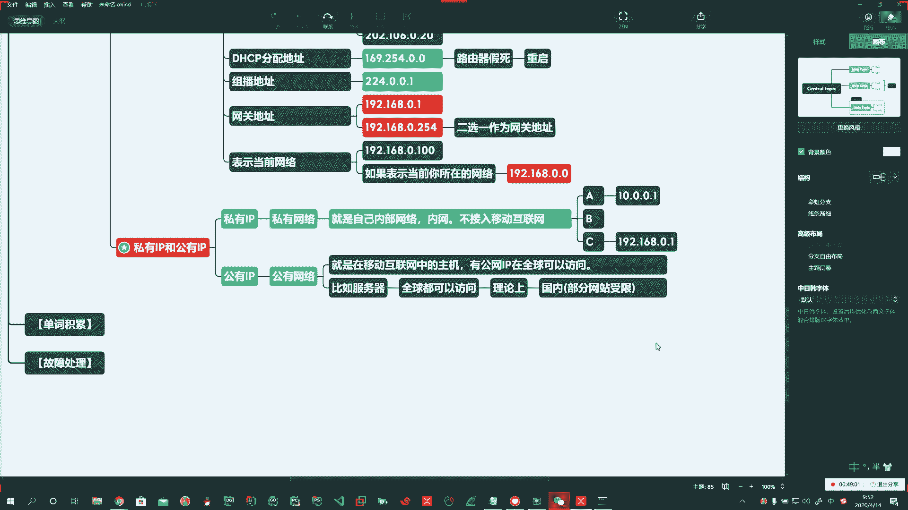

啊，那么这样暴露在你的互联网上，谁都可以访问，那也就是会造成你的安全问题。啊。一是安全问题，2一个是性能问题。🤧嗯。🤢，啊。哎，安全问题呢，那你电脑要这个这个配置要不够高的话啊。

可能呢你直接就被人家黑掉了，对吧？所以你这里头有什么数据啊，什么就不行。第二个呢，访问谁都可以访问，访问的人多，那你这个性能那也不行。2。所以我们怎么获得公网IP地址呢？哎。第三个就是费用问题。

也就是说成本。啊，比如自承本资费啊资费问题。说你装一个中国联通家用的都不给你报一个公网的IP地址啊，企业的才会有。那你去办这个的时候呢，特别贵。啊，费用高。一个公网IP地址。啊，一年。就一个地址。

一年应该在。4万啊左右。Oh。啊，我们也可以通过一些，比如内网的主机，让外网能够访问。比如说我们通过啊动态域名解析是吧？通过内网穿透等等等等啊。

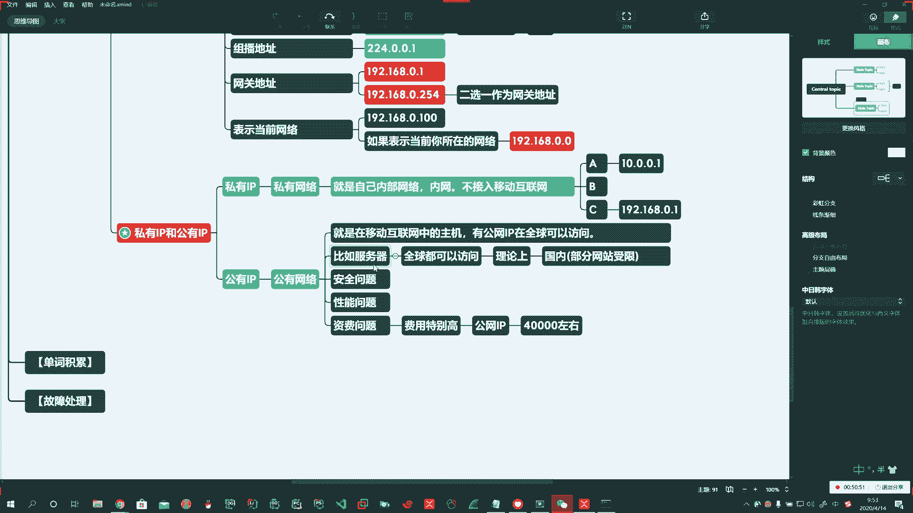

好，我们简单介绍一下。那么如何来获取你一台电脑的公网IP地址呢啊。比如说你买一台阿里云。啊，比如说你买一台阿里云啊，然后。阿里云上的主机，那你就是公网都可以访问。他会给你1个IP地址。

比如39105点2。1。啊。哎，这样的话就典型的一个公告IP机制啊。那么我们普通老百姓这些电脑，实际上呢你映射出去呢，你也有是一个公网的IP地址啊，也有的那我们怎么来拿到自己的公网IP地址呢？

你就输百度，然后输IP。

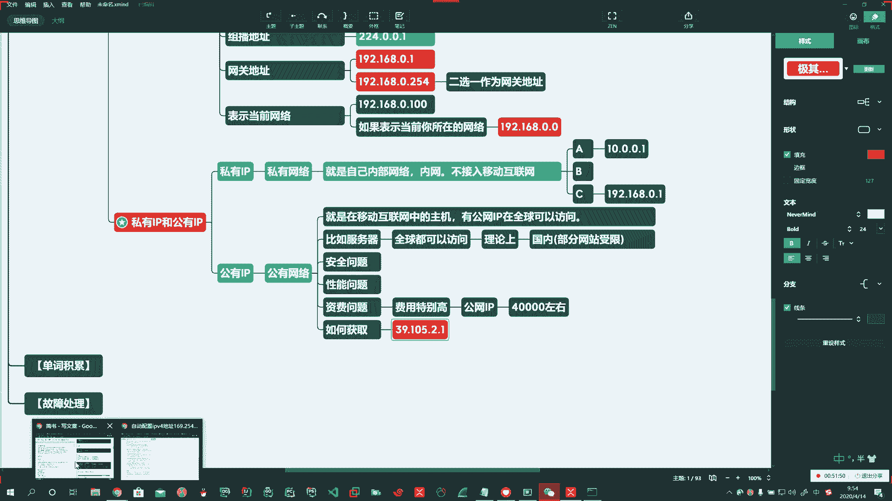

对吧然后呢他就会啊在这儿显示出来你的IP地址。这个地址就是你的公网IP。啊，你的公网IP地址。那么或者呢你输IP138这网站通过这个网站上去以后。这儿可以进行查询。啊，这可以查询。Yeah。

对吧你获得的这些个数据啊。Yeah。就可以使。而且呢通过你的IP地址，它还能够获得到你的地理位置啊，北京市。好，还有公共的DNS，你看啊公共的DNS它会有很多啊很多。

所以大家呢如果有时间呢啊你可以呢把这个网址呃，你看一看这里头大家看到的这全是特殊的DNS。

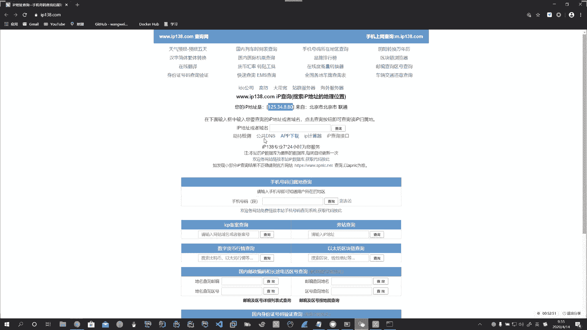

啊，百度的也有啊180767676。Oh。啊，包括电信各省市的电信啊。联通移动是吧哎。那么找到1个最快的DNS能够加大你的上网的速度啊上网的速度。谷歌DNS8。8。8啊，对吧？8。8。4。4IBM的9。

9。9啊，这些都是啊。所以特殊的IP地址自己还可以在网上去补。

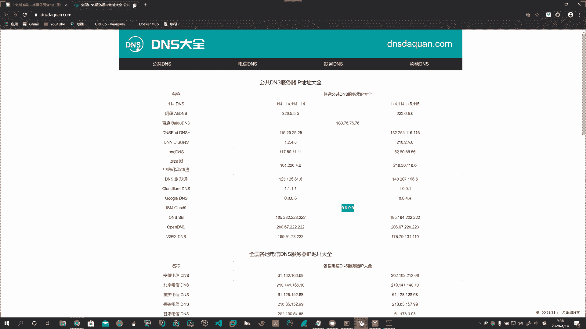

Okay。好，这儿呢给大家说了啊，如何获得公网IP地址啊，通过IP138。

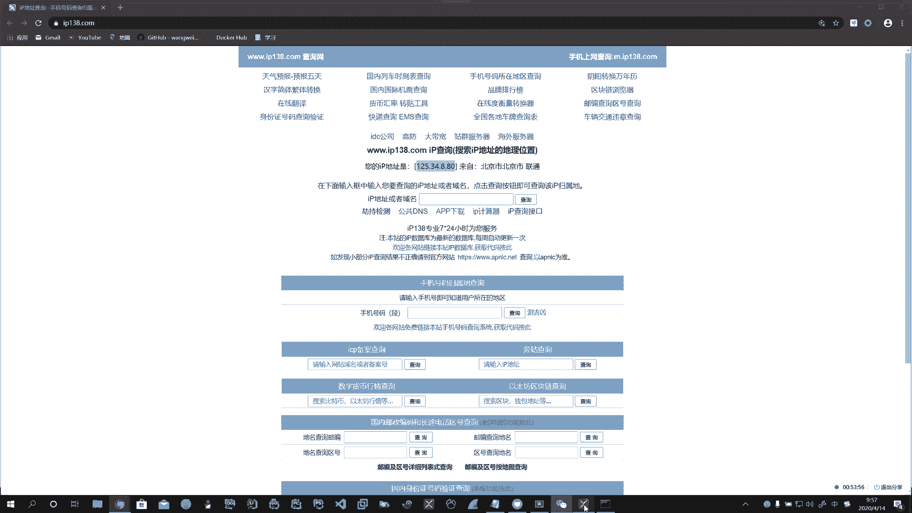

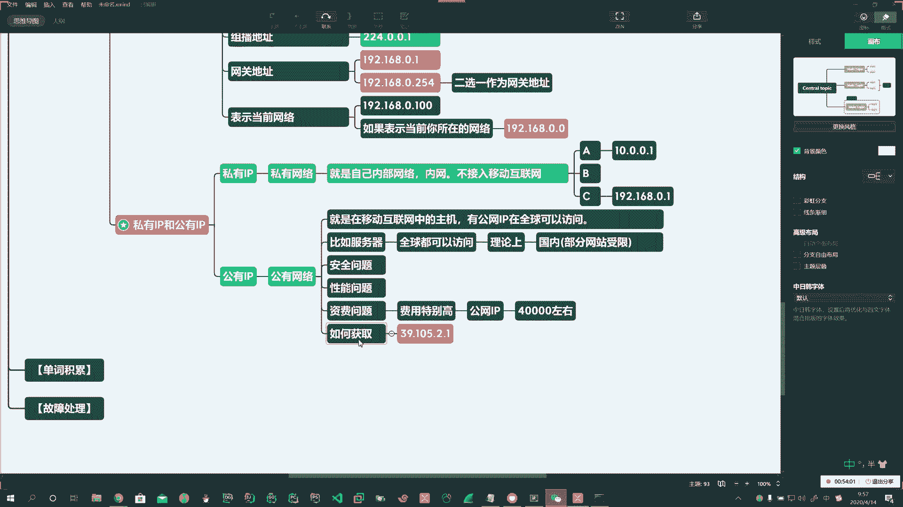

啊，IP138。那么通常我们家里的电脑就做不了网站啊，家里的电脑，比如说80端口是封杀的。啊，80端口是封杀的。你进不来了。啊，进不来。进不来怎么办呢？我们平时呢可以通过内网穿透啊，可以通过其他的方式。

实际上外网也可以访问我们家里的电脑，也可以的。啊，也可以的，但是。

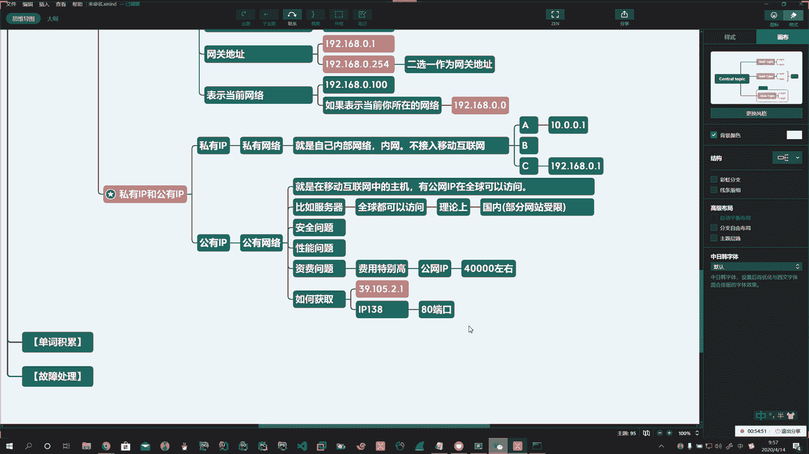

啊。

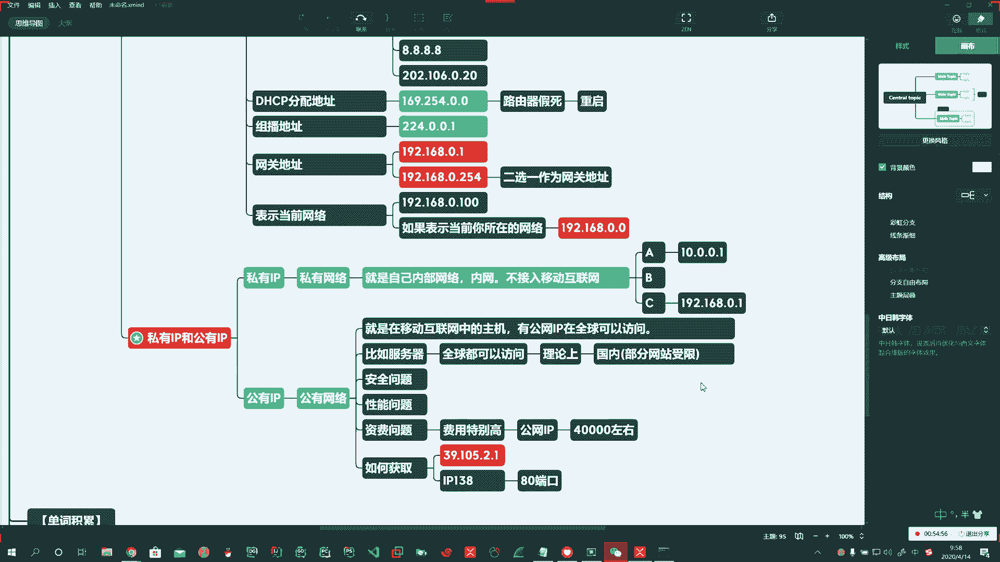

这个操作还是比较复杂啊操作比较复杂。好。