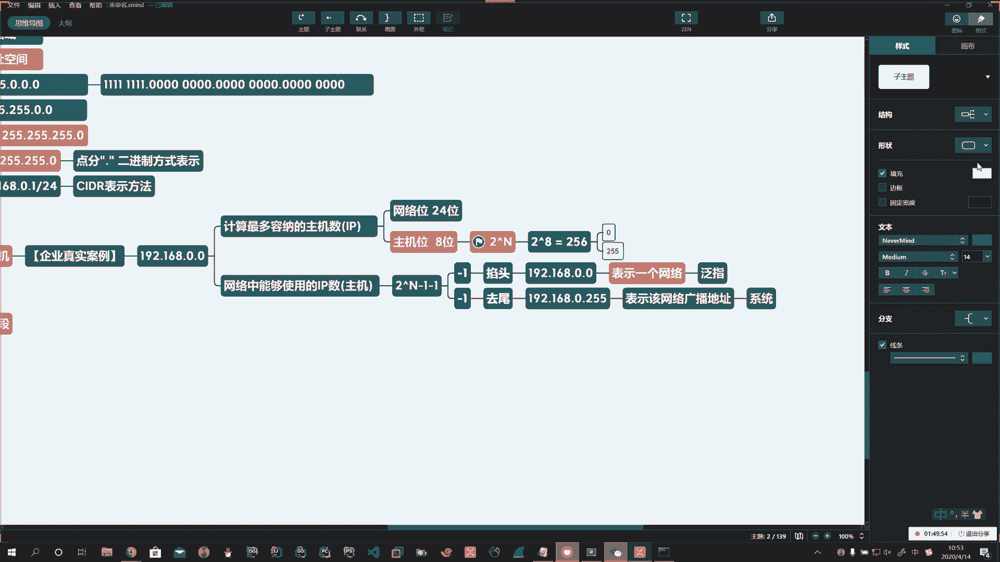
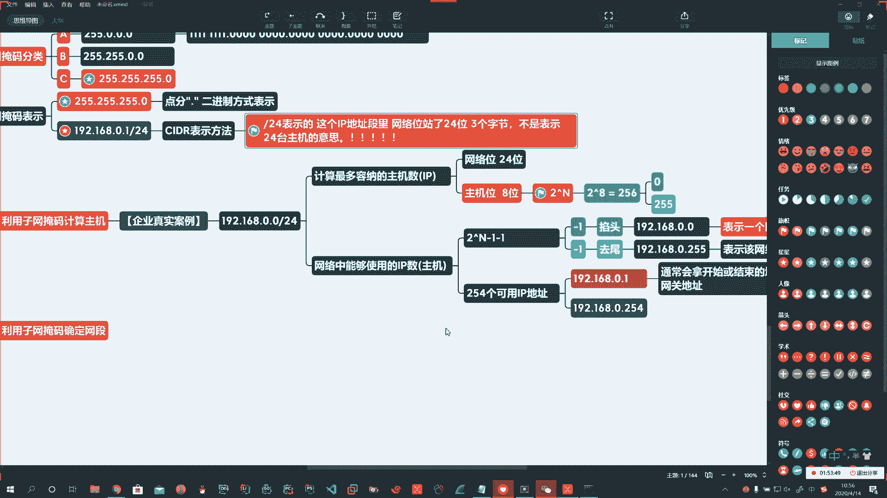
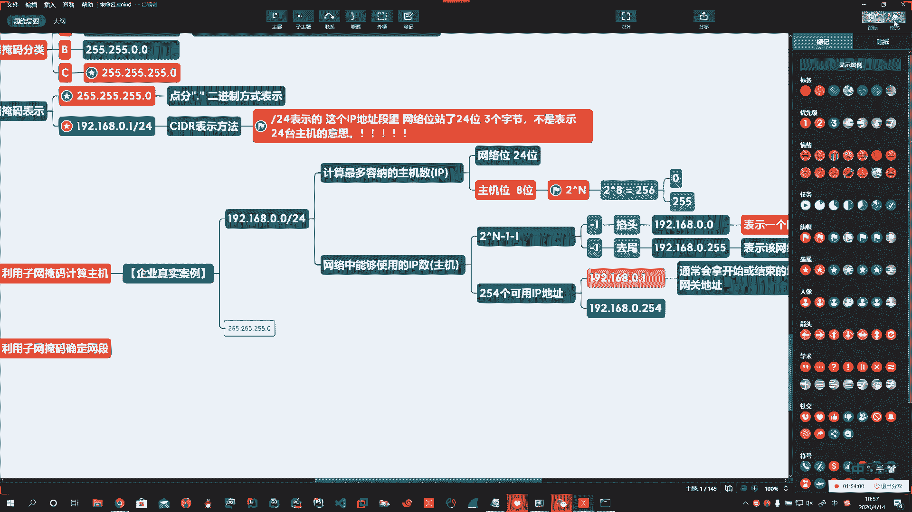

# 花了2万多买的Java架构师课程全套，现在分享给大家，从软件安装到底层源码（马士兵教育MCA架构师VIP教程） - P174：【Linux】子网掩码的计算方法 - 马士兵_马小雨 - BV1zh411H79h

好，那么子网掩码有什么作用？说我们通通常怎么去用它啊，企业中真实的啊要求。

啊，怎么来干？对吧那么就可以利用子网掩码子网掩码作用啊。

Yeah。好，第一个。利用子网掩码。确定网段。啊，啥意思呀？给我们1个IP啊，我们就能判断它是在哪个网络中的。所以咱们路由器在根据寻址的时候，会把你这些IP都换成二换换算成二进制的这种形式来表示。啊。

然后通过你的IP地址和子网掩码，你给我2个IP我能判断他们俩在一个网络部。啊。如果在一个网络中是不是你的路由，哎，就是吧找到这个端口，不在另外一个不在一个网络中啊，这条消息可能就会被丢弃。

所以可以利用子网掩码啊确定网段。啊，确定网段。

第二个，我们可以通过子网掩码啊。啊，来。计算。主机有哪些？

我先说第一个，因为第二个呀涉及到什么呢？涉及到我们要把一个十进制转化成二进制啊。但是他俩都重要。我们先说第一个。咱们介绍一个企业真实案例啊，我们一切以实战为主和企业真实案例。啊我录没录啊。啊，录着呢。

Okay。Yeah。Yeah。企业真实案例啊。说。我如何去确定啊？我如何去确定给我1个IP地址，比如说192点168。点0。1。啊。或点0。0。这个网段让你去计算。最多啊。容纳的。主机数。换句话说。

也就是说你有多少IP地址的个数。这里头怎么算啊，看你的那个地址啊，你的网络位和你的主机位。C类地址，你的网络位是不是24位呀？啊，看你是哪类地址啊，也就是说。

网络位占了24位，一共32位。主机位占了8位，这加一块是32。

哎呀。

Yeah。

那么你后边这是8位，拿主机位啊，二的N次方。8位，那这就是二的8次方。Yeah。对。Oh。啊，这就是256。也就是说，理论上来讲，我能放这么多。啊，这个公式二的N次方，请你把它记住容意好了。

Okay。能容纳这么多的主机数，也就是能给你分配这么多IP不代表就能分配这么多主机。

啊。所以第二步啊。网络中能够使用的IP数。啊。也就是说能放多少台主机。

第一问跟第二问有点区别，你需要弯弯绕一点点绕一丢丢啊。第一问是总共能有多少个地址告诉你有256个，那有多少主机可以用啊，注意。

二的N次方减1再减1。有同学说，那不就是减2吗？是减2，但是我们得知道为什么减一再减1。

减去第一个。再减去一个，这个叫掐头。啊，这个叫去伪。所以减两个一是掐头去尾，掐的是哪个头？啊，掐的是192。168。0。0，这个不分配给主机。啊，它是形式上的，它代表整个啊。表示一个网络。啊，它是虚的。

就相当于我们说哎人。😡，那你说到底是谁？男的女的、老的、少的啊，高的矮的、胖的瘦的、黑的白的。😡，对吧哎，他是一个泛指。啊，泛指。所以不在我们。不在我们分配主机的时候使用啊。

所以这儿在理解的时候要知道它是一个泛局，表示1921680嗯，后边一直到254啊，表示这个网络。再次强调啊，他是一个泛指。啊，我们不拿它分配主机。

听明白了吗？系。掐头去尾去尾去的是谁啊，那么每个。啊，每一个网络都有它的最大值啊，你能放256个主机，从0到255开始。啊，0开始到255就结束了。掐这个头去这个尾去的是192点168。0。255。啊。

这个表示的就是。该网络。广播地址。啊。你不能用。系统预留的。啊。所以这俩数啊咱们就要掐头去尾。

这样的话就是减一再减一。就是减2，那么就是256减去2，最终这里头啊能用的是254个IP地址。

好，那么你扣了0，那就是从192点168。0。1开始。

啊，到192点168点0。254结束。

So。从这儿开始到这儿。嗯嗯。Okay。Okay。Yeah。不。Okay。Okay。Okay。嗯。好，从这儿开始到这儿结束啊，所以你看这2个IP地址，一个是头的，一个是尾的。所以这两个地址都很很好记的。

啊，所以我们通常。会拿。开始或结束的地址作为网关地址。啊，可用里头最小的可用里头最大的。

Oh。所以。这个的网络的表示方式啊，还可以是这样写1921680。0。盖24。这个杠24的意思就是啊前边的网络位是24位，可不是说这里头就24台主机。啊。

这就叫CIDR法，这斜杠24。表示的是。这一段儿啊。这个IP地址段里头啊，网络位。占了24位。啊，三个字节。

。千万不要混淆啊，千万不要觉得哎呀，这里头是表示24台主机，不是啊，可不是表示24台主机啊。

。Yeah。

🤧。🤧。Okay。这儿很重要啊，再次强亮。好，或者呢你用表示成字网掩码255255255。0，这俩是一个意思啊。

只是表示方法不一样。这儿3个255不就表示前边三个字节都是网络位吗？都占上了啊。

这是第一个。