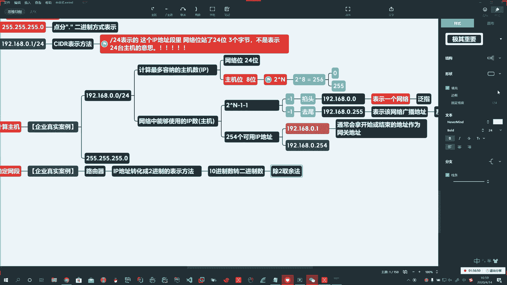
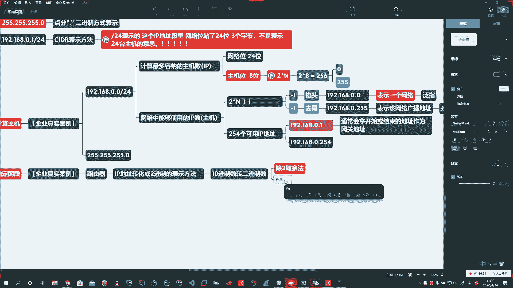

# 花了2万多买的Java架构师课程全套，现在分享给大家，从软件安装到底层源码（马士兵教育MCA架构师VIP教程） - P175：【Linux】10进制转二进制算法 - 马士兵_马小雨 - BV1zh411H79h

，🤧第二个，利用子网爷们儿。Oh。利用组网掩满。确认他是否在一个网站中啊。🤧好，我们看看第二个怎么用啊。好，它可以盖上，一般都是咱们路由器。路由器底层的工作原理，我们看到你家里头那路由器是吧？

它里头有芯片。啊，你那IP地址过来，人家就把你的IP地址啊。转化成二进制数的表示。因为你IPV4的时候，它是什么？它是十进制的，是不是？啊，所以十进制转二进制，这里头就是基本功。我。🤧。

那么这个转的呢有两种方式，第一种就跟小学一样，拿一张8开纸咔咔在那算。啊。🤧嗯。哎，这个叫什么呢？啊这个叫。😊，循环。啊，或者叫除二。除二。取余数。啊，所以叫除二取余法，就看你这个四则运算会不会。

啊，除法操作会不会？啊。第二种方法呢叫做权重法。

啊，第二种方法呢叫做权重吧。

对。是。第三种方法呢，这个世界上有一个东西叫做计算器啊，科学计算机还可以呢循环啊，还可以通过更底层的。啊。对吧还可以左依法。求一个数的二进制啊。

还可以诱一法。🤧。求一个数的二进制啊，这都是底层二进制底层未操作的。

啊。啊，我们脱产班的同学呢，那你就知道第一个啊就行了。对吧啊，因为我们不受到更深刻的编程。啊，周末班的同学呢，这个到时候我会在周末班呢给大家做一些提升。咱们再说一些编程的东西啊。所以呢这个对二取徐数啊。

它的过程呢就是循环对二取余。

。Yeah。啊，这都是扩展的啊，呃一不小心激动了，又多说了点东西，循环对二取余数。啊，逆序输出。🤧嗯嗯。好，那我们做一个啊循环对二取余数逆序输出，这玩意儿应该怎么做？这是数学老师的范畴啊。

小学三四年级的水平。

循环对二取余数逆序输出。咱算一个数啊，比如说。🤧。转移谁呢？算一个5。啊，算一个5，咱们算这个数。🤧。🤧Okay。我们算这个数啊。二进制，那他除谁呢？除2。Oh。🤧。啊啊5。除二啊取余数。商举与举。

Okay。商己于己啊，咱可以群里聊聊啊，考验一下我们小学数学水平。嗯。你们群里讨论一下，我就喝口水。Okay。好，我来了啊。咩。好，你看就有同学懵逼了吧，你这小学三年级这不赖我呀啊。

来我们看一下5除二商几于几，看他能不能整除。5除二除不尽，对吧？商最大的数啊，二三得六超了5了，二二得四。对吧所以底下商几呀，商2。与几呀啊，我们通常小学后边写点儿点儿点儿点儿点儿。5除2商2余1。啊。

商二于一。你琢磨琢磨是这意思吧。哎，然后这个二啊商的这个数再除啊再除2。Okay。哎，2再除2啊。2再2除2的话呢，直接就能整除了啊。直接就能整出了。🤧2除2商几于几啊。能不能整除？哎。

直到后边这是什么？直到。啊。伤为。这是几。商己于己啊。哎，你看这有的同学纳过闷儿来了啊，对，现在又智商又重新占领高地了啊，商医对不对啊？啊，商衣虞己呀。嗯。于0对不对？啊。好。那么这商一不能行啊。

在这不能停啊，说循环对二取余数直到商为0。就我一的时候，我还得再除啊，我再除2。直到最终这儿啊一除二不够除了啊，那我就商为0。啊，伤为0。啊，直到商为0。好啊，这有的同学还没纳过门来呢，没琢磨过来的。

你再琢磨一下子啊。🤧嗯。Oh。整除大哥整除啊。🤧嗯。好。我了个去，这家伙整除啊不是0。5，各位大哥哎。好，没事儿啊，我给你们点时间，你们你你们你们你们琢磨琢磨啊，你们琢磨琢磨。哦。

So。Okay。好，挺热闹啊，我把这上边这个给大家补完啊，补完。刚才呢我们这差一步是吧？哎，二除一商0，这里头写多少啊，后边。把余数补上。啊，商灵于一。好，那比如说五的二进制数怎么着逆序输出啊。

就倒着往上写，这上面往下是正的啊，倒着往上写。所以这里头啊我们要表示的时候，对吧？一个字节前边补零啊，后边是。8位啊五的二进制就是这样写。🤧Yeah。Yeah。好啊，这是第一种计算方式啊第一种计算方式。

这个练习呢你算多少都无所谓啊，就是循环对二取余数去算去啊。

第二种的权重法，那么也就是拿二的N次方来算啊，二的0次方，任何数的0次方都得1二的0次方得1。没楚。嗯。啊。二的1次方22的3次方啊，不二的1次方2啊二的2次方4。啊。Yeah。好，二的3次方。8。啊。

二的4次方16。二的5次方322的6次方64。啊，二的7次方1282的8次方256。啊。

好，这就叫权重啊，我们记住二的N次方。比如说我拿五啊，我给你说一下这个怎么算啊，就快速口算。😡，啊，拿你这个五。😡，你看五比谁大比谁小啊，比四大比八小OK那么就是5。5减4够不够减？

啊，构减就写一。好，5减4等于11减2够不够减，1减2不够减，不够减就写0。啊。那一减一够不够减，一减一够减啊。对吧构减。最终等于0，那构减就写一。

所以你快速口算的话呢，那这就是这个啊。5就是101。那么150如果我去算的话，那那我们算看150啊。

，Yeah。快速口算150，看它比谁大比谁小，介于谁之间，150啊，肯定不够256，也就是150减128。够不够减啊，够减就写一。

好，那150减128剩多少？🤧。上多少。算呗，对呗，凑十啥呀，那这22啊，对吧？22减64够不够减啊，不够减不够减写0，22减32够不够减，不够减，不够减写0，22减16够不够减，ok够减就写一。

所以22减16等于多少啊？哎，22点16，这不得6吗？对不对啊？😡，啊。6减8够不够减不够减不够减写06减4够不够减，够减够减写16减4够减了。等多少呢？等2。啊，2减2够不够减哎，够减。啊，构减写一。

那2减2最后剩多少呢？剩0。啊。所以你看你那个刚才你算的那个是不是这个数啊？啊，我们验证一下啊。计算器。

Good。计算器呢完了以后有一个程序员。啊，程序员或者说呢我们找一个科学计算器科学。

啊。科学纪能记。嗯嗯。😊，你可以跟这里头去算。啊，你可以根这里去算啊，包括程序员去用的这些都可以啊，啊，对不对？比如你二进制表示刚才我们说多少来150吧，是是这意思吧？Yeah。嗯，这我怎么不会用呢？

150。啊，150。150的那你看这个就是什么呢？底下这个BIN就是二进制。啊。10010110是不是我写这个？

Yeah。

啊。好啊，这个权重法可以快速算啊，咱们就说这么多啊，这个也挺happy的。

