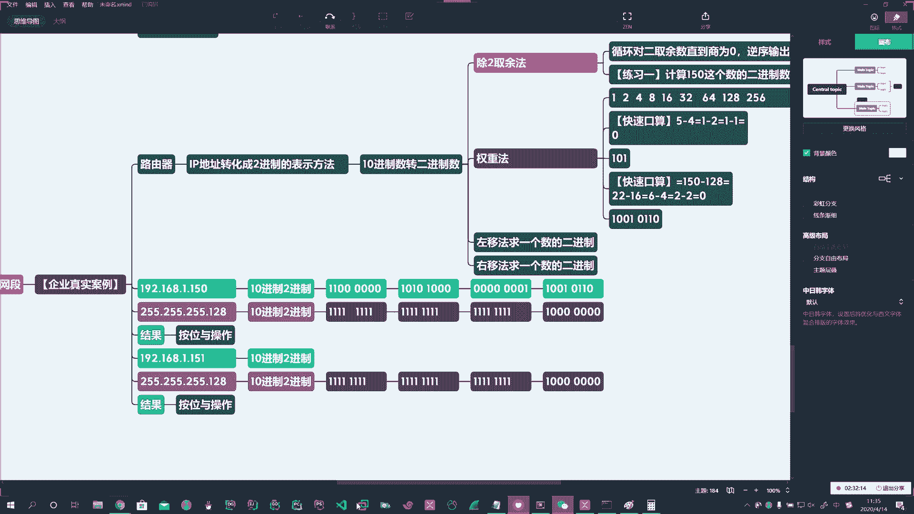
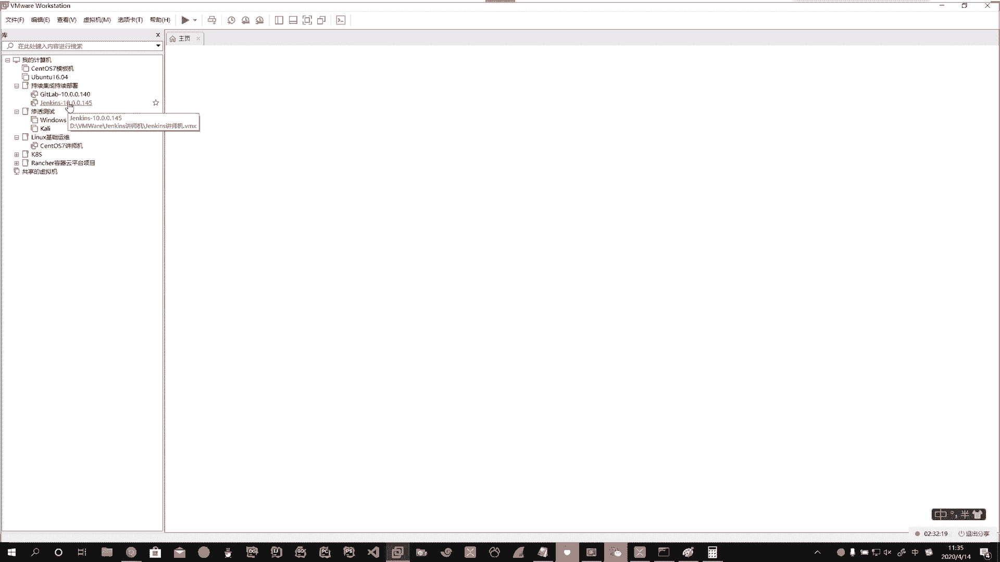
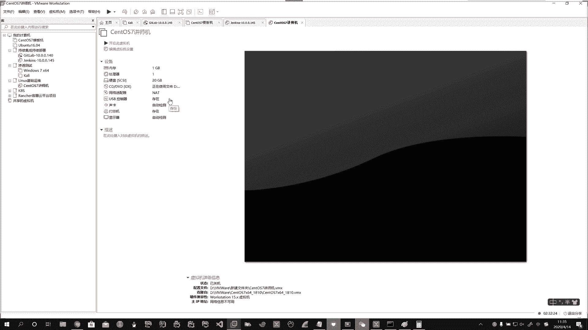
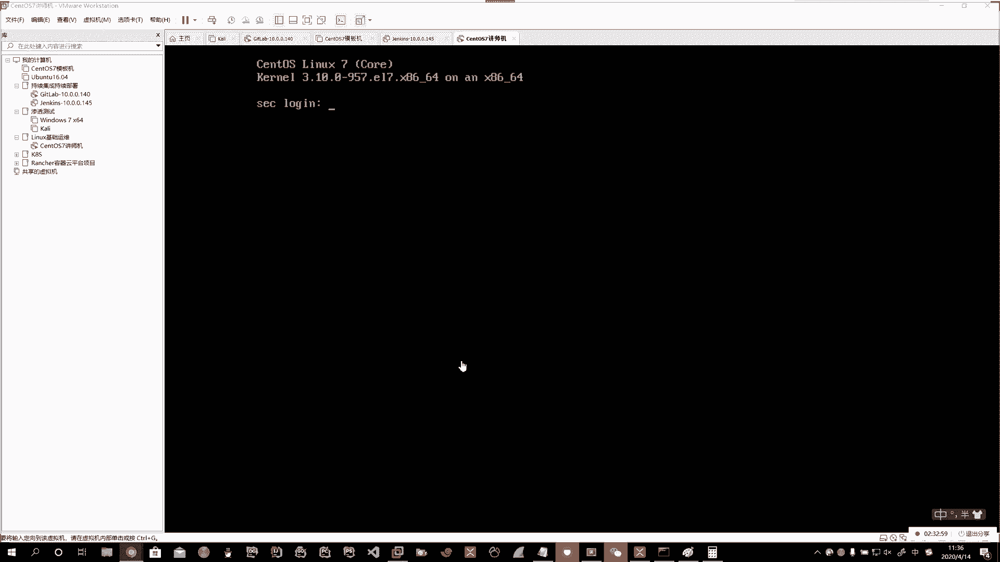
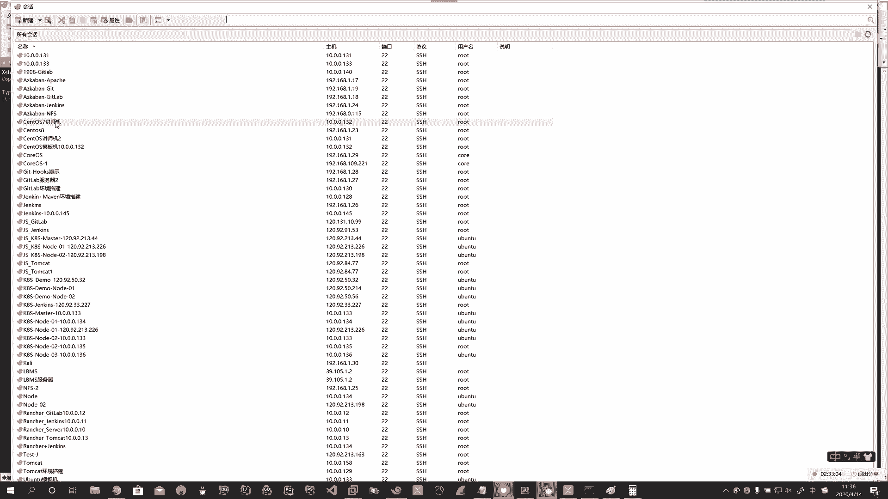
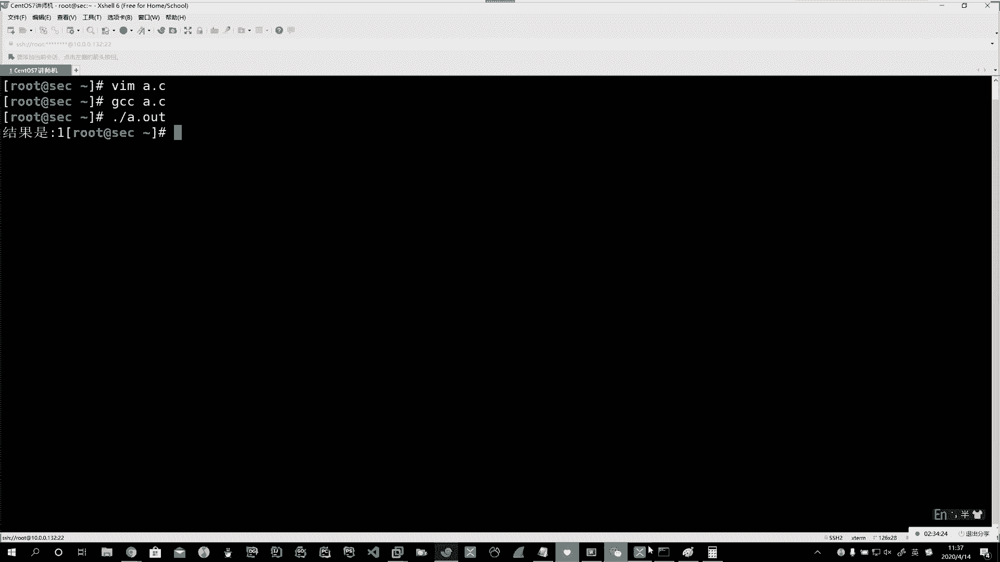
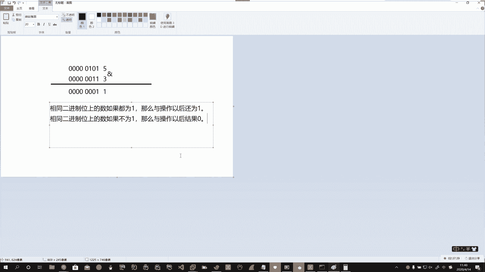
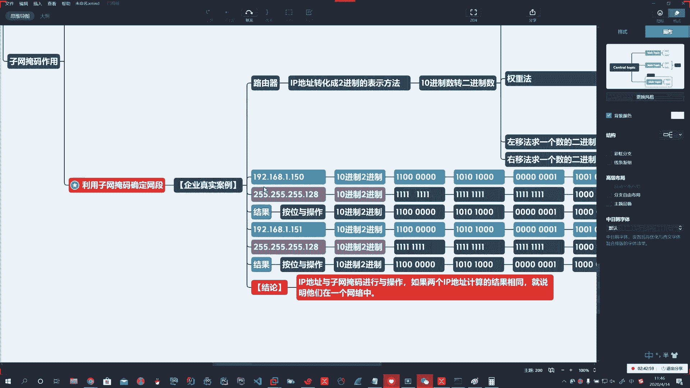

# 花了2万多买的Java架构师课程全套，现在分享给大家，从软件安装到底层源码（马士兵教育MCA架构师VIP教程） - P176：【Linux】企业案例计算两个IP是否在一个网络 - 马士兵_马小雨 - BV1zh411H79h

好，说你现在呢啊会第一步了啊，我们能算。然后呢，真实案例说你给我俩IP地址，说给我一个叫192。168。1。150。啊，你又给了我一个。哎，192。168。1。151说这俩IP地址。啊，这两IP地址。

那么这2个IP地址啊，我们得先把它转化成二进制的表示方式啊，十进制转二进制。我先给你打一个样，然后你算啊。哎，这150正好我们刚才算了一个，是不是？啊，那叫四段嘛。啊，150，那就是10010110。

就最后这150。啊。一直接拿它减啊。😡，对吧一直接拿它减00000001，这就是一。啊。168你算吧，算完了告诉我168是多少啊。嗯。哎。Oh。Okay。好，168我公布一下啊，怎么算啊？

168呀啊10。101后边4个0啊，这就是168。你算去吧。啊，拿咱们刚才说这数嘎嘎一减啊，快速一补。啊192呢也是这道理啊，192也这个道理，那192是多少啊？11。00。1234。好。He。是不啊。

这就是192的啊，所以说呢咱们拿到这玩意儿以后呢，咱们先把它转化成二进制啊，是这么算的啊。二进制还不行，然后呢，比如说他还得给我一个子网掩码，说这俩的子网掩码都是多少呢？

都是255点255点255点128。他俩的子网掩码都是这个嗯。好，你把255255255。128这个十进制，你也给我转换到二进制。用刚才教你的权重法嘎嘎一刨啊。🤧嗯嗯嗯。不行啊，权重法，你这数学你没没。

😡，报没了，数学不灵的啊，那你就直接用计算器吧啊，但是尽量自己算一下啊。啊，要不一会儿困了。🤧。H。咱不算此机硬背可以吗？哎。那得多累呀，得死多少脑细胞啊。好啊，那这儿7255这前三位最好算了。啊。

所以第1个255那都都是一啊，后边的也是。啊，都是一再往后都是一。啊，你只要算1个128就行了。啊，只要算1个128就行，128太好算了，那你算呗，那到这儿直接就干1个128呀，对不对呀？

所以直接128就是这样写。没毛病吗。对不对？所以这个口算啊，你刷就算出来了啊。😡，所以这个就是它的子网掩码啊子网掩码。Okay。ok。这个平时啊这个原理啊，咱们就说了一下啊。

平时呢这是咱们的路由器在那哇哇给它算的。啊，那为啥有时候你那慢呢？为什么我们要使子网掩码啊，对吧？它得进行进进行大量的计算呢？如果你对这个网络我们不进行优化的话，没有这个子网掩码的时候，你算死它。😡。

对吧，那过一会儿他就该热了，你知道吗？😡，对吧所以如果说判断这俩IP地址在不在一个网段中，就是这么算的。啊，咱们那路由器苦逼的就这么算。啊，说第一个这个结果。啊。结果。这有两个是表示结果的。嗯。啊。

所以咱们呢这个路由器就开始先第一步拿到你给的子网掩码，拿到你给的IP地址，先把它进行啊二进制的算法，然后它再进行与操作，就是你的IP地址和你的。子网掩板啊，他们进行与操作。叫按位语操作。

这不是咱们课程大纲里要求的啊，我给你扩展的。你能听懂你就听听不懂拉倒啊。反正咱也这块不收钱啊。Yeah。好，按慰语操作它有啥特点啊，按慰语操作，那它有口诀啊，有规律。所以说它如果要底层的话。

那就算死你是不是啊？那我们就说口诀吧啊，所以这样一说口诀呢你能秒懂。其实但是这个东西在计算机里头是特别复杂的一个东西啊，真的。你要不学个一年两年的玩意儿，你就听不明白。但是呢我们能用口诀让你能懂啊。😡。

吓。这个按位语操作呀啊它是一个运算符。啊，它是一个运算符，在C语言里头呢，它叫做运算符和表达式。啊，它叫运算符和表达式。那么也就是说它上下比完了以后啊，咱们这里头这个8位。

这里头的零跟一叫做啊二进制位上的数。啊，二进制位上的数。比如说我上边这是一，这对应的最高位，这是一，它下边也对应的最高位是一。啊，先把这二进制位上的数。记明白了。啊，记明白了。好，然后。这没对齐呀。

Yeah。Check。哎，是这意思吧啊，我这个这个这这个数数没对齐啊，数没对齐，你大概是这意思就就行了啊。好，那么安慰与操作呀，你要看它相同二进制数上的数是零还是一。Yeah。啊。是零还是一？好。

我给你写一个程序啊，你看看这个结果，然后呢，我们反推这个规律啊。

不议。咱们开一台主机。

这咱就干这个了，是不是一言不合，咱就写一个，这这算啥呀？五毛钱的事儿啊。

🤧嗯。对以。Yeah。啊。😮，连上啊给你写一段。

🤧嗯。

。Yeah。Yeah。看下。系。比如说我就做谁呢？五与上。啊，遇上3。啊，五语上三结果是一，咱们推一下这个规律啊。

哎呀，还得讲啊。画图吧。好。我提问一下子啊，就是看你们能不能跟得上。勇哥给我说一下五的二进之数。快点谁给我说一下五的二进制。啊，博文跟我说了啊，哎这赶我算过呀，1234啊，5，那不就是4加1嘛？

4加1那就是101啊，对不对呀？这就是5的二进制数。那刚才我们算的三的二进制数，三不就是2加1嘛？2加1不就这样吗？这不就三吗？没毛病吧啊没毛病啊。我要算错了，你们查我啊，那刚才说了。

它五与上三得一了啊，把二进制被补好，一就是这个呀，这就是一啊。所以通常呢我们用这个案位语操作啊，它的运算符叫end符。就是你那七键盘上七那数啊，这就叫无语上三。结果得一。那么总结的规律就是什么呢？

相同二进制位上的数。如果都为一。那么与操作以后。还为一。啊。这是第一句话。第二句话说，相同二进制位上的数。如果不为一。啊。如果不为一。那么与操作以后。结果就为0。啊，必须它俩相同都为一的时候。

结果才是一。如果一个是零，一个是一，你看上边是零，下边一，结果是0，上边是一，下边是0，结果是0。啊。

🤧你就这么记吧，这样的话呢那你就能明白了啊，所以与操作刚才说了，那我们就要看。看相同二进制位上的数，刚才说了，如果都为一，那结果还为一啊。如果不相同，那结果就是0。那所以这个看从咱们从左到右吧啊。

我这好排序，那一得11得1100100后边10100000。啊，所以第一段得的就是这个。好，后边还是这个，那他都是255啊。😡，对不对啊啊，哎，不是啊，不是不是这168了啊，168。

你这168与上255啊，这是什么呢？上下一啊，得一一0得0一一得一一0得零一一得一一0得零。😊，啊，这是第二个啊，没毛病。第3个哎，这好啊，1234123。二。啊。最后这个。1123。0000。🤧。哎。

这就是他们与的结果啊，他俩与操作这结果。好，我们再算一下下边这个啊下边这个。150和151啊，这个IP。🤧。这样我们只要算一下151的IP地址不就行了吗？是这意思吧啊，151呢这是多少？😡，哎。

在你后边加一个，就把最后那一位给它置上就行了。好，我们算一下这个结果啊。前边你是192255，那这儿肯定是一样的啊，你也是168嘛，对吧？你也是一嘛，只要算最后一个就行了。啊，只要算最后一个就行了。

那最后一个这是啥呀？这这这这这。啊，还是一样的啊还一样。好，拿IP地址和你的子网掩码做语操作啊，如果这俩结果相同。就表示他俩在一个网络里。哎，咱们那个路由器寻址就是按照这个算法来寻的。啊。IP地址与。

子网掩码进行与操作。啊。如果两个结果，2个IP壁址啊，计算的结果相同。就说明他们在一个网络中。啊。一个网络动。这就是路由器啊，底层的算法。啊。好啊，你晃晃神儿啊晃晃神儿，对吧？哎，这就是这么一个过程啊。

好，那么这个第二个第二个企业真实的用法啊，就是在我们这里头去算他俩在不在一个网络。

