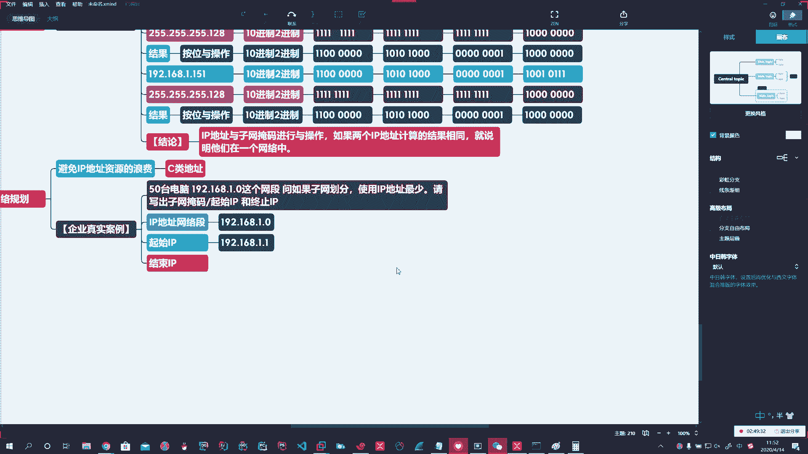

# 花了2万多买的Java架构师课程全套，现在分享给大家，从软件安装到底层源码（马士兵教育MCA架构师VIP教程） - P177：【Linux】IP地址子网划分 - 马士兵_马小雨 - BV1zh411H79h

，没。第3个，企业真实案例啊。

对。第三个企业案例呢就叫子网划分。啊。网络优化哎。网络规划优化啊，在这里头就需要你。需要知道啊，很重要。

Oh。Yeah。

Okay。好，那这个东西呢就是说提高寻址的空时这个这个这个这个这效率啊，减少时间。第二个主要是为了避免。啊，IP地址资源的浪费。这个在企业中实战的时候具备非常高的啊意义。所以这儿必须都得会认真听。

放下你手里的所有的事儿，手机扔一边啊，把这整明白了。啊，面试的时候，或者我们使用的时候，一般都是C类地址。啊，对我要是面试官，真的我问谁谁死。啊，我上来就先让你算一二进制，就得有一半人阵亡。

好。所以这儿一定要注意啊，他问你的都是C类地址。一般问你这题的都是我学生，你放心啊，你就这都是都是都是我教的啊，都是我学生还能问你这么刁端的，都是你啊，是吧？你就往点上答就行了啊，那怎么说呢？

来个企业真实案例啊，咱直接就真实案例了。

，Okay。그。啊，那你有时候你聊聊时不时的，哎呦，操太认弱了啊，你这是不是你说这不就巧了吗？这哎我也是亮哥学生，你说这操，那你不就录取了吗？是不是啊，企业真实案例呢，什么呢？说咱公司呀有50台电脑。

啊，50台电脑。然后呢，给你的是192。168。0。1啊，别点0了，点1。1啊，点1。0这个网段。问啊。如何。设计啊如何子网？划分。如何择网划分？使用。啊，IP地址最少。请写出。写出。子往掩马。

起始IP。终止IP。

🤧嗯嗯。

说遇到这样的问题，怎么怎么去操作啊，怎么操作先。

看人家咋问的。😡，啊，那首先呢他得让我写一个啥？首先我把网段。啊，网段我拿下来。网络段，那他已经给我了啊，他说了，那我这网段是192点168。1。0。

啊。然后呢，让我写起起始IP。啊。这一问白给分的192。168。1。1，肯定是从这儿开始啊。

是吧。好。结束IP。啊，结束I，我先不管，我一会儿算。对吧然后呢，他让我50台主机，那我看一下这东西我的思路应该是怎么做的啊。

遇到这种事不要慌，实际上还是考你二进制原理。如果刚才上边这个你算明白了，底下这个你口算都能算出来。

哦。我给你口算一下啊。

哎，咱们试一下啊，看看咱们自己啊，我看看你们扣活好不好啊。

来一下吧啊，说。50台电脑啊，这时候快速的想到我们权重法，50大于谁小于谁？好，大于32，小于64，这结果出来了。

就这么简单。考的就是你权重法明白明白，它介于32到64之间。啊，32到64之间。那么你64的话，它是二的几次方啊。嗯。

二的6次方是不是啊？啊，你看12345。喂。😊，0123456吓我一跳26次方。

2的6次方呢，那也就是啥意思呀？那也就是我在这个网络位，它又是C类地址是吧？C类地址C类地址呢？应嘤。😡，C类地址的特点呢就是前24位是网络位。后边8位是主机位。啊，这时候这时候我做子网划分的时候。

我实际上我这个八位能表示256个主机，可用的是254个主机。但是如果我就50台电脑，我给你254，你就是浪费的。所以你这八位应该是这么写的，00000000啊，0000，这就是8位。那么好。1234。

56。二的6次方够了。啊。那这得出来的就是64。也就是说，我如果这样表示。啊，这样表示我的主机位。啊，表示我的主机位。🤧。我能拿到64个IP。64个IP掐头去尾减一再减1。

啊，那我这里头能用的就是62个IP。

啊，所以这剩63再减完了剩62。啊。62不大于64，6662大于大于32啊，所以这个IP地址段就到这儿了。啊，就到这儿了。所以起始啊起始。1921681。1。啊，1。1。然后你的结束IP地址192。

1681。62。

啊。1。62。然后。啊，然后。还可以问，比如说你的广播地址。

啊，你的子网掩码。子网掩码呢就相当于我把主机位这左边这俩00位也给到你的网络位。

啊，00位我也给到你的网络位，所以广播地址就是192点168。1。63。啊，我的子网掩码就是前边啊24位。啊。对吧再加上这两位，也就是26位。那么如果是表示的话，那就是255点255点255。192。

啊。

或者表示成为192点168点1。0-26。啊，我把前边00这两个主机标识也往前移移给让它标识为网络位。

啊，那这样的话呢，也就是变成了。前26位啊为网络位。后边6位。啊，为主机位。

这样我们就把这个子网给它划分好了啊，用最小的IP壁纸。

好，放了这50台主机。啊。好，那到底跟我们说的对不对呢？😡，对吧哎，我们可以算。

。嗯。好啊，它有在线工具嘛，是吧？我们看一下，刚才我们提说的是10段是吧，192。1。0。啊，你的掩码默认是24位，对不对？刚才我说了，把后边借两位给他，那24加2就是26。啊，那可用IP你看62个。

第1个1。11。62结束，广播1。63。

跟我们说的这是不是一个一回事啊？系。这就验证了我们说的是对的啊，那你的掩码255255255。192，看我们是不是。

252525192。啊，表示方式可以用这种啊CIDR的方式表示杠26前26位。Yeah。哎，这样我就画了一个子网。一点都不浪费我的IP地址。啊，后边的。在用的时候再给别人啊。Yeah。

好，这就是子网。