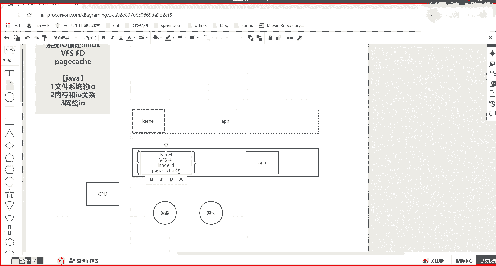

# 花了2万多买的Java架构师课程全套，现在分享给大家，从软件安装到底层源码（马士兵教育MCA架构师VIP教程） - P178：【IO／NIO】操作系统宏观介绍 - 马士兵_马小雨 - BV1zh411H79h

宏观上呃梳理一下我们要学一个什么东西，呃，学的肯定是IO这块的东西，但是要一层层的去讲。首先一个比较宏观的一个一个拓扑图，就是在一个计算机操作性当中啊，然后非常至关重要的，有这么几个核心的东西。

一个是内存啊，一个是CPU，然后剩下的都是IO设备，啊，这个应该在前面的都已经都已经了解了。然后呢从另外一个维度，从程序的维度的话，你要知道有科呢。有一个操作性内核，这是一个程序。

内核它说白了就是一个程序。

然后呢，除了它之外，剩下的程序就是我们自己的application用用户空间的程序。

然后呢，有一个逻辑的一个图啊，就是之前课应该也说了，每个程序其实是逻辑的线性的一个内存地址。通过MIU给它转到我们的这个CPU的物理地址。

然后呢，我们的一个程序其实模拟的是使用了整个这块内存，这个内核在它的高低哪端无所谓啊，但是它的地术空间里边肯定也包含了内核的这个引用。啊，这并不重要，重要的是一个程序。如果想执行的时候。

如果想获取IO当中的数据的时候，其实数据除了有我们的这个应这个应应应用空间的东西。

然后有我们的内这个物理内存里边，这是物理表示方式啊，就是在内存里边堆了一这么一个程序，堆了这么一个程序。其实这个程序他看自己的时候是这个样子，就等于我自己整个使了这个内存条了。然后除了有内存。

有它还有我们的CPU。

还有我们的一系列的IO设备，比如说磁盘。网卡。这个这个其实还有很多的其他的IO设备。然后在我们学习的时候，关注的无非就关注这么两类的一个IO设备。

好吧，那么IO设备里边肯定是有数据的，数据呢最终是想被我们程序读取到，那程序是不能直接访问硬件的那程序只能通过调用系内核的系统调用啊，一般来说一般来说，但是它有直接IO这这个这个这个这个行为啊。

但是那个后边来说。程序想获取数据的时候，在这注意一下，有几个抽象啊，内核内核里边有哪些模块，内核到底管了一个啥事儿？内核其实它是既管我们内存的分配，又管磁盘IO，它什么都管。

这里边有一个叫做VFS的虚拟文件系统。它有一个这么一个概念叫做虚拟文件系统FS大家应该都知道，你windows上有一个文件文件系统，它里边有C盘D盘E盘F盘，每个盘里边有自己的目录数结构啊。

可以存自己的文件。只不过在linux操作系统或者类unux系当中呢，它是一个在内存里边，首先先制造起了一个VFS。然后呢一会儿我会让你看命令，看到那个那个那个结果啊。然后它里边的它其实就是一个数。啊。

一个目录数数上的不同的节点，最终可以映射到不同的物理位置。啊，树树上那个节点，那个目录可以映射到不同的物理内位位置，每个不同的物理位置可以是不同的具体的文件系统。

比如说FAT或者E叉 fourE叉 three这样不同的文件格式，然后或者是网络上的节点，或者你虚拟了一个块设备等等的啊。没错，是可以挂载。我先先宏观介绍一下，先听一遍这个这个词汇。

然后一会儿再带你实操去看那个东西啊，为什么是虚拟文件系统？首先嗯。怎么说呢？像windows你就可以理理解成是一个物理的文件系统。因为你看的C盘，那个就是你硬盘那个C盘，你看D盘就是你硬盘那个D盘。

那操作系统linux它要出一个虚拟文件系统，它其实解决上层应用程序对底层这台计算机有可能很多地方存数据。但是每个存储数据的这种硬件，它的驱动，它的实验形式不一样。那这时候如果没有一个中间的一个解耦层。

就类似于这是数据库。这是你的程序。中间如果有1个GDBC接口抽象的话，那你可以通过一个GDBC访问不同的数据库。你就把虚拟文件系统想成是给我们用红颜程序暴露的一个统一接口，它下边挂载的不同的设备。

它的实现，它的驱动可以不一样。

啊，这个能听出来，说波一就是跟你什么，咱们这个你其他不懂，但是渣我我认为你是要懂一些的，对不对？哎，有有什么我就拿扎我给你举例子。

那么有了它之后，这里面在虚拟文件系统里边，它还有一个几个层次，一个东西你要知道叫做i know。我先不带你看这个所谓的什么内核的源码之类的，还有一个定义定义格式，我们先抽象这语义卓号。

你就把它想成是一个就是一个ID，你就把它抽象成想成一个ID在虚拟文件系统当中，尤其在使用磁盘等等一系列的时候，它的每一个所谓的文件，那个文件在你打开的时候。

都会有一个安卓号来代表它唯一它然后对对应着这个安卓号在内存里边，就是如果你程序想读数据的话，通常默认的。第一步是访内核说我的这个数数当中打开哪个文件，然后呢，这个安号被加载。然后呢，它的原数据被加载。

并且你读这个文件的时候，注意文件读读到的时候，是先由内核去读，读到我们内存里边，它会开辟一个所谓的配置ch。啊，用就先把这个第一个名词数梳理梳理出来啊，这个payca就是你看可以看到叫做页缓存。

这个页缓存默认的是4K。

啊，是1个4K的这么一个大小。在这注意一下一个程序。如果有两个程序呢？

第一个知识点，如果在我的系能中有两个程序，他们想打开的是同一个文件啊，他们想打开的是同一个文件。那这个时候其实按造号要配置cash，其实是在这一个物理链当中是一份给他们共享的。这个是第一个知识点。

就是两个程序。如果打开同一个文件的话，它其实并不是每个程序都会有一个独立的一个把这文件加载的过程。他其实访问的是你的虚拟文件系统。这个虚拟文件系统如果发现加载过这个文件了，然后你想读的东西。

这内存的pay cash已经命中了。那这时候其实已经就是可以给你返回你要的那个pay cash数据了。而且在这儿还有一个点啊，我们一定要把它这个这个这个知识这个舒展开啊。这个p着c。

它是你内存里边就这个数据的一个缓存。然后还有一个东西就是。dirty脏的意思。这几个这几个维度你得你得知道啊，因为这个要不知道的话，后边很难理解。那么如果我程序。读取了这个磁盘里的文件了，那些个E。

那一个所谓的被这个这这个p cash在这这个内存里已经出现了。但是后来我改了某一个。page cache里面的数据，就是我程序现在都是和内存里交互的。虽然这个数据曾经来自于磁盘。

但是你读过之后就在这缓存，缓存之后后续的修改会变得很快。那变得很快的话，那你就会修改，修改之后，这个配这个配置它就会有一个标识做脏。这点记住了。听同学来说说一。就是程序和硬件之间隔了一个内核。

内核通过page catch液缓存来维护你曾经想读的数据在内存里边。然后你如果对它修改的话，它会标记成脏。那这时候违脏的那就会有一个。所谓的flash的过程，要书写到我们磁盘当中去，对不对？啊？

张议要书写到磁盘当中去。那么如果数输据到词文当中去的话，是什么时候书写的这这个书写形式是实其实决定了我们的IO模型。你可以程序没写的时候，没没改的时候立刻摔到磁盘，但是性能很慢。

也可以交由系统内核来决定这些脏页什么时候该书写。但是在这要注意了。这个脏的标识是内核对所有上层打开的文件的一个统一的管理。它并不是针对某一个文件的那这个时候一会儿我我也会带你看一些内核的调优参数。

它有一些阈值。比如说达到物理内存的10%或者20%，或者经历5秒或者30秒，这样的一个周期，它会整体的把增页输写到磁盘去。一个是你程序等着内核，他就他去他去刷。一个是你程序调内核，直接给我刷。

那直接刷的话，保留的多，保留的这个这个准确。如果交给内核的话，会丢的多，能丢多少？举个例子，如果你有1个30G的用这个内存，那搞不好5秒钟之内假设某一种特殊情况，极端情况。

假设你5秒就对那5秒之内对内存造成了3个G的数据。差一点，比如20。8个G5秒之内，那就是通断电了，那你可能就这2。8G数据可有可能就丢了。就是他既没有触发到脏的那个阈值，也没有触发到时间点那个阈值。

那时候还没来得及把它刷刷刷刷写出这个主机。这点。任何同学来说波一，这个就先死记死硬背啊，再给你展示。Okay。这是一个宏观的简单的先说一下这个内核里边这个这个事情。笔记的后来我都我再再给你整理啊。

然后在程序当中，那这时候其实和我们java当中概念一样。回到刚才一个知识点，那内核先说完内核内核可以帮助我们说很多程序如果打开一个文件，我可以在这里面把那个文件的这个放到内存，你们都可以读。

谁都可以写了。那这时候加左不加左的问题，对不对？不是说有点类似re持久化re的持久化也是来自于操作内核的这个约束。你买sl等等都是来自于内核的约束。所以其实这个点你学明白之后。

你再去看那些个需要持久化的东西，他们就会你会明白哦，原来内核有这个有这个bug，所以他们才会能去设计好吧，那么内核如果提供了文件的一份缓存，供所有程序去使用。

这个时候其实有点像我们java当中的代器模式。因为其实这里面还有一个维度就是这个程序想好了文件的偏量和这个程序想好了偏量不一样。也就java中为什么在集合当中会有一个代。

迭他器模式是给每一个线程一个独立的一个指针，你各自在这个机合当中使用你的指针，想取谁取谁两边的取不会影响对方。所以其实这里面还有一个概念叫做FD。

最终会还有一个一层把下面这个包装起来，就是FD。FD要叫做什么？叫做文件描述符。

filldescriptor文件描符当中会有一个什么？就是这个这个文件描符最终是交给我们程序用的。这个虽然这个文件啊这个文件有1个Iode。

但是这个这个里面对这个iode有1个FD得到了1个FD这个FD假设它的指针啊，它会有一个指针的概念。或者叫做四个。偏移这么一个一个一个一个一个一个指向。比如它偏移它平移可到8上边的就可以偏移到。20。

一会儿这个我尽量也带你去看一眼啊，都能看到这个物理的表表象，通过一些工具和和指令。那么这样的话，每个程序在读取文件的不同位置的时候，其实各自有各自的sep，各自各自自字的指针。明白什么意思吧？

所以这时候其实他们各自通过自己的偏移，找到自己那个所自己的该读写的那个配置 catchch。如果在没有修改同一个位置数据的时候，其实也不用加锁。你修八我修不修改的时候，这时候咱也不用抢锁。

但是如果大家修改的是一样的话，那这个保齐会修改到同一个位置的时候。其实这个时候如果打开同一文件的话，那肯定是加锁的一个过程。这个这个这个就有点像这个咱们ja当中，如果你修改同一数据，那肯定要先抢一个左。

谁想上来，谁去改啊，它其实把并行改成一个一种创新化，这是一个非常简单的一个宏观。

