# 系列 3：P179：【IO／NIO】虚拟文件系统 - 马士兵_马小雨 - BV1zh411H79h

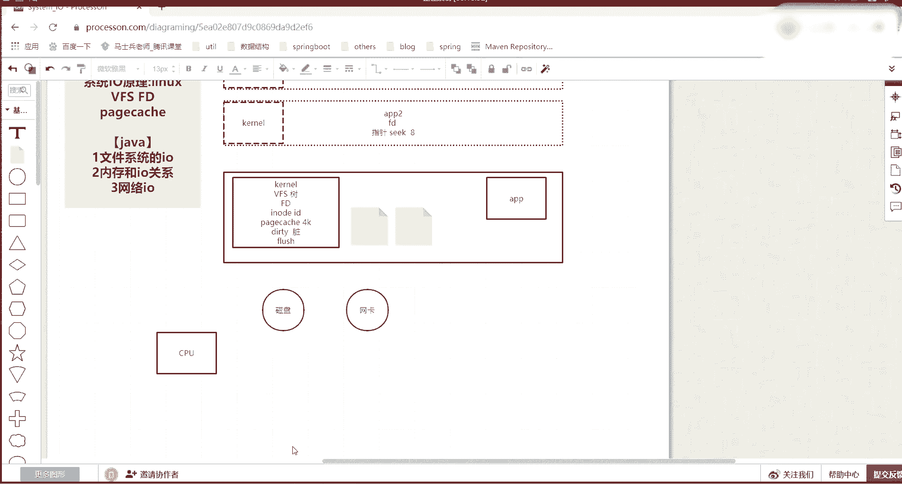

验证的第一个环节啊。我打开了一个linux的一个系统。第一个先知道什么是虚拟文件系统。什么是虚拟文件系统啊，它是一棵树状的，有一个根目录，根目录下会有一级目录。一级目录里边的每一个目录，它会有子目录。

就像一个倒着长一棵树一样啊，从一个根起，这是第一个支点，每个人应该都知道这个不难。第二个支点介绍一个命令，这个命令叫DNF。DF这个命令可以起到一个什么效果？你可以看到啊，就是内核里边。

比如内存起来之后，它维护了一个虚拟的一个目录数结构，这个目录结构很多的目录。那这个这些目录当中哪些目录啊，哪些目录它其实挂载了不同的位置。可以看到我们我们挂在的一个情况。因为这个所你看有一共三个条目。

这三个条目都是从根起的。但是它们隶属于不同的这个叶子，不同的这个子目录。像这个最开始这个这个主根是挂在了我们的DV设备目录下1个SDA3这块硬盘，就是SDA这块硬硬盘的三分区。那在这儿我给你画一下图吧。

这这个有一个最后能能能能能理解啊。

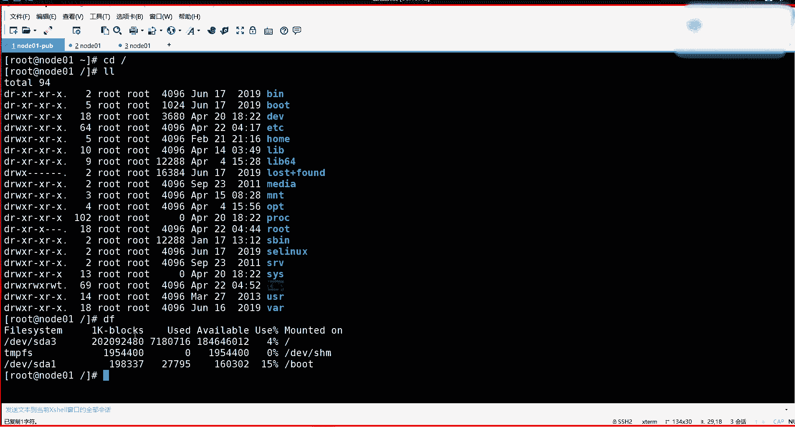

呃，如果咱们学C的同学同学多，然后大学及科学的好同学，你你忍耐一下。因为这个其实这块就是如果没有相关这方面学习的话，其实还真是不懂你你你要你要认可这这一点啊？所以这个第一节课我可能讲的特别的慢。

讲的特别的这个呃不会不会特别的深，很可能可能你会感觉这个东西你都会了，为什么还讲，对不对？这个忍耐一下。首先我有一个硬盘。我的硬盘上边有三个分区。有一个零分区。啊，一一分区吧，二分区和三分区。

这是我曾经自己规划的时候，我规我系统安装的时候这么去装的。那一分区我的大小应该是在200兆。这是我硬盘这么做的一个分区。如果在windows上你就能看到这个分区，但是在linux看不到的一个分区。

它是一个目录数代表了这个这个这个引用了。二呢是我一个swe的一个交换分区。这个交换分区我当时好像是2G。然后第三个就是我的根分区root根分区。这个入头两个词，在文件系统就是跟的意思。然后在用户的时候。

就是这个管理员的意思。

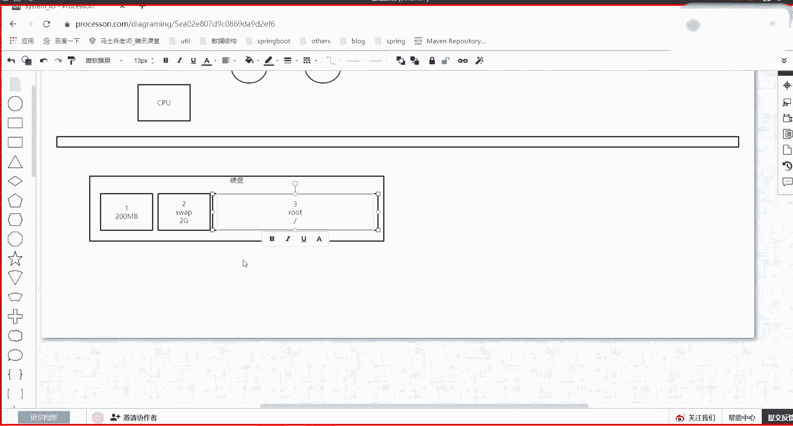

好吧，那现在可以看出这么一个现象来啊，就是在我的系统当中，这个虚拟文件文件系统当中，这是一个它有这个目录了。这个目录里边呢，注意我们观察第三行，第三行，这个有一个but目录。

就是你看到的这个所谓的文件系统的目录数，你看到他们都聚在一起了。好像来自于一个地方来自于一块一块硬一个分区里边，但是其实不然像这个bo，它就是我这块硬盘的一分区，这个200兆的引导这个一分区。

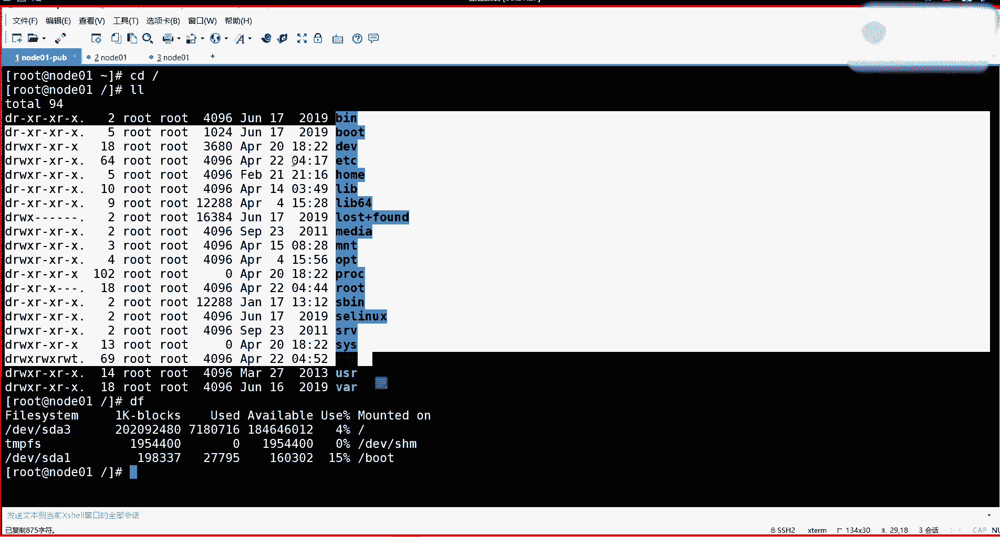

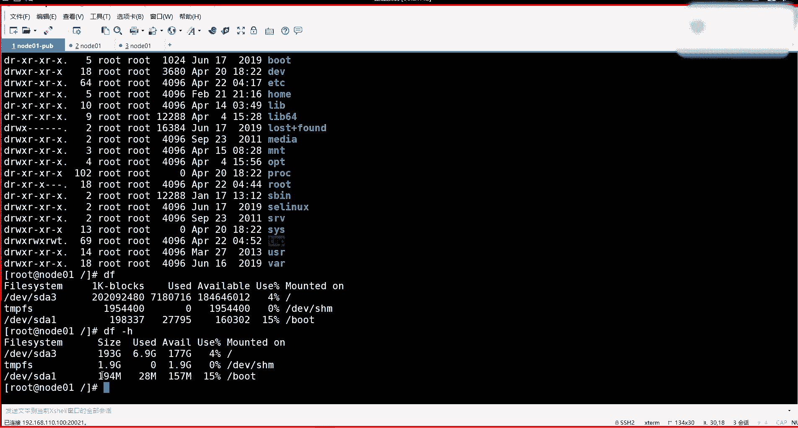

将近200兆左右。然后像我的那个根分区，就整个默认的这一个所有东西，默认所有东西其实是在我的三，那全部在三，只有里边的boot在一，有这么一个差异。

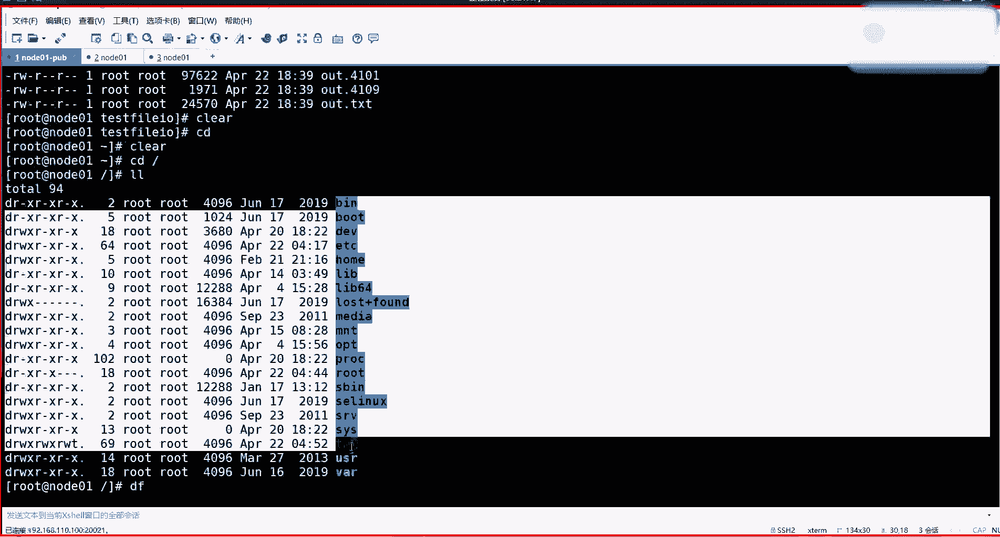

有一个覆盖，等于这条记录覆盖了上边，你这个原有这根下那一个boot，听同学来说波一。

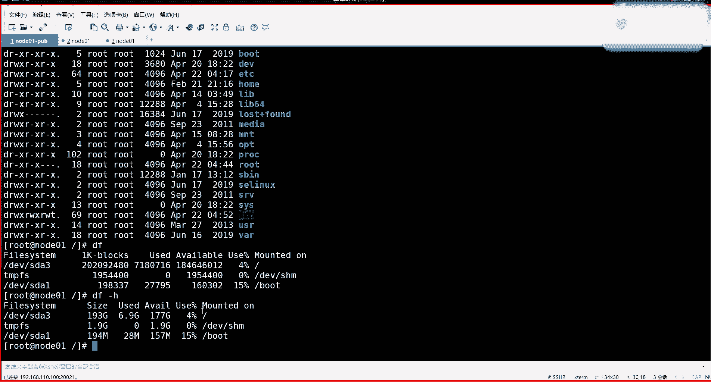

还有人刷刷刷刷刷啊，其实这个整个根啊，如果看你的文件系统。你的根目录是来自于。三分区在计算机起祈祷那个引导的时候，内核进入内存，内核会初始化它的文件系统。这时候它初始化一个虚拟文件系统，这个文件里空的。

只有一个根，然后他把根映射到你的三分区，三分区里边，这个分区里边会有很多的目录，比如有有这个bo分目录。然后有DV目录，然后有这个。ETC目录就是这些目录其实都都这个这个三分句里边是有这些目录的。

只不过在引导的顺序里边，第一件事情是加载了它，这是第一步先加载的。先挂载了，然后挂载完它之后，第二步它又挂载了一下。这个一分区200兆这个其实这个东西可挂可不挂。因为其实真正出现的顺序。

在计算机帮当一N电的时候，一N电的时候先是bisbis完事之后，先读到的是这200兆分区，因为这里边引导程序GLB引导完了之后，把内核内核程序啊就chan是在这里边的，内核的小镜像。

Klonel啊这个小金像。是在这个200分区200兆这个分区里的，把它加载到内存之后，然后这个Kel就已经在内存展开成这个程序了。这个程序就等于这个有点有点这个。呃，这个叛这个叛逆的感觉哎我到内存了。

那我就把你弄死，然后呢我重新加载它，然后呢变到变到我科的这个虚拟文件系统里边去，能看到所有目录了。然后为了让人在后续访问这个目录数之后，能看到里边的配置啊等等一些东西，他又给它覆覆盖的一个挂载了一下。

所以这时候其实在你磁盘当中有两个目录，这边是挂载了这个bo。

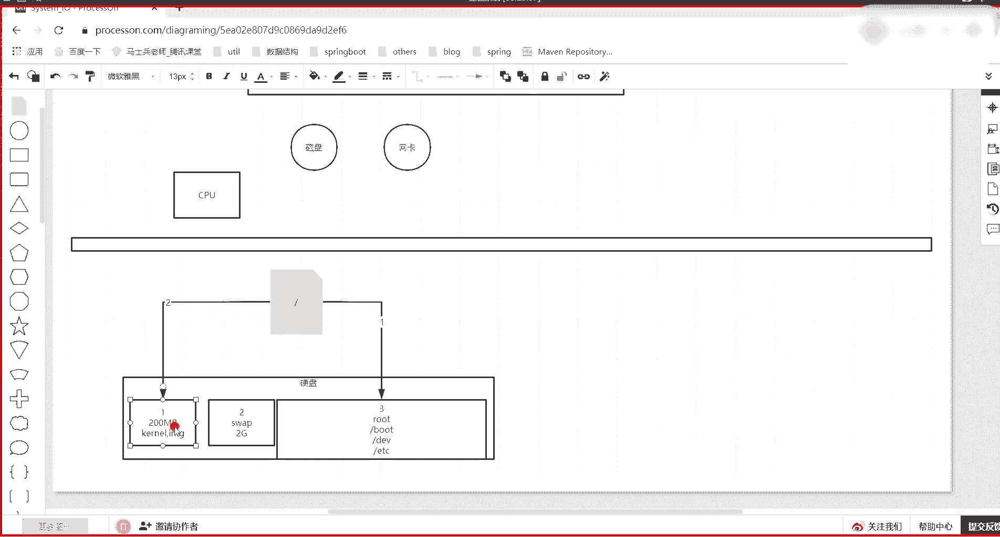

然后这边其实也有一个部的。明白吧，就是这个目这个挂载覆盖了原有的那个那个不同目录，你可以看一下布的。在这个里面其实就会有关于我们引导程序的，比如GOB啊，还有我们内核的一些个这个这个这个镜像。

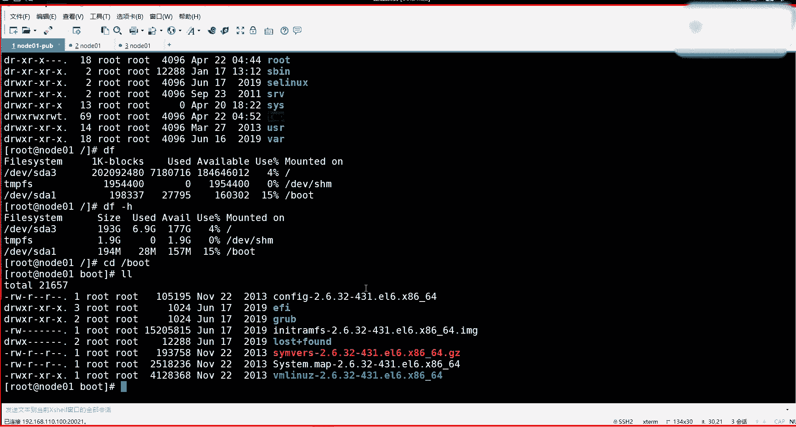

好吧。来这块能听的出来说波一。

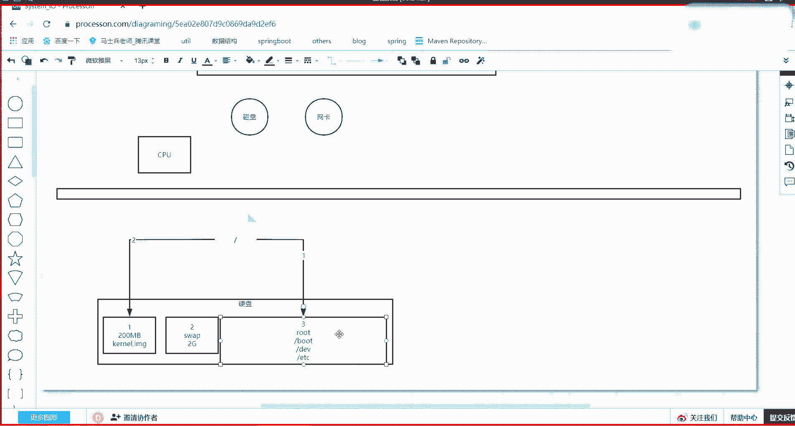

还能找到原来的bo吗？这我给你演示能能能就咱先看啊，你就先先懂第一个层次，DNF是可以看到挂哪一个的那其实你可以unmount。amount我们的boot，你刚才看bo里边是不是有东西。

是不是全是这些东西。那这些东西现在问一句，根据现在的映射关系，你现在看到的bo里的所有文件，在磁盘的物理的哪个分区里，是不是在一号分区？对不对？然后这时候我把bo的一个目录如果给它卸载掉啊。

我因为在这个目录里边，现在是busy，不让不让用退出这个目录，然后再unmount。boot退出之后，先看DF是不是没有这条规则了，规则是不是少了，没有这个规则了，没有这个规则，你去看跟目录啊。😡。

根本我有没有bo的，bo还在啊，不还在，但是你去bo里边没了。

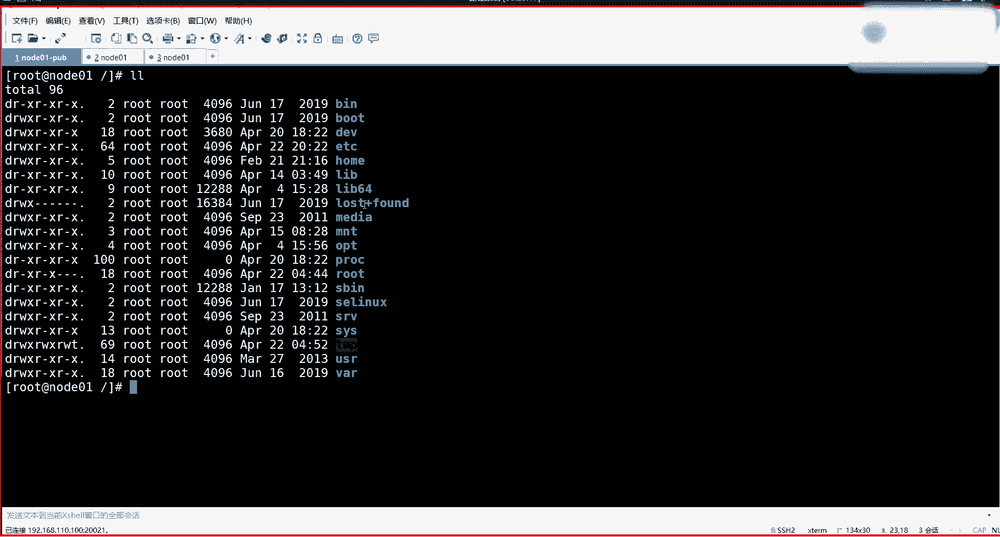

现在看就看的是这里边的bo。但是如果你挂mounttDV的SDA这块硬盘的一号分区挂载到你刚才的这个没有东西这个这个。因为你要明白内存有一份，内存里边是有一个所谓的一个boott，就给它给它覆盖上去。

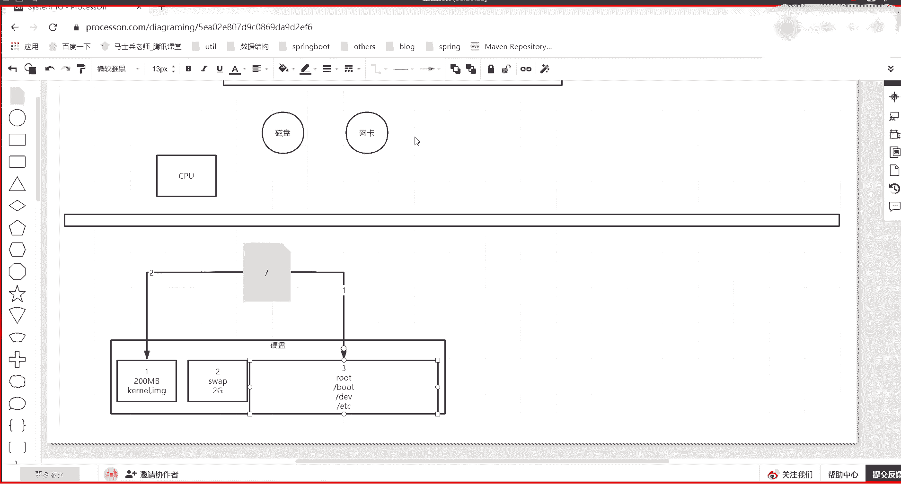

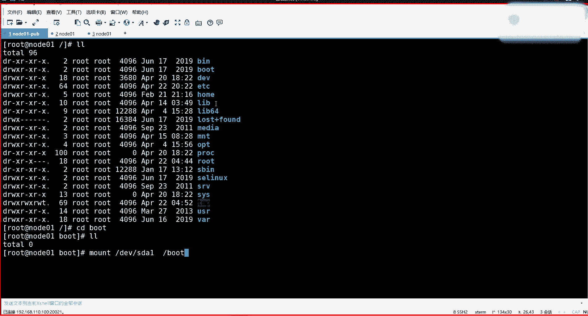

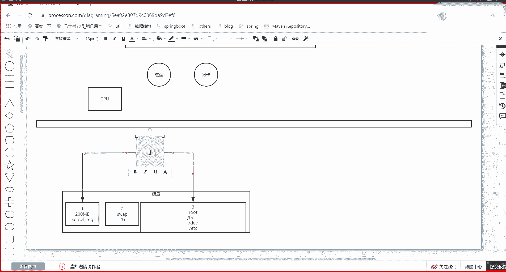

那这时候你再去看boot。东西就回来了。比会我还有一更细致的一个一个一个演示，就先粗粗显的知道这个有一个。有一个虚拟文件系统就可以了。那这样的话，其实你看刚才这个挂载不挂载。

卸载不卸载这个来回的切换过程当中，你会发现。

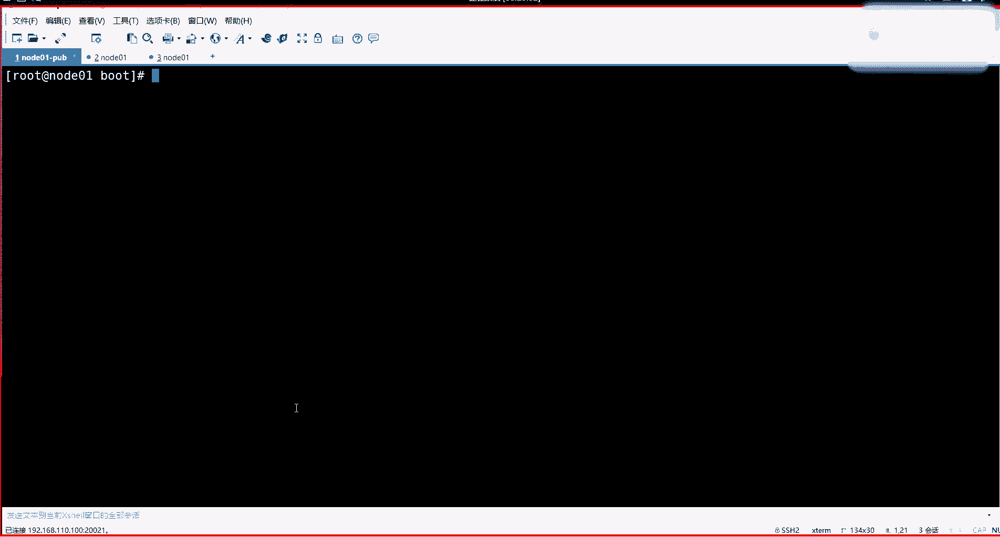

对于程序，我们程序来说没有任何的影响。因为你的数据目录结构趋向已稳定，就是目录数。这个目录结构啊。结构是趋向于稳定的，但是其实它有一个映射的过程。

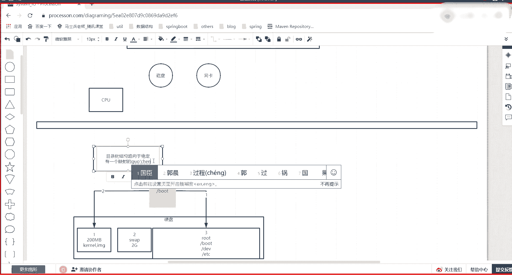

那比如说未来举一个很简单一个应用场景的例子啊，像我们根目录。USR目录是放数据的那现在你来看DF来看，唉，这个没有看到USR这个目录挂载情况，那么代表着USR是默认随着他的父目，随着他的根，随着的根。

随着他父亲是在三分区的。但是这里边如果东西多了之后，你是不是可以在你的电脑上加一块新的硬盘哎，变成SDB这块硬盘，然后就一个分区，然后几个T先给它加上来，加上来之后，先把老的数据拷贝过去。

然后再把那块硬盘挂载到你这个虚拟的目录数的这个USR给它覆盖上。那这时候未来其实你在访问这个目录里边可以存两个T的东西。能理解吧？

或者一般就是说哎root加目录或者U homemeus目录里边数据比较多的时候，我们可以给每个用户单独挂一块硬盘，对不对？哎，都无所谓。这个映射先有啊，映射有了之后，这是第一维度。

你要先知道一个虚拟目录数，这个目录数是一个趋于稳定的。没错，我们的光驱硬盘都是这么去挂它才能使用的。

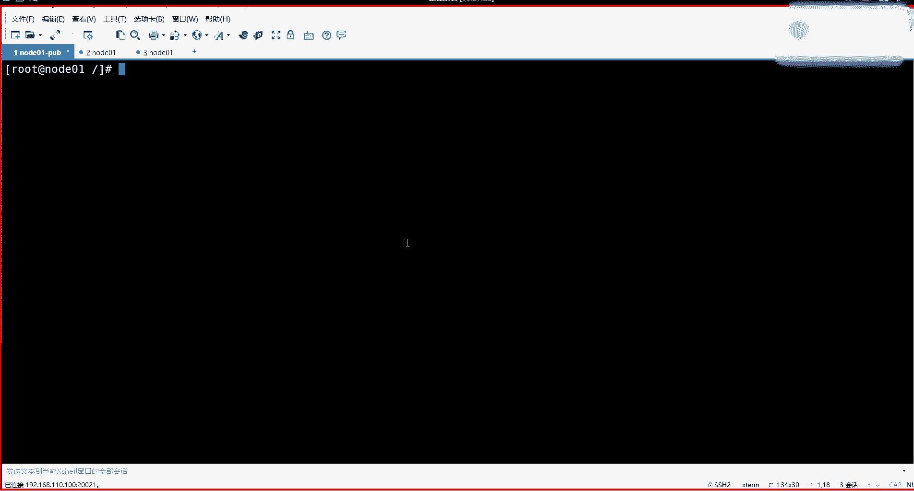

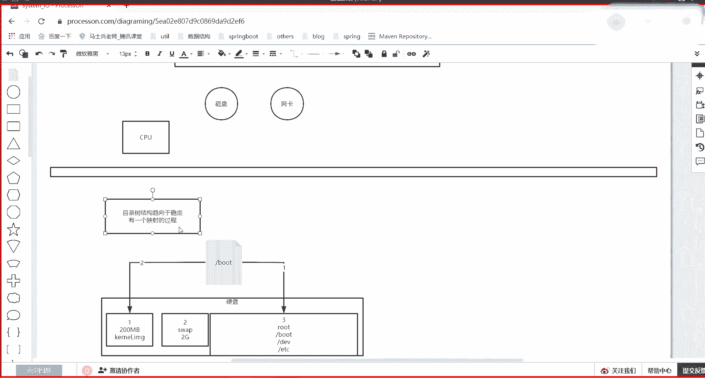

收啊收这个环节到这儿就可以了。你先知道这么一个概念。另外还有一个概念，就是有了虚拟目录数结构之后。

这个有一个虚拟文件系统，呃，我想想我给你演演示完吧，再给你秀一把啊，这个是不是很多人都开始想学docker，对不对？但是现在虽然下午我演示的不是不是docker啊，但是我我我给你演示一下。

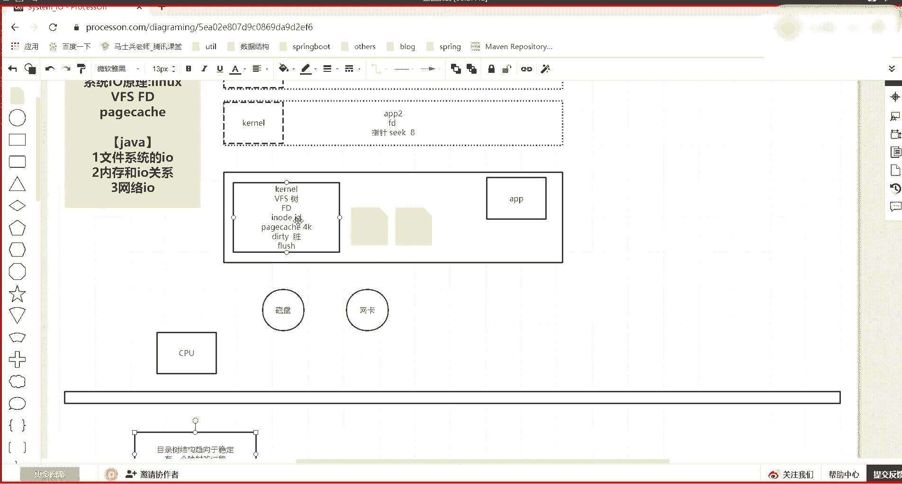

回家。😊，嗯，这样演示它的话，还需要另外一个概念。

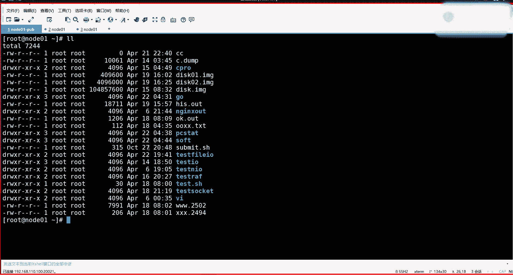

我一会儿给你演示吧，先把这个下面的概念讲完。第一个是虚拟目录数。另外一个一般会延伸的一个知识是还有一个知识点叫做文件类型。因为要学这个的话，前面还有一句话。能跟着那这个这个这个这个这个这个逻辑吧。

首先我们要先尊重一句话，这个一句话谁说的是冯度一曼。没错啊，冯动伊曼冯动伊曼它规定了计算机操作系统的组成啊，它的组成说了有CPU。然后呢，有我们的这个库这个也不是的这个计算器。透制水。中。存储气。

然后剩下就是输入。书。设备输出设备。因为他给出了这么一个定义计算机的一个框架一个结构。那么像这里面其实计算机控制器的话就是类似于我们的CPU了。像主存储器其实就是我们的内存了。

然后输入输出设备就是所谓的我们的IO设备，先有这句话，然后这句话不白说，你要找到一种感觉，就是类un类 unit系统啊，然后基于这件事情，它做了一个抽象，效率虚拟文件系统。

然后在这个文件系统上做了一个抽象。就这虚拟文件系统既可以做映射啊，既可以做映射。还有一个就是一切接文件的一个抽象。这个抽象就是一切。接文件。这个街接是哪个接呢？仪器及文件。

这是第21个这个文件系统要做的一件事情。有时拎那盒要做一件事。那么一切接文件是什么意思？什么东西都可以是文件，你的文件磁板里的文件是文件。然后你的摄像头可以是文件，这个打印机可以是文件，只要他们是文件。

那么基于这个文件就和前面这个输入输出设备，这个输入输挂上钩了，也就是IO基于文件就可以应用到IO流。这就是和今天要讲的知识有那么一年年可以挂上勾了啊。因为今天讲的就是IO嘛。

正好他这个抽象也是为了IO这件事情。因为你光有文件，你也不读不写的话，这个本来就是一个一个一个悖论对对。那么知道它之后，一切些文件，那文件怎么区分那些东西，文件就有类型了。在linux系当中。

文件类型其实有很多很多很多很多很多啊。那在这儿说几个常用的，以及看到的和看不到的，一会儿都给你去演示一下。

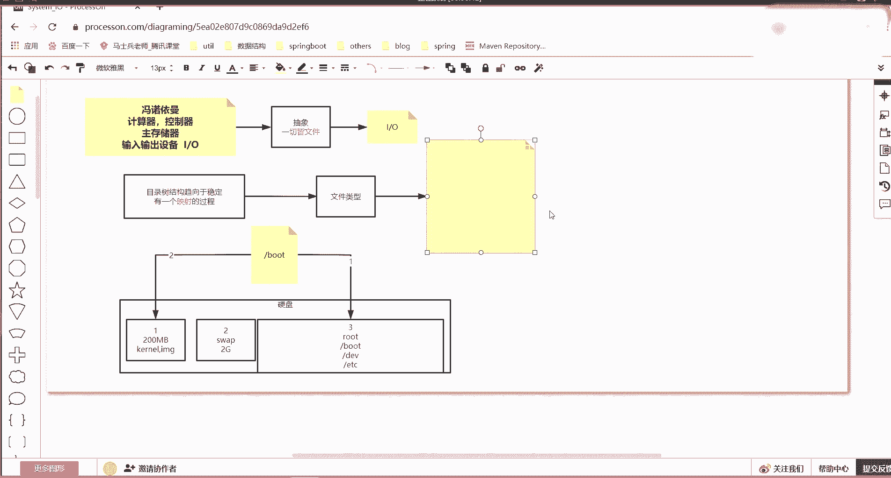

第一个呢，先看一眼这个这个这个显示吧，比如在看的时候，这样有这么多东西，前面会有一些提示，就是在这行的首列的时候，每一行的详细的首列的时候，有中线和D。

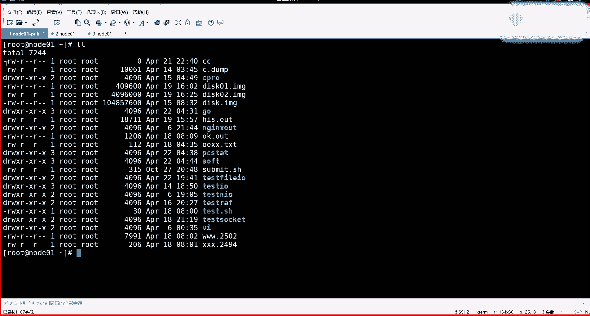

中线代表的就是我们的普通文件。这个普通文件可以是什么？可以是可执行的。可以是图片，可以是文本。啊，可以是就是你常规的知道那些个普通文件。然后D。是direct目录的意思。目录文件的意思，这字小不小。

大一点啊。第是目录的意思，我现在是铺垫啊，你要呃。你要有耐心。然后还有其他的一些，比如说是B的和C的。这里面B是所谓的块设备。所以呢。这么卡。那块设备是什么意思？块设备其实就是一个。嗯。

这两个一块儿理解好理解了。如果你能够从一个设备那从一个地方读数据，可以来回自由漂移的读，不受什么约束啊，不受约束。那那个就是一个块设备。但是如果你读的时候，你读不到过去的，读不到前面的，不能随便漂移。

且读的时候还有一些比如说要要根据一些编界码或者驱动的约束的话，那这时候就是字符设备。比如说我们的键盘就是字符设备，像我们的硬盘就是块设备，像我们的socket的网卡拿到那个车的文件就是一个字符设备。

像我们的这个这个这个块设备还有什么呀？嗯。去去想吧，反正就大概这么一个区分，这两个又偏稍微偏底一点，跟程序员其实关系关系不大，一会儿给你演示就可以了。还有一个就是S开头的是socket。

真正的一个socket，还有。P开头的是管道，这两个一会儿我给你演示出来。管道。那么还有比如说之前你应该看到一个文件描符可以指向什么？Even the pull。类似于这样的一个指向。

那Epo的话代表这个文件的类型啊，它就是我们内核提供的epo的那个内存区域啊，其实还有很多啊太多了，还有太多了就不给你演示了。因为我能够让你看到的这几个应该是都能让你看得到，看得见摸得着的。好吧。

OK那这是一个那那这只是一个介绍啊，现有这么一个一个一个一个一呃，对，还有一个L开头。还有一个链接的，然后开头。链接的这么一个类型。我们一个来看啊。

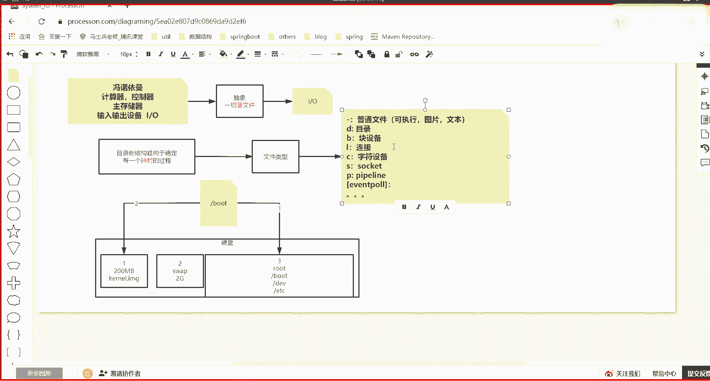

这里面像所有的普通文件能打开，能读取的就是这种中线的，像目录就是D，然后DV目录下。这里面会有一些C开头的和一些B开头。啊，这个B开头就是块设备。像刚才我们看的SDA这块硬盘，它是B的。啊。C的话。

像我们那种终端TTY，比如我们所谓的终端。终端的话，其实你传的不不这个只能说是继续往后读取，而且传的时候也是传的某一种这个不能被切割的一种字符数据啊，字符级的一一种一种数据。

所以这时候它就是所谓的C啊字符型的。

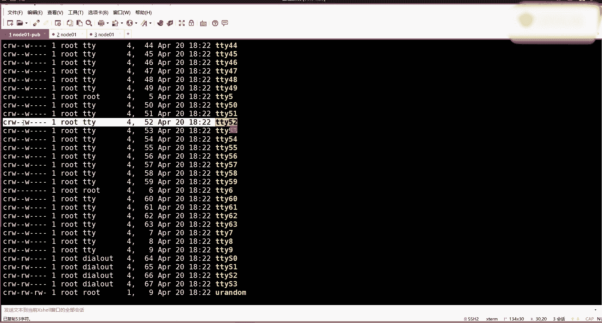

其实你可以把它想成这个B想成我们type字节的，然后只不过还能自来回去切。然后这个。这个C的话其实就是一种字符的，这个往中间去。好吧，这几个非这几个应该都比较好理解。链接这个的话嗯简单给你演示一下。

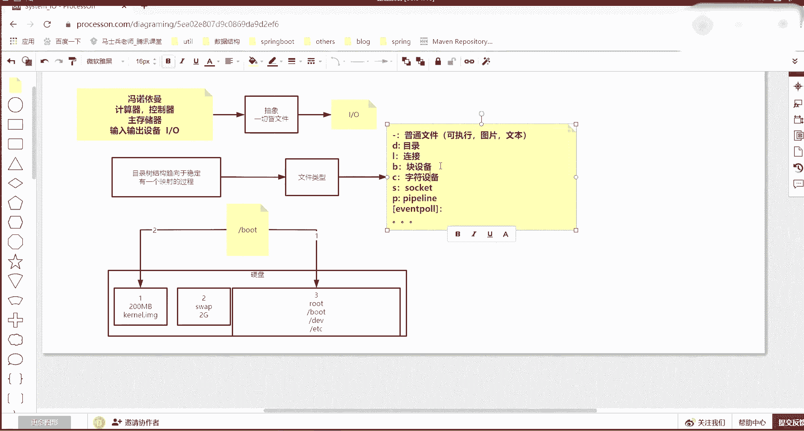

链接分为软件和硬连接。比如这里面我随便写一个文件啊，马士兵点就马士兵点PIG吧。这个文件巴拉巴拉巴拉啊，随便写点东西。我可以用LN将。root然后下的马士冰点TIT。

然后变成root下的圈圈叉叉点TIT。这已经有了，那就插上新件吧。就叉叉圈圈点PIT啊，那么直接回车的话，你会看到这里面多了一个。叉叉圈圈点TIT。啊，那这个所建一个链接，但是这时候往前倒往前倒。

前面这出现了一个数字2。然后刚才的这个马士斌前面也出了一个2，这个叫做硬链接，有一个指令state，然后马氏冰点TIT。可以看到这个文件的原数据信息，这个原数据信息里边就有一个按ual的号。

它的按号是10227872。然后再state看我们刚才得到的叉叉圈圈点PIT你会发现哎他们两个的安特号是长得一样的。看到一个现象吧，就是两个文件长的是一样的。那么这个就是一个所谓的一个硬链接。

那么什么叫做硬链接？先跟我一下什么叫什么叫硬链接磁板里边其实就有这么一个文件。

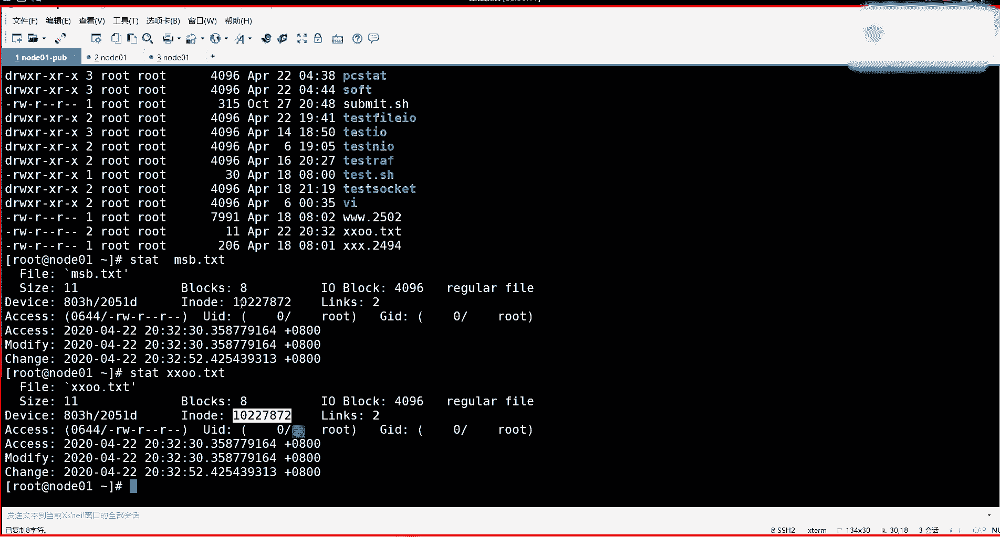

磁板里边就这么一个文件。这个文件只不过在虚拟文件性当中啊，在目录当中，它有各自唯一的pass，就是从开始的根开始的根目录一直用到了它这个文件名。这个这个这个这个在内内存里边这个描述这个路径是唯一的。

但是它们指向是指向同一物理文件。

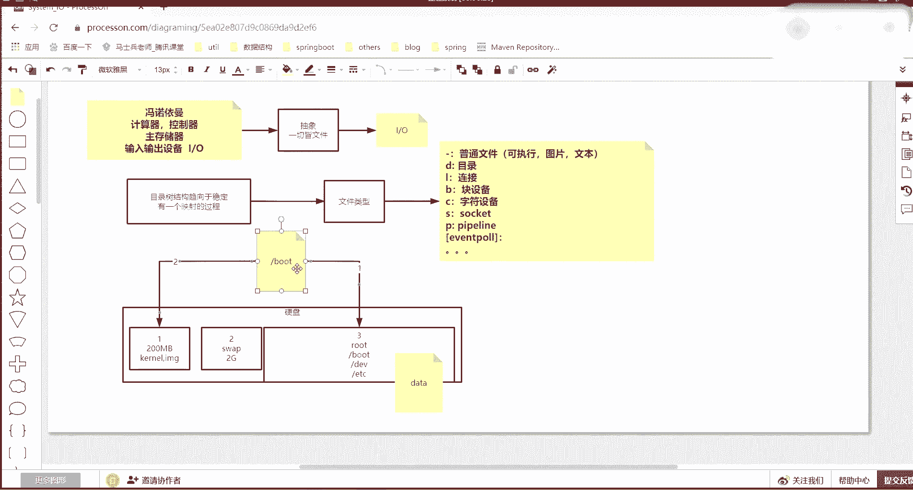

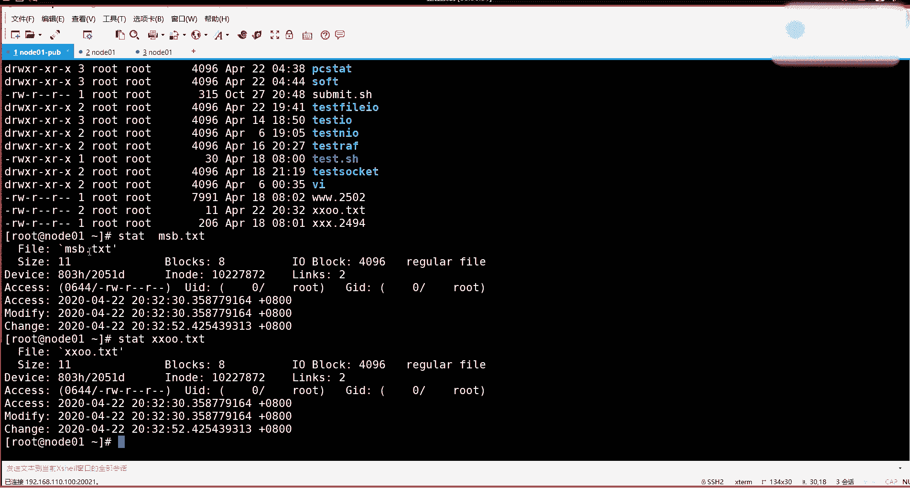

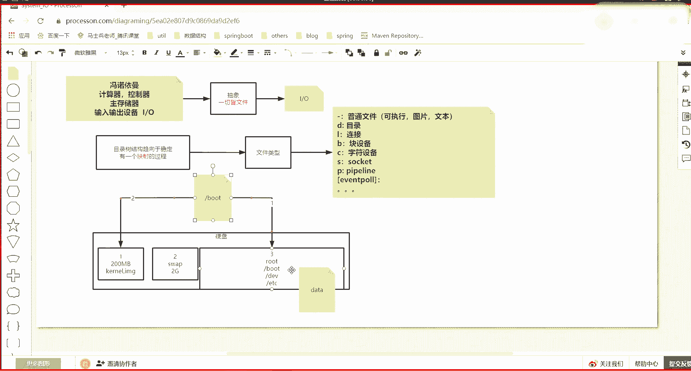

跟windows的快捷方式，那是软链接，先看先看先感觉啊，先找感觉，其实就是两个变量名，一个叫MSB点TIT，一个叫叉圈点TIT它们指向了同一个物理位置。只上同一个物理位置，这个东西是一份。

那无论软链件硬链接，它们一个特征，就是他们都是链接啊，链接是什么意思？其实就是我如果修改任意一方。叉叉娟君，我修改了它，在下边追加了一些数数字。那么这时候我去看马氏冰点TIT的时候，就能看到这个变化。

无论硬联件软件，这个特征是有的。这是硬链接。那硬链接如果我删掉，比如删掉原始的数据，RM杠F把马氏冰点TIT这个原始数据删掉会有什么后果？快速说啊没有什么后果，只不过是把刚才那个引用删掉了。

那像这个这个拆权那文件还在，只不过这个计数就降成一了。那么这一列就是这个文件硬验接被引用的数量。到这儿硬链接是啥，能听同学来说个一。哎，两个就等于两个变量引用了，一个对对立对象一样啊。

你这个拿着哪个引用去对这个对象的属性修改，另外一方都都都都能都能都能反映出来。还有一个是软链接，同样是LN，然后比如说杠Soft软。然后可以把我们的root下载，它是这个叉叉圈圈。

然后映射成root下的马氏兵点PIT回车。那这时候你可以看到很明显的一个区别啊，很明显的区别。这个这个文件就多了这么一个指向，这有点像windows了windows的快捷方式是一种软链接。

因为你要先创建一个快捷方式，它里边会一个指向，指向了某一个具体文件，且这两个文件它也是独立的state马氏冰点PIT它的按号是7871state我们的。咔嚓圈圈点TIT然后他的安顿号是7872。

1个7871个7872，且它的数量并没有被增上去。然后无论软链接硬链接，你修改任意一方，比如叉叉圈圈点TIT。然后再往下加一些字符进去。我对叉商圈改了，然后这时候VI里的马士斌点TIT能够看到这个变化。

这是链接该有的。只不过这个时候如果RM杠F删除了叉叉圈圈点TIT那这时候你的这个软链链文件指向就丢失了，就开始爆红报错了。仅此这是软链接硬链接的一个区别。

到这个链接这个类型能听回来稍边一这跟windows有点差异，对不对？

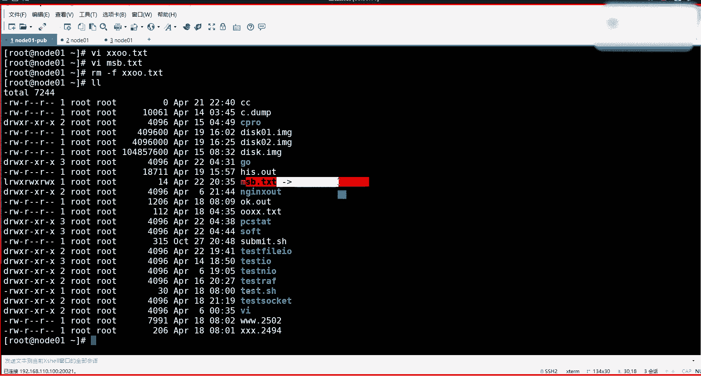

普通文件类型、目录类型的都不用不用解释，那你也可能需要给你解释一下这两个一会儿给你演示一下。sork的拍 pipeline烂待也给你演示一下。

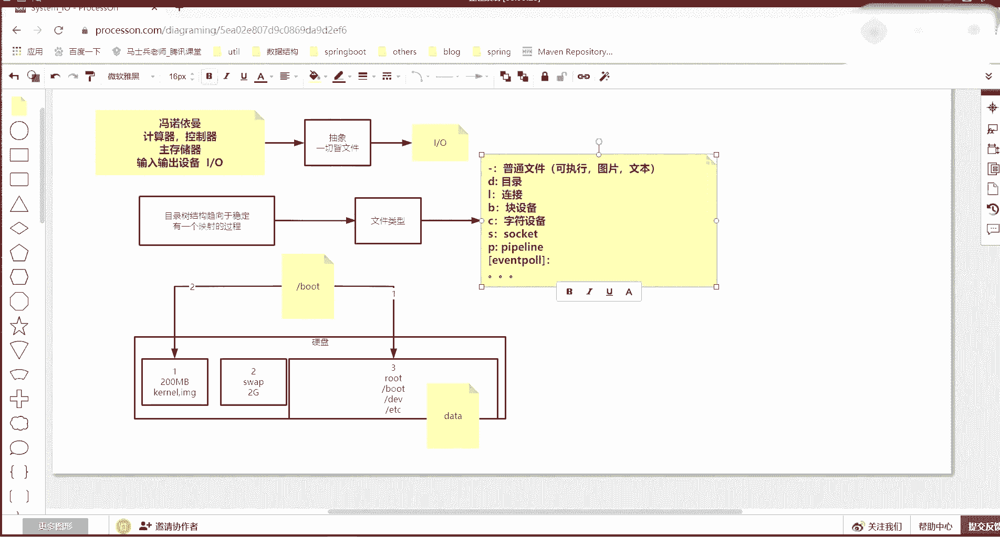

好了。😊，演示完这个之后，我再给大家演示一个演示一个好玩的东西。把刚才我讲的所谓的一切接文件，然后所谓的块设备，然后所谓的挂载，然后所谓的跟目录这些事情都演示，演示的过程是这样的。

我还是准备一个干净的目录吧，耐克DR。

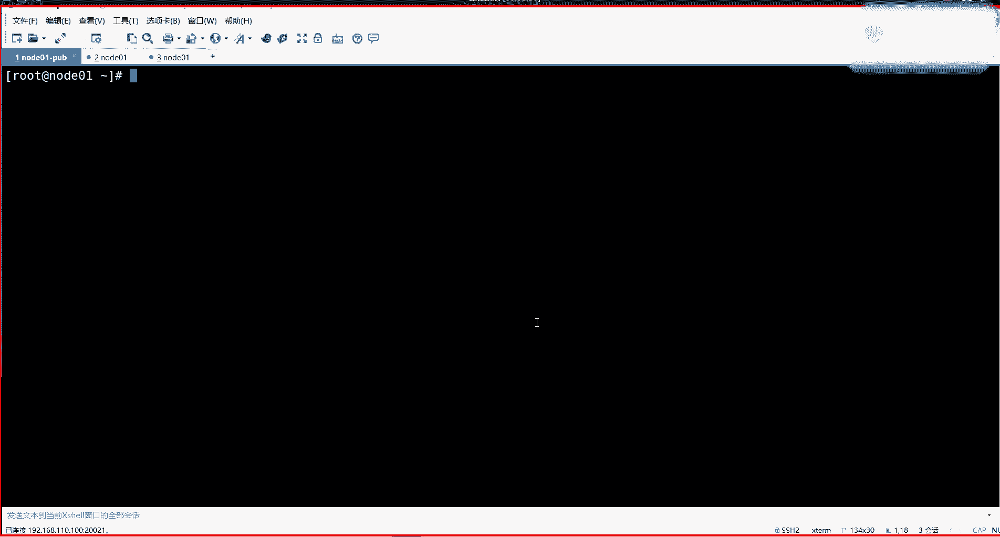

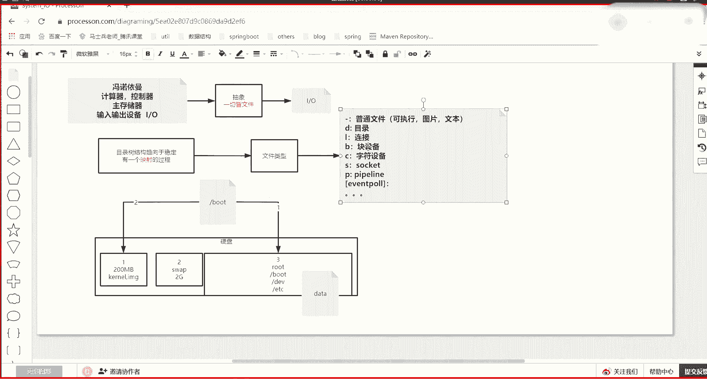

那。是非常目录。我的当天目录是空的，我准备这样一个指令叫DD啊，DD的目的是可以拷贝数据，生成文件啊，生成一块设备等等。这个死硬背也可以了。呃，它的参数第一个就是input file。它为了要创建一个。

一个一个一个设保一个一个一个类似于我们这样的一个设保文件。滴D有一个in inputput file等于什么啊，等于先看写DV zero。用我们快设备里边有一个独特的一个文件，像DV的n是黑洞。

DVDV的zero的话就是一个无限大的一个空，但是它却不占有你的这个太多的磁盘空间。然后out file输出到当前目录啊，得到一个所谓的my disk。第二image得到这样的一块磁盘文件啊，标识。

然后这文件多大呢？就是我拿多少个零去填充它呢，它这个未来是应该多大的一个文件呢？然后后边一个BS就是block的数量。这个B这b的这个这个大小，1048576学过大数据的同学告诉我这个值代表什么意思？

1048576代表什么意思？小怪兽是128兆吗？1048576，那会儿讲HDFS分布式文件性质刻意输了一下，它最小的默认参数是一兆的，一兆大小对不对？这是一个这个数值乘完是一兆啊，一兆。

也就是说这个未来这个这个这个磁盘文件里边它的块是一兆一兆。我这么去做，然后我又count。有多少个站术块组成它呢？然后这里面我准备用100，那么最终这个输出的。这个文件应该是1个100兆的。看到吗？

1048576乘以了1个100。然后它的大小啊约等于100兆。就是这步我是在磁盘上得到了这么一个文件，但是这个文件是被零被空填充的啊，全里边全是这个这个零这个电瓶听明来上边一，这是第一件事。

我就想得到这么一个文件而已啊，那得到那个文件是什么？我其实是把它要当做一个磁盘挂载到我的这个文件系统上去。那你光你我拿它做一个磁盘如何去挂载，这些都是先去经背吧。现在这个环回接口的一个一个挂载。

挂载到DVDV有一个设备目录里边1个LL loop0这么一个设备。我把我的买di挂上去。关上去之后，那么这个时候这个一切接文一切接文件都是虚拟文件系统。那这时候第一位的这个目录啊。

这个所谓的这个这个这个设备其实就不是指向一个物理的一个一个一个一个什么东西，指向的是我文件系统里边的一个文件而已，它俩一个一个关系。有了它之后，然后我利用格式化工具。

我想想是make EE叉PE叉Pwo吧，然后对我的DV的L look0。做了一个格式化，格式化的时候是会把它格式成E叉RT two的这么一个文文件类型。

这个what tab有一个fusson tab找一下。那个描述在哪？

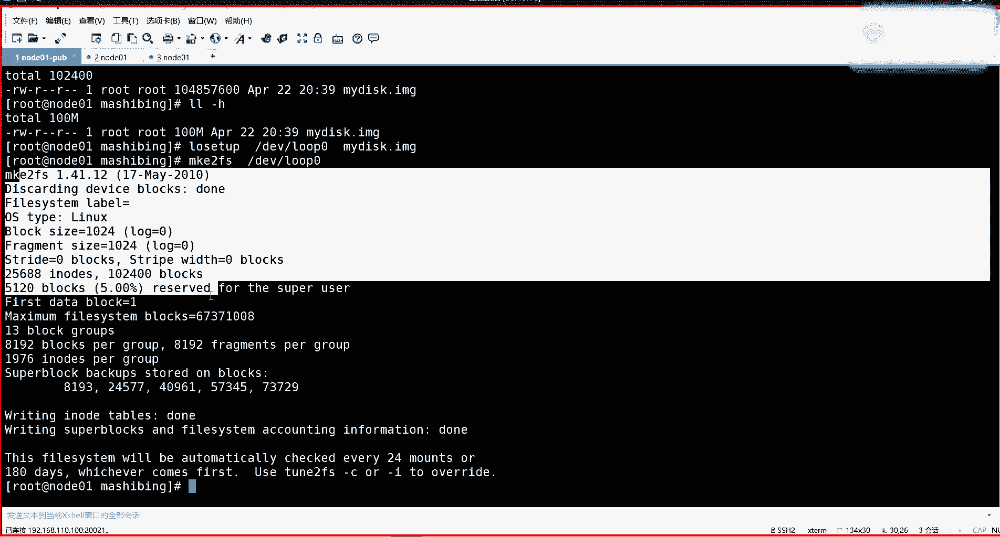

一会儿挂上就挂挂挂的时候再给你看吧，这个就是为了要给它格式化，就是类似于你在隔你的U盘，在隔你的那个那个磁盘分区一样。好吧，就是。类似于吧，你就想成是一种跟跟那个挂的一样。

就是把我们的这个刚才这个这个设备挂到了我们那个DV这个这个这个目录上去。那我对这个设备已经把它应把这个磁盘镜验文件印到这个虚拟的环还回设备上了。然后呢，我也给它做了一个格式化。格式化之后。

那这时候其实这是一个设备啊，这是一个设备，只不过这个设备它不是物理的，它是一个虚拟的一个一个一个映射关系。那像我DF当中是没有它的一席之地的那我可不可以把它在挂到我这个虚拟目录上。

那我访问某个目录的时候，其实在访问这个虚拟的硬盘。明白什么意思吧？哎，那这时候先跟着我的先路的思路走啊，因为最后我先铺垫铺垫到最后的时候，找感觉啊，找感觉。😡，那比如说我去到一个MNT的目录。

这是一个目录啊，这个目录里边我看圈圈叉叉这个目录是空的。注意看我的虚拟文件系统里边已经有一个目录了，叫MNT的根本MNT有一个圈章是空的。我可不可以把我第一位的这个。录个零挂上去。

就像我把DEV的ID3挂到某一个目录或者SD1挂到某一个虚拟目录上一样。找这种感觉啊啊找找找找这个这个感觉。所以呢怎么去挂载mount，但是这个类型你要搞它是E叉T。

two这个刚才格式化的是这个文件格式挂在谁挂载的就是DV我准备的这个虚拟的这个环卫设备挂到哪去，挂到MNT的圈圈叉叉这个目录下。回车。那这时候先看DF啊，DF里边多了一个条目。

在你未来人或程序访问操作系统的跟目录下的MNT目录下的群间叉这个目录的时候，这个目录就再也不是你曾经的刚才创建那个在这个第三S13分区的了，而是录零这个文件里去了。这个虚拟文件里去了。

到这儿能听懂学来稍波一。😡，跟着我的思路走啊。😡，那么这个时候我们去看一眼那个目录MNT全均车边。哎，这里面是空的啊，没有什么东西。然后下边我做这么一件事情啊，注意听我做这么一件事情。

到时我一如果实在还听不懂，我看大家的一个数量，我给你画图。但是下面我演示完，你应该有这种感觉了。首先第一件事情。我where is。Blash。嗯，我觉得大家应该是不是都知道一个拜师是一个什么东西？

拜师就是我们单间那个解释程序。明解吧？就是你和lininux交互的时候，你打那个字符是哪个程序解析的，是这个拜事。这个听懂同学来说说一，这个不需要再讲了吧。Yeah。这个应该都懂啊啊。

而且他还只持脚本编程都懂啊。那么where is就是告诉我这个程序它在哪儿。你会发现他在B目录下有一个bsh，这是在我操作系统B目录下。那我现在是在哪个目录下，我现在是在我的这个虚拟目录。

虚拟文件系统的一个目录下MNT的均叉下。那这时候我做一件事情，makeDR。创建一个并目录。那就多了一个B目录，我把谁拷过来，我把操作系统跟目录下边的一个B目录下的b拷贝到这个B目录下。

那也就是说其实我是在我刚才挂载的这个虚拟这个这个这个目录下，有创建一个B目录，里边，并放了我这个拜事这个可执行程序。能明白什么意思吧？哎，有这个这个这个放了个程序了，还有一个指令就是LDD。

LDD接上我们这个be事，它可以分析。你的这个程序，它的动态链接库有哪些？就是这个程序如果启动的话，它需要其他就这个这是程序可执行的。但是它启动的时候，他可能需要一些库里边提供的一些方法函数。

可以动在架子行，这个这这些这些这个就是它的依赖，就是它阳启动的话的依赖这些东西，这个能听懂原来说ber一，然后且发现它们的规律都在lib64这个目录。😊，啊，libabary64这个目录。

所以我就返回上一集。有人是不是已经感到我要做件什么事情了？我这边目录刚才创了一个病里边放了一个b，同级的话在这里边再创建一个lab64的目录。

我其实拿这个子目录在模仿我的根目录里边的目录结构以及程序的这个摆放位置。然后做一件事情，拷贝你上面根目录la本64里边，它这里边是有这些文件的，但是这文件好几个可以用一个花国号。

然后紧贴着把这个文件名完全粘过去。一个文件我要考加一个逗号，这叫花括号扩展俩文件。因为你的他们都来自于这个一个目录，最后花号里边东西一个S去拼接它们，然后将下一个文件。还有一个文件是他。然后画框收尾。

这里边不允许出现任何的空白符，整个这个花框会上这个写法，把它这些文件一口气儿拷贝到我当前目录自个儿创建的le64这个目录下。

那你看到是不是这个里边注意这个这些文件都是我自己的在我这个目录下创建的里边放到一些东西了。到这一步呢看同学来说波一。は。然后呢，有了之后，我现在准备了一个程序存在的目录。准备了一个它的库载这个这个位置。

如果这是一个根目录。是不是启动这个成立的时候，他就固固然的去这个目录找一个库就能挂了，他他就能启动成功，对不对嗯。Change root。有这么一个指令啊，都是现在都给你演示告诉你的是一些相关知识。

其实这些跟你们没有毛关系。因为这些都是运维干的事儿，但是我告诉你系统里有这些个知识点就root。然后一个当前目录就是把跟目录切到当前目录，并把并下的b事启动走。你先看到得到了一个。

接受我们用户输入的一个一个提示框。但是这时候是跟上面这个提示框是不一样的，这显然是俩程序。他的进天I号是4278，一会儿我告诉我，一会儿我们回去看他的进天I号是多少。先记住现在这个拜是。

他的进 ID是4278。然后在这个里面你执行LOScom not found，然后执行VIcom found，然后执行com found。其实这些都第些命令都没有找到。为什么？

因为我刚才在这个目录下并没有放这些程序。我只是放了一个bash，但是放bash不怕，我是不是可以用ele，就是b事拜事自带的一个打印程序，然后打印一句。hello，马士兵将这个字符串用重定向。

这也不需要外部程序，都是拜事自带的。重定向到根目录。注意这我写了一个根，下边1个ABC点TIT回车写成功了。我打印了这么一个字符串，用重定向写到了所谓的虚拟文件系统的根目录下的ABC文件里。

到这步都能看的同学来上边一。他的进来量是4278。然后我退出这个程序，加击退出就回到了刚才外界这个程序。然后我先打印echo。ID号刚才的这个bsh是4278，是由这个闭目录启动的。然后请他之前。

其实我这个真正解释程序是4117。另外一个副blash。那现在我要验证一件事情。第一个我先去跟目录跟目录去看，刚才是不是先根目录写了一个ABC，我先去我这个物理操作的根目录看有吗？有ABC吗？

是不是没有，然后这个时候再回到。这个目录刚才我是呃这个这个去到MNT挂载这个目录，这刚刚才是在这个目录下，对不对？这个目录来看是不是多了1个ABC点TIT我是在这个目录下亲入的清了了根目录。

并把它跑起来了。那这时候程序虽然那个新的系统里边有一个b，但是我做了一个根目录里边放了一套另外的bash。然后所有他们的跟文件交互都在这一个目录下完成。啊，没错，跟切换了啊。

但是这个时候跟你们所有的docker不一样啊，跟你们所有的docker还不一样。刀cker它不止一个文件系统的一个秘密空间的一个一个一个一个一个一个一个子域。好吧，现在我只是告诉你有这一个感觉。

以上所有的回顾一下，从最开始的时候，我在我的本地磁盘里边准备了一个文件叫做买d。

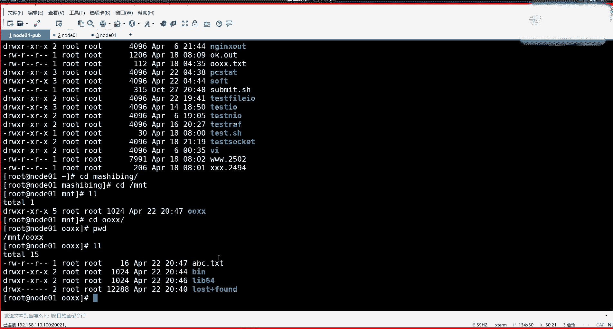

点儿image。我这个文件是不用DD命令生成的啊，一个空的文件。然后我把它挂载到用L set set up，挂载到这个所谓的虚拟文件系统的DEDV模型。零这个设备上。挂上去之后，我对它进行了一个格式化。

格式完之后，然后又mountant这个东西到了我的根目录的MNT的圈均叉这个目录。那也就是其实作为上层程序，如果访问这个虚拟文件系统的圈金叉，其实访问的是谁？访问的就是这个文件。

而且我在这个文件里边又自主的创建了一些bin，拷贝了一些bsh等等的一些东西往里放。那其实我在这个目录放的所有文件，应该存在哪了，是不是存在这个文件里去了。到现在能听同学来说个一。

这个整个这个实验的演示的过程当中，就有一个所谓的虚拟一切接文件。我拿这个反正是一个文件，我可以挂载，然后可以映射，然后可以操作。

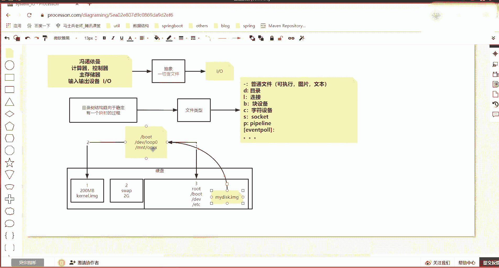

啊，那这个时候你现在看这里边有刚才这些东西啊，然后如果我退出去DF这边也有了一个映射。你现在访问他看到的就是这个这个设备，那也就是那个文件的。如果嗯。Mot。MNT全给它卸载掉，你再去访问它。就是空的。

但是如果但是但是你要注意啊，你要注意，现在看是看不到了，但是这个文件是不是还在？嗯。啊，随萍在这个共下，我刚才那个镜像文件是不还在这个镜像文件如果给你的话，你挂载之后，其实你也能看到这里边东西。

那在这个间接的去遐想啊，去假想。如果你学过docker的话，你会发现docker里边是不是第一步你要先有imageimage里边是不是要先放你的程序。docker其实是容器，容器这个虚幻的东西。

它是一个命名空间，里边跑的是进程。没有操作有内核什么之类的，他所有的docker复用的是你物理机这个统一的内核。你先有镜像，有了镜像之后，才有con它的容器的一个概念。镜像这的磁盘呢是Eage。

其实需要先挂载，挂载之后切换根目录读取里边的那个进程的那个执行文件，再准备命名空间，然后这个这个进程的空间等等的，然后再把它跑跑到个这个进程这个命名空间里边，那程序才会跑起来。

这个间接有感觉同学来刷波刷一波一，这个源于它这个整个这个虚拟文件系统的一个支撑。

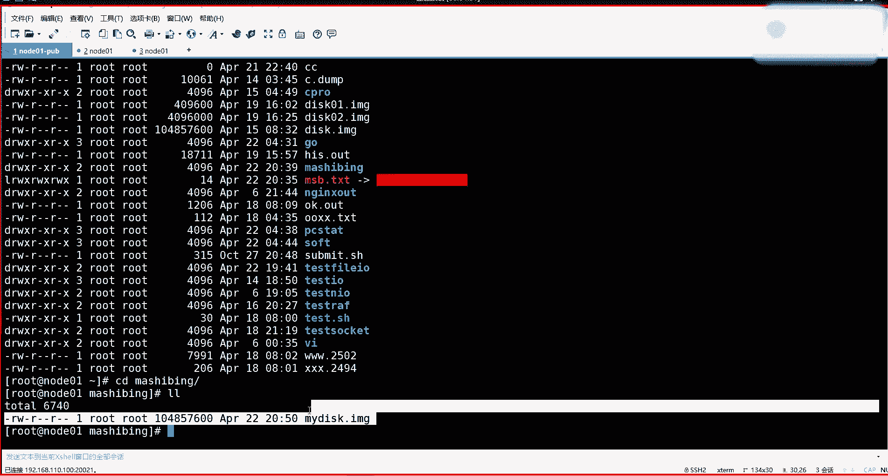