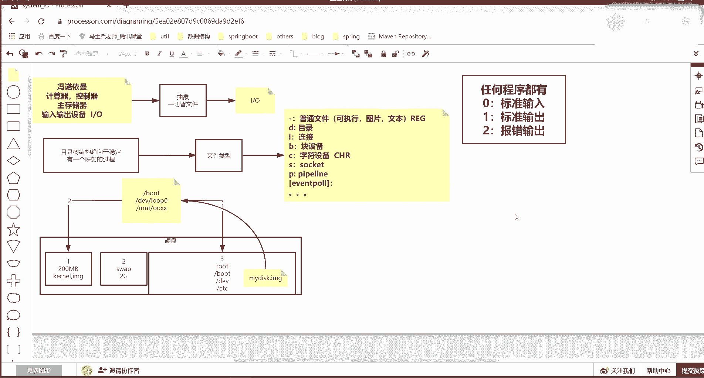

# 花了2万多买的Java架构师课程全套，现在分享给大家，从软件安装到底层源码（马士兵教育MCA架构师VIP教程） - P181：【IO／NIO】socket pipeline - 马士兵_马小雨 - BV1zh411H79h

跟种速度啊，现在我有一个新的进程，这个解释程序就43980他的ID号。然后去PROC，然后4398看它的FD目录，这个里面只有012，它的一个程序的最基本的输入输出和报报错。然后我做一件事情。

这个在光测我还有那个前面讲我的通讯的时候，我也讲过，比如我准备一个8输入输出来自于DV的DV是一个设备目录，一切接文件，然后有1个TCP你看不到的目录，它虽然看不到。

但是有这个那这个那核里边是有这个路径的，但是这不不是给人看的，后边接3W点百度点com，然后80端口，这看似是一个目录。但是一切接文件，最终。有点慢，有点卡。最终它会变成一个文件描符8。

指向了一个所谓的一个scket，然后现在又多了1个LOF，然后杠OP到这你这能看到一个表面的一个8展scket。但是这个八指向的是谁，指向的就是一个IPV4，上面一看叉，这个就是IPV4了。

它就是一个所谓的一个socket。只不过平时我们看不到它，只有在有它产生的时候，这个文件描符才能标识出出它来。然后以及它是PCP连接的啊这样一个这个安就是不是具体的了。

因为它不是文件的某一个真的一个文件了。后边就是我那个01自己一个随机端录号，连了百度的1个80端口号，已经建立连接了。文件描述符一切接文件，任何东西都可以是文件，文件描入符都可以去描述它的。

这就是所谓的这个文件描符出现的意义。在linux操醒当中，因为它先有了一句话，一切接文件是不是一切接文件了。然后它实际上看到是文件，然后它实际上是一个scket的，但是它也是一个文件。

然后会有文件描符去描述它。这块能听回来，说个一。嗯。

这块的没有啥没有啥演示的了。set的你应该也知道了。然后呢，还有一个是管道的这个类型，一般你也看不到，像S那个类型，就前面什么S类型你看不到。因为它是程序内部可以产生的啊，那核还不让你看。

所以你看不到它。但是你可以知道得得有这么一个文文件类型，它是可以用文件描符表示的。还有一个就是管道说的管道就把你们刚才所有人不会我都给你整整体给补一遍吧，咱们从哪开始讲起。

咱们先从文件这个这个文件描符的012开始说起。首先你要知道一件事情，死记硬背，任何程序都有012，只不过你用不用的问题了。

012，然后零的话就是标准输入。一的话是标准输出。二的话是报速输出。死记硬背啊，先死记硬背这个这个概念。没有什么理由，linning就是这么对程序就这么去设计的。

都有任何程序都有零样这个三个最基本的一个程序，你写的时候，只要你你就一个你只要想创建一个ja程序，零样就有了steem点in点s点arrow，但是你还可以打开别的文件，在打开的时候就会出现45加90。

这是文件描符要描述你打开的那些个文件。

🤧然后再往下。任何都有的时候，这个时候我们还可以看到它去PLC。去到你进程所在的这个路径PLC啊，先说PLC这个目录是内核映射目录。

这是第一个知识点，任何程序都有这个它，然后怎么去看它跟目录有1个PROC。PC这个目录是。映射的我们。内核里边的一些变量属性等等的。就是虚拟文件系统吧，它的每个目录并不一定非得是磁盘上的。

像PLC这个目录，你再看你成为看开机的时候，再看到的时候里边有东西。

就像你看到的东西了，你把电导关机，你偷摸看那块硬盘那PLC里边是没有东西的。

它这个开机之后，内核里的一些变量属性等等，都会在这里边去挂载。内核有什么，内核比如说有进程管理，你看那些数字的目录，其实这每一个数字就是一个进程代例号。能明白什么意思吧？哎，就这这个就是进程代地号。

所以进程被内核管理。那进程或者内核的一些个网络等等的这个一些属性都在这个里边是可以去被被映射成文件的。一切进文件，即便是连程序内核里边的一些变量属性和对象等等都可以映射成文件。

这是这个目录可以右一切接文件这个可以挂挂上勾的到这部分听同学来刷二边一先强记啊。然后在这个目录下，然后你去到。doll了 dollar，那么do dollar，我说一下doll dollar什么意思？

doller dollar是当前。😡，bsh就是和你互动的这个拜sh的PID进常列号，这是一个特殊的一个环节变量。而且它极其特殊，一会儿我还要再说他同样获得这个PID的。还有另外一个变量叫做败是。

TID有两个变量都可以获得和你当前交互这个进程的ID号，一个是两个doller，一个是。但是PID。这个能取出来，这两个也能取出来，但是它比较特殊，它特落在哪了，一会儿讲到管道的时候你就知道了。

那么在这个目录下。PC的目录像。有1个FD的目录，就是当前这个程序的所有的文件描述符，你还可以用另外一个命令。LOF然后加上OP。带一个参数杠OP，然后到到这来看这个当前这个进程。

这个b是它所有的文件描符的细节，这个只是简单知道哦有哪些文件描符，它打它指向了什么东西了，这个是可以看到文件描述细节的偏移量指针等等的。这就是刚才我讲的一些知识的一个算一个小的一个总结。

这些都应该能听懂吧。听懂的同学来说个一。Yeah。

哎，这个能听懂之后往下走。你都能看到里边FD了，也就是在这个目录下去到doll了 dollar。他就会转成4398。啊，就进到这个4398那个目录了。4398这个目录进进进来了，进来之后啊。

这一个进程还有很多的属性参数。哎哎，我怎么挪这个窗口，还有很多手用参数都可以给你映成文件，就是一切接文件。它这里边有比如说namespace挂载的，有FD文件标符，有task现成的数量的。

然后我们去FD的目录，这个FD目录里边就是可以看到所有的这个程序当年开启的这种IO。啊，对哪些文件K加O有文件描书可以代代可以代表它了。😊，这是现在讲的知识。那么你能看到它之后有什么好处？

操作系系统基于这个的本质之上，它有一个linux有一个功能叫做重定向。注意，首先说重定向不是命令。重定不是魅量，重定向是一种机制。啊，什么机制？举一个很简单的例子。如果在你开发一个java程序的时候。

你如果new了一个fi。如果在写ja程序的时候，你你写了这个。死代码用了一个file，这个file就是你的根目录下的圈圈叉叉点TIT。那这时候你会得到一个所谓的一个fi。然后比如说这个I file。

等于它这个伪代码这个也算不伪代码了，这个代码都能看懂吧。就是你读你想打开一个文件的时候，那肯定就是你写死了。那这个程序一旦被编译的时候，请问还变得了吗？

这个程序如果未来你通过它身上I fell点get啊，是get应该什么呀？就是一个out to stream。应该扭一个扭一个啊，就是应该扭了。如果你扭一个output stream的时候。

如果放了iF的话。那这时候如果未来你你会得到一个一个out，对不对？有写尾代码了，你如果在out写出的时候。你写一些东西的时候，那代码写死了，一定会向这个文件去写。到这步能听回来，说波一是不是写死了啊。

你程序你在你程序员看自己代码的时候是这么看的，对不对？但是操作系统里边，他哎他他特特特别讨厌操作系统的时候了，你你我我我能知道你你里边怎么回事。当你要对这个文件去有一个输出写的时候。

这个过程当中其实会伴随着得到这个outt其实是什么呀？它会伴随着得到1个FD在系统的在系统里个界面里边，而且能给你能让你看出来。😊，这就是一切接文件，还能看到这个FD。

你你在ja里看的是out这个对这个这个对象。其实这个对象是谁？在操作这层面看到1个FD。

一会儿就会在这能看到1个FD。如果你这个代码里边有一个，那只不过这个FD指向什么呀？后边指向的应该是你写的这个。

学商这个文件都被暴露出来了，这句话能听出来。说波一就是你代码虽然写死了，但是这些个映out或者个FE映射这个文件这个规则会被暴露出来。暴露出来之后，它有了一个机制，这个机制叫做重定向。

它可以选择让你的IO指向别的地方去。

对吧？那个重定向机制怎么实现的？往下来啊，重定向的时候，其实我们的输我们的流的方向无非就是输入和输出，对不对？留的方向IO嘛无非就是输入和输出。那其实换到操作符上，那输输入就是小于号。输出就是大于号。

这个叫做输出重定向操作服的基本服务。但是它有很多种写法。那么重定向怎么去实现。我给你解释一下。比如说像我当前的，比如我要启动一个程序啊，我要启动一个LOSL可以读取你给出的当前目录。

并把当前内容把你打印出来，其实任何程序都有012，注意听啊，任何程序都有012，我是012。其实这个L它是个程序，它也有012它的一是标准输出，一是标准输出，那它的一指向哪。

一指向了屏幕就打印到屏幕上了。那这时候如果我LOS打印当前目录，把它的标准输出输出重定操数大于号给它指向你加目录拨浪号是加目录录，你加目录的意思，加目录下有一个LOS点out那这时候屏幕就看不到。

到这部分能看懂同学来边一整个这行参数有几部分组成。第一个是指令一个程序，后边是它的参数，再往后注意这个一大于号，这不是它的参数了。

截持了知道了哦，一大于号时触发一个机制，是让未来IOS它的标准输出一不要再指向屏幕了，换一下它映射，换到这个文件上去。那这时候换完之后，它再一执行的时候，就会把一里边标准输出打到这个文件里去了。

所以你就看到了会有1个IOS点out。

就看到这个IOS执行打印那那些内容。

好吧，这个是重定向，输出重定向，有输出重定向就输入重定向像catca。比如说可以读取一个圈圈叉叉这个文件，它这个cat里边有两个流，cat这个程序一旁，你都能写出一个cat，用加入程序。

它肯定读了一个参数，这个文件就open它了，打开这个文件之后，读了它里边内容，就是它的输入流，cat有输入流。因为它读了一个文件，它cat有输出流，并把输出的内容打印到屏幕。它有两个流的对接。

这个cat，那它就有它有流任出就有流。那我可以让cat在启中的时候，它的标准输入。它的标准输入来自于我们的圈圈叉叉这个文件，并让它的标准输出写到cat点out。

那这个时候其实你就把这个程序原来硬编码的那些东西给它改变掉了。那屏幕也没有了，那这时候你去看。看点 out。这是打印出来的，就输出两个方向，他给通过我们的人为干预已经已已经已经改变了。

这个能听明来刷波一还有一个刚才我演释了一个readd命，对不对？哎，一个rad可以后边搁一个A，对不对？哎，注意这个A是一个变量r它起到一个什么效果，注意看回车屏幕阻塞了，你在这儿随便输入点东西。

按任何字符它都不停止。但是一旦你按下回车键。哎，它退出了。那么也就是说read这个readread个这个指令，它对换行符极其敏感，读到换行符就退出自己。那么它做一件什么事情了，它通过标准输出。

就键盘的输出，这键盘的输入，通过标准输入键盘的输入，任何东西都零一样。它的零其实现在对接的键盘，你给了东西之后，它判定每一个字符是不是回车，判断回车之后停止并把读到的东西复给了A。

所以你打印A的时候就看见到刚才那个输入的东西了，就复值给他了。那这时候任何程序都有输入输出，所以read。😊，在给A读动力的时候，我可以让它标准输入来自于。一个。刚才把咱们那个cat点out这个文件。

是不是可以重名一下，本来你硬编码read的就是要来自于s点印标准输入的。零会映射到s点和它的一个一个东西，那它映映射到键盘了。但是我可以在你启动的时候给你指向到一个文件。

这作为这个文件里边内容作为你未来要读的东西。那回来之后就不会有阻塞等等待用户了。因为它已经把键盘转成文件了，所以回着之后就就直接退出了，因为它已经从这个零不是读键盘，而读文件读到东西了。但是注意看了。

我们先看VI点里边会有很多行内容，那么请问A里边存的是什么。😊，刷一下。😡，A里边会存什么东西，是整个文件内容吗？还是3个A啊？没错，他对换行符非常敏感，这叫IO流里边的所有这个文件，所有字数往里留。

它一读到换行符就结束了。所以ecle A的时候只有3个A。就第一行。这是基本的输入输出的一个原理。听同学来说分一。是。哎，除了有这个最基本的，还有一个进阶的，还有一个进阶的。我的流的对接除了可以对接到。

案的就是全部的意思嘛，到时给你解释啊，我现在就要开始讲高级的了，除了可以对接这种，就是它后边都是文件，前面都是文件描符。在这儿有一个语法格式，先强调一点啊，就是从定向操作符。

无论是输入还是输出这个重建操作符，左边放的是你要改变的这个程序，它自有的那个文件描符，且两者之间不能有空白符，在命令行当中空白符极其敏感，会做死例的切割。切开之后，它会认为零是前面它的参数。

再也不是那个文件描号符了。明白什么意思吧？这个成序都退出了，当然单单当当次有效了，就是它启动的时候，我改变了你零的位置。重电操作符左边如果你放文件标符，两者不能空白符，右边是可以有的。

默认这个这种重电操作图符，右边放的都是文件啊，都是你的数据源的，你的文件。但是其实我们有的时候可以把重电操作符对接起来。可以从内容操作对接起来。举个例子。我常给你们举个例子，比如ENEC嗯。

哎又说他又又又又又又又开始蒙了，怎么给你解解哎，就这么这么一说吧。比如说LOS我显示当前的内容，然后呢，LOS可以接两个参数，一个是显示当前目录，一个显示根目录下的圈圈叉叉回车。

那这时候注意LOS的输出有两个，一个是报错了。因为如果你看LOS圈圈叉叉这个目录的时候，是不是会给你报错不存在。能理解什么意思吧？哎，那也就是LOS在执行的时候。

它可以显示你给给定的有的这个目录里边内容或者报错，你给的目录不存在。那其实这两个输出它应该是一个走了stem点outt，一个走了sem点arrow，一个走了一，一个走了2。

这个能听同学来说边一也就是LOS如果显示既显示当前目录，又显示一个不存在的一个目录。那么这时候我可以让标准输出一，重定向到1个L01点outt。然后屏幕上就没有标准输出，但是报错。

这也可以看出来到报错还有还还被打印。所以这时候你可以再改，让二指向到LOS02点out。那这样屏幕就没有了，你可以让两个留写到独自的文件，各自的文件去，也可以让他们写到一个文件去。

但是如果要写到一个文件，比如写到三去，这个重电操作符默认是覆盖的，它并不是追加的。比如说这两一的这个LOS的标准输出一和报错输出2，他们都写到LL03那个文件回车哎，屏幕没有，但是你VNS03点out。

这里面你看到的是只有标准输出，没有那个报错，报错没有写进来被覆盖掉了。这个能听懂来，shop边一哎，那有人说可以改追加，还有一种写法，其实是可以让一个文件描入符指向另外一个文件描符。

另外一个文件描符指向一个文件是不是可以了？能理由下明达什么意思？也就是说我可以让二指向一，对不对？让一指向1个L04点outt这个文件，对不对？就这个思路能听明的同学来刷波一。但是你要注意了。

但是你要注意了，第一个只有两个只有两个bug要解决。第一个叫语法。我说了，从定向操作符左边一定放的是你某一个这个程序的文件描符，右边放的基本是文件。但是这里边它是文件。

它其实说的是这个程序的一号文件描符是标准输出。你如果右边重现操作，如果右边放的是文件描入符，重定向操作符的右边。如果放的是文件描入符，请在重定向操作符后面放一个and符。这是一个硬性约束。

如果你不写这个案，他就会认为把错误写到一这个文件名里边去。这不能听懂来刷波2。好吧，那这样写的时候，是不是可以可以完成这个程序的二合一就对接起来了呢？我们来看结果啊，回车，你会发现屏幕上依然有报错输出。

那这是重定向操作符的另外一个基本语法，从定向操作符绑定是有顺序的，它是一个一个去绑定。当二指向了一的时候，其实这时候一还没有指向文件，一指向的是屏幕，所以二指向了一又指回了屏幕。

这时候一在指向文件的时候，二依然根据刚才那个指向，它指向个屏幕去了。其实二并不是指向一了。在这个指行的时候是二指向了一的位置。一后来改了位置了，抱歉，你曾经一那位置已经被二指向了。

所以他俩应该分个个才对。就是让二指向一把一的位置先指向这个文件，一就指向这个文件了，把二指向一的位置就指向了一。刚才那个指向这个文件的位置。回车屏幕就没有了VNL04点out里边既有报错，看到了吧？

又有正常输出。这是纯定向操作符的基本语法。都能听朋学来说波一。哎，这这些应该都是。最基本的一个知识啊。重定项操作服有了之后，我们讲另外一个知识点。

学linux，你必须就是先你要先学成定项，成定项。学完之后还有一个非常至至关重要的一个支识点。这个知识点如果不学，你lininux白用，就是管道。管道式呢就是一个叹号，不是就一个竖线。Com。

什么是管道啊什么是管道？举一个很简单的例子啊，举一个很简单例子，介绍几个命令。哦。马士兵拿到这个目录，我准备一个文件VI1个tests点PIT。这应该这应该这应该这个这个太费之间讲这个知识，到是没办法。

你们这个还是给你们补吧，要么然后边没法讲。这是我准备了一个文件，这个文件有若干行。呃，比如说先介绍两个命令，这都是在我们日常生灯常用的一个命令。一个呢是had头ha头。然后呢，默认如果你接了这个文件。

它会显示这个文件前十行。当是这个文件显然不是特别的多啊。再往下追加几行。上面上面字母，下边数字好吧。这个键盘好难用。然后用head头。可以读取ts，哎，你读到它就是十行，相对应的还有一个t读这个文件。

就读到末尾的时行。这是两个指令，能听的同学同学来说边一head杠一test可以读到文件的头，连续的从头开始读出一行来。headd杠2，它可以连续的把头开始这个文件的两行hd杠3。

它可以连续读出这个文件的前三行t一样。杠一你读它就是文件最后那一行。杠2的话就是从文件持续到文件的两行给你显示出来。但是没有一个指令说我想显示文件的第八行只显示第八行。能理白什么意思吧？哎。

就是目前来说，你掌握的指令里边只有ha的头，只有这个t尾。我要想显示中间的第八行怎么显示？我想想示中间的第八行怎么去显示？那这时候用管道就对了，因为一个命令headd-8把文件的前八行取出来。

交过通过管道交给tll的留下最后一行，这就是第八行。听不明来刷波一。先看表象，就是我一个程序执行，我虽然拿不到精确的第八行，但是我可以从第一行到第八行全给它搂出来。录入来之后。

把这个八行的一个数据集交给管道留给了另外一个指令。这个指令会它的特征就是留下最后一行，那前七行就被过滤掉了。前面的管道的目的是前面的输出是作为后边的输入，这是管道的基本特征。这个特征听了之后。

那么下面进入一个非常之。这个烧脑的一个环节。😡，这还差一个知识点啊，就父子进程。我操今天失败了，这个课讲的有点疼，有有点有点疼了。这知识如果不成体系讲，我等于我其实这节课应该先讲lininux。

我把lininux操系总讲完这个使用讲完之后，我再给你讲这个。关于IO这块的知识的好好理解了。这里边还有变量和环境变量的概念啊，管道是听到这儿，先听个响，先听个响。我下边讲另外一个啊。

再来听这节课这节课咱们就改个课程名字，叫lininux基本使用啊。😊，嗯。讲另外一个知识点。嗯，先看ecle dollar dollar，当前进程的ID号是4398，这是一个bsh一个程序。然后呢。

我们还可以再启动一下并下的blash。再启动一个binmat，这就是一个什么呀？4463了。那么这时候用PS tree可以看到。我PStra是一个指令，他来自一个拜师，这个拜师又来自一个拜师。

前面这个拜师就是4398，他的儿子就是这个拜lash4463，他们这两个进程是一个父子关系。进程是有父子关系的。来听懂同学来刷波一，你还可以用PS杠FE，然后grave，这就是管道啊，前面的输出很多。

通过管道交给gravegrave抓取谁抓取一个4。398回之之后，你会看到4398这个进程就是一个bash。然后呢，4398这是父进城，就是他儿子那个进来地4463，就是4463，这是他儿子。

也是一个blash，这是他们一个父子关系。对吧啊，这也是一个前置知识。那我退出前当前这个这个拜事拜一回车，其实退出的是4463，又回到了4398。这是回到了4398啊，这是一个基本的一个常识啊。

先知道有父子进成的概念了，再来说变量。如果当前在这边定义了一个变量，比如ABCX吧，它的变量值是100回车用eical可以加doer符取一个变量值。取出X值，这是变量的知识吧。在拜式当中，它只是脚本。

你可以写一个X，注意步动空白符，空白符非常非常敏敏感。X值付成100了，ecle X取到值是100。然后这是在当前进程，如果启动一个B是。那这时候就是另外的一个进程。这个进程474了。

那这时候能不能取到X的值，负进程里边有一个X的值100，那子进程能不能取出来，能还是不能？子行能不能取出来，取不出来，进行隔离这块数据是要被清掉的。啊，是要被清掉的，取不回来。

所以才会有了一个export。定义哎呀，我去。excode定义一个X，这个这个这个词儿是什么意思？是让X具备导出能力，环境变量投动力。只要对着一个变量制了一个t之后，你再执行并下的back。

4481这个紫禁程就可以读到X值了。因为4481来自于父亲。这个也就是为什么你们在学习linux时候安装系统的时候，让你去写EDC profile profile。

这时候后边要定义变量的时候说要定义环境变量，前面加它。因为如果你没有这个关键词，这些变量是在当前进程有用。一旦启动了紫禁城，他就不知道这些变量了。那你在紫禁城工作的时候写写脚本的时候，执行的时候。

你是不是要把变量再重新定义一遍，是不是累了，人是懒惰的，促使着科技的进步，所以他琢磨出这么一个东西来。父禁城只要定义好这些东西，任何的紫禁城孙子，孙子在孙子，他们都知道有这些变量。好吧。O。😊。

知道了负子进成这个变量，这个有知道父子进程了，知道了变量了。那么再来说一件事情，加上管道的支啊，再加上管道支，内部不AWK什么就不扩展了，那个就不扩展了。咱们再说管道的这这个结合起来。

🤧如果看我下边的一个操作啊。还有一个再说再多说一个知识点，叫做指令块啊，这字指令块。也就是你可以写一个花括号，一定要加空格。花括号其实它是一个命令，一定要加空格。要结构用的。后边比如说你可以写一个。

Ele。然后巴拉巴拉，然后注意用分号结束，这是第一个指令。第二个指令再告诉他嗯，执行一个。爱口123。再写一个分号结束，再用空格，再加一个花括框，这是一个基本常识。这个花要分开的。像刚才拷贝的时候。

那个括号跟东西不能分开，直接用逗号，那叫花框扩展花号有两两两两种这个文文本解析这个这个结果回来之后你会发现这两条指令都被执行了，这叫代码块，这个能听懂回来。邵波一就在一个花括号里边。

你可以放了很多的指令。

而且注意他们会在同一进程执行，就是这个花号里边的所有的指令是在同一个。副进程里边去执行的。我要说一件什么事情啊，注意听看我下面的一个操作。如果我在当前我先告诉你啊，当前的附近城市4398里边。

我定义了一个A变量等于一。apple dollar A等于一了。那么这时候注意看我写了一个花括号，令A等于9。明白我什么意思吧？然后并，然后输出一个内容。这个这个代码肯定两条指令先后执行。

它肯定有标准输出，它的输出我可以通过管道。给到我这边的一个。看t。😡，cat是不是有输入输出的能力，它有一定有输输输出，这一定有输入。所以管道会把前面的输出作为它的输入留给他。就流出来了。

能理有什么意思吧？啊，先看这么先看这么一个一个一个这个东西看怎回来说个一。这就是管道啊，左边执行了A等于9的负值，然后打印了一个字符串。打印字符串呢会交给管道留给ca cat。读完之后。

再ca再cate出来就被打印出来了。回车，你能看到这个输出。那么请问如果我ecle dollar A，请问它的值是一还是9？请问是一还是9？它的值是一，管道可以衔接输出和输入，这是一个大家都知道的。

但是如果稍微有点工作经验，都知道管道如果你就学到刚才那个层次，你上班容易踩坑，而且死的很惨。注意听管道的机制是。首先你写的是一个文本字符串，吧叽一回车。你的解释程序拜是这种脚本，它为什么叫解释执行。

它会解释你的一个文本段，它不是编译执行。他不是说先编译完了再执行，它是解释执行。你什么时候回事什么解释。解释的时候，他看到管道。这个拜事。如果看到管道的话，他会先在左边启动一个子禁程。

右边再启动一个子禁程，并让两个禁程的。😡，输入输出通过管道。

就是另外一个类型，就是我为什么绕了半天，前面的铺垫都为了给你讲这个东西，因为这个东西看不到，但是它存在，它会用另外一个机制一个类型，一个文件管道的方式对接起来，对接完之后，左边的进程，子进程。

再去执行A等于9的负值，挨打印它，右边的子进程再去执行caca的时候，因为刚才已经连接完管道那个那个那个那个对接过来了。所以他就都把前面留过来打印出来。但是再加上刚才小五还是谁也说了。

操作系统的进程补充。😡。

就融的隔离级别很高，你A就是这边子禁程里边对A做了一个负值等于9，是那个子禁程的。它结束完这个A等于9就带走了，再没了，负进程A还是等于一。你回到现在的附进城。负近成4398里边。

这里边肯定是一个子极称，对不对？哎，4398里边这个A还是等于一这块能听出来说倍一。😡，那是不是呢？我们是不是可以验证一下，怎么验证啊。

我是不是可以ecle dollar dollar把这边的京天套打印一下，然后交给管道，通过这边t显示一下就可以了。这能看懂。是不是这样就可以了。那这样的时候注意听，看着先看结果，先看结果加击。诶。😊。

左边不是应该启动一个紫禁城，紫禁城是一个新的ID号，然后再启动ele吗？那为什么看到的这个到了到还是4398呢？这个就是刚才说了，有两个东西可以取集成ID号。

dollar dollar也可以取dolldollar办事PID也可以也可以取，然后交给cat，这个是4496输出，两次输出明显不一样。那这儿的本质区别也是一个坑。

dollar dollar的优先级高过了管道，这种一个dollar取变量名的低于管道的级别。换句话说，bsh是个解释执行的一个程序体系。它是解而行。当你吧唧一回车的时候，b是没有先看到管道。

而是先看到两个doller，它的优先级高于它，先把当前的4398给它替换过来，叫这叫这叫参数扩展，先把两个doller扩展成4398。扩展完了之后才看到管道，然后左边起了一个进程，右边起了一个进程。

但是左边进程虽然是一个紫金ID号，但是这个值已经不是do，而是一个具体4398了，它输出的就是一个字符串，给它就输出了，就是4398。但是下边这一行一回车先看到管道后看到它看到管道的时候。

左边起了一个进程，就是44964496起来之后才看到D以把ID替换成了4496被输出。😊，这块我说明白了的同学能听能能听懂同学来说波一。哎，我讲他是为了告诉你管道有坑，他是有父子进程的关系的。我告诉你。

do了到和do家变了名，他有预言级关系，我是给你讲这个吗？不是注意听，不是我是要给你讲夸框号里边可以执行多条指令吗？不是不是要我给你讲这个东西，这些东西是你你应该都会的。我这一个想讲IO。

我是告诉你拍不烂这个类型。所以下边我要做这么一件事情。啊。我的信号累对吧？eical一个。随便一个奏串，这个奏串一定会被打印。然后注意有一个叫做sleep。这个叫睡眠。这个睡眠让他睡多久呃，不让睡眠了。

用另外一个刚才readread的是不是可以发起读取啊，复制给一个X，这有一个指令，这些指令我都让它正常执行，前面是不是一定会有一个输出，后边是不是它输出完之后，是不是后边一定会有一个阻塞。

等待用户的输入，因为这没有给他成一样，然后给个管道，管道这边的时候，然后注意看啊。这边也是一个cat，可以读取你这边输出过来的东西。然后它打印完之后，后边也有一个read，然后读到一个变量里边去。

我用了一个管道操作符，衔接了两个代码块。千万其实你一些小括号也是代码块，写花块，也是代码块，花号指当前的这个进程。这个小块指是子禁城，这个知识扩展就不扩展了。现在这个代码能看懂吧？

就是两边这两个指令执行完，然后走管道，然后这两个指令执行，他们因为是管道，两边肯定有两个紫禁城先起，两个紫禁城才能执行代码代代码块。这个能看懂学来说2波一。回车。

然后哎我错了我错了错了错错了错了错了错了错了错了。不应该随便打随便打字符。我这边应该打的是doller办事PID我要看到那个今天的例号，我要带你看他紫禁城的那个管道那个对接啊。dollar但是PID。

这边是不是如果他是紫禁城，他应该照多，他那个刚才的紫金紫金台D号是不是会输入出来，然后右边的话也是开完，然后read的之前也是打印一下的。eical dollar但是PID。

能能能理解我想表达什么意思了，这两个代表段回车之后后边这个没来得及输出啊。因为前面是阻塞了，不管怎么看到1个4512，刚才自己是4398，我们双击它再开一个标页去访这台服务器。进程ID号拿到了4512。

明白什么意思吗？4512是这个管道左边这个紫禁城是4398的紫禁城，我们先来确定这件事情。PSS。杠SB。g4398，你会发现4398是个进程，他作为父亲生出了两个孩子，一个是4512，一个是4513。

对应的也就是4512是他4513是右边这个这个能看懂回来刷波一。是不是这个跟我说的是一样，它两边会启动子禁程，子禁程都是b启动器，再就解释这段文本它去执行。这个能听懂之后，我们再来看L。😊，我先去啊P。

因为它的程序没有退出，在这阻塞着呢，去到4512的FD目录，你没看到这里面就一个一，本来程序都有012，曾经的程序的一也是来自于什么呀？DLPDSR那个对着我们这个S终端的。

但是那个一他这个这个一被修改成指定了一个pa。然后你可以再去看。PROC4513。FD啊也是一个F这个零，你看一是不是标准输出，左边的输出。4512的输出一指向了它的。

0这两个就是通过一个pa围管道对接起来了。然后这时候用LSOF杠OP4512。是不是会看到4512左边4513是右边，12里边的一是不是一个先进先出的一个管道，一个pa？4513的。

零是不是一个先进出的一个管道？一个是WE写相管道写，一个是在管道里边去读。只相的是一个ilo3996839968对接上了。听同学来刷二波，666。铺垫这么多知识。

这个东西就已经能把它。