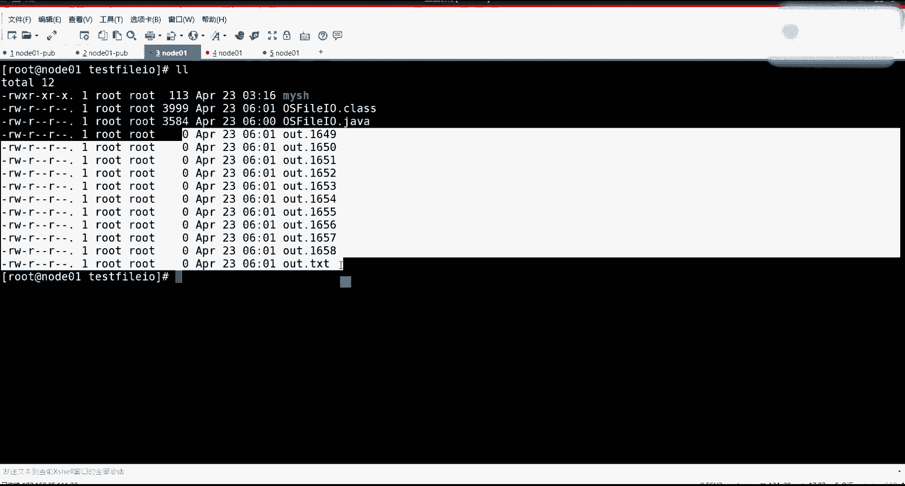

# 花了2万多买的Java架构师课程全套，现在分享给大家，从软件安装到底层源码（马士兵教育MCA架构师VIP教程） - P182：【IO／NIO】PageCache kernel - 马士兵_马小雨 - BV1zh411H79h

书的理解。P以 catch啊，先说一个宏观的一个演示，我只是给你演示它啊具体是个啥东西，我们先见到先见到猪跑了，你再说这个猪它是黑猪还是花猪啊。K edge是液缓存，是内核 kernel。啊。

那个科呢啊它是一个折中方案。可以没有配置 catch，那也就是操作系统当中的这个进程。如果想读取数据的时候。只是调到内核的方法，内核调驱动，驱动直接导找硬件，把数据返回，然后直接给你程序。

程序拿着玩着吧。但是这时候其实你的收IO的这个延迟比较多啊。能明吧？所以在操作流程中加了一个padc，其实加了一个缓存，也就是程序。其实这个缓存就在这就开始说缓存啊，缓存有多个地方可以缓存。

我们依然要宏观去说。首先在拓普描述这张图的时候，我们用applicationapplication里边其实是可以有一个缓冲区的。Aplication里边就有可以缓冲区域，有一个buffer。

这个这个应该都知道，因为你在使用IO的时候，你们是不是都喜欢使用buffer的什么什么IO，对不对？那么，为什么巴弗莱欧比不使用巴弗莱欧快呢？这个时候描述要准确了，可能跟你们之前。感觉的不一样。

然后再来看啊，这就是你的应用程序，应用程序肯定要访问内核，内核其实也是个程序。但是你应用程序和内核之间通信的时候，这里边夹杂了一个东西叫做sstem call系统调用。这个我就不给你复习了。

这是前面操作系统刚讲完的，对不对？嗯sstem call有一个性标用steme call怎么实现的呀？系统方怎么实现的？系统调用怎么实现的？印差。80对不吧？你的80in the80是一个啥？

这个这个你你只需要知道in的80是啥，什么意思。int80是啥？是中断再说的准确一点。你看的80的值是128，一个字节就是0。这样的一个特征，因为它是十六进制的对啊，0S80十6进制。

十0进制是1228，2进制的话就是1000000这么一个特殊。嗯，那他们它其实是一个值。它是一个值。它这个值这个值干什么用的呀？是这个首先这个值是要放到CPU的寄存器里的。是要放到计算器里去的。

计算器计计算器里边存储值干什么用的，它是和你内核里边的中断限量表。中断描述符或者叫向量表。去做匹配的这个表里边会有。0号、1号、2号到128号到255号。258，因为一个字节可以表示范围就是0到255。

明白什么意思吧？嗯，1828这有一个call back。就是这个表里边它的key表里边的key是这个一个数值，它的value你们就通俗想称，就key是这个数值，是这个数值。

这个call back就是一个地址，这个地址就是一个函数。一个方法。一个方法靠白一个方法。那这时候如果在程序里边注意在程序的。里边是在用空间的程序里边。如果你想调用内核的某一个系统调用的时候。

其实是完成了一个int80。然后在其其他计算器里边一经放了那个系统调用的单参数里名字了。但是这条指令一旦被CPU读到之后，这时候就开始走什么呀？哎，读到了128ca backca back之后。

这时候开始保护现场恢复现场，然后从用户 side切到内核态或一个t的切换。因为这时候这个call back在哪儿？这个这个这个所有过程在哪儿？这个东西在内核里。就是CPU是。CPU是要读程序的去执行。

对吧通俗来说，然后也会去读那核里边的指令去执行，就是CPU。不能停着，它一直在转，一直在执行，读出它读它读出他的指令了，帮读它了，咣当开始其他读它里边指令，它里边应该读哪开始呢？

就靠ca back那个地址，告诉他从那个方法开始执行吧，里边就调度了，或者有这个这个这个要调哪个那个方法了。😡，那这里边其实是会有一个保护现场。然后切换。用户太内。这一个过程这是一个通俗的一个描述啊。

这个这个这个描述没问题吧，能接受吧。你先对列有一个有一个概念，先对列有一个概念，因为这个东西和IO有关系。这是你所有人必须要知道的。因为我怕又好多人前面没看，有但又又又又全蒙蒙了。唉。

感觉还要回看马老师的操作系统啊，前面是要看的啊，前面是要看知识这东西是有体系的，没有体系的话，你很难去做啊。嗯。然后调内核的时候，比如说你要调的什么？

调的是比如说你你程序里边想调的是read的读取某一个硬件，没没描描符，那描符代表了某一个硬件。你想读取的话，然后其实这里面在内核 kernelnal里边，它你调的是这个，比如说你调的是这个read。

假设你调的是这个readd，然后读的是某一个文件描符。FD就是读的D8，你要你要你要读它。然后其实你调它读取的时候。这是内核啊，科。我就用画图这种方式更清晰一些吧。你调的是这个读取。

然后内核其实会真的去读你的硬件。硬盘。硬盘是我们的硬件了，硬件读取的时候这个好多层次啊好多层次。注意在内核里边会分配配置cash，把读到东西。就是你你读的时候，你可能读的是想读一个字节。

但是你的内核依然是要读一个pagec，也就是4K回来。4KB回来，这是一个缓冲区，内核缓冲区。又因为其实我讲了，那会缓冲区是基本上是压榨你的内存。这种pay cash会很多。他是优先往那头里堆堆堆堆堆。

他是不会去。主动释放。你读的东西越多，他缓存的东西越多啊，然后这时候读读读的时候，但是这时候读取的这个过程啊，其实想真的你这个掉的是readd，但是那核里边的方法，这个硬盘的数据怎么读回来的？

这个过程往回去读的时候。这里边还有细湖，首先硬盘上也有。缓出去。硬盘也有缓冲机，就是缓冲机分这么大几地儿。啊，硬盘上也有一个缓冲区，那么读取的时候还分为什么呀？这个还有一个东西，这个东西叫做。鞋处理器。

这用要DMA。它是一个斜处理器。他不是不是给你擦鞋的啊。啊。开始组成原理了嘛？这这这这这哪这个很简单的一个一个过程。就是你如果没有斜处理器的话，你去想一个事情。数据啊其实整个计算机的心脏是CPU。

无论数据在哪儿，其实都是要先走指令，走数据，先走它的寄存器里边，就CPU里边是有寄存器的。这是一个常识。就是有有有一组计算器啊，如果你想读的是这个。想读一个字节，他如果想放4K的话。

这时候有可能是如果都没有这些优化的过程。那其实是CPU通过读取。硬件读一个字节过来，然后读完之后，然后放到cch里去。这想这个这个动动小指的一响，这这条线走起来，那简直缓慢的不行了。能明有什么意思吧？

😡，能不能听懂？是不是啊，就是数据如果从磁盘先走到CPU，然后再走到内存里边去，然后从内存的开始，然后再给你拷贝到你的buber里去。这数据拷贝这么多次好麻烦。所以现代化都不是现代化。

就是从我很小的时候啊，就是我那会儿碰特别古老的计算机的时候。看bos的时候都会有DMA这个词儿。斜处理器就你CPU其实不需要让他数据走这，你的深圳这数据是可以走DMA直接去走到这个经过DMA吧。

但是但是其实不是真正真正经过这个DMA，只不过是内存可以分配，可以直接访问这个这个这个区域，直接把数据拷得过去了。等于这时候其实把CPU这个过程切出来之后，然后有低时总线低时总线可以交叉使用。

您是否我是否您是否我是否这个这个这个数据数据数数这个数据总线。那这样的话，其实就他只是要技数告控制好你这个这个硬件，把这个数据光拷到那去。

CP这时候还可以忙着别的那这个整个系统的话就趋向于比这种方式什么程序都停了。CP一直在搬数据，这个过程要快很多。就应该放到这边好好好好好看一点。这所以它管它叫斜处理器。这个很通俗易懂吧，截张图。

IO等待的时候就是等待处理器把IO。准备好吗？这个IO等待这个词描述的太抽象了。地铁马上没了，几点下课，明天你可以看录播呀，咱们现在的录播应该都是高清的。啊，别别别这个。别耽我回家。

你再打个车这就不知道了。🤧好了，这个东西描述清了之后，我们再来做一个演示。这样我就做一个演示，然后呢，我把代码发给你们，回去自己演示，然后找一下感觉就可以了。好吧，我先去做一个。

今天我就在讲一会儿，呢就咱咱们咱们就可以就就可以下课了。我讲一个事儿讲一个啥事儿。嗯，我现在把我虚拟机调出来。熏机，我现在刚才注意这个这个连的不是不太记较，我现在连了一个note01。啊。

我现在有这一个note01，这个note01是。看啊。就弄弄了01这台讯机是85。111。因为我说到这儿，我指的连老师啊，像刚才前面那两个讯拟机是连的我另外一台。

就通过网络连到我另外一台机器那个那个那个虚拟机啊。这台虚拟机。我要让你知道我在做件什么事情，123456。这台虚拟机的地址就是85。111，就8。11。所以我如果在这台操作的时候。我让他写文件。

写写写写，我可以让这台虚拟机注意vivo有这么一个功能，它有一个电源，电源里边有两个关机，一个关机摁它就等于在你电脑上摁了一下电源。这个电源会产生一个中断，会告诉CPU你的老板想关机了。

开始掉内核里边关机的过程，开始把那个系统正常关机，会有这种脏的缓存。这个p这个页面回写磁盘的过程会保存所有的数据，这是正常关机。就是如果你轻摁了一下，你关机。你看它一步步走完操点的关机。

这时候曾经内存里的这种脏页会写到磁盘上去。这个能听懂学来刷波一。对吧然后下面还有一个关机，这个关机就约等于在主机上啪把那个电源线给薅掉了。能明白我啥意思吧？哎，薅掉的时候，其实这时候就趁你不注意。

电就断了。那这时候其实他来不及把内存的脏液给它刷出去啊，都不是强制关键，就直接耗电源。因为前制关键你要数数秒数5秒。😡。

所以这个事儿能听明白的话，然后看我做一件事情，做一件啥事儿。我这一个test file这么一个目录。然后里边我写了一个小脚本，这个脚本很简单啊，我先看一眼啊买SAD小脚本。这个脚本一启动的时候。

删除我当前目录里边包含out的所有的文件。然后并用JDK1。8的java C编译我OSfiIO点java这个文件，编译成这个字节码文件，并用str追踪。这个后边来讲，最主要的就是把它它跑起来。

后边用java启动OSOOS file这个IO这个文件。并给传一个参数去，就是这个脚本知道什么意思嘛？其实就是就是为了把我这个就最重要的就是把它跑起来。前面只不过加了一些这个这个这个这个这个这个。处理。

因为每次我不想每次都手工去山里乱八糟东西啊。原始文件是java这个文件，编译完就是它我不是用java自个儿跑这个编译完这个文件，我是通过这脚本。那这个java文件里边写的啥？能跟得上吧？

我们先验证一个东西啊。实验证一个东西。我写了一个很简单的一个。写法。这是一个方法叫test basic file IO。然后呢，这个文件是passpass就会在当前目录生成一个outt文件。然后呢。

外循环就是打开new output stream，打开这个文件，得到一个out out，就没有任何的包装，就是一个文件的基本的一个输出流s流out时我写了一个死循环，然后每时毫秒，然后。做一次写的操作。

out right。但是使他的话其实看不太出来，我把这房线住了嘛。先住掉了也也也没有10毫秒睡眠了，就是玩命的死循环，玩命的去向文件里追加一起一个date date date。这个date是什么？

注意看啊文这个文目录就是我当前这个目下为out点TIT写的内容就是1234989换行，就是这么一行一行往里追。听我们来说波一，很简单的一个啊。😡，然后呢，多开几个窗口，我待会去给你抓看一眼啊。

这边这边先给你演示它会有的现象，然后从那台机子来给你演示它会有什么结果。也是我再看一眼O Sfi点java。这个零如果传参的时候为零的话，就执行的是这个函数。也就是当前目录执行它给一个参数0。

参数零啪跑起来之后，它就会输出。奥点TST这个文件，我们盯着它长大长大长大，然后呢咣当再一重启就可以了。然后重启完之后，不对把它关机，关机完之后再给它重启，然后看看它起来之后，那数据它有没有存盘。

能理白什么意思吧？这个虽然很基准啊，但是也挺有意思的。走。开始疯狂的写。写出来了，然后再去把它关机虚拟机。哎呀，这个慢了这个慢了这个慢了关掉，啪它关关掉了，关掉之后再把它起起来。

刚才最少已经写了这么多了，1011120，对不对？啊，已经写了这么多了，就是。K10K百K写了一兆多了。这已经写了一道多了，对不吧。刚才加了一会儿，其实不止是这一道多。能看懂我想表达什么意思吧？同学们。

😡，然后这个可能都得重新连接。

看到大小了吗？都是零，对不对？

是不是大小都是0啊，那这个就跟我这个图画这概念一样。这个图当中其实程序我刚才还没有使用buffer，都不是buffer的，程序里边拿了一个数据就开始调s，开始写一个切换。

然后写之后其实是放在了pay cash缓存页里边，这个时候其实并没有去刷写的。是并没有去刷写的，而且我代码当中也没有flash刷写的一个操作，对不对？能没我先表达什么意思吧？

然后这是一个啊这是一个。然后。嗯。

下节课再讲吧，你你就先知道这么这么一个事儿了，因为再讲的话，下面要下面的其实成体系的啊。

下面的这这个再讲，我得把这整个这个文件给你全部跑一遍。

到所有的测试，这个时间太长了。你就先知道没有刷写这个事儿就可以了。这张图先有一个概念。好呗。😊，嗯。有个问题，一个县城遇到毒请求，会IO阻塞。CPU线程切换。就去干别的事儿。

了这个阻塞线程LO准备的过程是斜处理器干的。下次县城切回来就能继续执行了，我理解对吗？对堆，非常对，他说这啥意思啊？这个你看抽象的描述就是这1个APP。A1。然后进程是有状态的，马老师应该讲过了吧。

这个没有不懂的去往上翻，进程是有状态。俩程序，然后呢有1个CPU。然后呢，这是你的内核。🤧。然后呢，这是你的硬盘。如果这个程序现在是running状态。然后他如果帮当调了系统调要用了。

说我要读的是他的东西。那这时候其实就会有一个就首先他你要调它内核调用了。这时候其实这里边已经调了int80了，他已经知道就是他已经知道in80这事儿了。要触发性这个呃切换到内核这一个过程。

这走这么一个流程，要切从哪妈切过来，切过来之后，这个钛也转过来了。然后它其实已经是被保护线差不了。保现场什么意思？就是曾经你这个CPU的缓存，123级缓存里边数据都给你搁到你的内存站里面去储存回去了。

存去之后，然后CPU的这个态也从这个用态接到内核态，然后呢开始执行它里边的相应系统调用进统调用的时候会你要读的数据，注意看他先那核先分一件事情，先找有没有有的时候发触发缺液，触发缺液那个页还没有。

那这时候给人反馈不了。这时候可以走我们的DMA协处理器。斜处理器去完成了数据的获取的过。然后最主要的是这里面有一个概念，就是你的进程就会进入一个t，这个态就是挂起状态。就是从一种阻塞的状态就被挂起。

你你就不在内核的系统调这个技能调度。进程调度，它里边允许调度的是那些个活跃的，活着的是活跃的。那你这个进程就不属于活跃进程，就是未来调度也不会调度你了。那未来调度肯定要是调度人家其他的进程。

在所有的时间片产生的时候，就别人在轮循在执行，你就一直不执行。他把数据考完之后，他会有一个所谓的中断。中断给了之后，这个中断就知道哦这个。曾经你在你给你给你挂起的时候。

注册过关关注过这个中断那个那个数据想要那个数据，中断过来之后，才会把你的状态可运行。切换一下，切换之后，未来在一某个视间片才才能把你调度回来。这时候你再一执行的时候，恢复现场也已经有了数据拷贝方案执行。

你就可以继续执行了。听懂什么意思了吧。😡，好吧，OK那就是一个一个一个一个一个一个逻逻辑过程。行吧，今就讲这么多吧。中断是什么意思嗯。😀ふふふ。😊，回去看前面的课吧，大哥就前两节不不不不是很多。

马老师讲的这个操作系统原理的课。就是很简单的一个道理。如果现在你在吃饭呢。你在吃饭呢，你凭什么要去？就是你不会思考啊，我让你干嘛你就干嘛。我说你吃饭，你就一直在吃饭。😡。

然后这时候你怎么知道要不要去干别的事儿呢？如果说我爸打了你一下，你看了我一眼，我说去这个喝水去，你就去喝水吧。那我爸打了你一下，让你干别的事儿，我打了你一下，这就是中断。😡，但是谁都可以打你。

我可以打你我是键盘，我可以打你。😡，软件也可以打你DMA可以打你网卡可以打你，谁都可以打你，但谁不同人打了你，让你干不同的事儿。😡，能力有什么意思吧？那就是不同的中断。😊，这个每个人打你的时候。

那你这个你怎么知道他他是谁呢？他让你干干什么事呢？这个该干的事儿在哪呢？我并没有说，我只打了你，然后量一下一个数字，这个数字终端号。😡，你怎么知道？其实有个小本本，就中断下量表。😡，你一翻表哦。

这个80啊128啊。好，那你要你要切换程序了，不是你要发生竞标用了。如果其他的就其他其他的事，好吧，啊，通俗来说就这么一个就是CPU如果没有中断的话，CPU会汉死在一个进程啥事干不了了。

他就一直跑这个程序，他不可能切就切切换程序，或者或者发生任何的事情。键盘你摁了它CPU不理你键盘那个输入，整个计算机CPU就在忙这一个事儿，你键盘。😡。

