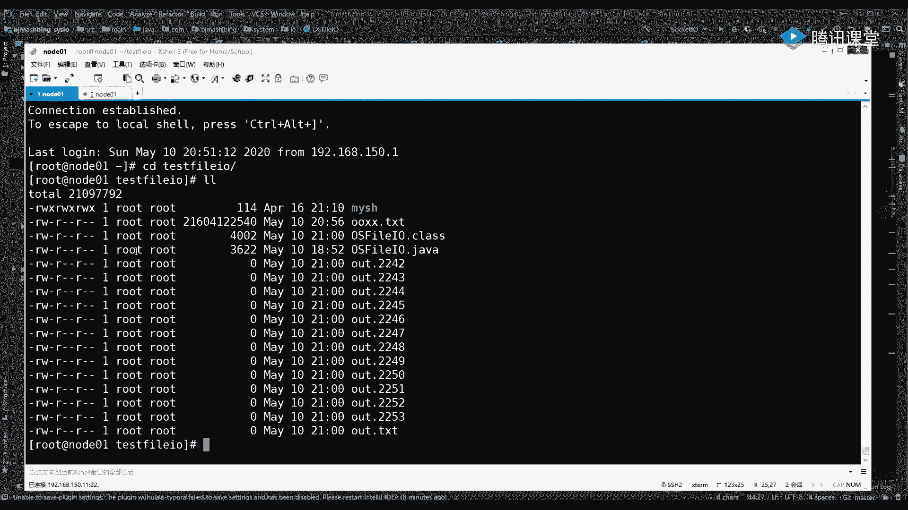

# 花了2万多买的Java架构师课程全套，现在分享给大家，从软件安装到底层源码（马士兵教育MCA架构师VIP教程） - P183：【IO／NIO】pagecache - 马士兵_马小雨 - BV1zh411H79h

IO我是一直会顶到网络IO。然后呢，我把多路服用器的Epo这块，我会给你讲的很细。好吧，好，收了啊，开始开始讲了。那么这是给你铺垫一个前前置你就要去看的一个东西啊啊，有兴趣可以看。另外一个问题就是。呃。

物理内存把p这个概念再再强调一点，我们有物理内存。其实前面马老师也稍微讲过了，在这我就重复再啰嗦一下，找找那种感觉。物理内存是一个线性地址，就是0。37小时，这是地址。然后呢，我们里边会有内核。

然后有程序啊，这是这是一个内核。然后还有我们其他的这个他们的摆放原理啊，然后上边我也讲过了。就关于他的这个用泰那个太用空间内核空间呢，然后GPT呀，然后这个终态线量表等等。这个这些知识我都讲过了。

物理上看的话，这个内存里边会有 kernelnal有不同的程序。其实这程序啊，然后应该也是在这个物理内存当中碎片的。比如说APP1，然后呢它的一部分。一部分数据是在这儿在物里存的这个位置。

然后APP1的另外一部分数据有可能会在这个位置。因为在分配内存的时候，你的程序不是一口气儿把这这一辈子知道的这个数据，这个内存代小都都是下都分配完了，是随用随分配的。くな？对不对？

可就是有可能会出现碎片的这一个概念啊，就是一个程序，其实它真在物理上是不连续的。然后但是每一个程序在运行的时候，它其实是会有一个概念叫做虚拟地址。这现行地址。一个程序其实看自己的话，这个我也讲过了。

他就看自己就认为自己直接占用这个物理空间。好吧，哎，它有一个线性地址空间0。37910，在这里面就牵扯到一个东西，它线性地址到你物理地址。比如说这个程序APP它的数这个这个数据本来是这个连续放的。

在他程序里的物理地址，可能APP1的X段和Y段，它们连续的，但是他们却指向了物理地址的分配的不同的位置，就这么一个映射关系，这就是线性地址和物理地址的一个映射。

这个映射的过程是需要你CPU里边有1个MVU单元，就CPU里边。有1个MMU就是内存管理单元啊，然后呢，且我们的程序里边是有一个。这个。就是提供给MU这个单元去换算这个数据在哪？那个数据换在哪？

一个映射的一个对应关系啊，那个那个表这个东西它整个这套系统，这个映射关系有硬件的MMU啊，也及是转换。那么它依赖的是哪个单位，这个单位叫做配置。就是E。一页的话，在性能中默认4KB啊，4KB。

其实说白了就是在管理个物理内存的线地址的时候啊，你的内核是会把它分成很多很多4K4K4K4K4K的。啊，全都是一堆4K的小格子，小格子小小格子，你程序用谁了？那这个找一个空的4K，然后给它映射上。

然后你的数据其实就放在这个格子里了。然后下次你的程序再想申请空间的时候，那这时候可能申请到这块这个4K或者连续几个4K。好吧，这是1个4K的这个页，然后成进程里边其实映射，然后通过CPU的MMU去转换。

然后这个过程当中一定要记住了，操作系统它是一个。是一个灵活的一个系统，就我们GVM也是一个灵活的。然后这里面有一个概念就是随用随申请。可以预分配，但是不会全量分配。尽量的不会做全量分贝。

而且一个程序它启动的时候，也不知道未来自己可能会用多少内存。所以在在这个位这个环节上才会有一个问题，就是当一个程序可能开始就申请了这个一个G的数据这个空间。但是后来又又想写东西，所以会有缺液。

就程序如果再想申请一个空间，就再想再就程序跑跑的时候，我想访问这段地址了，就前面这0。37小1想访问11了，11这时候其实还没有页去映射呢，这时候就产生一个缺液。

缺液的话会在你的CPU在执行你这段程序里边代码的时候，会做一个缺液异常，也是一个类似一个软路断，然后跑到我们的内核里边，然后开始建立页的映射关系，然后再漂移回来，让CPU再继续执行的指令。

就是在你只只要执行那个访问那个地址的时候，没有会一个缺液啊，这时候就过来了。先把业补上，你才能继续执行啊。那么讲它有什么意义？其实这个知识马老师前面已经讲过了，在这儿有一个概念要强调一下。

既然如果这个能接受，就是现在这么一个通俗讲法，就计算机里边用业的分配方式来让我们的程序动态他慢慢慢慢慢的去使用这个一口一口的使用这个内存。这个能理解的同学来说波是一是一个基础的知识。其实前面已经讲过了。

什么导致缺陷？你程序里边分配了，比如说程序里边有一张表啊，一个table。他已经比如把我线性地址，程序线性地址，比如1到10，假设啊1到10，然后指向了你物理内存的。然后这个30。就把把把把一吧。

1到10这个指向30到408。我用我用我用这个，因为你要我要按照官方给你讲的话，这个太费时间了，我就给你抽象讲程序里边刚记了一个1到10只行了30到40。但是你程序代码却想访问。80这个地址的时候。

但是这个程序进程中间是虚拟线性地址，它是从零一直到满这个44G可能都有。但是80的时候，其实在这张表里边还没有1个80，就是线性地址，80映射到哪个物理了。那访问80，这时候产生一个异常。

这个异常这个这个这个异常叫做。缺页。一た。这个缺异常异常其实就会产生软中断，然后这时候就会跑内核，就是由用这个CPU就不执行。因为你代码执行不下去了嘛，然后这时候就开始那用太切内核太切到内核上。

内核先去分配啊，给据这个程序去分配。说咱们再拿出一个空间来，比如这个这个就是80那个位置开始没有。那我先给你在物理内存当中找到一个位置，申请一个页啊，分分配出一个页来。

然后在你这个表里边映射了你的80其实指向了物理这个位置。那表里就有这个这个80指向了。80比如指向了线性地址的222这个地址就是线性地址指向了物理地址22。那这时候从内核菜再回到你的用户态。

你的这个否则80这个事儿就可以继续往下执行了。好吧，OK那这不不做太多的那个扩展了，有点浪费时间了。你先知道这么一回事儿啊，就是我程序跑的时候，肯定是一口一口的把这个内存就分配到这个物理上了。

而且这个配置要再强化一点啊，这个配置强化点。也就是说全局其实整个整个内核起来之后。是你程序的啊任何的位置。啊，任何的位置其实都是但只要使用内存的时候，基本上都是按照这个配置去做的。比如说什么东西。

一个程序，这还有一个基本概念，就是在我们一个程序跑起来的时候。只有这个。在一个程序，只要它运行起来了，程序它的内存其实分分成了就是一个程序的内存空间，它有一部分一些东西组成。

就像GBM它的内存有哪几部几部分组成，由我们的代码段KIT。有我们的数据段。就初始化的静态数据。然后呢，还有我们的站和堆。对不予。这是C的C的程序操作系统进程啊，这不是我们GVM的，然后呢，还有站。

你用来。好吧，那整个一个程序这边一个进程，它在内存里跑起来的时候，其实它的经历的步骤是先从我们的硬盘。硬盘里边有一个程序，比如说这个程序是APP，然后W你的程序是在硬盘上有一个文件啊，这个文件是APP。

W。没。这个文件是我们程序的所有可执行啊，就是这个这个一个数据结构20制的，它里边包含了我们这个这个这个这个尤其包含我们这个代码段啊，这个咱扣扣去。你的CPU里边计存器，其实你CPU里边有一些寄存器。

这个寄存器就指向了这几段的机地址，手地址会埋到这个寄存器里边。在执行这个程序的时候，只需要访问某一个断领的，给出偏移，就能找找到那个指令了啊。

PC计数器其实就是说我在这个code的代码段已经执行到哪哪哪哪行哪行指令了。那么这个文件被就是一个程一个程序变成内存进程的时候，其实也会触发配置啊，也会触发配置。也就是这个文件是读4K，先放进来。

假设这个文件假设这个文件是10个4K。假设啊是10个4KB，那可能加载的时候刚把4K先放进来。但是这个空间多大，这个空间是10个4K。就是未来它大小是10个4K。

但是在我内存里边可能是刚放进来1个4K进来。然后随着使用啊随着使用我去访问到你这个第一个4给后边数据的时候，这个文件的字给再往上放。も系。这个能听懂同学来说波一能听懂吗？就是一切都是按照这个配置走的啊。

程序加载就是一个进程加载的时候，其实这里边的所有数据本来都是按4倍去分配，4倍分配是一个最基础的。我用一个简单的意思给你解释一下。

。比如说我们现在这个程序。当前那个程序是1287这个竞争I例号啊，这是一个程序。我们那个程序是啥？PST。这个税。哎，这种还有紫的lash，没有没有没有没有结束的，等我我把别的这先结束一下。

Q杠91630。把对。平安市公安费。因。先不管了吧。这应该是我在另外一台远程登到这这台服务器了。就是我你看我执行PS的时候，这是一个程序，它的附进程是一个b。这个b就当天我这个拜ashb它是一个进程。

它已经跑起了叫1287。那这个进程它的可执行程序文件是什么？就是我们的并下的这个文件，好吧，然后跟跟跟着我的思路走啊。

大家这种思路走我给给过你们上传这个这个程序就age里边这个PC state给你们编译完这个用它PC这个PC就是配置cachstate用这个命令接并下的ash。一定要记住啊。

就咱们操作系统里边磁盘上变下有一个拜事，这是磁盘里边的一个文件。然后这个命令是在做一件什么事情，他在询问我们操作系统内核。这个文件有没有就是它里边这个文件会有很多很多4K的这个数据块。

在那这个内核里边有没有填充那些个页，就是没有被加载啊，有没有被加载。所以这时候你会看到beb是。这个程序的大小字节数是903336，它的页数消耗了221个页。

但是因为对这个程序在我们现在的这个我这个我这个操作型里边，对它可能使用的不是特别多。

其实常用的可能他就已经cach到了194个页。不是百分之百，这个能能看懂这个输出结果。同学来说波一，就是我给你演示的就跟我刚才讲的一样，我的一个程序大小可能10个4K。

但是我并不是说一口气把它全部加载进进来了，我用的就放进来了，能解吧？哎，然后有一些不不常用的，一会还会说比如说我可能随着我的用给它用的很多。但是可能随着我这个其他的程序的使用，可能会会有一个淘汰的过程。

淘汰出去啊，就是你们说的LLRU。

这是一个概念啊，这这是明前的一个进程。然后在这儿再多加一个。我上次上节课讲的一个概念。其实配置就是操作系统内核里边会维持维护着一个配置。也就是配置其实它属于什么配这个配置。

它属于我们真正纯数据的这个硬件设备。和我真正这个运营的进程。他们之间的一个抽象层一个抽象层。数据真正在哪？数据真正的是在磁盘上，但是我们内核里边也有这个数据。

这个数据其实可以未来给给到我们这个进程去去使用，去访问，按配置去分配。这是第一个支点。第二个支点就是哎如果再启动一个程序。其实你刚才也看到了咱们这个我现在这个操作系统里边，其实启中了两个blash。

其中两个bush。那么其实这两个代码段里边是共享了你内核里边这个配置的，就这个尤其这个代码这个这个环节。其实这个也是算是一个一个一个一个什么概念？就是在操作系统当中算是一种优化啊，内存优化。因为什么？

因为如果我跑一个b程序，我可以把这个磁盘这个文件读这个这个程序读到内存里边，就给我这个这个程序去执行了。我在我在执行相同程序的时候，如果操作系统中没有这个抽象层，没有这个配置。

这个这个缓这个缓缓缓存这个层次的话，那我这个文件要重复加载进内存跑跑100个这个bash程序的话，那我这个文件等于在内存里边要消耗100100倍的这个内存空间。但是如果住在我内核里边维护了啊。

维护了这么一个配agecach是在内核里边。那这时候其实每个程序，它的映射，它只需要相同的这个只要这两个程序，这两个这个这两个进程，它是来自于同一个程序，它们仿同一个同一个配配 catch。能列吧？

这是代码这个区域，然后剩下的这个数据区和未来我们牵扯到IO的时候，因为你其实进程变成程序这过程已经牵扯到IO了。那未来如果我一个程序再想打开其他的文件，比如这两个进这两个程这两个进程。

WappW和appX这两个进程如果都想要访问磁盘里边的另外一个文件，这个文件，比如说PID。想反这个文件，这个文件最终其实也是要先放到那内核，这个被内核先做一个page catch一个缓缓存。

存进来之后，然后这两个程序虽然都是要去访问这个page cache。这其实是上节课讲的，但是这在现在整体给你复习一下，就是无论你的代码段少，然后还是你的这个数据，你要访问这个文件IO啊。

然后想访问他们的时候，他们其实都是使用到同一个共享的一个区域。然后再加上其实他们各自会有各自的。sick拼音量就是文件描符这个这个上节课讲的文件描符这个章节，这个图就画通了。

然后这个只是在上节课我讲的一个概念上，因为上节课只讲了你在IO上面打开文件的时候。这两个其实复用了它啊，复用了这个这个物理文件到内核这个配置p catch缓存。复用它。

其实他们里边各自维护了一个基于这个文件文件标符的一个4个音量，就是他们可以各自访问这个数据的不同的偏音量这个位置。不是，只有1个FD不是只有FD这个配置是一啊，这个配置是一个。

这个在这一文件在物理上是一个。然后内核你上面有多个程序访问这个文件的时候，这个文件里边的每一笔数据它会占填充不同的一个page catch，就是它可能由4个页组成的。在这里边开第四个页。

这四个页是唯一的。但是你可以有很多的程程序进程去想都想去打开这个文件。那么这时候他们的FD。他们FD啊这边的FD进程里边的那个对对文件的FD的一个抽象啊，这个FD是独立的，这有点像我们编台器模式。

因为每个FD里边会有一个指针seick。这个sick会维护着他们每个程序对同一个文件访问的不不同的位置。把我上节课最后讲的段，其实你看完的话啊，这个应该能知道，好吧，这块都能接受，同学来刷波一。

就这个概念应经ge到啊。Yeahello。在这里边你其实要总结一件事情，就是哎这样的话是比较省内存的。然后你在其实这个如果在扩展的话，f进程的时候也也可以理解。

比如如果这个进程想创建一个子禁程还是还是他那fog的时候，其实这个程序只要在内存里边再开辟一个新息地址空间，把PCB啊进程的这个这个这个相应的这个属性创建出来。

其实这里边全是指针指向了底层的那个相跟他之前那个进程相同的数据。就是在系统里边有很多都是东西指向了同一个位置。能理解吧？嗯，那这里面其实如果聊到这儿，还有什么考这个喜事复制，那个就待会再说了。

把这个概念串起来是有一个什么目的啊？总结现在我给你总结一句话，因为我后边讲后边的知识，就这个我给你带一把，给你带一把啊，然后只需要总结出一句话来，也就是配置。Catch。是内核的内核。

维护的啊一个算是一个中间层。从那个中间层，那pagec它可以满足我们程序啊代码段啊，然后IO的文件的访问数据的一个缓存等等一系列的这个一个一个一个中间的一个一个缓存区。那pagec它使用多大内存。

使用多大内存。因为你现在从图上可以get到哦，就是我这两个程序啊，都可以访这文件，或者一个程序可以访问这个文件，都是通过这个pay catch了。那么这个pay catch使用多大内存去缓存呢？

就是我文件如果我内存如果10个G，我这文件如果8个G，我是把8个G的数据都放到这个内存里面全填满呢？还是说它里边我用多少就放多少，不用的西，我立刻淘汰掉淘汰掉呢？其实这个时候要牵扯到使用的环节。

就是使用多大内存啊，然后这个消这个这个这个这个就是淘汰是否淘汰。对吧如果你对这个修改的时候，程序如果修改了数据的时候，那是修改配置cash。那配置c修改是立刻写到我们的这个文件当中，立刻持久化呢。

还是说它有一个延时，还是说它会丢数据啊，也就是说是否延时。啊，是否丢数据？为什么？因为只要你知道这个东西，它不是一一口气顶到这儿，中间只要就是计算机软件工程学，只要中间加了一层，这一层有好处。

可以让你数据访更清亮，内存开销更大更更少。但是它反而会带来副作用。这个副作用就是从这个点到端点之间加了这个层次，它的一致性等等的可可靠性就是会出现问题。能理解同学来说波一啊，这个都是铺垫啊，这个别走啊。

ZDC不不千千万别说这个这个这个没有意义啊，因为我后边是有事，别慌，我后边是要上代码的啊，因为OS这里边我会给你演示，就是就咱们之前写的代码，它为什么会有这一个变化。

🤧好了，为了为了把这些事情，现在这个模型制作制好，基于这个模型我们去抛我们代码，然后来推导一个这个所有的这个问题的过程。然后。没错，一切VIO因为IO就是pay cash这上边才是。

你要学的这个IO这个知识点。我为了把它讲明白了它的依赖是什么。IO的依赖一大类依赖是依赖我们的page cache。虽然我们进程可以就C里边可以开启directIO，就跳过那核的pay cache。

但是java没有，只有C有java里边是没有directrIO的。啊，java基本上连mM map也使用的是pad cash啊，好吧，先说，我们直接来看看这个这个这个案例。

Yeahello。讲这个案例的时候呢。我先介绍一个东西，CsCTL。杠A。这个是3层S里边，你回车的话，它会显示我们内核当中的很多的控制项啊，会显示很多的控制项，连网络的等等的。

在我们虚拟文件系统操作系统。🤧我3316，然后把它加一个管道，通过grape，然后去查什么，查dirty。下意思。把这几个配置项。我们先把它摘出来。

然后我先把这个值给你放大，放大之后我们回头再说。怎么回事？我先给你粘出来啊。这几个配置项里边注意这你看这俩长得一样，只不过是一个阈值和一个by by这个字节数，这个两个长得一样。

只不过是一个阈值和一个字节数。下边是两个关于时间上的啊一个定义。啊，也就是我们脏页是5秒还是50秒还是怎么着的。这个配置项我要给它做一个修改这个修改怎么去修改啊，我我先我先去做做完。

我刚直接告诉你是VIATC写的ss cTL点com。

好到最后这个我之前加过这些东西了，我先把它全删掉。

我们只用什么？只用先把这个阈纸background，就是后台的脏液的，从内核向磁盘去同步写，把它拿出来。

然后阈值多少，我定一个90%，9%，90%什么意思？内核如果里边就是内核这个内核计算这个内存，内存假设啊是10个G。那假设可用是10个G啊，刨出那个别人被分配走的，剩下还有10个G可用。

那你这个在读取文件的时候，在使用IO的时候，那一个所谓的缓存的页。如果把10个G占了90%的时候，就9个G的时候才会由内核完成，从内存到磁盘的去写的过程，同步的过程。这个能听懂的来稍个一。

我先给它发到90%。那我我的内存多大，待我告诉我内存3个G粗的说就是其实我们的程序像磁盘写两个多G之后才会真正写到磁盘，那这个可能就丢很多，跟swipe没有关系啊，所以说是另外你要这个描描述不精准的。

然后另外一个值也有一个阈值，这就不是不是background就是前台的了。前台是什么意思？我把它值跟它做的一样，你先不要管它合理性，我只不过是把一个东西放大，看到它的一个特征，其实真正用的时候。

你是要跟你的业务场景和你的这个省的不同程序，你来调调它的一个特征的。

这是后台的，也就是内核其实也有现成啊，它会后台去触发啊，达90%就开始一写了。还有一个就是有一钱在阻塞。如果说你这个程序在往内核写的时候，分配页，分配页分配页，分配页已经分配到内存的90%了。

其实这个值啊，这个值应该是小于这个这个值的小于这个值的这个值应该稍高一点，这个应该稍低一点。假设就是你程序完疯狂的向内核写写写这个写数据，在疯狂的分配这个配置ca，因为会缺液嘛。

你你访问一写数据就开始分配。那一达到了可用内存的90%，这时候就阻塞你程序了。上面这个是不会阻塞你的程序，你程序还继续向内存写着写写那剩下的10%，然后会起一个线程。

然后这个这个这后台一个线程会把这90%向磁盘去写。其实这个值应该是你要去调U的。果你程序写的它的。这时候内存不会爆满不会出错。但但但是这个这这是后这种方式这是前台在什意思？

就是你程序使用内核要去写数据开始分配个只达到这个值了，那你程序别动了别写了内存我得保证内核个这个空间的利用率紧先把这里边增页的数据写到这个磁盘如果再写再分配的话。

触发LU这两个都把老那个没怎么用给淘汰出去就保证你新的数据一直能写到我这个内存这两个阈值的设定个出来是值的一个出发点就触发我们就是其实白了程序是先写内存后磁盘，只不过写的问题这两个。😊。

识点关联到哪些知识点。比如说你学read的时候，readies里边做持久化，尤其那个AUF日志文件。你学myscle调优的时候，这个binlock和and那个relog andlog这个这个日志。

他们有三个级别，他们都是有三个级别可以调这三个级别里边有两个级别，一个级别是你每秒钟就给我写一次。能明白吧？要不就是随内核啊，还有一个就是每操作都要写一次，他为什么会定义出这三种啊，为什么会定义这三种？

就是因为啊就是因为我们内核你你写给内核的东西，它不会立刻给你保存，而有有可能丢很多啊，有可能丢很多。这是一个出发点。再来看还有两个。

呵。

这两个是他后台的这个任务线程的一个时间的一个维度。上面这个我的这个本来是这个是要这个除以除除以这个这个除100啊啊除以100。因为它可以控制到毫秒级呃，不是这个11秒啊，11秒。如果你写一个一的话。

就是11秒就要做一次这个写写写back，就是把这个脏页写回这个事儿啊，然后下边这个是脏业的这个生命周期的可以存多久，我把这个值都先放大，我把时间这个事儿给它放大，这就这个等于就是50秒。啊。

这就等于300秒的一个延时，就是时间上肯定不会自主的去触发。向这个磁盘丢这个这个这个保存数据这个过程。我现在只考虑到内存消耗。也为我一会儿如果光灯关机了，真正能丢多能丢多少数据。

这四个配置项能看出来刷边一。真的我的我这个件绍能听懂。哎，你看折字器说丢一秒丢一条和丢一个缓冲区，关键是丢一个缓冲区，你的面试官会问你这个一个缓冲区是丢多大呢？是4K呢，还是4兆呢，还是4G呢，对吧？

哎，其实这个看你的你可以定义字节或者是定义阈值。

没错，一个页被创被刚分刚分配出来，就是你程序刚要申请一个页。那这时候这个页申请完了之后把数据完了一放，这个数据就是脏的，就申请过来就是脏的。因为这个页未未来肯定要还得把把它写出去嘛。

写过的就不是脏页了啊，然后不是脏的页，可以直接被LRU或LFU直接淘汰掉。但是如果是一个脏的页，不能直接在内存给它抹杀掉，是要先给它写到磁盘中去，才能给它淘汰掉。

这是一个基本的一个符合人人类思维的一个逻辑，对吧？😊。

然后在这个里面是OS fileO这个文件就是我给你们同步的OS fileIO这个这里面有几个就是在主方法跑的时候会接入几个参数。012我们常用的自测的这三个就可以了。

3不要写我到时候给你演示这个ffer用的012这3个我给你示演示的就是无ffer的有buffer的和random直接的直接里边还分为这个MM直接的这个内存映射和对外内存的几种几种对IO的这种使用方式。

然后最基本的fill写啊最基本fill写就是直接打开文件啊，这个pass就是我我这个文件啊，我这个文件直接放在了我的root，你回去之后到你那要改成你的那个路径。然后打开文件之后。

然后得到了一个输出流out，然后死循环。我那个代码当中我会把它给注释掉，不让得这个睡眠了。因为睡眠会产生很多的其他的所的那个系统都要用那个接口。然后我我我直接把它B掉，然后让他尽量快点。

然后直接把这个ddta向这个文件去写，写的这data是什么？这个data就是123789加一个换行符，等于10个10个字10个字节向外去写，就是这个最基本的这个第一个测试的内容的。

就是开启了一个普通普通的输出流，疯狂的向外去写这个逻辑能看能跟大同学来说边一，就这么一个事啊，就这么一个事儿。

然后注意听啊注意听我一会儿跑起来之后啊，我会用str追踪。然后呢会首先这里面是str这个str追踪到的这个性调用的文件out点什么什么。然后它输出的这个文件啊。

输出这个文件直接叫out点IT就是数据文件，这是数据文件这个数据文件注意看啊，你比如说这是我曾经啊曾经跑了一个跑了一个这一个out点IT你要记住了。

我给了你这个命令叫做PC page catchstate来查询这个文件的被p catch缓存的这个状态回车，你会发现这个文件是我曾经跑的，已经被淘汰开的时候，它肯定填了好多填了好多开到好好多。

哦，对，这个这个现在它只有一个只有一个啊，只有一个已经被被配这个配置被被ca开住了。所以现在是被开也是100。当然一会我写的时候会写的很大啊，我们来就是通过PCstate来看一个文件从0到1的过程。

它的缓存率，然后以及它如果超过了内存之后，它是不是会淘汰掉一些配置。就是通过他可以可以看到一些东西。然后也可以通过LOS这个LL杠H人类可读的一个单位机制。我看这个文件长多大了。

因为那个我一会儿我执行这脚本的时候，我这个程序会一直死循环所以综合考虑，我就用LL杠H，然后同时再给我执行1个PC state，然后是out点TIT这样的话，我既可以看到这个文件长多大了。

又知道它被分被从内核就是它它一共有多少多少个页啊，在内核里边缓存了多少个页啊，百分比是多少，这这个这个输出的个这个样式能get到同学来说波一。

现个你。

好吧，那我再开一个标签页啊，再开一个标签页。ches their file这里面，然后我的这个脚本my shell这个脚本里边默认写了s追踪后边我这个java1。

8那个java程序的所有的线程以及输出成outt点什么什么那个文文件跑的就是我OSel这个IO这个这个文件接收一个参数012听的一个，我们先测0。呵。然后给一个参数零，给了参数零之后啊。

刚才忘了看了这个文件，他会先把之前的历史这些数据删掉。就是每次跑这个脚本的时候，他都先把里边那个所有out包含out连数据文件在那个追踪文件都删掉，很干净。所以每次你只要看新鲜的就可以了。

跑它给一个参数零，参数零加G给之后，那么好，我这个java这个程序就跑起来了。然后这些东西全变成一套新的。然后这时候你来执行这个这个指令，你会发现哎我这个文件outt已经3。2兆了，先看啊再执行6兆了。

7兆7兆8兆。9账。11。12。长得快嘛？先告诉我长得快嘛？这种这种我刚才写的这个是一个死循环啊。是不是长得不快啊，一会儿我给你解释它为什么不快。一会儿我换buffer的时候，而且这里面没记住了。

我的所有代码都没有掉flash，没有掉这个刷写的个过程，它一直写。而且我在那我那这个lin里边，其实我把那个sli睡眠的事一个注掉了，一个住掉了。😡。

兄弟吧？然后你可以看到它的分布离配置一直在 catch，一直在ca。而且一直是百分之百啊一直是百分之百。找到我讲那个感觉找到我讲那个感觉。看到吧？是不是一直往上涨，为什么？

因为它不是说cach只是你用谁给你ca，谁，剩下直接淘汰了，因为它会根据你内存，我内存是3个多G。您现在刚使用35兆，我可用的内存空间很多，那我cach就玩命的去给你分配这个这个剩余的。

就一直保证你的程序，你现在访问的数据一直都在内存里常驻，除非未来会有一个竞争机制给它淘汰掉。好吧，这是第一个知识点。看懂同学shop边一就是在一个程序访问一个文件的时候，只要内存够。

这个cat就一直给你给你给给你在内存里缓存。也就是未来如果你偏移到想读这个文件投的时候，不需要产生任何磁带哦咣当这个数据就就就就可以读到了。刚才那个C4CTL，我刚才改完了啊，改完了之后。

我忘了1个杠P执行它，我得把它执行一下。啊，这个阈值9090%90%，我先执行一下，然后再把它重新跑一下。可能是。先第一步先在你找到了感觉，就是一个程序使用文件的时候，即便它临时创建很多。

他也是给你缓存这个这这这一页了。另外一个这个因为把刚才这个加载这个应用啊，这个刚P之后给它应应用起来了。然后下一步我们来看它能丢多少数据，丢多少数据。还是抛这个零啊。重新来啊重新来两兆三兆。好。

9兆多了，将近99兆多了。然后这时候打开你的虚拟机，虚拟机里边有一个电源，然后点关机有俩关机。这个关机是它自主关机，它会保存你内存没有flash。我所有的这个操作，我给你演示。

今天演示东西都不带用户端强强制flash，就靠内核什么时候给你写啊。然后我直接点关机，咣当就等于啪嗒就断电了，就是来不及保存，内核都来不及保存。好吧，刚才已经写了好几兆了，那这时候再把它开机。插没错。

这刚刚总经拔电源了啊，再给他再给他插过来电源，再给他开机。😊，我。嗯。呃，这些知识点用用这么讲吗？用这么细的讲吗？因为我感觉咱们以因为以前咱们比如这个。这个介绍的时候，好多学生说老师不是季组的。

不是没不是本专业的，好多知识这个不太不太不太不太熟，所以我就讲的有点。有点碎啊。没错，我其实就是想给这个咱们不是本专业的这种小白去讲。其实咱们这有有很多这个。比较优秀的学生。对。

其实他们是应该是不用听这些东西的啊，然后再把那个链接打开弄01。再复制一个。O。test file来今天看刚才是不是写了好几道了？是不是都丢了？是不是都丢了？因为我内核允许你跟我，你调我。

你调我的给你暴露的系统端用写，你就写吧，你写的其实写在我内存里去了，给你缓存了。但是我因为内核参数赔的太高了，我没有来得及给你保存。对吧这是一个，然后呢先不着急啊先不着急。

再来看再来看在我的这个java从从这看这看清楚点。在我架当中啊，我一会儿给你分析他们的性能差啊，这有一个basic的 fileO还有一个是ffer的 bufferffer的话。

其实还是同样这个要往这个pass这个out文件去输出，就是out点TID但是这时候我给它套了一个buffer的out stream，然后得了一个out，然后呢我也是一个外循环。

我也会把这个10这个10秒说眠那给注掉，因为减少镜调用这个用上那个切换。然后就疯狂的开始写。那先第一个基本常识，你出去面试的时候，这是java肯定会会问的。

就是八分的IO和普通的IO属于快。就第一个问题属于快。哎，大家都知道8分的。那么8分的为什么快？😡，八分的为什么快？且八分的。是。就先告诉我为什么快，大不知道为什么快。😡。

就就是就是人家就怕问你这个问题，少IO什么叫什么叫少IO次数？不认。嗯，这个说到聊到系统调用才对啊，聊到系统调用才对。8分IO待会我会给你演示，你就看其实8分IO是在JVM里边，它默认多大。

是不是8KB。就在GM进程，在我程序里边，你这虽然每次可能只写一个10个字节，这个data是不是10个字节，每次你掉了我这个巴来写10个字节，写10个字节，但是这十个字节没有交给内核，是在GVM里边啊。

就是在GVGVM里边，它开了1个8KB的一个数组字节数组，把这个数据先放到这个GVM里边8KB满了之后，调一次内核的，就st callll。的一个right把这个数组写出去，这个8KB的一个数组。

也就是说这个8K之后才调一次系统调用，但是上面的时候是什么呀？是不是每每次read的时候，这个直接顶到底，就是你只写十个字节就调了一次系统调用。所以他们俩切换的次数，就是那个在应户在切换的次数。

这个数量不一样，做以一个快慢的一个问题。好吧，到时候但但去追踪啊，我们回来看。

因为一会儿看到那个现象，你就不知道怎么回事了。但是我先来去演演示最开始这个现象，就是通过我的买。我先把这个命令搞出来。然后再加上PCstate，同样还是看这个TSE点po out。

现在只不过这是历史的一个数据啊，这边再去跑它。

这时跑一了，一就是我们的巴ffer的了，这个验证了啊，走跑起来之后，注意这边看，你看他们长大的这个。でど。看到这个长大的那个这个速度了吧。这就是本质区别了。为什么扎了就一定得使。😡，大分来了都对。

是吧然后这时候再来再来观察，我们先观察底这个缓存那个。因为现在刚2。5个G，我内内存3个多G啊，3个多G啊，然后再往上走哎，到3个G了，然后再看再看再看先盯这个缓存那个，你看这降低了哎。看到效果了吧。

就是我这个文件已经超过很大了，超过我内存剩余空间了。我文件是这么多页，但是我内存空间只能放这么多页。这个感觉找到了吧。就是内核会充分利用自己的可用空间，尽量的为你去维护你访问过的数据在内存里边。

这个配置会给你给你维护到好吧，但是这已经超过了，它肯定会像磁盘已经因为你你这个百分比是不是命中这个这个ca已经小于它了。那曾经那一页，其实已经被淘汰掉在内存里边，所以就被淘汰的，必然就已经产生过什么呀。

像磁盘去写的过程了，就有一部数据已经被持久化了，只不过后边还没有被持久化。好吧，我把它ctrl C结束一下。重来再重新跑啊重来重新跑。但是不止是重新跑啊，这已经有一个outt文件好大了啊。

一个文件好大了。16个G啊16个G。然后呢，我们先来看PC。state杠这个我们的out点TIT。记住他现在的缓存的页数的百分比是17。087。啊，我我这边啊这边没介束啊，这边。出兰怎么上来？

再来看一眼。是15%，这个应该是百分百，反正就是这么多啊，这是被缓存住的了。我这个程序也结束了。这文件这个outt文件已经写结束了，能明我什么意思吧？写结束之后也看你的大小啊，跟着我思路走啊。

现在是221个G叫outt点TIT，然后给它重命名outt点TIT变成圈圈叉叉点TIT。然后其实只不过是pass的文件名变了，那个数据没有变，相应的内存的缓存都没有变。它只是改了一个原数据。

就是它的那个在目录里边那个名字变了，相应的配置没有丢失。为什么P你先看是不是就是由outt跟outtTIT变成圈叉叉点TT了。然后你去PCstate，然后看圈圈叉叉点TIT它依然是还是缓存这么多东西。

这是第一个现象啊，第一个现象就是这个文件曾经被用过了，那核只要它改名字也不怕，只要这个物理文件这个数据缓存过的就依依然还在。然后注意听注意听啊，下边的下下边下边的这个这个这个现象啊，这就开始淘汰了。

如果我再重新跑起我这个程序。掉一一这个这个测试分了，它会疯狂的产生一个al文件，对不对？因为它里边写死了，产生一个outt文件，这outt文件会疯常疯狂的它是一个活动的一个进程。

这个文件已经是曾经被用过，曾经被缓存了。如果未来再打开这个文件的时候用到了这个这些这个页的时候，就可以从内存直接可以用了，能明白我什么意思吧？但是现在如果再跑一个程序，这个程序玩命的去创建另外一个文件。

然后呢再申请这核的这个页。那这时候其实那边这个新的活动程序太快了，就会把这个没有被引用这个这个这个这个页给它淘汰掉，一会这个圈叉，它即便被缓存15%，就给淘汰成0，这个理论能听。说边一。りま？

所以我待会儿跑起来之后，第一个先看他长大。同时看PCstate。看我们的out，它那个那个新的那个java程序输出那个它的那个业的增长以及百分比缓存百分比，以及在观察这个老的它是否开始被产生淘汰。对吧。

先来看啊，目前来说哎这个老的文件圈刷它还是被缓存了15%。好，这边抛弃。看上面的是不是已经开开始分配了，下边是不是开始被挤出了？是不是被淘汰掉了？能看的同学来说个一。哎，哪这人。保证你上面这个有。好。

把这个结束，这这个线在也抓也抓到了啊，就是现在你知道了那这个。程序啊其实由不得自己啊，程序由不得自己，他很多是受那核去影响的，对不对？好，这几个点验证完之后，最终还得跑它，为什么还要跑它？

我们要看丢多少数据。outt点TIT。目前来说缓存了这么多了啊，然后不是现在是这个历史的，当我跑去之后肯定还从零开始涨。我就是看它涨到一个多G不到两个G的时候，我在光灯给它把电源关掉，看那两个G里边。

它是不是给你保存了，保存了几百兆，还是保存了一个G能不能保存，还是最终倾向于0。也就是说我开始的内核参数，因为那个参数是不是six cTL我杠A的时候，gra dirty的时候。我知道。

就是T的时候是不是定义了内存要使的，使用到90%才会由内核触发泄。然后我内存大小是3个多G啊3个多G。呵。😊，所以。我在做下一个验证。就是一会儿我跑起来之后，达到一个多G的时候，我就直接薅电源。

180300400。900了，然后开始电源开始关机。其实这时候已经写了将近一个多G了，我再把E给关掉。那这时候其实起码说已经大于90兆这个文件能理解吧？哎，然后有这么多页已经被分配了，已经被cat了。

那这时候再把它跑起来。那其实这时候如果说就现在这台服务器，我装了一个readdis，我将redis或者买circle，它的持久化级别选成由交给操作系统的缓这个缓存级别来帮我保证这个持久化。

那这时候你就可想而知它要丢多少数据了。能ge到这个点和S一。

2。好。有啊。就是没关上，还是还是还是我刚他起没起啊，起了。嗯。确定。抛起来了，然后重新连进来。你说啊。快到线上了吧啊，咱们直接给你验验证验证本质验证现象东西是不是都丢了，好好难受的一件事情。

所以一般一般我们都会选择什么呀？就是为什么reis默认像是他没有给你选成那个完全信任内核这件事情，他选了一个一秒，就是他丢也丢丢丢掉你最近一秒它的刷写速率，丢那些数据。Okay。

这圈叉是历史文件，跟刚才那个操作，跟我那个java这个跑这个java文件已经没有用了。因为java指会输哦奥点PIT曾经的时候，其实我已经给他，因为他已经这个新生的文件已经把它那个页给它淘汰掉。

淘汰掉的时候，脏页它一定会保存下来。这服务刚才那个验证了对。能能能理解了吧，这个你那个名字是有枪有什么那个这个星三个星的那个这个这个同学，就是你你你说这个他啊现在现在都明白了吧。

因为第后来几次实验的时候，因为他有疯狂疯疯狂开毕业嘛，所以他虽然没保保留住，但是就因为你也老使用内存，你把别人的这个内存的脏液。给给刷写到4板上去了啊，人人人家就就给保保存住了。🤧。好。以上这点东西啊。

最主要的其实说白了我是给你演示这些东西，你你开发时候用吗？你也不会这么去去做。首先先记住了一个一个概念，就是我得出了一个结论啊，得出了一个结论，也就是其实配age catch。

推我们的。是。P catch。是一种呃内核本来是要做一件好事，是优化。IO性能的，他本来是要想优化这个IO的性能，就是优先走内存对吧？优先走内存，但是它要一个弊端，什么弊端，弊端就就是会什么呀丢失数据。

他一常多电的时候，对吧？好，那么给几分钟休息一下，把刚才这个东西找下感觉。

