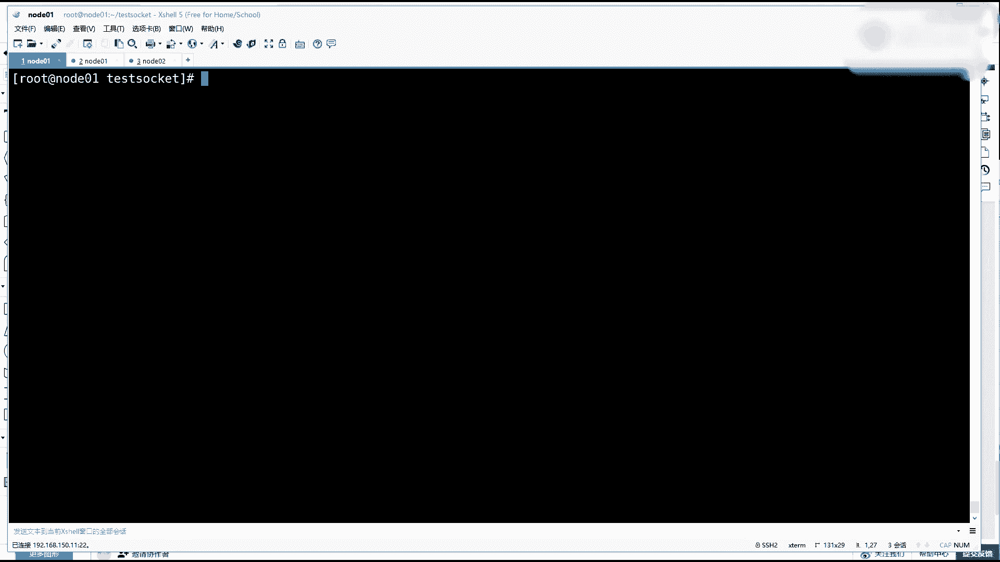
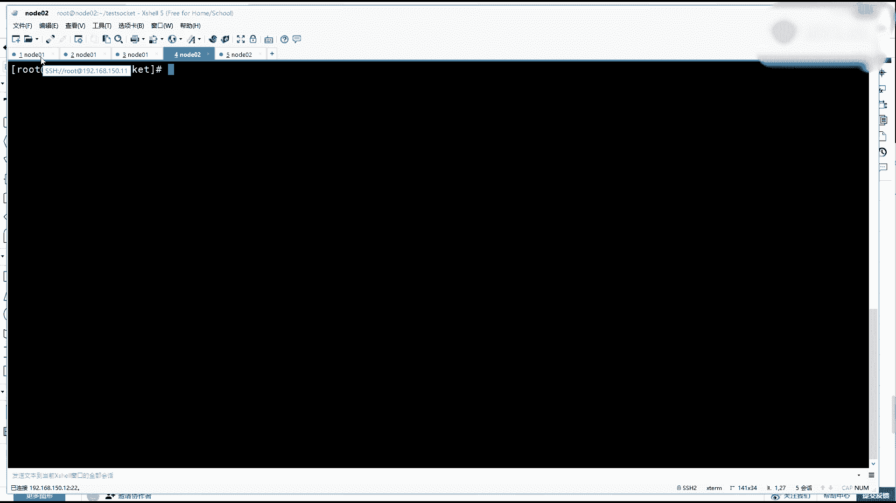

# 花了2万多买的Java架构师课程全套，现在分享给大家，从软件安装到底层源码（马士兵教育MCA架构师VIP教程） - P185：【IO／NIO】 TCPIP - 马士兵_马小雨 - BV1zh411H79h

这先其实还是老掉牙的那些工具命令，我先把工具命令给你梳梳理一下。

一个命令是LOSOF这个命令是可以看到我们的某一个进程，它里面的文件描述符是否已经有了。那么就网络这一环节的话。

一会儿我们去看它通过它什么时候你才可以看看得到啊这个一个关代表网络scu的通信的一个文件描入符。就是这文件描符什么是候有的。还有还有几次课，嗯，应该下节课或者再顶顶多顶尖都有两节课。

还有一个是n state。杠NATP这个是他他主要是我我想叫教你用这个命令来看内核里边的scket的这个建立的过程。然后这个一会儿给你展示，他们两者其实是一个建职对的一个关系。

就是一个你可以只有scket，但是没有文件描符。那什么时候有的这个过程它的依赖关系，就是内核和用用空间的程序的一一个依赖关系。还有一个是TCP。这样这是一个抓取网络通讯数据包的。嗯，在这个过程当中。

你去演示一下其他的门令随讲随用吧。这是一会儿要用他的命令。另外一个程序的一个范本。

换门我就用这儿给你演示了啊。这是一个升级一点的一个代码，就是socketIO的这是1个BLO的方式。B，然后多线程的方式。你听了我上节课就知道资料都都在哪去领取了。然后这个这周吧。

应该是他们更新完VIP页面，应该有地址，那个资料可以下载。往下捋这个sockcket的IO是BO的一种方式。然后上边会有一些关于在使用网络通信的时候，sockcket的时候会有哪些参数？啊。

比如说keep alive心跳，那这个是不是它是是否代表长链接，还是说为 false的时候，它就不是长链接这一个有一个语义的纠正。因为这是面试的时候会问的。然后像断开的。

不是这个是否优先发一个子符量发过去试探一下啊，然后receive buffer就是在使用一些指令的时候，我们可以看到一个。

nettter state杠NATP你会看到有一些receiveQ和Q。啊，那这里面这一个Q代表什么意思？如果用户给给到这个reive buffer跟那个Q有什么关系？

还有reuse address是否重新地址，然后send buffersendq，然后还有一个是断开连接的速度。再往下是一个。用客户端读取的时候，在我们读取数据的时候，我们说在必要下是一直阻塞的。

但是你可以加一个超时。也就是我只想读你3秒3秒。如果不发数据的话，我就开始抛异常做做其他的处理。然后还有就是一个比较重要的一个参数，一个no delay，这是一个TCB上的一个优化算法。

也就是在发送数据比较少的时候，它可以利用缓冲的一个概念。但是你开启不开启它对于你的业务的数据量的大小和规模和特征是有关系的。

还有一个常配的配置就是这个backlogbacklog就是当我的一个服务起来之后，如果有很多连接过来了。但是我线程不够了，资源不够了，我不分配了。那这时候排队的我还认为你几个人在那少的。一会我释放了。

可以把立刻就处理你剩下的超过这个的，我就开始全拒绝了。啊，等等这些这些参数到会候给你演示出来。然后剩下的主逻辑啊，主主逻辑就是在主方法当前现程当中，在当前当中准备一个server。

这个server起来之后，我让他绑定了9090端口，然后backlog现在是V2V2，也就是说这个分配剩余的等待着就是不不处理的只能有两个啊，就是不分配文件标符有两个。然后。剩下的这个参数一会再说啊。

现在那个t out都是为0上面的，无论你的这个接收的这个接收客户端等待，那个就accept的是为零的，还有你的客户端读取数据的都为0，就一直场永永久阻塞。当有了一个so在主线程起来之后，然后开始死循环。

死循环里边，然后在这注意下边这个循环循环，这有一个注意点啊，我掉了一个sean点 in点read，这是一个分水岭，这个代码要强烈一点，这是一个分水岭。这个分有什么意思？上面我只是得到了server。

现在注意听了，上面我只得到了serverser有了之后，其实我拿server想调accept，但是在调accept接收客户端之前，无论你是BLNL。

但是在这个在他之前我被一个read通过用户想输入一个东西，这个被阻塞住了，也就是这这条代码肯定不不会不会触发。那么就在这个被阻塞住，但是这个程序前面已经有了的状态，如果别人咣灯咣灯连起来。

能不能和我这台服器进行连接，就是三次握手能不能走通和TCB什么关系？也就是内核里边会不会有什么事发生，也就是什么什么是锁谓连接。之前只是跟你说过，连接就是为了开辟双方资源。那内核里是不是要开辟资源。

有没有所谓的队列，可以在没有接收客户端的情况下，你客户端就已经可以发数据了。接收之后可以连数据都给给给你处理清楚了。能流解白达什么意思吧？哎，这个这个一会儿要注意这个这这行代码的一个特殊性啊。

这是一个分水岭。也就是我拍了回来之后，他才走这一步。那可能别人连连接过来了，然后也发了数据，然后之前没有处理，这时候还还来得及去处理。有了客户端之后也会设置一些参数。

这个参数一会我会在lin客户端给你去调，然后不同的每次启动调一个参数，然后找一下感觉，然后用TCB多包来抓一下这个特征。然后现在的模型是当你得到了一个客户端，因为是阻塞的嘛，就是肯定会等到一个客户端。

得到一个客户端之后，我下边是抛出了一个线程。这个线程里边拉的表达式写了一个逻辑代码，它软方法，这里面就是从客户端这个链接里边拿到输入流读取东西。然后。把你读到的可能性啊，读到了多少内容是啥。

给你本地打印一下，然后为零的话，就continue继续继续等待这个客户端的这个这个发来的信息。如果读到负一的那什么时候负一，客户端那边动开的时候，可能会出现负一了，那直接跳出这个循环。

这个线上就可以结束了，这star起来了好吧，这段代码其实如果你之前听过公开课呀，或者看看过前面的东西，这这个逻辑应该都没问题。那么现在如果第一次听这段的。这个课的这个逻辑能ge到同学稍不一。

这是一个服务端代码，除了一个服务端代码，还有一个是客户端代码。在客户端代码当中比较简单，客户端代码就是用一个scket，然后呢我要连啊某一台机器，然后顿号是刚才那个那个那个服务端等号。

得到一个cl得到cle之后呢，我可以设置它的send bufferffer，就是发送这个缓冲区是20个字节，然后这个no delay是te还是 falsese，一会我调这个参数给你演示。

然后最终我是要拿从它身上拿到一个输出流。但是这个注意是一个ult stream一个基本的输出流。然后呢，我开启了一个s点 in，然后拿到一个输入流，然后包装成一个reader，然后写一个死循环。

一直在等待着我就每循环一次等待等待着我用户敲一些字母，敲完的内容如果为空的话，把它转成字节数组。因为上边这个和服梯建立这个s连接，一个字节，一个字节的去rite。但是这里面注意了没有flash。

这里面是没有flash的啊，这是一个客户端的一个我写了这么一个看上去是有争议的这么一个写法。就是你不是说输出流由都得掉flash，不不叫flash不输出嘛？一会我们来演示看一眼这个效果。好吧。

这一个客户端，客户端代码也能看东西来s微一。

好，那退回到我们的这个窗口，我会把一系列之前可能会讲的东西再给你梳理一遍，总结一遍。首先我们先来。找到服务端，服务端就是我这个sockcket的IO properties点java打开它。

这个就是刚才我写的这个这个代码啊，在这只不过把刚才那个地址绑定给去了，就变成一个逗号了。一样，也是也是这单要要起1个990。其他的我们来看一眼参数的默认值，现在我给的默认值啊。

验证一下我的backlog是两个，可以登两个。然后呢。一系列的Q关关闭了。然后第一个手手手手字节发送关闭了。然后全部重用关闭了，但是receive的这个接收的8分20，发送的8分是20，这个我更新了。

然后立刻关闭，我开启了。因为一会儿我会ctl C结束这个结束之后呢，我希望把这个9099090立刻释放掉，不在这堆积。然后no delay是为fse。

就no no no delay这个为 falsese是什么意思？就多说一句，就是如果你它默认就是为fse。啊，这个no delay就是不优化，不优化为fose就是负责症优化优化什么意思？

如果你发的数据量比较小的话，它会积攒一下，然后充分的利用你那个缓冲发更多的东西。但是如果你为处的话，你有多少他发多少。啊，就发的被这个在缓冲上使用的时候，它不会突破你那个上面的一个缓冲区。

一会儿演示出来就看到效果了。好，服务端先给他简单解演演示一下java C给它。编译一下。编译成功之后，然后我再用java。调起这个服务端。🤧我先拍了一个命啊，一会儿我回头把它跑起来。

然后用另外一个窗口也是note01。我们先来看一眼网络状态，net state杠NATP。现在里边你能看到的都是一些什么22、25、22、22、25这样一个登口号啊。然后在另外一台，这是一啊。

一还没有起，我告诉你到这么去起。在二这台服务器上，我要起一个。客户端啊起一个客户端。这个客户端，我们先来看一眼它里边的属性。看看刚才我有没有乱改啊。那这里面我要连的是10。11，就前面那台。

然后9090和它建立连接，连接有了之后。这个发送的缓冲区是20，然后呢优化不优化这事为fose就是默认也是优化的方式来发送数据。然后呢，首字节快速发送也也关闭了，然后得到输入流，下面逻辑是一样的。

OK是一个扣分好，也是java C吧，然后编译我们的sockit clientjava编译成功之后，java调起socket client。这两个一会儿服务端先起，然后我们来追踪它的所有的状态。

还有一个我在开启一个窗口，是打开TCB监控TCBdump杠NN杠。哎，监控ET20这个接口，然后端口号是9090。好吧，开这个这个窗口上开启了监听抓取数据包，然后我们一个个来起。

先把服务端这个java的服务端程序跑起来回车好了，它已经提起来了，用到了909的这个端口号。那么通过网络连接这块，我们来看lets由前面什么都没有，没有相关的东西。

这出现了一个对于909的leasen状态，这是第一个知识点，服务端啊，服务端会开启listen状态申请这个端口号。

通过你给那个顿号，它会监建立一个监听。未来所有的客户端通信的时候分成两两类两个阶段。进来连接的时候，就是三次握手的时候走listen。找到他找到这找找找到这个进程，但是监听这个三次部手之后。

他肯定会抛出现城或者是。分配到文文件描符交给某一个县场，那是后后边就是在在在发送数据的时候，是走另外的一个环节。我们先来看，先记住了，服务端的第一步是要先监听1个9090有了这个监听之后。

那么你的客户端就可以连进来了。但是先看抓包包这边是任何事情没有发生的。因为你只是本地被动的被动的去要监听了别人还没数据包没有发过来。那么除了可以看到有一个9090。

然后listen状态还要把别的命令再使用一下GPS得到我们那个服务端的静态电号是7932用LSOF这个之前已经用了很多了杠7看一眼7932，它的文件描述服务分配情况回车。

你会看到这里面分配了一个文件描述服5他在做一件什么事情，就是list状态。因为现在没有客户端连接，所以没有6没有7到这个环节都就是一个初始环节，我刚起了一个服务，就刚起了一个服务，你会看。

哦他有一个文件面符占了监听，然后用另外一个命令也可以看到这个所谓scket的这个状态。离森，然后呢，TCB也没抓到任何东西，因为他是刚刚起来，这些都能听懂同学同学来说波一，没问题吧。

我讲稍微的讲慢一点啊，就是咱们以前我讲过很多遍，类似的，你听过就听过了。咱们主要是因为有很多新报名的学员，我得把这个整个给你串一遍，也保证咱们这个系统L流可程的完整性。这是第一个大环节启动了。

该监控该该看得看了。那这时候来完成啊back是啥，我我马上给你演示啊，注意看现在现在如果我一旦启动了我的客户端，我的客户端里边逻辑代码是要和它建立连接的对不对？那这时候能不能建立连接呢？来注意看啊。

一定要记住了，我我再强调一点一定要强调一点，我就用给你演示了，在我刚才那个代码里边，我刚才是不是打印server up use了9090，也就是这行代码被执行了。但是一旦进到这个循环。

它一踹这一块里边光当是sstem点 in点read等待着用户的输入，也就是其实在我的主服务这这是在等着用户输入呢？如果我这不按任何的操作。

这行代码就会在这死死死很久下边代码是逻辑根本是跑不起来的那也就是说下边的这根本就没有到accept在这那我这边客户端如果起的话，能不能和服务端有一个所谓的建立。

一个过程。大家伙儿可以刷一下啊参与这个这个思考的过程。能理解我想表达什么意思吧？啊，就能不能建立上这个链接。😡，好。竞猜结束啊，然后注意看看啊，注意看看看看看细节，加低回车。回车之后。

那么这个程序它首先没有说8唧一回车，包包括这种错误之后，这个程序结束了，又回到这个这个这个这个等待输入这。所以这个程序现在是运行着的。第一，程序已经跑起来了。第二，看抓包这，你抓到了三次握手。

是不是抓到了三次握手，是我们的1012那台子一个随机定的号，对我90。哎，我要跟你建立连接，握了一次手，90有轮还给人回了。回了1个ACK，行行行，然后呢，这个12的台的随准号1990回了一句。行。

我也我也知道了。咱在俩可以愉快了。但是注意听啊大家注意听。😊，看前面的监控，我们依次来获取。第一个先看的是nancy杠NATB走，你会发现在这个网络连接状态里边，曾经对9090啊。

只有一个服务端自己的一个监听。然后呢，我服务端也没有执行accept。但是客户端连过来之后，注意在内核状态当中，你看到了一个socket。是9690和12的47513，它建立起连接。

但是这个scket的有分配给谁去使用的吗？没有被谁接收。但是内核里边已经有它了，这个能看懂同学来刷边一就有它了。但是在内核太里边有它了，你的程序还没有接受它，不只是有它了。

如注意看前面是不是还有receive这个这个scket里边有没有收到的数据包和发送的这个这个数据包在这堆积，对不对？然后我这边哎我给你所建立所有连接了，即便你不要我，但是我也悄悄的给你发点发点东西。

我发四四个一加记回车，然后你会看到哎这个后续的书，这个发送数据包，哎，客户端服务端还能有好的交互，还有确认ACK。然后再来主要看那个抓取。网络这，即便这个set的没有谁去。没有分配给谁去使用的。

没有文件面是对应的。但是前面会出现一个4个，已经就是有4个字节，已经被内核收到了。但是你想一想，我们代码里边进城式外卖还还没有接收这个ser链接，但是内核里边已经完成了资源的一个初步的一个使用。

这个就是我常说的，什么叫做TCP协议是面向连接的，走完三次握手。刚才是不是走完三次握手了，双方是不是要开辟资源，是不是有资源的开辟，有缓冲区，对不对？然后这时候即便你程序不要我。

但是我也在内核里边会有资源去帮你接收或者等待等等的。那么这就是什么叫做连接？连接不是物理的。双方通过三次握手，开辟了资源，可以为对方提供服务了。那这个连接就已经有了，他是看不见摸不着的。

但是靠资源来代表的，听懂同学来说波666。先记住这个级别，就是内核里边是干点事的，对不对？啊，然后但是这时候再来找我说了socky，待会给你解释scket的这个资源组这个事情，它必须是4元组的。

然后再来看一个东西，它其实还是一个建职段的LSOF杠P刚才这个进程的ID号是java listen这个是。7932对不对？哎，7932。你会发现内核里边有这个set的，还没有被分配。

然后在我java的程序里边，文件描说还是指到5V。listen状态。也就是也就是说程序其实不是通过scket要使用sockcket的那程序其实在等一个东西，等一个文件描符。但是这个excel没掉。

所以它没有反回文文件描符。

明白我什么意思吧？那这时候其实我只要让我的代码这个s点 in点read这，我编击一回车输入点东西，让它跳过这个阻塞，那accept就一定会执行。一执行其实就为了分配一个文件标符，下边一定要注意看。

看完我摁一下回车，加G摁回车c port47513，代表我程序收到它了。然后呢，你看啊不止说我接收到它了。后续那个内核里边缓冲的数据，我四个字节我也读到了，这是我程序代码可以打印出来的。

能能理解吧？那关键看哪，关键还要看这这段这这一段的监控，先看那NATP你没看到刚才的那个这段ser连接没有被分配给谁，但现在已经被分配给7932了。这个联通的状态已经分分类给他了。

且再看LOSOLP6这个accept6已经得到了文键标符。到这儿都能看出来说个一。要总结一下啊总结一下，其实就是我常说的第一个问题。

对。TCB是什么？TCB的第一个知识点，它是面向连接的。可靠的。传输协议。这都已经被我讲的烂大街了，谁都知道。但是今天我让你实质的去看到这一过程了。那么什么叫做面向连接？什么叫做可靠传输协议？

那么连接首先是它是不是物理的啊，不是真正的说要建一根网线。这个连接的过程是要通过三次握手。三次握手我帮你抓包也抓到了，关键是三次握手之后啊，这个双方的内核级要开辟资源。

这个资源其实说白了就是我们所谓的那个连接。曾经我画的图，就是如果你有一个客户端。有一个so端。然后三次我手势我给你发一个数据包，这个数据包里边的那个状态位是SYNone和你握手。

然后回送的数据包是SN加ACKacled。然后你再给我回送1个ACK收到了刚才我给你回那个确认ACK那么这个图三次握手谁都会换。但是你听过我的课，跟别人不一样。你要告诉对方之后三次握手之后。

双方开辟了资源。Okay。这个资源代表了所谓的连接，就是客户端服务端都会去开辟相应资源。Yeah。Thank。这是。嗯。对。不我我我这个我还是强调一点啊，因为这有有些知识我之前是讲过的。

但是我今天细化一点。这个别烦啊，我争取把这个课讲的这个成体系一点，好吧，就是留成一个绝对的一个模板课。未来新人老人复习，看这个这节课就没有盲点，好吧。好吧。

这开辟资源其实中间的这个呃这这个不应该虚不应该用虚线，因为于实现中间的这个所谓三次握手，这是一一瞬间的事儿。这这都是虚无的，关键这个资源要为对方提供服务，好吧。Yeah。下个戴耳机啊。好了。

那么这是开始说的第一个三次握手啊，内核第一要开辟资源，就完成了这个所谓的这个面向连接这个过程。可靠承输协议就是靠的这个确认确认机制，acknowledgeacledge。好吧，这是考成人协议。

那么除了这一点，另外一点，现下除了TCP，你另外需要支持一个知识点就是socket。刚才我给你演示的时候，还刻意跟你说了一下这个socket的过程。这个这个这个语义socket的是什么？

我再给你精准的定一下。socket是什么？socket是一个4元组，记住了，sockcket是一个4元组。Yeah。你们知道资源组代表什么意思吗？思源组代表的意思是你客户端的IP地址。

加上你客户端的端口号，然后对应到你服务端的IP地址，然后和服务端的端口号。必须是4个啊必须是4个。而且这是一个内核级的啊，它也是在内核级完成的。

就是因为在这个现在s的是在你TCP传输控制层TCPtrans，然后clpro这个pro这个还是pro这个proty就是传输控制协议啊。他依然也是内盒机的。因为刚才在代码当中啊。

就是你这个握手的过程在那根完成，即便你不掉，即便你。不调用。accept其实你的内核当中也会根据上面的资源啊，然后还有接收队列等等去去去完成这个建立和就是这个这个连接的建立和数据的接收的过程。好吧。

那么在这儿继续向下扩展。既然它是资源组，那么怎么去理解它？啊，孙子怎么去理解他？一般会有一个常用的一个面试题。这个面其是什么意思？也就是在我的网络拓普情况下是这样的，你有一个客户端有一个矩形吧。对。

因为一个客户端。然后呢，会有一个服务端。然后客户端的IP地址是AIP。然后服务端的IP地址是XIP那IP地址是在互联网当中取一个什么目的？它是要定位你的主机。啊。

IP地址是为了群描述一台主机的一个操作系统的那这一个主机里边它。除了IP之外，还有一些进程，真正想通信的是两个进程想通信。那两个进程想通信的话，那IP只能代表主机主机里有很多的进程。

你怎么能找到那个真正想通信的进程呢？所以这里面还有一个端口号的概念，就是一台主机里边每一个想参与网络的，都会有一个端口号，对吧？那基于这个有IP有端口号，这个资源组就这样去描述啊？如果你有一个服务。

它的IP就是叉。IP然后它的端口号是Xport呃，Xport起了这么一个进程。那这一个serv端里边，它的IP地址是XIP。请问它的进程，请它的进程可不可以有export或者外port？这个抽象点。

比如说80端口号和1个9090，可不可以起两个服务，这是肯定的。一台服务器是可以启动很多的服务进进进进行一个lea森，对吧？就是你可以启动一个topom再启动一个ex都可以，你你想起几起几个。

但是这个口号是不能冲突的啊，不能就是leaen状态是不能冲突的啊，listn状态这个号的数量就是665535个，这是服务端啊，这是服务端，然后再来听你的客户端，客户端里边我的IP是AIP。

然后如果我启动了一个程序，这个程序啊，如果想参与网络通信去访问某一其中的每台服务，它会随机申请一个登录号。比如说就是一个C part。这个Cport的比如说123。那如果这里边起了一个程序。

它随身申请到了一个顿号是123。然后他想建立连接的，比如就想和这个80建里连接。那这时候其实他们这个连接有了之后会得到一个资源组，这个资源组是谁？是AIP。然后和本机的Cport。

对应到了我们这边的X负端XIP和它的Xport。这是一个4元组，到这步能听回来。稍边一。对。然后我再多说一句啊，最近有一个有一个学生追着我问了好几天这个问题就是也有一个不太懂的地方。

如果面试工问你一个客户端和一个服务端建立三通过三4五建立建立连接之后，服务端需不需要为这个客户端，除了他自己的监听80之外，再分配一个随机端口号，需不需要？就是服务端接入客户端之后。是否需要物位？

为cl的连接。分配一个。需要还是不需要？就是注意听是不需要的。现在现在咱们也有人犯蒙啊，是不需要的。你来看这个过程，你的服务端有1个80的端口号是叫80，对不对？你的客户端和它连接进来之后，我说了。

双方开辟资源，这个资源里边其实包含了这个条目，这个条目是在你客户端的内核里边有这么一个对应关系，一个记录有了。那你服务端里边也有这么一个记录，在那核已经有了。

而且记这个记录线下还会开辟内存缓冲区receive或者s bufferffer里边都会开开辟 bufferffer，其实这时候你会发现，无论站在任何的一方，只要我这个记录，有这个记录是一个唯一标识。

我就没有必要再给他再拼上一个顿口号，再拼成一个最端端号。比如说这个333服务端没必要再开辟这个口号。那，其实晚下我给你再演示，你就知道了。那现在是一个客户端，一个客户端的一个连接过来了。

那么服务端我先告诉你是不需要开闭的，就是这80为了有这个连接就可以了。那么这个同样的一个客户端可不可以开启很多的线程连一台服务器？就是一个主机里的一个进程，申请很多的端口号。建立很多的连接。

对一台服器是可以的，就像你的。😊，你的一个windows上的一个浏览器，开很多的标签，连百度一样，对不对？那这时候其实你会发现有一个地方是不一样的。就是你会建立很多的锁的连接。在建个连接当中。

你的服务器的IP地址和逗号一成不变，你的主机自己的IP一成不变。但是你每一个端口号是唯一区别的，就是CB。ACBX嘛CBA。就这个口号这个位置会会会会变化。那这时候你会发现在4源组里边。

其实最少最少只要有一个维度能够区分他们三者。那这三条连接是可以被明确区分的。这三条连接，无论是出现在了客户端。你说数据包来了，它是属于某一个这个连接里边的，是不是可以正确的交给你某个线程或某个进程。

服务端是不是也不需要再开辟一个数据口号了。因为每一个4源组，就是一个数据包里边是包含IP原IP目标IP的数据包里是包含原号和目目标口号的，只要这数据包带着其中的某一个四源组过来了。

根据这个四源组的映射关系，就可以交给相应的线程和进程。所以这时候就不会去开辟。就是服务端就不需要再开辟这个口号了。为什么是6535，他就用了两个字节嘛？好吧，就现在到现在这个这到就现在到这个环节。

服务端不需要开辟动口号。什么是扫给的是4元组，4元组可以让连接变得很清晰。唯一这件事情能听懂同学来说边一。😡，对吧哎不着急不着急啊不着急。😡，如果啊如果在你的客户端当中，客户端当中，对着这一台服务器啊。

对这一台服务器，我已经建立完了65535个端口号的这样的一个连接，就6万多条连接过去了，就是这一台服务器。但是这里边还有另外一台服务器。那请问我这一个程序。已已经申请完6万多个动号了。

那么访问外这个动号还能不能再进来连接，就这两台服务器还能不能？或者从另外一台阿里的服务器，或者那个淘宝的，还能不能再开辟66566万多个连接。可以还是不可以。那。

我告诉你是可以的是可以的这就是一定要记住它是4元组这件事情。这就是sy的定义啊。为什么就是这个事情上要研究出一个sock给来？那其实如果你再呃就是还是得这个这个这个这个这个客户端这个IP地址，然后呢。

你再申请重复的一套的这样的一个端口号，换言之是长成一个什么样子啊？比如比如说上面这个经建立完了，然后呢，你再来一趟，但是这时候注意了，后边连的是虽然是XIPD台服务器和IP地址。

但是它的端口号会变成Y端口号。能找到感觉吧，是不是多这个测的服务的那侧段号换了，换了另外一个服务器了。😡，就是可能来自于客户端相同的端口号，但是他却访问的是不同的服务端端口号。那这时候请问这6条记录。

每一条是不是都是唯一的？是不是都是唯一的，是唯一的。那么这个记录如果交给两端的话，如果帮当来了一个数据包，这个数据包里边的4个维度。

它的原IP目标IP原端口I那个目标端口是不是就可以找到相应的对应的那个自己那个scket就能找到自己自己那个条目了，是不是这个它里边带的那个data那个数据可以放到那个条目对应的那个缓冲区里了。

到这步可以听筒学来稍边一。就是说不在不关闭的情况下，你一个主机里的操作系统的一个程序先把持住6万个连接。对着这个Xport的这这个这个服务进程。在不关闭的情况下。

你还可以再申请6万个登口号去同时对外进行连接。可以开启将近10万多个。为什么？因为他这个条目是唯一的，这点一定要记住了一定要记住了。😡，一台服务器可以保持和653以上的客客户机，保持长链接通讯吗？

一台服务器可以保持和可以啊，一哎你这这这这这这个这个问题正好正正不科学，怎么不科学了，很科学。我讲完下边你明白了。首先先把第一个消消这个问题。

一台服务器可不可以保持和65以就是6万多个以上的客户端保持长链接可以的，可基本上可以调到百万连接以上都可以，就连接，咱俩连上百万连接内核开闭所有的sky的缓冲率都开好了，只要内存够，这些都不是问题。

明白吧？啊，就是因为你服务端不需要为每一个单独再分配一个C端广号。因为只要我们的四源组是唯一就可以了。好吧，UDB的事待会儿再说。😡，接下来有一步，哎，先跟着我的思路走啊，先跟着我的思路走。

接下来这步才最值钱。根据我刚才的演示，在我代码没有就read的这个阻塞的时候，没有走到exac的时候，别人是不是可以连到这台服务器，完成内核及四层的传输共制层的三字握手开辟资源。

只不过你没有你发现它四源组有啊，但是它没有分配给某个进程，对不对？也就是某个进程，某个县程还没有accept。😡。

也就是那个时候又用L这个LSOFU看到也没有对应的文件描符。那换言之是什么意思？其实最终啊如果一个就是你的服务端的一个进程，如果内核虽然完成成4元组，但是你的程序如果想访问使用这个socket的时候。

它会为它开辟1个FD一假设一个F3吧，FD3，如果再想是接受再accept另外一个sockcket，那么这个时候他会为它在系统层面分配1个FD4。然后这个时候再想接住另外一个什么时候想接受。

你就再再去接受它会分为一个FD5。那么这个时候你要记住了，连接两点的连接这个scket前面这个叫set4元组是唯一的。然后你的这个进程里边对不同的scket他们的分配的文件描符是唯一的。

那这时候其实这个文件描符是你程序内部在使用流。

时候用的这个代表。就抽象对他的一个代表映射关系能听懂白来说个一。你另外一个进程，这个外泡的是不是另外就是9090了它。😡，这个进程里边可以有FD3代表这个链接，因为这两个进程已经隔离了。就资源这块。

你自个儿在脑子里边一定要把它想的特别清楚。其实说白了，这就是一个游戏，只要路标通信全部唯一正确，那数据包就不会发不就不会发乱。进城内的FD唯一嘛，肯定是唯一的。😡，如果是同一个进程呢，就线性往上增呗。

就一直三4567891112344521到到很大一直往上增。只要你能给我开辟一起。比如这个这个AIP来了6万多个连接，BIP又来了6万多个连接CIP又来了6万多个连接，这就是三六十8万。

那你这个前面FD的话就会有18万个。到这儿能听懂同学来刷波一，就是如果站在一个就是站在一个服务，80这个这个角，80端口来说，它可以接入多少个客户端，那就看IP和端口号，只要这边没有重复的。啊。

你有你有1万个IP，每个IP里边有6万个连接，那是1万乘6万，这么多个连接都可以建立成功。只要你内存线有资源资源够，那个参数只要配配够了就可以了。好吧，先找到对应关系。

所以其实到嗯你这个服务端是有这FDFD的，其实你客户端那边也是客户端也是会得到相当FFD，只不过两这个这个都是两个物理机的。这边你可能三那边可能是7。但是无关无关这个怎要最重要的你要知道。

当accept之后是会拿到内核sckit的抽象那个代表FD在java里边FD又被包成了对象sockit。

啊，这个内核参数是可以改的，可以改啊，可以可以调大一些的。ser soockcket和socket是不是两码事，的确是两码事啊，的确两码事。s socket是你建立listen状态的一个。

它他只关心别人和我建立三次word之后，我掉一下accept，就会把那个三次 word的事拿过来，然后把就是最终是要so soocket是只调accept。但是sockcket。

你得到这个scket这个对象要干什么事情，它是要最终要去read和right，就是读写。

只拿到输入流和拿到输出流。啊，是为了完成这个这个建连接传输这件事情，服务端的80和9090的LD3同名不会冲突吗？我说了，你服务端这个时候如果是在两个进程里边，这个FD不怕啊。

这个这下面应该变成345啊。因为它系统级的进程的隔离机是这个进程是隔离级的。而且你在学过docker的时候，你也知道，其实docker里边还有一个命名空间的一个隔离啊。不管怎么样，如果两个进程。

它内部的文件描符都有3都你你比如说最基本的随便一个进程都有012零是标准输入，一是标准输出，二是包错输出。那平常报端口号被占用是啥情况？我一会给你举给你写出来啊，就是在如果如果是在服务端。

你在服务端当你起服务的时候，会报你刚才描述的端口号被占用，是为什么？因为服务端其实要起的是ser socket。ser soet它是一个什么特征？就类似于0。0。0。0，然后0，然后和我本机的这个0。

0。0。0的。比如说你是80动口号，如果你的第一个服务启动的时候，假设。在没有任何的约束的情况下，他可以接受。任何IP地址的任何端网号，通过我本地的任何IP和我的80来通信，这就是一个listen状态。

对吧你起了一个服务了，当你如果想起第二个服务的，知道服务器，他得先有listson，对不对？他得先监听起来。那你监听的时候，如果别人也使用80，那这个时候在你内核里边。

这两条这两个条目listen的条目能区分出来吗？未来如果光机真来了一个数据包是这这个这个数据包，前面这些个都他都他他都填好了，但是他最终都都就最终不断号是80。

你说这数据包是给他还是给他是不是区分不出来了。这很简单的一个什么呀？唯一性的一个问题，对不对？这个能听出来说个一。这个时候如果你是先启动一个服务，他占了80了，别人再提就就不行了。😡。

这就是我刚才讲的服务端leason状态断个号起的服务就6535个。

是。对吧因为你可以看刚才我们这个n state。

，这里面listen你比如说SSD99994的一个进程，它是listen状态，它是不是本地的任何IP就是访你从可以通过本机的任意IP地址进来。你的数据包里边是我本机的任意IP地址。但是我多号是2事。

你得写出来，你可以是来自于互联网的任何的IP地址，任何多号。但是这时候如果994这个SZ起了起了的话，你能再起1个998的1个SG的一个进程吗？变成listen状态是起不来的。

因为这个20他如果再起一个涨了涨leaen22的话，别人已经被占了。如果再让他启动成功，来一个数据包22，目标况22就不知道怎么分了。😡，没错，可以认为只要sockcket的4元组不同。

就可以创建一个连接。yes就这意思。现在能ge到这个点了吧。这就是我为什么强调的？就是你你之前跟别人学什么叫sockcket叫插销啊，叫套节字，叫这叫那的。我给你区限点scket就四元组。

这是在计算机软件工程学当中，通过这个四元组可以代表唯一性。因为你的连接就是一个唯一的。

只要他满足唯一性，这个连接就能够被创建出来。这个这个这个通讯过程就可以被允许。唯一性这个词很重要，现在能get到能听懂同学来说波一吧，没问题了吧。记住了，服务端一个客户端来了之后。

服务端是不需要给他开辟一个段号的。服务端就我这我是这80服务，那我的所有的和我建立的连接，任不无论10个人百个人，1万个人，在我这一侧的段号就是80。我这这我的一测就是80，你那边随便变，你只要客户端。

你客户端，你你IP地址多少里随便变，只要咱俩这个最终这个条目是唯一的这个就能建立起来，我就能跟很多人去通信。因为只要数据包来户交互的时候，跟着这个条目就能进到对应的内存的缓冲区。

然后你程序里边又有一个文件面符代表了每一个那你程序如果读FD3就代表的是在那份里找他的缓冲区里边有没有数据。如果程序想读FD4的时候，就看他这个条目的那个缓冲区里边有没有数据。

拿过来就有就有没有就在那阻塞着，或者后边的NL没有是负1。对吧我再给你画的清楚一点啊，就是如果这是一个application程序，程序里边它需要持有一个东东，这个东东是啥？就是文件描述符啊。

一个小索引FD比如说FD8，这FD8程序里边，如这个程序如果想动这ID8想独特的东西。这FD8代表什么意思？它是抽象的，它指向了你内核里边。在你内核里边啊内核这这是我们的内核。

在那个盒里边你会有一个sockcket这个scket，比如说客户端是这个C。100的IP地址，然后这个。123这面一个端口号。然后到我本地的servword的。这个1这个200GIP地址。

假设假设然后1个80的1个多稿号。如果FD8代表的是是这个，就是他自己肯定是这个abplication，他的自己的是你这个例子多少是80。如果来了一个客户端，和它建立连接之后，有这个映射关系了。

那么这个映射关系条目下边它还会挂一个东西，挂两个东西，我就用统一一个来表示了，就是一个buffer。缓中区。啊，有一个buer。那如果再来一个客户外接再来一个客户端，就是这个你可以想成是另外一一个。

我就直接用一个客户端plan。这个客户端如果从互联网连过来之后，肯定走内核，先走权输控制层。然后这边这个内核就会为他开辟一个8ffer，然后为为为他建立一个sockcket那这个客户端里边的地址是什么？

它的地址是100，它的随机端号号是123，然后他的IP地址是200，然后它断号是80，如果再来一个客户端，这个客户端有可能是从一台主机，有可能另外一台主机，它的IP地址肯定换了，换成换成这个300了。

但是他有可能这台主机也又6过3个号，这个客户端是不是也有可能随这个随机性呢123这个这个这个端口号，然后他走完三次握手之后，注意这条线是要先完成三次握手。三次握手就是一个瞬瞬时的过程。有了之后。

那这个站在服务端上面这个服务端啊，服务端那个服务器里边一定也会给他开辟一个内存缓冲区内核，对不对？是不是这道理？然后呢，并为他在那核里边维护一个。你像刚才。

我们也看到了内核里边是先有一个所谓的sockcket，但是这sockcket可能没有被分配给谁，因为它可能还没有accept它呢，它只是连接连接有了，但是它还没有这个这个进程还没有调性调用accept。

但是一旦调用了之后，那么accept一定会从系统里边申请到一个文件标符，就是动态给你演示了。比如申请到一个9。这酒就代表了。这个sockcket这个叫sockcket，这个叫文件描符。

程序application，用文件描符，文件描符会找到sockcket，找到socket找个buffer。你来了数据到这儿，我就可以读取到。八分满了会有数据丢弃，一会我给你演示，就到这步连接关系这块。

能听懂同学来说个一。啊，C300啊，C300啊，C300。你看这里边这两个ser里边口哎俩客户端号一样啊，服务端的IP里顿号都一样。但是它肯定一个能区分的1个C1001个C300。

就是s里边绝对会有一个能唯一区分他们。如果这俩要长得一样，那这个你这这个数据来了之后，数据包就就肯定乱了，没法放了。🤧。嗯。其实这个画的再精准点，应该是类似于剑。就是飘出来。映射关系是这么走的。

然后这个socket的会用到一个缓冲区，因为缓冲区可以读写两个方向嘛。Oh。Yeah。好吧，我讲的是有点那个有点碎嘴，有点慢了。但是这样应该很清楚了吧。其实如果再画的再勇敢一点的话。

客户端那边画法跟他一样的。因为你客户端也是一个application，它也是有一个内核的，我给你画出来了，我给你画出来更完整一些。其实在你。客户端那台主机里边。😡，长什么样啊？如果这两个这两个是客户端。

它也是application，那他也有他自己的内核，它那核里边是不是也会有和他长得一模一样。这个所谓这个三次握手连接的这个sockcket。就是这个连接这个这个在两端看都有。能有什么意思吧？😡。

就中间是靠三传输控制层，内核里的传输控制层完成三组握手，就开备了资源，开备了资源，开备了资源，他们就一一锁定映射关系了。然后这时候双方的application其实也会您这边。

如果这个稍谓的这个建立完之后，会给他一个文件描符，在这个application里边会拿到一个文件描符。比如他的文件标符可能就是FD。FD6。如果看完整一点的话。

这个哎这个客户端申这个申请和这个服务端去通信的时候，这是一个客户端想和服务端去通信的时候，他们先内核级完成三次握手，建立开辟资源，然后双方对那个所谓的s的这边叫FD8，那这边可能叫FD6。

这个没必要是一样的。但是他们如果两端application想使用那个连接的时候，都是都是动自己的FD，然后就找到内核的缓冲区数据读写就可以完成。这边的来1个FD。这边可能要22。好吧，这个过程是。

顺时完成抽象的。啊。一个进程能监听多个端口号吗？可以啊。Okay。呃。复用这个事儿复用这个事儿先不聊，这个一聊就晕了啊，这个一聊着真晕了。有有有这个这个这个监听复用的一个概念，但是先先把那事忘了。

先先不聊啊，后边咱们扩展再说，到这个是完成。因为后边很很多的这个这个课这个这个支点，这是最最基本的。如果想聊到通信IO这块，就是网络通讯这块，这是最基本的一个模型，这块会了，刚才给你演演示出来，对不对？

然后也看到buer缓冲区这个这个过程。

接着来我们接着来演示。countl C结束的。う。是。然后把这边监听的也结束了，然后把这边的code连接给它结束了。我下面给你演示一个什么东西，就是。在nty和这个所有的编程当中常用那个backlog。

好吧，程序呢依然把它跑起来，就是服务端哎，光东又跑起来了，这是服务端跑起来了。我为什么要把它重启，我们要看到一个干净的一个一个一个样式啊，用net state看NATP现在里边只有一个listen。

到9090，这是我这个java唯一的一个在内核里能看到的一个所谓的一个监听的一个scket，别人没有连接，对不对？然后用TCP这边也把它抓包抓起来，然后注意看我二上面再开一个被射页，开俩倍射页了。

注意看下面的特征，在我开始我这个server的时候，我的我用ideder给你看一眼啊，我给它的配置项是backlog应该是为2。

就是backlog只能有两个，那这是什么意思？服务已经起来了，然后我服务端的代码里边有一个阻塞ex这个在这阻塞着accept一定不会调用。就是这个内核你即便可以有连接。

但是我服务端如果不accept的话，这个东西到我程序里不用它。那那核到底会不会玩命的帮你的一个进程，在这攒了10万个人的连接，但是你却一个不用，那核把这个资源全给浪费掉，能能理解我什么意思吧？啊。

行白什么意思吧？那刚才我backlog那个到底是一个什么语义，我配的是二，那么来注意细节，我现在启动一个客户端。😊。

哎，起了一个客户端，这个客户端是java写的。刚到我那java那个客户端代码就一定会连我服务端。我服务端在这阻塞了，我没办法回车，那肯定不呃不accept。

所以这边你去看哎也能看到有客户端和我服务端的内核级的数据包的一个三次握手的过程。😊，有三次握手了，然后呢，用nice来看，的确也内核机也看到了4元组。但是这个4元组还没有被一个进程领领走。

也就是那个经理还就是他还没有分配文件符给到某一个进程，对吧？到这步都能听懂出来。刷倍一这是对刚才质点的一个验证。然后可以跑一个，我是不是还可以再跑一个？😡，能理解我想白达什么意思吧。😡。

这里面我是不是可以用java直接跑起来，我的代码是不是就可以了。哎，我标辑跑，你看三次握手是不是又又有了。哎，另外一个客户端，这上面是4747514，下面47515，又来了一个客户端连接。

然后也是依然是指在内核已完成了。是不是四人组都有了是不是四人组都有了，只不过是没有被某一个进程接收，对不对？这俩都成了，这俩都成了，这俩都成了。然后我还可以什么呀？我可以发点数据。

比如发1个123第一个客户端，然后数据包能发第二个客户端发一个数据包发点数据包机也也能发。然后呢这个监控的包也能抓到，就是内核里边这俩在玩挺开心的。然后你用这个命令来看，哎。

他们这两个虽然没有进程去收养他们。但是他们的内存的的这个缓冲区的数据已经收到了。这俩都可以，这两个这两个都可以。因为他还在那个数值的范围之内，但是如果我想开第三个看啊。😊，喂，有翻车。

这是开了一个第三个，然后数据包也过来了。三次握手。然后但是我看以看这let's sit走。发怎么能建立三个呢？我再开一个。这个有有有有有点要翻车的感觉啊。看到三个了，第四个呃。

应该三个应该三个是应该三个是可可以的。然后第第4个啊。哎，也成了，我勒个去。但是这时候你注意。应该会有应该会有变化了。走。看到这个状态了吗？看了吧。我配置白克老是2，但是这能有仨能有仨攒。

但是第一再来一个看这个这个这个状态，在socket的连接里边。注意listen是坚定起来的，这个这个单词是已经建立完，就是走完深自握手内存缓能序都开完的。但是S文 receiveceive什么意思？

S文 receiveceive什么意思？在我服务端，如果看到某一个sockcket，你看到这个了，尤其在我讲LVS的时候也讲过，在负载均衡的时候，也就是我哎我这个服务端，客户端的SN握手来了。

但是呢我再也没有收到确认的一个事情，也就代表着我没有我可能没有给他发，我给他那个确认，就是我不去，我不care他你来可以，但是我只有对，只有一次。第二次我可能没有给你发，或者我发了发丢了。

这两种都有可能只抓到了这个状态。就是不理他了。能理有什么意思吗？哎，那你再开的话，其实后续的都是这个状态了。因为什么？因为我已经在我的成序代码当中告诉那核一件事情。

就是back lock后续队列里边给我放两个人。😡。

我程序我目前那个监听的端口里，端口号里边，我后续啊就备胎可以有两个。他有两个备胎，就别给我开更多的备胎，因为我可能一会儿忙不过来，那存内存就被占占占爆了。😡，他这个能听懂，这是这个选项的意义意义。

这个配置项的意义能听这是在我们serv soet的 listen丝这这个上面起作用的，能听出学来说波一。Yeah。默认我我默认你可以用，因为现在都我都是set进去的，其实你是可以get。

它默认好像是50还是多少个可以配，那时候都可以调的啊，那时候都可以调的。但是一般我们都会去根据我们业务的特征去做这个设置。因为内核可以接收更多的。但是你限流也好，保证你的客户端的这个用户体验度也好。

因为你肯定是微服务的负载均衡的。我这台实在忙不过来了。我就先在这手头有有来来30个备胎，我一会能都给他处理好，谁也发发现不了谁。然后这个30亿满了之后，那尽量的它前面的个负载均衡就会向别的服务器去漂移。

这样整体对你的用户的感官度还是不错的。嗯。

那有人说了，一个，如果我们再再来看这个。对，刚才那个连接的已经失败了已经失败了。Yeah。是。看一眼啊。已经没有了，连不过来了。那个。先不说那个备胎之外的事情，备胎之外的肯定就是最好不让他还在这儿。

如果你说备胎之外的，如果我有一个所的连接建立完这个推退掉之后，那个还可以用。其实你根本就没有没有没有理解为什么一个白开白这个。这个这个这个这个意义背要就是最好就是我哎我允许有俩备胎。那我这个备胎之外的。

你就不要再跟我再变成一个备胎，是备胎的备胎了，就不要了。这个这个这个玩法太太狗血了，明白什么意思吧？肯定就是刚才那个就不行了。那这里面最重要就是哎有备胎之后，然后这个你看我这边如果。

忙完了从从一个很很强的一个阻塞结束之后，加机是可以收到。刚才这三个里边的，第一个你看。是不是就已经因为这个这个这个代码可能写的写的问题吧，就是最终他是可以把这些收到的，有应该还断开连接了。

Soockcket is closed。先看这吧，前面那个代码写的问题，但是不管怎么样，java这有一个过来了，剩的应该超时了。java有一个。9090。另外两个应该应该是超时了吧。2。

这边连接已经断了，这边连接。有问题。这是开始发的这个现在只剩第一个，第一个那个数据还能发过来。但是后两个已经不行了，这个所以最好设置一个合理的一个backlog，以及是面向你这个业务处理的速度。

你不能说我设置bu道无无限的设置一个很大，但是我这个业务CPU资源也好，跑的很慢，造成了很多的bu道的这个堆积。然后结果到最后其实这个连接已经出问题了。好吧。

这是一个选项参数backlog这个听同学来说个一。啊，你如果去看一些nT的案例，他们都会去手工去配置这个。这个这个参数啊，这这个就已经懂了。

然后这个还有在这个你监听s so的监听这一侧可以设置一个time out。然后在客户端鉴定内测也可以设置一个time out，这个time out什么意思？就是在你调用了except的时候，默认的话。

其实它会永久组册等一个客户端来。但是如果你在上面给了一个so端的一个，就是so里边设置了一个time out的话，你如果定义成3秒，那么它在这会等3秒，3秒之后再抛一个异常。但是他不会让你他只叫异常。

他不是致命性错误。回来之后还可以继续等，只不过会解中断它。就类似于加加了一个时间的一个中断啊，一个一个一个一个一个一个一个定时器，只不过用异常的方式来处理。这个能听的同学来说个一。

就是你在你的sword listen的时候，可以对accept设置一个超时时间。时间到了之后，那个阻塞就会抛一个异常，但是你该出往单独往下走，还能回来，还能继续。然后在读取客户端数据的时候。

也可以做一个抛一个时间到。一般像我们比如说web server，你比如连百度的时候，我可以和你建立连接。但是我就不给你发请求头。但是你过了一会儿的时候，你发那个连接也不也失效了。为什么？

因为其实它那边也会做一个超时的一个设置，就保证不会有一个恶意的连接，一直消耗你那个资源。这些配置都是这些配置，这些配置都是你看这些配置项都是在我们sk的一个级别去设置的。

都这个都是在内核的TCB协站里边的。啊，不是GVM是lin那操作系统去做的。这是现在其实这块还是关联到呃TCB协议当中的一些选项参数。好吧，这个也能懂，剩下的两几个参数，我们休息几分钟。好吧。

你把前面这个捋一捋过一过。尤其刚才这张图。

