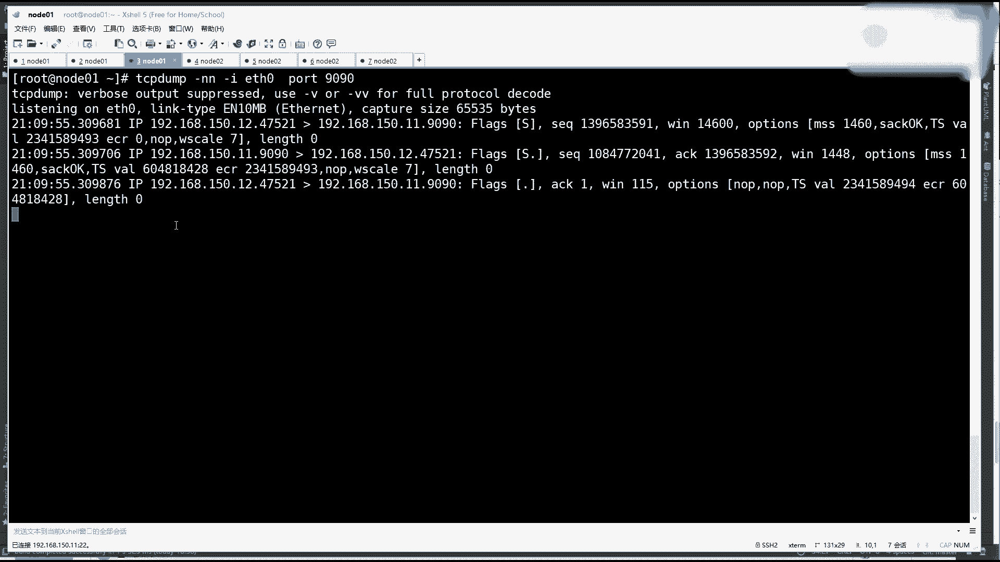
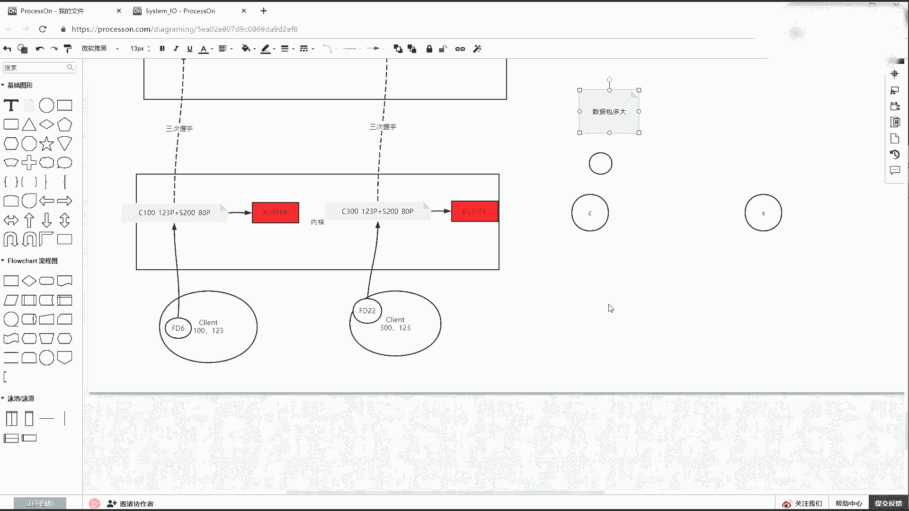
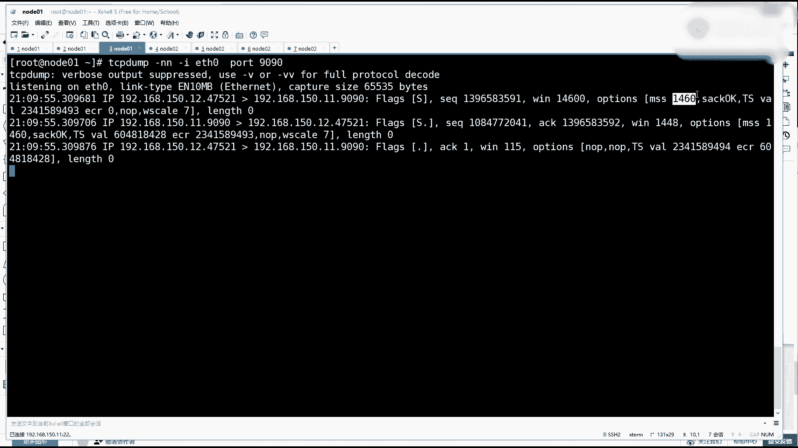
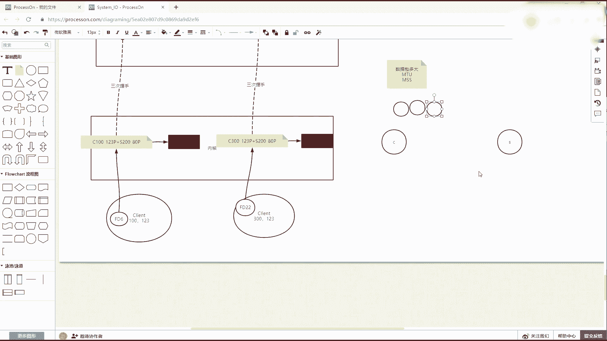
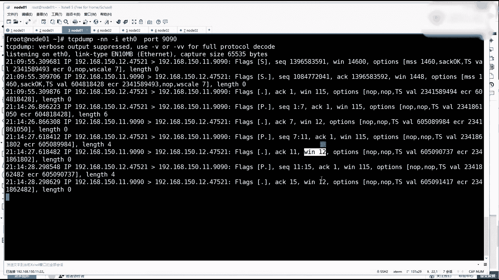
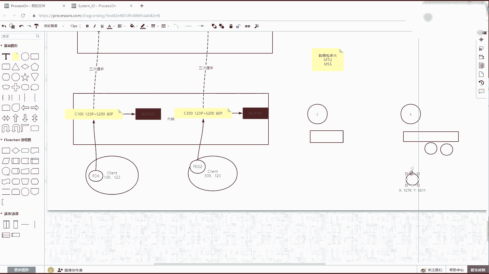
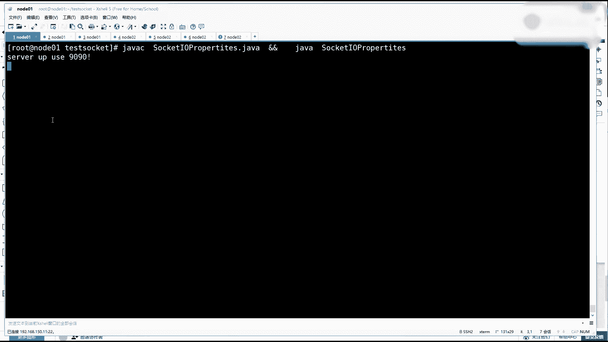
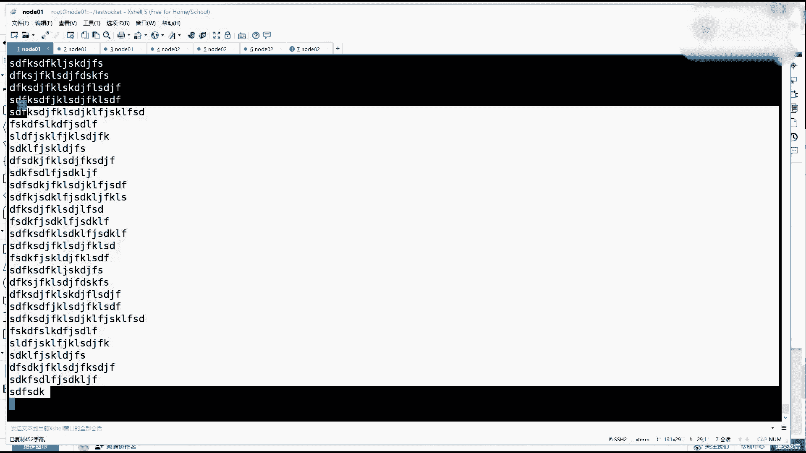
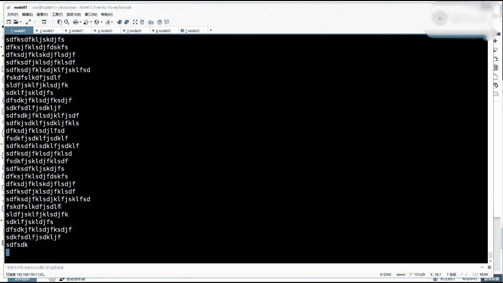

# 花了2万多买的Java架构师课程全套，现在分享给大家，从软件安装到底层源码（马士兵教育MCA架构师VIP教程） - P186：【IO／NIO】tcpip内核数据遗失 - 马士兵_马小雨 - BV1zh411H79h

另外一个小知识点。开始抓包，抓包的时候在三次握手里边啊。这边已经停了吗？哦负担提起来。然后张包这边。重新抓一下。招包，然后呢，我就用一个程序来NC啊。连local host9090。为什么要连上？

就能用。Yeah。应该绑定地址了，1就218。150。11，行不行任？连过来了，然后呢，我们先来看三次握手的包啊。现在握手肯定是我刚才那个NC的随机程序，随机登个号，猴子就能想握想做一个握手的包。

这个握手的包里边在TCB通信的时候，会有几个维度，一个是窗口大小。然后在握手的时候，其实就是在三次握手，两两者想去见连接的时候会删量很多的事情。有各自带的我自己发了那个序列号，然后呢。

对方会在这个序列号上去加一，再回AK的时候会给加一，自己会带上自己的这个序列号，然后呢会有窗口大小，窗口大小是什么意思？其实滑动窗口啊，你如果学过流式计算都有这个窗口的概念。很简单一个道理。

就跟我讲那个啤酒理论一样。或者是我之前有一个老师，我看过他的一个课啊，讲讲这个网络通信。

如果两个节点想通信，比如说就以扔馒头来说，一个人喂一个人吃馒头，这是一个一个一个端给到另外一个端。嗯，我可以给你扔一个馒头过去。你给我回一个确认，然后我等你的确认之后，我再给你扔一个馒子过去。

然后我才等你再给我回一个确认。那么这样的话就没有所谓的窗口的概念。因为他们之间都是之间的传输的这个常数是一，就是只有一个数据包过去，然后回一个确认，这是基本基本协议的规定。这个能听同学来稍个一。

Yeah。Yeah。然后这个过程其实就跟你我之前讲的PU理论也好，这个很很费劲，对不对？因为之前有很多时间是消耗了的。那这时候其实做窗口机制是什么意思？也就是说我这边要发送的数据啊。

其实是最终被变成了豹文或者叫个数据包。第一个知识点，数据包应该多大。数据包多大？那么怎么知道你的系统的数据包多大呢？可以发的。首先没错，MTU那你怎么知道你的MPU多大？很简单一个道理啊。

你看if con。

呃告诉你了。从这块往法发的时候，它的MTU是E500。记住了，if can看你的接口的时候是可以看到这在这个网卡上，如果向外发送的话，它那个数据包的总大小是1500。啊。

是总的那个数据报的那个报文的大小是1500个字节，就是1。5K1。5K。但是注意看刚才是不是抓招过包，抓包的时候注意看这里面会有一个optionions。这是在你的数据的就是封数据包的时候。

有这个数据包的包头，包头里边还有一个可编长的可选项的一个一个一个一个区域。这里面会有1个MMSS那它的给出的值是1460。这个其实约等于你的数据的真实大小。啊。

就除去了你包头的那个IP和顿号的个IP应该有20个字节，然后登我号应该有20个字节，家里用40个字节全刨掉之后，你里边可以放的数据大小是1460个。听同学来刷波一。

就你的数据包里边，你的数据包多大MTU是你的整个数据包的大小。然后MS是你的数据内容大小。然后如果你要传输的数据比较大好大，它最终肯定会切成很多个MSS，然后拼成很多个MTU这样的一个包要往外发。

那你手里会攒着很多想发的东西。那么根据刚才的理论，你可以发一个等一个确认之后，再把第二个发出去，或者用另外一种方式，也就是在其实在三次握手的时候可以协商回一个windows的一个窗口大小。

就是客户端两端啊，它的网卡的配置啊，缓冲区啊，也就是内核的给定一个一个一个大小。像这个时候这哥们啊客户端直接连服务端，张嘴就说啊14600。然后但是后来协商的时候，其实1448，然后但是服务端。

就是最后最终写上这个这个这个称数来表是1115115，后续如果再发送数据，我接收一下，接收完了，然后再把客户端的数据再发一下。发了一些再发一些再发一些，他有很多数据包交互啊。

然后这时候你观察这个窗口协商之后的大小，这两端给的大小就不一样了。一端说我的窗口是是是是115，一一端说我这边还有12个。可可以可以使用。哎，别没错，TCBU塞控制，先不提U塞啊。

先知道就是两边还有一个窗口大小这么一个概念，就是有多少个格子可以放多少个包。根据我们协商那个包，根据我们协商的包的大小MS。

到这步能听明白来，邵边一就两边可能他他俩的这个窗口大这个队列不一样。嗯。对吧啊他俩可能不一样，但是在通计的双方的时候都汇报自己啊，这里边放了几个还剩多少。然后这时候传输的时候，当你的数据量很大的时候。

那么就可以通用这种这种窗口地址。也就是我可以你如果你这个这个窗口这么大，那明显你放三个是绝对没问题的那我就可以一口气给你多，把这三个都给你发出去。让他们在路上，然后最终啊你肯定是收两个也好，收一个也好。

收三个收三个也好，你再给我回确认。我根据我回你回的确认，我决定这个窗，你回在给我回的去里边，你说你窗还剩多少，我再给你继续发包，快速的发减少了很多阻塞等待这个确认包这个过程。这是所谓的窗口机制。

它解决了UC。这个能听懂来刷波一。啊，这就很通俗很通俗一个，你就知道有这么一回事儿啊，面试的时候，基本上如果面腾讯的话，都会问到这一点，就是问你TCP当中什么叫做U塞U塞的话。

其实就是如果这个窗口被填满了。那这时候怎么办？回的那个数据包里边确认那个ACK里边一定会告诉他没有余量了。对吧然后这时候客户端就可以先阻塞自己不发了，等着对方把这个他的应用内核把这个全处理处理一点之后。

然后后续他再给补一个包，说有了，你再给我发。这个能听的同学来说个一，这就是所谓的庸塞控制。嗯。就既要提升性能，我还能别给你发爆了。为什么？因为本质上来说，这个东西如果全填满，你继续发就开始要丢弃了。

一味的发是要丢弃的。

我可以给你演示一个一个现象。那也是一个现象。把我的服务端停掉。把服务端跑起来了。跑起来之后呢，然后我们来用mattter state这NATP去看。然后再用一个。我把这招包现给它关了。用NC连192。

168。150。11，然后9090把那一个客户端帮都连进来了。连进来之后呢，然后这边我去接收它8这个客户端42588接进来了。就是我这个连接已经和它建立好了，也接受了，接受之后，然后来看啊。啊。

不不应不应该接受错错错错重重来啊，不应该接受，应该让们阻塞住。就为了。压压榨出他那个接收队列。然后这边重新连，连完之后，我这边不问回车。那这时候其实只看nstate。

那这个时候你会发现哎这个内核里边连接已经有了，然后缓冲区也开了，接收的队列已经开了。那这时候只不过程序还没有接受它那数据是不不可能给到你的应用应用程序的那这时候完全就靠底层内核的各级。

还有网卡的各级缓冲去接收这个这边客户端发的东西了。那么客端发东西的话，注意来看，发一个发一个发一个发一个发一个程序还没有接收这个连接，所以这个数据只最多是顶到内核的缓冲区了。O学吧？

就这么别别别发发的时候，你会发现它的接入队列是一直要涨。😊，对吧，然后我们把它。复制一下。粘贴粘贴粘贴粘贴粘贴粘贴粘贴粘贴粘贴粘贴，这是咣机咣机，客户端还在发到这步能看懂未来说不一就客户端一直在发。

一直在发，一直玩命的发玩命的发命的发玩命的发玩命的发。但是你那盒里边不可能无限收，对不对？那存就充爆了1920了，然后呢再来发一下，看还能收吗？然后再来看。😊，还是120，这个东西不往上涨了。

然后这时候我注意啊，我发。派对一。走过去之后，然后他其实还是不涨。然后这时候注意你那会儿已经帮我攒了一些数据了，那是攒的头的还是尾的呢？客户端开始接收，接收完了之后，他一定会读数据，对不对？走。

读到了前面的东西，后边人就被丢弃了。

可以设置。后边我再讲那些具体的这个讲到那个内核配置，我再跟你说，我先告诉你这么回事儿。

