# 系列 3：P187：【IO／NIO】tcpip 参数 - 马士兵_马小雨 - BV1zh411H79h

接下来还是把我想要怎么给你演示啊，还得抓包，不抓包，你光给你讲，你根本听不懂我在说啥。还是得把它抛起来。哎，编译了一下，然后又把它跑起来了，服务端啊，现在又跑起来了。当跑起来了之后啊，我们开始抓包。😊。

其实抓不抓抓不抓也呃，抓不抓，就抓着吧。啊，先给他抓抓，然后呢，是这样的。我客户端这边啊。课端代码是要做这么一个里边有一些配置。有这么三个维度，第一个维度啊。

我s这个set send buffer分 size，我给了一个所谓的一个发送的缓冲区大小是20，但是呢还有两个配置。这两个配置我先给它全部制成foralse。一个是no delay优化这块啊。

这个如果就是如果单看这个单词，这个优化是什么意思？如果你发的东西很小很小，他宁可是给你攒一攒再发。也不是绝对说不发出去啊，就是或者你的数据量比较大的时候，你能看出这个特征来了。

它是不是按照2020去发的，还是可以突破20这个概念，就是有没有优化，就是本地攒不攒那么多东西。为什么你一定要记住了，我这边发送的时候是写rightite的时候是一个字节，一个字节的。

就是我在命令行敲的时候，这个readland的时候，我可能一一口劲敲50个或者60个字节。先别想那么多，跟着我的思路走，拼包什么的都别想，你会的东西都先忘掉，先跟着我的思路走。因为这叫冷知识。

就是我在命令行，我可能敲50个字节，60个的70个字节或者三个字节，一个字节。无论我敲了多少个字节，在IO使用上，它是一个字节，一个字节的调内核，就是从过程序里调内核。要我我我每次调是写一个字节。

而且我不调flash，关键是以下这两个参数，尤其中间那个参数，还有这个缓冲区，它是怎么用用起来的。😊，啊，他是最多发20还是可以发6080或者100。我如果写的多的情况下。

到这个能听同学来说波一就是传输的频率。因为如果我本来有100个字节给你发，我可以变成一个包发出去。因为一个包可可以放1000个字节，对不对？😡，但是我这100个也可以给你分成按20分成5个包。

那我传输5次跟传输一次都是这100个字节。你说谁更谁更省劲儿，就是先表达这个意思，这就是这是delay是不是优化这件事情，no delay是不优化，我还给它关了，那就是开开启优化。😡，这就是负负得正嘛。

明白什么意思吧？这是默认配置，就是默认它是开启的一个优化的。😡，然后下面这个fose关掉，先不用管，这其实是是不是会把第一个你的数据的第一个字节砰掉就发出去了。啊，是不是一个着急的这么一个事儿。

一会儿演示你就知道怎么回事了。我们把这个这个这个配置先记住了啊嗯，知道之后呢，我把它关闭掉，然后用java。😊，C去编译它。编译成功之后，把它跑起来了。黄灯先先是建立一个连接啊，建立一个连接。

这边我把这链接还给它收到。哎，建定好了，那现在就开始等传输了。当我想传输的时候，注意听啊，想传输的时候，注意我先发送一个字节走起。😊，这边收到的是一个字节啊，是内容是一。能看懂吧？然后呢我再多发一点。

如果发3个123发三个走起，我发了三个字节，注意这是read这个read line，它读到了一个字符串啊，读到了一个字符串，但是它是不是一个字节，一个字节，一个字节的rightite。

然后这时候再来看它收到了，你看这有一个特征啊，这个第一个一着急先发出来了。然后呢，后边又收到2个23。😊，小的时候你可能看的不太清楚，没有没有没有什么优化呀，我们再多一点。

刚才我定义的缓冲区是201234567891012345678910。再来1个1232三个字节走。有没有发现它可以我换成缓成器不是20吗？是不是22个，除了第一个着急的，22个是不是过来了。

如果再放大一点。😡，走。也就一个包的大小是可以超过缓冲那个8ffer的缓冲区的。听同学来说波一，就是在刚才这个配置情况下，我舍得默认的起优化的这种这种状态。好，把我的客户端结束。😡。

然后再来去编辑这个文件，我将配置项改掉，把new delay的这个事给它开启为tto别优化了。着急发送，别给我攒着，别攒成一个包，有多少？缓冲区满了就给我出发，或者能给我能给我发，就赶紧给我发出去。

然后再把它跑起来，能能理解我想把它什么意思吧，是不是就改了一个参数走。😡，喂。怎么报错了。用管他再来一遍。诶。数字开始。前面是出错了吗？要reuse了。re失败了。再来一遍啊。没错，我把这边结束一下。

服务端重跑一下啊，90677起来，然后这边。那个结束一下，换另外一个。C。这个他抛起来。好，连上来了，连上来之后呢，我给他接收一下，走接收了1个47526。刚才是不是又改了一个参数，着急了。

别给我优化了，nodelay为 true了呃，没有delay了。然后这时候注意我发1个123效果是看不出来的。对吧哎，收了仨效果看不出来。然后但是如果一多。这样。

我这很多已经超过了我那个二0那个缓冲区了。走。

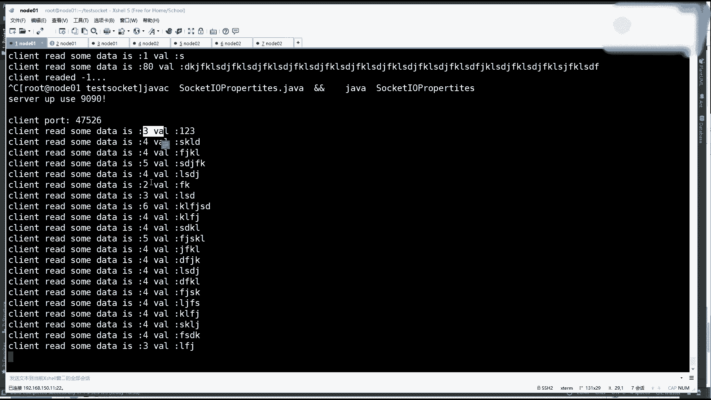

看到效果了吧。之前有优化的时候，是不是会攒成一个包，一口一发过来。现在是不是随着我产生的速度，他该发的尽量的根据内核的调度，该该发的赶紧发出去了。😡。

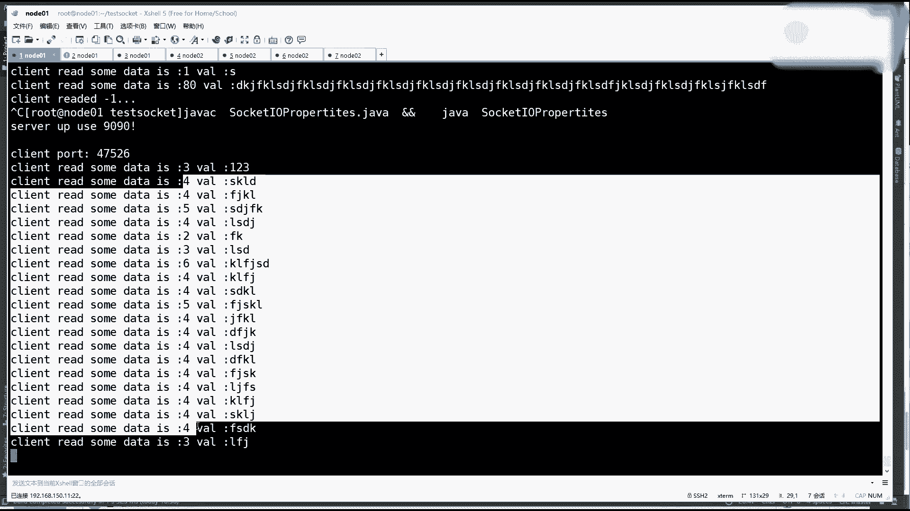

到这儿能看同学来说个一。也就是说其实在于你怎么去设计啊，你着急发东西的时候，不想走这个优化。你比如说很简单的，咱们这个。😡，L我使用SSH我编辑回车，我才按了俩字母。😡。

对吧就是如果你平时传的东西不是很大的时候，就用就而且复用一个连接的时候，这个链接里边传很多的东西，还不是使用多个连接。然后很多东西的话，每个东西还独立执行，然后体验不大的时候，就不要开启优化了。

因为别让后边的拼了一块一块出去，它毕竟有一个延时，你别小看那点延时啊，这个这个这个这个小小你这个这个前后这个这个延时，如果这个就是这个就是这些东西如果攒到等到后边这个东西再发出去的话。

那这个这个过程可能会整体的这个感官，就是整个系统的吞吐量就下去了。

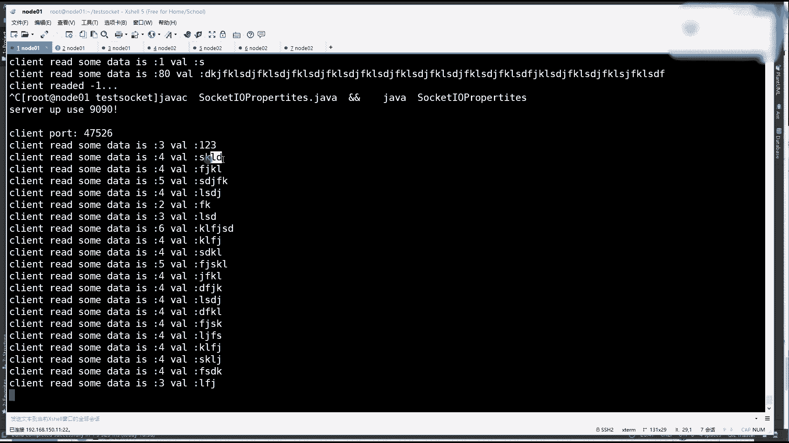

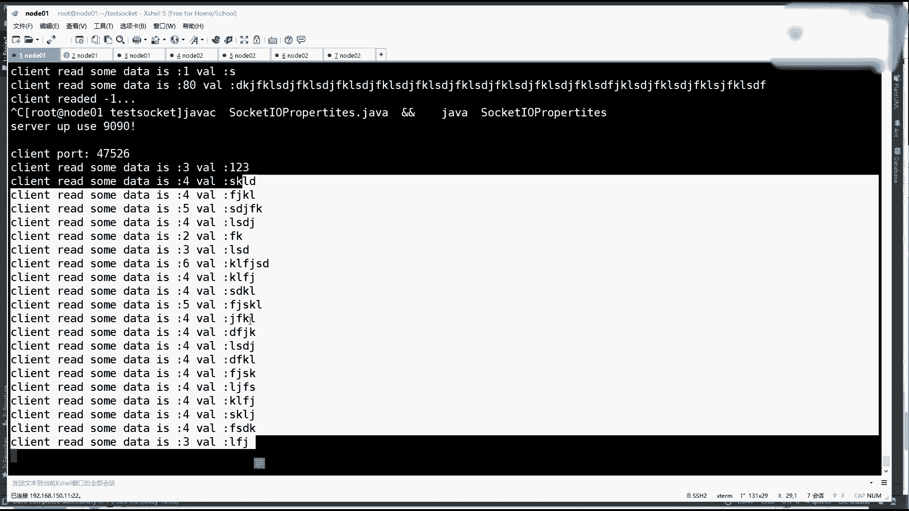

啊有的时候你要根据自己特征来选是吧？开启这个快速传输，这个就是这个load这事，是不是要开解关闭。😀。好吧，都是用你肉眼可以看到的一个效果哎来给你演示。再接着来还有一个是这个其实不太重要啊。对。

这是为foalse，然后给它开启。为 true。编译完，前边这块搞定。然后再去把它抛起来。又不让凉了。没 you。欢 you。N state。服务端只有一个现程，不是的。Yeah。我是重用了那个啥了。

重用了那个断号了，应该。reuse开启了吧，我看一眼啊。Yeah。没有开reuse。没有在这一个配置线，然后再服我再看一下服务端代码。对。不错怎么关了。服务端没啥问题，我服务端，你看服务端。

如果我ctrl C断开连接之后。刚才也读到了负一了。就close掉了一个扣端了，然后再把它重启，应该是可以重启。起来，然后刚才改改过配置了。然后走再连进来，连接之后呢，然后先把这个客户端。

你看飞机接录到了47528已经过来了。过来之后，然后开始输入123走。看那个这个收到了3啊，然后我再给你演示。然后1234567，然后走都是传一些小的数据包。然后你会发现像这个G是一个。

就是是那R是一个。R哪去了？对对这，可能可能是刚才。因为他一个写了嘛，但是基本上会保证你这个单机传输这个最短的这个111个1个一个证圈的一个轮询。他没有着急把第一个字接打出去。能看这现象吧？

因为你记着刚才是不是有一个现象在传输的时候。先记住这些啊，就是现在啊我客户端的这个代码我给它结束了，crl C。结束掉之后，然后这边就为负一了。正在报了一个错，那s一个字s is close。

我是不是服务端代码真的有问题？No。是。读取它，然后接收它接收完了之后起了一个线程，一个线程起来之后，然后我能读到-一，然后把它close掉，然后break。

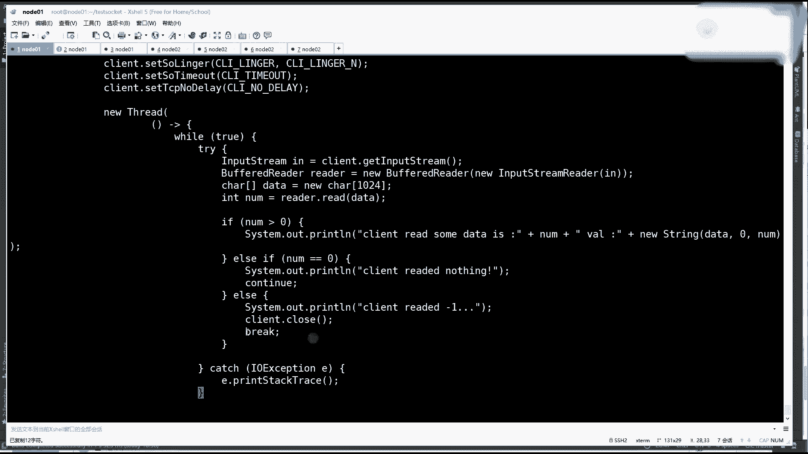

break是要跳出这个循环的。然后这个链接也会给它关闭掉，关闭掉之后，他为什么还要报那个异常呢？

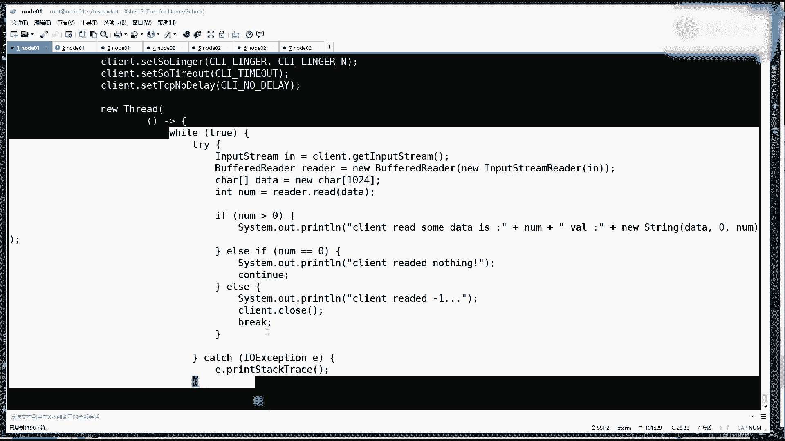

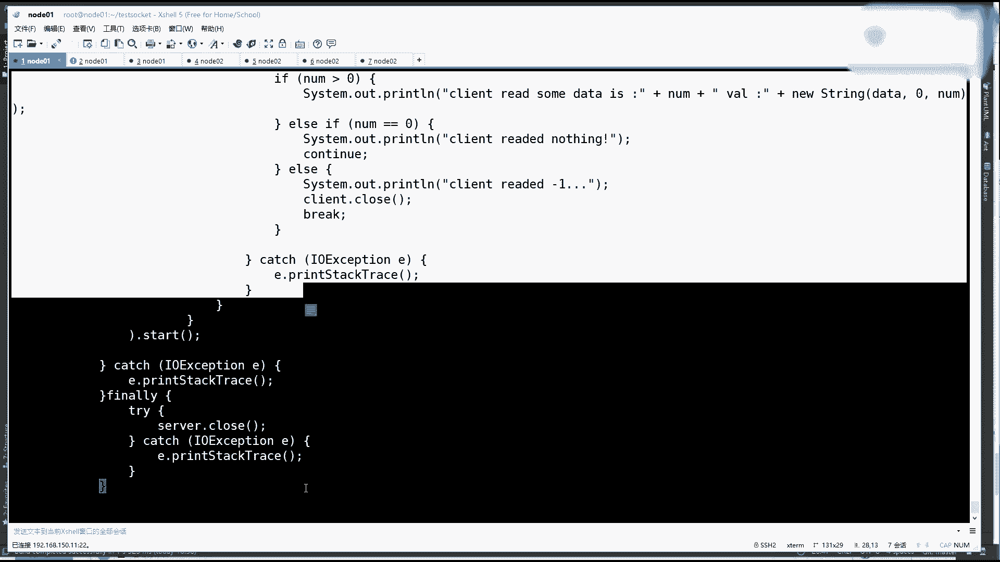

Yes。是现在阻塞现程，这个线程结束了。因为这个放这个这个循环只要结束，这个lemon的表达式，这个大括号就结束了，这个线程就消失了。线程消失之后，然后其实那就那个客户端就没有了。然后这边循环的时候。

它会拿到一个新的客户端，新的客户端会抛出一个。如果再再来连接的话，是会抛出一个新的线程。

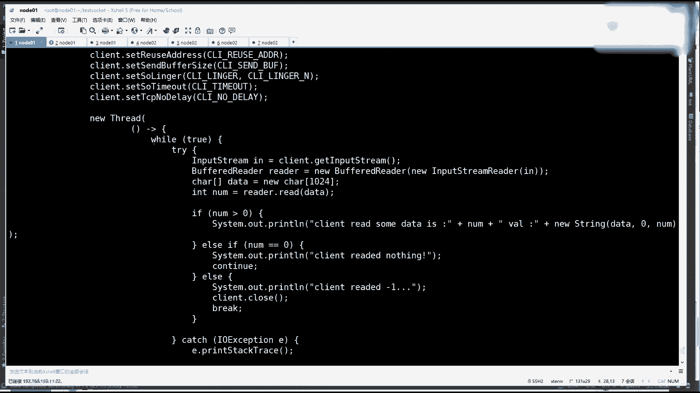

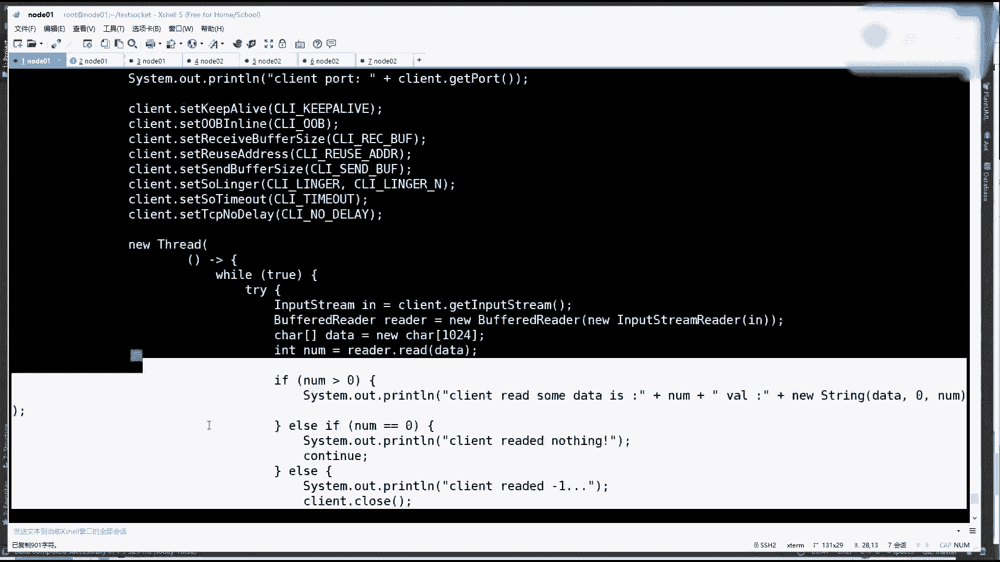

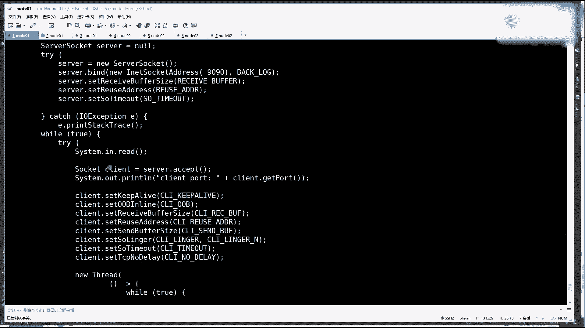

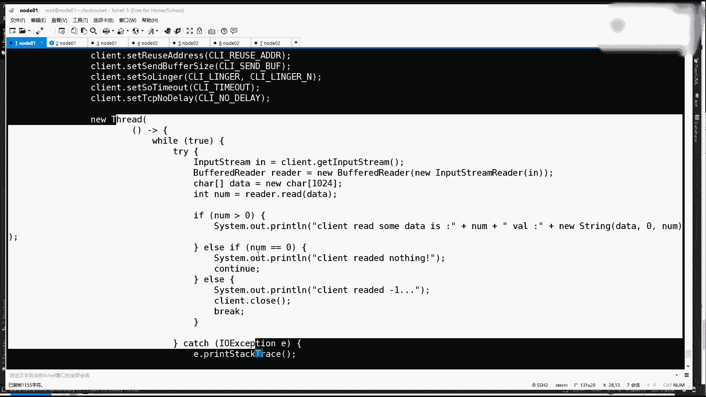

说哪资源改过配置吧。不管怎么样，我先把刚才那个演示啊。先给那个演示那个finly是整个结束的时吧。你看这个分斗率是在整个这个tck cap的时候。上那里写错，写错位置了吗？哦，我翻到里是不是写错位置了？

啊，我说的还真是。但你不写他的话，我想想把它写哪去合适这个。啊，很难真是这个问题，这是一个catch，它的try是在。就这个位置。没毛病。哦，不行不行不行不行不行。啊，的的确的确的确。

应该是对整个的这道代码，整个加一个tryca值，在整个的就把这个cach的给它移移到后边去。对吧是吧这这这三行3DD要挪到。我Y我循环结束之后。就是我class类主方法，然后在这儿，然后粘粘过来。

走到这儿来。是这意思吧，哦，知道了。掉行了，那这时候就没问题了。刚才的确是把那个自个儿那个soer给他端端端端掉了。😊，其其实不是翻车，我就是告诉你啊，这个哎这个翻的里你写对位置。不断跑起来了。

跑起来了，然后在我这边继续刚才改了配置文件了。老演员了啊，我把那个。😊，刚才为 true的时候，就这个这个选项为 true的时候啊，它是你会发现你写啥，他就给你把这个包发发回啥了。

但是如果改成false。然后优化不需要优化，直接发送。先看先来看一眼啊。客户端的跑起来，然后服务端接收它。服务端再去发送数据。123走发过去了。三个这为啥演的不出来呢？发点发点发点都发一些超过一个的。

只有只有D和F是一个字节的。这有D和F这有一个D这有个D这个F这不明显，可能他还得他还得结合这个no delay的这个方式。这两种如果结合在一起的话。保存。java编译再重新跑起来，客户端再去接收它。

服务端发发一些比较短的东西。然后你看他都是先发一个比较着急的，然后再给你拼后边，再发一个着急，再给你拼后边的，再发一个着急的，给给你拼拼后边的。

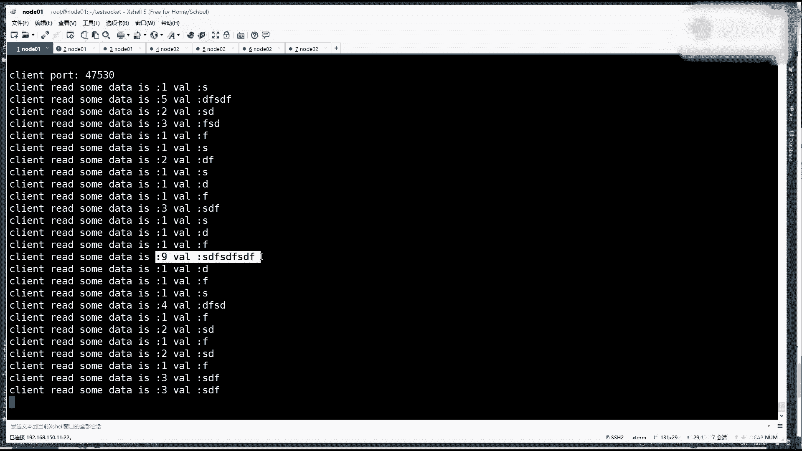

啊，就大概理解这么一个选项一个参数。就是如果嗯。就这个选项嘛，这个选项其实我也一直没没弄么明白他为什么这有这么一个东西啊，我只告诉你有这么一个东西就可以了。没啥用没啥用。

但是有的时候是可以起到一定的作用。为啥？因为你如果第一个包发出去了，对方没给你啥反应，其实后边可有时候可以不用这个不需要再重复的，就是可以过早的去秀探出秀探出。这个不重要。像剩下的参数的话。

这个关闭这事不不重要。no delay也给你讲过了，te out你也知道了，还有个keep alivekeep alive那个keep alive什么意思？再把它演示一下。

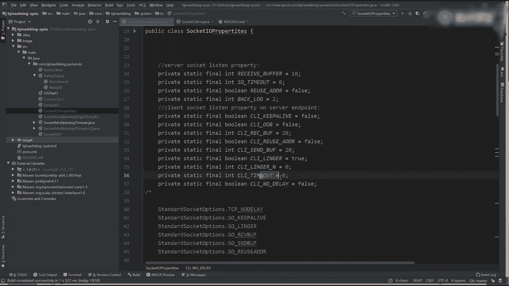

服务端结束。嗯。把服务端那边的keep left换成te。在这儿有一个先把它跑起来，跑起来之后TCP抓包这我给它清掉。靠TCB招包能看得出来，但是那个时间有点长，但是不要紧，到时候给你画图的时候。

正好正好跟他演这个演示一下。如果再把我的这边的这个扣户端连进来。关机啊，客户端建立三次握手，这三次握手已经有了。有了之后呢，然后我接收它，然后呢，咱俩我俩谁也不说话了，先把它标在这儿不动了。

那么什么叫做keep live？ keepep left这个词，你应该在很多地方听说过在这要标记一下，keep live。

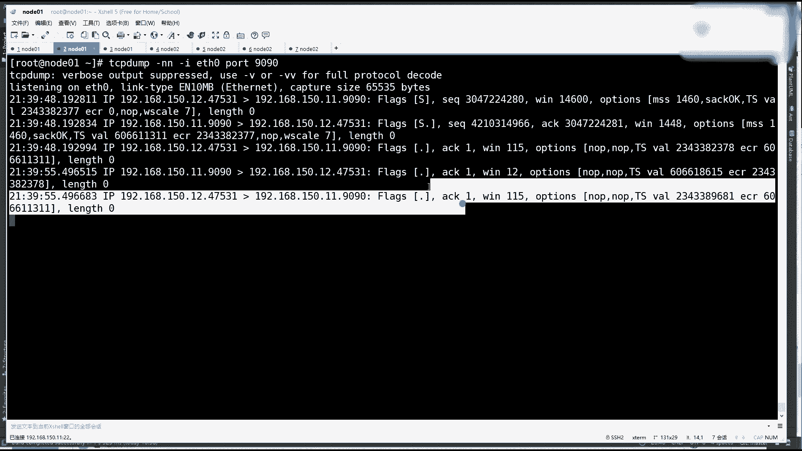

有一个概念，就是在TCP这个呃。协议当中规定的就是双方如果建立了连接。如果双方。建立了。连接首先根据上面的描述，这连接是虚无的，它不是不是物理存在的。那只是双方主机里有这个资源而已。

他们之间并没有一个物真正的一个物连线给他给它连起来。那首先第一个知识点第一个知识点，如果很久都不说话。其实这个时候你能你能确定对方还活着吗？Yeah。能确定这件事情吗？是绝对是不可能的啊。

因为对方可能光机断电了啊，或者那个城市被炸了啊，或者整个他那边运营商的都瘫痪了。但是你这边的网络，你那边的你的下游那个物理设备，那个那个网线那个灯那个电都还在。但是就是外界不行了啊外界不行了。😡。

能理白什么意思吧？就肯定不不你不能确定他是不还活着。所以在这种情况下啊，在这种情况下他提出了一个keep alive。这是TCB级的，在HTTP级别当中，也有一个keep alive。

然后在附载军里边还有一个keep alive的那样的一个一个高可用，一个进程啊，这三个东西千万不要给它弄混了，不同层级的。

能理解什么意思，能理解什么意思吧？哎，那这时候再来看，哎，你看我是不是双刚才是给你高量到这个位置了。😡，开启了keep了就开启了心跳了。那这时候他自个儿会，两边会。😊，说话。发的包L死没有数据。

只传输共程层要发一些确认包来。

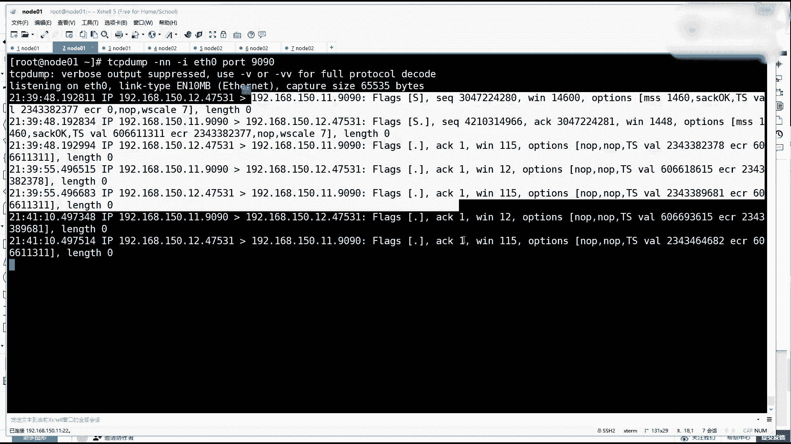

做这种所谓的心跳啊悄悄化来判定对方是否活着可以了。这样的话会为呃周期性做这件事情，会为你后续资源的把控和效率性能有一定的这个这个帮助。为什么？如果说你有5000个连接。他们都挂掉了。

但是你却没有把这个没有心跳，也不是他们挂掉了，你的内存一直保持这000连接，其实是很消耗资源的。虽然我们可以让网络当中消耗一些数据包周期性的，但是起码说可以让我的内存相对的来说。

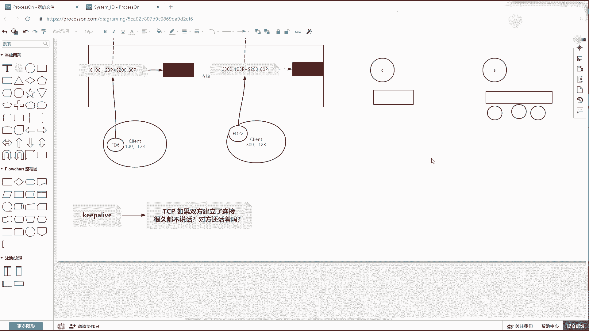

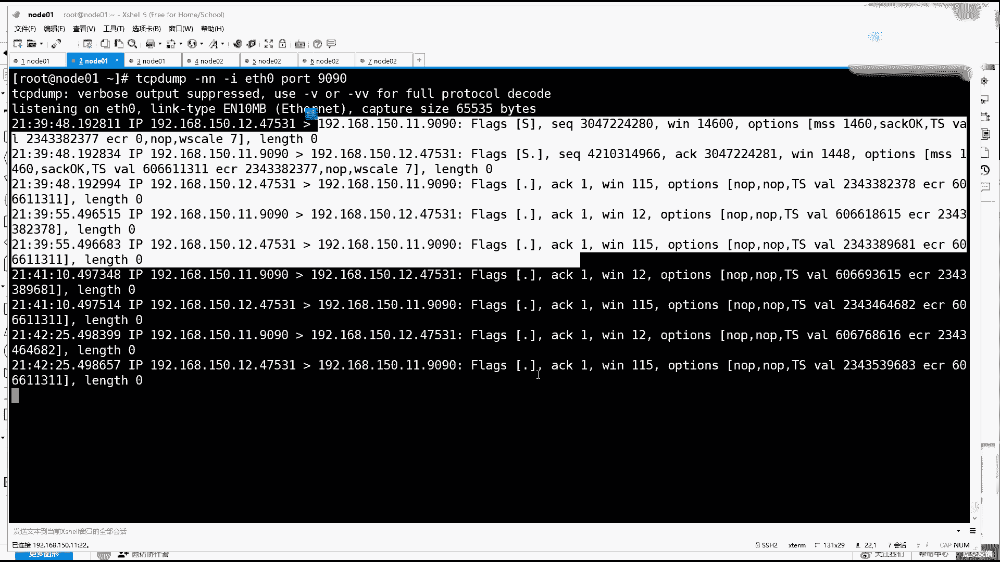

发现他没回应了，超过我多少次之后给他踢掉，内存起码可以省出来啊，这个能理解同学来说个一。嗯对。

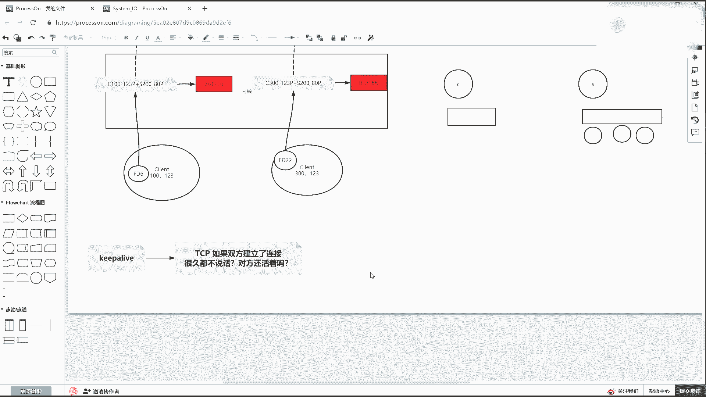

好吧，就是一些很简单的一个知识啊。😊，用我用了很多的时间给你讲解了一些东西。好，那么现在只是讲了一个。简单的socket就之前咱们在公开课讲IO之类的。

是讲讲的这版scketIO就告诉你我是是一个阻塞的，我得先起监听，然后呢，我得等着别人连接，然后再等着别人发数据啊，仅此而已，是我是在这个版本的情况下给你扩了一些关于参数的配置。

而且这些参数配置其实只一部分。后边到nty的时候可能还会更多一些。但是这个参数已经。起起码面试的时候能聊了，好吧。🤧，但是不管怎么样，他现在是隶属的是BLO环节，就是会有阻塞的事情发生。

会有这个开辟县程对应某每一个连接，会有资源的消耗的问题。

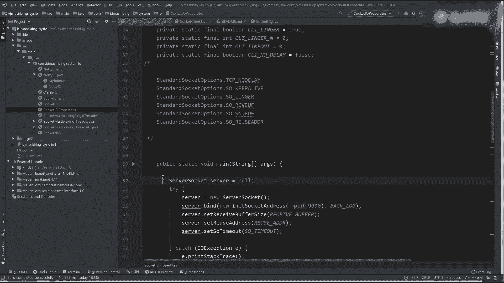

好吧，是这节课讲的，还是下节课讲的，我想想啊。喂。从那一课开始讲吧。刚才给你们演示的是关于。

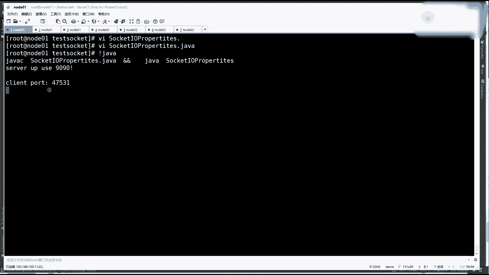

其实更偏重于。